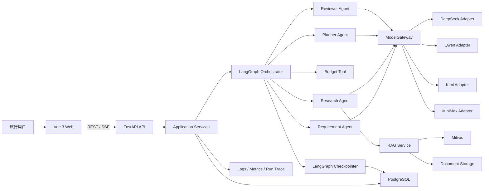
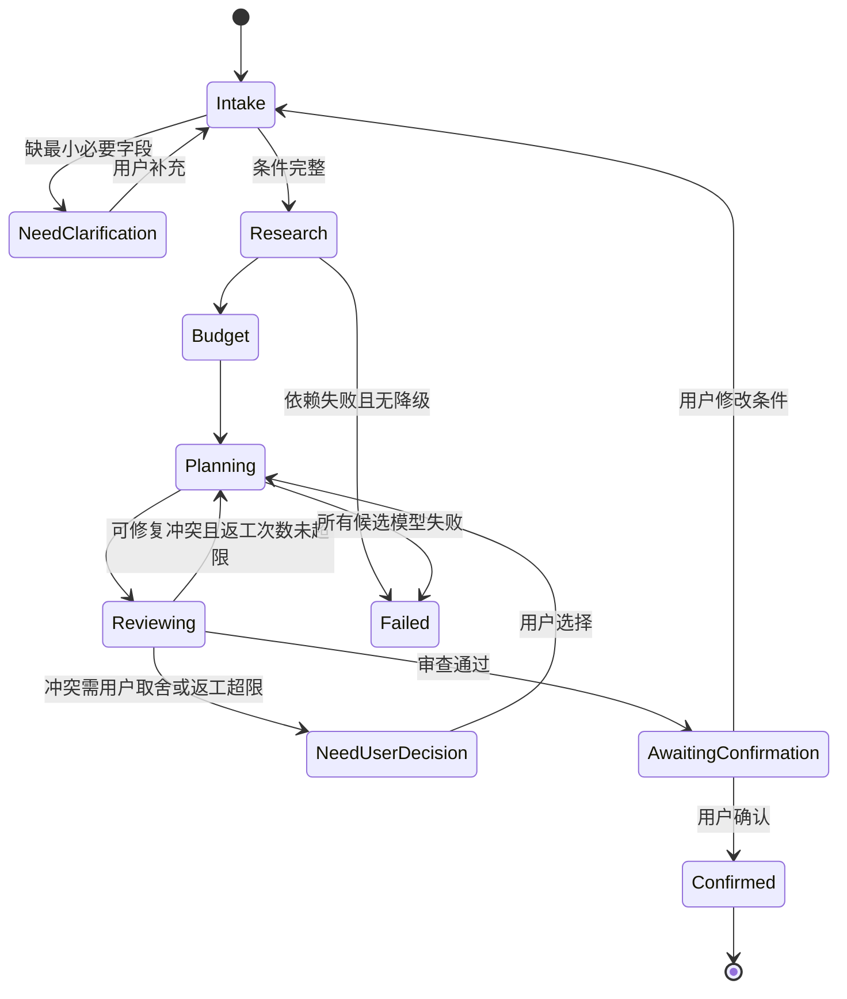
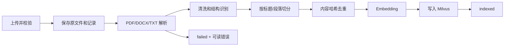

# TravelMindAI 技术设计文档

> 文档版本：v0.2  
> 更新日期：2026-09-08  
> 状态：目标设计，尚未代表当前仓库已经实现  
> 关联文档：[PRD](./01-PRD.md) · [模块实施](./03-MODULE-IMPLEMENTATION.md) · [项目进度](./04-PROGRESS.md)

## 1. 设计目标与原则

技术设计服务于一个小而完整的旅行规划闭环，优先保证可验证、可解释和可逐步交付。

1. **先单体、后拆分**：MVP 使用模块化单体，不为尚不存在的流量引入微服务。
2. **规则和模型分工**：金额、日期、范围、冲突等确定性逻辑用代码；模型负责理解、候选生成和解释。
3. **显式工作流**：用 LangGraph 的状态和条件边表达协作、返工和人工确认，而不是把所有步骤塞进一个 Prompt。
4. **提供方与业务解耦**：业务只声明能力，不直接依赖某个模型名或端点。
5. **来源优先**：RAG 输出必须携带可验证引用；动态事实没有实时工具时显式降级为“待核实”。
6. **持久化分层**：会话状态、长期偏好、业务数据、向量、原文件分别管理。
7. **失败可观测**：重试、熔断、降级、返工都要有上限、错误分类和运行记录。

## 2. 关键假设与约束

- 后端：Python 3.11、FastAPI、Pydantic v2、LangChain、LangGraph；
- 前端：Vue 3、TypeScript、Vite、Pinia；
- 前端组件采用飞书方案中的 Arco Design Vue；普通样式先用 scoped CSS，TailwindCSS 不作为强制依赖；ECharts 按实际图表需求引入；
- 关系数据库：PostgreSQL；本地单测可用 SQLite，但不能以 SQLite 结果代替 PostgreSQL 集成验证；
- 向量数据库：Milvus；Windows 本机开发优先用 Docker Desktop/WSL2 中的 Milvus Standalone；
- 文件存储：MVP 使用受控本地目录，生产化时替换为对象存储；
- 依赖管理：`pyproject.toml` + `uv.lock`，版本在实现阶段按兼容性锁定，不在设计文档写死易过期的模型名；
- 模型密钥由使用者提供并保存在环境变量或密钥系统中；
- 首版为单租户本地演示，但数据模型保留 `user_id`/`owner_id`，避免后续无法隔离。

Milvus 官方文档当前列出的 Milvus Lite 支持环境不包含 Windows，因此本项目不能假设 `MilvusClient("./file.db")` 能在当前 Windows 环境直接工作。Lite 可用于 Linux CI/开发，Windows 集成环境使用 Standalone；二者保持相同客户端接口。

## 3. 总体架构



### 3.1 模块边界

| 层 | 职责 | 禁止事项 |
|---|---|---|
| API | 鉴权、校验、协议转换、SSE | 不在路由中编排 Agent 或直接写 Milvus |
| Application | 用例、事务、权限、DTO 组装 | 不拼接模型私有参数 |
| Domain | 旅行约束、预算、行程、冲突规则 | 不依赖 FastAPI/LangChain |
| Agent | 状态图、节点、Prompt、工具调用 | 不直接读取环境变量 |
| Model Gateway | 适配、路由、超时、熔断、指标 | 不理解旅行业务 |
| RAG | 解析、切分、嵌入、检索、引用 | 不生成最终行程 |
| Infrastructure | PostgreSQL、Milvus、文件、外部 API | 不包含业务决策 |

## 4. 建议目录结构

```text
TravelMindAI/
├─ backend/
│  ├─ pyproject.toml
│  ├─ uv.lock
│  ├─ src/travelmind/
│  │  ├─ main.py
│  │  ├─ api/v1/
│  │  │  ├─ chat.py
│  │  │  ├─ sessions.py
│  │  │  ├─ itineraries.py
│  │  │  ├─ documents.py
│  │  │  └─ health.py
│  │  ├─ application/
│  │  ├─ domain/
│  │  │  ├─ requirements.py
│  │  │  ├─ budget.py
│  │  │  ├─ itinerary.py
│  │  │  └─ review_rules.py
│  │  ├─ agents/
│  │  │  ├─ graph.py
│  │  │  ├─ state.py
│  │  │  ├─ nodes/
│  │  │  └─ prompts/
│  │  ├─ models/
│  │  │  ├─ gateway.py
│  │  │  ├─ routing.py
│  │  │  ├─ circuit_breaker.py
│  │  │  └─ providers/
│  │  ├─ rag/
│  │  │  ├─ parsers/
│  │  │  ├─ chunking.py
│  │  │  ├─ embeddings.py
│  │  │  ├─ index.py
│  │  │  └─ retrieval.py
│  │  ├─ persistence/
│  │  ├─ observability/
│  │  └─ settings.py
│  ├─ tests/
│  │  ├─ unit/
│  │  ├─ integration/
│  │  ├─ contract/
│  │  ├─ graph/
│  │  └─ evals/
│  └─ migrations/
├─ frontend/
│  ├─ package.json
│  └─ src/
│     ├─ api/
│     ├─ components/
│     ├─ views/
│     ├─ stores/
│     └─ types/
├─ data/
│  ├─ fixtures/
│  └─ evals/
├─ docs/
├─ compose.yaml
├─ .env.example
└─ README.md
```

根目录现有的学习脚本在迁移完成前保留为实验材料，不能被后端运行时导入，因为它们在模块导入时可能直接发起模型请求。

上述目录是目标结构，按里程碑创建实际需要的文件。当前 9 个实验脚本的清单及验证边界见 [项目进度](./04-PROGRESS.md)，不要求先新增课程或练习项目。

## 5. 领域模型

### 5.1 核心对象

```text
TravelRequest
  destination, origin, start_date, end_date, days, travelers,
  total_budget, pace, interests[], dietary[], lodging_preferences[],
  hard_constraints[], excluded_items[], assumptions[]

Itinerary
  itinerary_id, session_id, request_snapshot, days[], budget_summary,
  citations[], conflicts[], status, version

DayPlan
  date, theme, activities[], daily_budget, notes

Activity
  time_window, poi_name, duration_minutes, transport, estimated_cost,
  reason, citation_ids[], verification_status

BudgetSummary
  accommodation, intercity_transport, local_transport, meals,
  tickets_and_activities, contingency, total, remaining
```

`TravelRequest` 是一次规划使用的不可变快照；用户修改后创建新快照并递增行程版本，避免历史输出被新偏好悄悄污染。

### 5.2 状态机



## 6. LangGraph 编排设计

### 6.1 Graph State

```python
class TravelGraphState(TypedDict):
    messages: Annotated[list[BaseMessage], add_messages]
    user_id: str
    thread_id: str
    intent: str | None
    travel_request: TravelRequest | None
    missing_fields: list[str]
    research_items: list[ResearchItem]
    budget: BudgetSummary | None
    itinerary: ItineraryDraft | None
    review: ReviewResult | None
    citations: list[Citation]
    retry_counts: dict[str, int]
    rework_count: int
    warnings: list[str]
    next_action: str | None
```

State 中只保存可序列化的业务数据、消息引用和运行控制字段，不保存数据库连接、模型客户端或大型原文。节点通过依赖注入获取服务。

### 6.2 节点与条件边

| 节点 | 关键行为 | 下一步条件 |
|---|---|---|
| `classify_and_extract` | 识别意图，结构化抽取并与已有约束合并 | 缺字段 → clarify；否则按意图路由 |
| `clarify` | 汇总真正缺失字段，生成一个问题 | interrupt/结束本轮 |
| `retrieve` | 查询改写、Milvus 检索、组装引用 | 有结果/无结果均进入预算，但记录警告 |
| `calculate_budget` | 确定性计算预算和硬规则 | 严重超支 → 用户决策或规划备选 |
| `plan` | 基于约束、研究和预算生成 Pydantic 结构 | 校验通过 → review；失败 → 网关修复/降级 |
| `review` | 运行代码规则和 Reviewer Agent | 通过/返工/用户决策 |
| `persist_draft` | 保存版本并生成响应摘要 | 等待用户确认 |

Supervisor 是路由策略，不应成为一个能够任意调用所有工具的“万能 Agent”。确定性条件边优先，只有含糊意图才调用模型。

### 6.3 多 Agent 选择

首版使用一个父图和若干职责明确的节点/子图。研究、规划、审查任务默认每次调用隔离内部临时状态，共享经过约束的父图业务状态。只有真正需要连续多轮内部推理的子 Agent 才启用 per-thread 子图状态，避免历史无限增长和并行调用冲突。

### 6.4 记忆设计

- **短期记忆**：LangGraph checkpointer 以 `thread_id` 持久化每步状态；开发可用内存/SQLite，目标集成环境使用 PostgreSQL checkpointer；
- **长期记忆**：单独的 `user_preferences` 业务表或 LangGraph Store，按 `(user_id, category)` 命名空间存储用户确认偏好；
- **摘要策略**：消息超过阈值后生成摘要，保留原始消息的数据库引用，不把所有消息永久塞入 Prompt；
- **隐私操作**：提供查看、更新、删除；删除会话和删除长期偏好是两个独立操作。

## 7. ModelGateway 设计

### 7.1 统一接口

```python
class ModelRequest(BaseModel):
    capability: Literal["extract", "research", "plan", "review", "chat"]
    messages: list[Message]
    response_schema: type[BaseModel] | None = None
    timeout_seconds: float
    idempotency_key: str
    metadata: dict[str, str]

class ModelResult(BaseModel):
    content: str | None
    structured: dict | None
    provider: str
    model_alias: str
    latency_ms: int
    input_tokens: int | None
    output_tokens: int | None
    fallback_count: int
```

业务节点调用 `gateway.generate(request)`，不感知 OpenAI 兼容 SDK、专有 SDK、`base_url` 或特殊模型参数。

### 7.2 ProviderAdapter 契约

每个 DeepSeek V3 系列/Qwen/Kimi/MiniMax 适配器实现：

- `supports(capability, structured_output, streaming) -> bool`；
- `invoke()` / `stream()`；
- 提供方异常到统一错误类型的映射；
- token/usage 归一化；
- 模型私有参数注入，例如某些模型的思考模式与 tool choice 兼容配置；
- 请求和响应结构校验。

四个提供方可以复用 OpenAI-compatible 基类，但必须各自保留适配层；“接口看起来兼容”不等于错误码、流式事件、结构化输出和 token 统计完全一致。

### 7.3 路由算法

候选模型先按能力和健康状态过滤，再计算分数：

```text
score = configured_weight
      × recent_success_rate
      × latency_factor
      × cost_factor(optional)
```

MVP 使用“加权选择 + 最低近窗口延迟优先”的可解释策略，不建设复杂预测调度。一个请求在选定模型后保持粘性，只有失败才切换，避免同一流式响应跨模型拼接。

### 7.4 错误与降级矩阵

| 错误 | 同模型重试 | 跨提供方降级 | 熔断计数 |
|---|---:|---:|---:|
| 连接错误/超时 | 1 次，指数退避+抖动 | 是 | 是 |
| 429 | 尊重 `Retry-After`，最多 1 次 | 是 | 是 |
| 500/502/503/504 | 最多 1 次 | 是 | 是 |
| 空响应/JSON 校验失败 | 修复 1 次 | 是 | 是 |
| 401/403 | 否 | 可跳过该提供方 | 立即打开配置告警 |
| 400 参数错误 | 否 | 仅当确定为提供方兼容差异 | 否 |
| 内容安全拒绝 | 否 | 否 | 否 |
| 用户取消 | 否 | 否 | 否 |

熔断器状态为 Closed/Open/Half-open。阈值、窗口和冷却时间通过配置管理；初始建议为近 10 次中连续 3 次可用性失败则 Open，30 秒后允许一次 Half-open 探测，最终值由故障测试调整。

### 7.5 配置示例

```yaml
model_gateway:
  routes:
    extract: [qwen_extract, deepseek_general]
    research: [kimi_long, qwen_general, minimax_general]
    plan: [deepseek_general, qwen_general, minimax_general]
    review: [qwen_general, kimi_long, deepseek_general]
  providers:
    deepseek:
      api_key_env: DEEPSEEK_API_KEY
      base_url_env: DEEPSEEK_BASE_URL
    qwen:
      api_key_env: DASHSCOPE_API_KEY
      base_url_env: DASHSCOPE_BASE_URL
    kimi:
      api_key_env: KIMI_API_KEY
      base_url_env: KIMI_BASE_URL
    minimax:
      api_key_env: MINIMAX_API_KEY
      base_url_env: MINIMAX_BASE_URL
```

实际模型标识放在部署配置中，并在启动时校验。文档中的 `*_general` 是稳定业务别名，不对应某个永远不变的公开模型名。

## 8. RAG 设计

### 8.1 文档处理流水线



- PDF：优先 `pypdf` 提取文本和页码；扫描版首版标记为不支持，P1 再增加 OCR；
- DOCX：使用 `python-docx` 保留标题和段落顺序；
- TXT/Markdown：按编码、标题和空行解析；
- 文件白名单、MIME/扩展名双重检查、大小上限默认 20 MB；
- 归一化空白但保留原文定位；片段建议 400–800 中文字、10%–15% overlap，最终参数由 Recall@5 评测决定；
- 每次索引使用 `embedding_model_version`，更换维度时写入新 collection，不原地混用。

### 8.2 Milvus Schema

| 字段 | 类型/用途 |
|---|---|
| `chunk_id` | 主键 UUID |
| `document_id` | 业务文档 ID |
| `owner_id` | 数据隔离 |
| `content_hash` | 文档/片段去重 |
| `source_type` | official/user_upload/curated |
| `source_title`、`source_url` | 引用展示 |
| `city`、`poi_name` | 元数据过滤 |
| `published_at`、`collected_at` | 时效判断 |
| `page_number`、`section_path` | 原文定位 |
| `quality_score`、`review_status` | 质量过滤 |
| `text` | 原始片段文本 |
| `dense_vector` | 稠密向量，维度由 embedding 配置决定 |
| `embedding_version` | 防止向量空间混用 |

### 8.3 检索流程

1. 从旅行条件生成检索查询和过滤器；
2. 强制加入 `owner_id`，再按城市、来源和审核状态过滤；
3. 稠密向量检索 top 20；
4. 去重并按 document 多样性截断；
5. P0 用规则/相似度取 top 5–8，P1 加 reranker 或 BM25 混合检索；
6. 将片段和 citation id 一同交给 Agent；
7. 输出后验证所有 citation id 存在，删除无引用的“知识库事实”。

Milvus Lite 的完整全文检索能力与 Standalone/Distributed 不同，因此 P0 不把 BM25 设为跨环境硬依赖。先用 dense + metadata 做基准，混合检索在 Standalone 环境单独验收。

### 8.4 RAG 安全与质量

- 把文档内容视为不可信数据，系统提示中明确禁止执行文档里的指令；
- 不允许检索结果覆盖系统规则或用户硬约束；
- 相似度不足时返回“知识库未找到可靠依据”，不强行引用；
- 文档级删除采用业务库状态 + Milvus 删除，失败可重试且可审计；
- 评测集同时验证检索命中和生成是否忠实，不只看“回答流畅”。

## 9. API 设计

### 9.1 通用约定

- Base path：`/api/v1`；
- JSON 字段使用 `snake_case`；
- 时间为 ISO 8601 UTC，金额为字符串 Decimal 或整数分；
- 每个响应携带 `request_id`；
- 写操作接受 `Idempotency-Key`；
- 错误格式统一为：

```json
{
  "error": {
    "code": "MODEL_ALL_CANDIDATES_FAILED",
    "message": "暂时无法生成行程，请稍后重试",
    "retryable": true,
    "details": {}
  },
  "request_id": "req_xxx"
}
```

### 9.2 核心端点

| 方法 | 路径 | 说明 |
|---|---|---|
| POST | `/sessions` | 创建会话并返回 `thread_id` |
| POST | `/budget/estimate` | 确定性预算估算；M1 首条业务 API |
| GET | `/sessions/{id}` | 恢复会话摘要、状态和当前行程 |
| POST | `/sessions/{id}/messages` | 非流式调试/测试入口 |
| POST | `/sessions/{id}/messages/stream` | SSE 流式运行图 |
| POST | `/sessions/{id}/confirm` | 确认/拒绝 interrupt 或行程草案 |
| GET | `/itineraries/{id}` | 获取结构化行程 |
| PATCH | `/itineraries/{id}` | 携带版本号局部修改 |
| GET | `/itineraries/{id}/export?format=md|json` | 导出 |
| POST | `/documents` | 上传文档 |
| GET | `/documents` | 列表与状态 |
| GET | `/documents/{id}/chunks` | 预览可引用片段 |
| DELETE | `/documents/{id}` | 删除记录、片段和向量 |
| GET | `/health/live` | 仅判断进程存活 |
| GET | `/health/ready` | PostgreSQL/Milvus/必要配置就绪 |

健康检查只覆盖当前里程碑已启用的依赖：M1 不检查尚未接入的模型或 Milvus；M2 起分别报告模型配置与业务存储状态；M3 再加入 Milvus。就绪检查不通过发起付费模型请求验证密钥有效性。

M1 的预算请求至少包含 `days`、`travelers`、`total_budget`、住宿档位与费用假设；响应包含分类明细、`total`、`remaining`、`over_budget`、`assumptions`。住宿按房间×晚数计费，其余类别明确按人/天或整团计价；估算价必须带数据版本，不伪装为酒店或交通实时报价。领域层独立计算金额，路由仅校验和转换。

### 9.3 SSE 事件

```text
event: run_started      data: {run_id, thread_id}
event: node_started     data: {node, display_name}
event: retrieval_done  data: {count, citations[]}
event: model_token      data: {text}
event: fallback         data: {from_alias, to_alias, reason_category}
event: draft_ready      data: {itinerary_id, version}
event: need_input       data: {question, missing_fields[]}
event: run_failed       data: {code, retryable}
event: run_completed    data: {status, metrics_summary}
```

客户端使用 `event_id` 去重并支持断线后按 `Last-Event-ID` 恢复；若首版暂不实现真正重放，必须在契约和 UI 中明确改为查询当前 run 状态。

## 10. 数据库设计

### 10.1 主要表

| 表 | 关键字段 |
|---|---|
| `users` | id, display_name, created_at |
| `sessions` | id, user_id, thread_id, title, status, created_at, updated_at |
| `messages` | id, session_id, role, content, metadata_json, created_at |
| `travel_requests` | id, session_id, version, request_json, created_at |
| `itineraries` | id, session_id, request_id, version, status, itinerary_json, created_at |
| `documents` | id, owner_id, file_name, mime_type, content_hash, status, error_code, metadata_json |
| `document_chunks` | chunk_id, document_id, location_json, text_preview, vector_status |
| `user_preferences` | id, user_id, category, value_json, source_message_id, confirmed_at |
| `agent_runs` | id, session_id, graph_version, status, started_at, ended_at, metrics_json |
| `model_calls` | id, run_id, node, provider, model_alias, latency_ms, tokens, result, error_category |

LangGraph checkpointer 使用其官方 schema/迁移，不自创一套兼容层；业务表只保存需要查询和展示的投影。`thread_id` 不等于 `user_id`，也不能作为授权依据。

## 11. 前端设计

### 11.1 状态管理

- `sessionStore`：会话、消息、SSE 连接状态；
- `requirementStore`：已抽取字段、默认值、缺失项；
- `itineraryStore`：当前版本、局部编辑、冲突、引用；
- `knowledgeStore`：文档列表、上传和索引状态；
- `runStore`：节点进度和演示追踪。

服务器状态以 API 为准；刷新页面通过 session API 重建，不依赖浏览器内存作为唯一来源。

### 11.2 关键交互

- 提交后立即显示 `run_started/node_started`，避免长时间空白；
- 结构化字段使用卡片展示并可点选修改；
- 行程和预算不随着 token 流逐字段写入，待完整结构校验成功后一次更新；
- 引用侧栏显示来源标题、页码/段落和片段；
- 降级只显示用户可理解提示，演示模式再显示 provider alias 和错误类别；
- 编辑前记录 `version`，409 时提示重新加载而不是覆盖。

## 12. 配置与安全

- 使用 `pydantic-settings` 在启动时校验配置；
- 仓库只提交 `.env.example`，不得提交 `.env`；
- 密钥只在 provider client 初始化时读取，不写日志、数据库或前端；
- 上传文件使用生成的存储名，禁止信任原始路径和文件名；
- 限制文件大小、类型、请求体、并发生成数和单会话消息长度；
- CORS 仅允许显式前端源；
- 日志对 Authorization、Cookie、API Key 和用户敏感字段脱敏；
- 所有 `owner_id/user_id` 过滤在服务端强制注入，禁止由前端自行决定；
- 生产前增加认证、CSRF/会话策略、速率限制和依赖漏洞扫描。

## 13. 可观测性

### 13.1 标识关联

```text
request_id → run_id → thread_id/session_id → graph node → model_call/retrieval
```

### 13.2 指标

- HTTP 请求量、状态码、P50/P95 延迟；
- Graph 节点耗时、路径、返工次数、interrupt 次数；
- provider/model alias 成功率、首 token、完整延迟、token、降级率、熔断状态；
- 文档解析成功率、索引耗时、检索延迟、top-k 分数分布；
- 业务指标：条件完备率、单轮完成率、用户修改/确认率。

初版使用结构化 JSON 日志和数据库运行记录即可；OpenTelemetry/Prometheus 在需要跨进程观测时引入，不阻塞第一条端到端链路。

## 14. 测试与评测设计

| 层级 | 内容 | 外部依赖策略 |
|---|---|---|
| 单元测试 | 预算、日期、状态合并、路由、熔断、引用校验 | 全部本地 |
| Provider 契约测试 | 请求转换、流事件、错误映射、结构化输出 | fake transport/录制的脱敏响应 |
| 集成测试 | FastAPI + PostgreSQL + Milvus | Compose 环境 |
| Graph 路径测试 | 缺字段、正常、超支、返工上限、interrupt 恢复 | fake model + fake retriever |
| 真实 smoke | 每个已配置 provider 一条最小请求 | 手动/受保护 CI，不打印 key |
| RAG 评测 | Recall@5、引用正确率、忠实度 | 固定语料和标注集 |
| E2E | 用户输入到行程确认/导出 | 浏览器 + Compose |
| 故障注入 | 超时、429、5xx、无效 JSON、Milvus 断开 | 可控 fake/proxy |

测试不能只断言“返回不为空”。结构化输出测试应断言 schema、约束和错误路径；真实模型测试与确定性 CI 分离，避免费用和不稳定性使主分支不可复现。

## 15. 部署设计

MVP 的 `compose.yaml` 包含：

- `frontend`：静态构建或开发服务器；
- `api`：FastAPI/Uvicorn；
- `postgres`：业务数据和 LangGraph checkpointer；
- `milvus-standalone` 及其官方所需依赖；
- 可选反向代理只在部署需要时增加。

启动顺序由 healthcheck 决定，不使用固定 sleep。数据库迁移、Milvus collection 初始化和种子语料导入是显式命令，避免每次应用启动重复写数据。

## 16. 关键决策记录（ADR 摘要）

### ADR-001：模块化单体

选择 FastAPI 单体内模块隔离。原因：单开发者、MVP 流量未知、调试和部署成本最低。只有模型网关或文档任务出现独立扩缩容证据后才拆服务。

### ADR-002：显式 LangGraph 工作流

选择 StateGraph + 条件边，而不是单个通用 Agent。原因：需要证明任务分解、返工、恢复和人工确认，并让路径可测试。

### ADR-003：PostgreSQL 统一持久化

业务数据、运行投影和生产 checkpointer 使用 PostgreSQL。开发早期可以内存/SQLite，但发布验收必须连接 PostgreSQL。

### ADR-004：Windows 使用 Milvus Standalone

当前官方支持矩阵未列出 Windows Milvus Lite，因此 Windows 用 Docker/WSL2 跑 Standalone。代码只依赖 `MilvusClient` 抽象，保留 Linux Lite 的轻量开发路径。

### ADR-005：不在 v1 引入 GraphRAG

普通 RAG 先建立可测基线。只有邻近关系、开放日、多条件路线等评测持续失败，才增加最小图检索实验。

### ADR-006：SSE 而不是 WebSocket 作为首版生成协议

首版主要是服务器单向推送进度和文本，SSE 更易重连和调试；用户输入继续走 HTTP POST。只有需要高频双向协作时再升级 WebSocket。

### ADR-007：采用参考方案的业务能力，保留已确定的基础设施

飞书使用 FAISS/Chroma，本项目继续使用 Milvus，不同时维护多个向量库。保留 DeepSeek、Qwen、Kimi、MiniMax 的目标网关；OpenAI 不增加为第五个必验收提供方。Redis/Celery 在缓存和持久后台任务出现实际需求时引入，不作为首条预算 API 的启动前提。逐项依据见 [参考文档对照](./05-REFERENCE-ALIGNMENT.md)。

### ADR-008：结构化行程是唯一业务事实来源

Planner 输出经过校验的 `DayPlan/Activity`，Markdown 是该结构的展示/导出结果。路线调整按天处理实际入选活动，输出回写同一份行程后再做预算和 Reviewer 校验；不另外生成一份前端无法对应的“优化路线”。没有可靠坐标时保留原顺序并返回警告。

## 18. 参考实现需要补齐的工程契约

### 18.1 模型与 Embedding 配置分离

聊天模型与 Embedding 分别配置 provider、model、base URL、API Key 环境变量和超时。不得按“哪个 key 非空”选择向量化凭据，也不得随聊天模型切换而改变已有 collection 的向量空间。记录 embedding 模型、维度和版本；真实向量化请求成功后才能标记接通。

### 18.2 工具执行与事实有效性

天气、路线和景点查询统一返回 `status`（`ok/unavailable/error`）、`data`、`source`、`fetched_at`、`valid_for`、`warnings`。测试夹具与真实 adapter 分开，正式响应不使用随机天气或虚构酒店/机票补位。天气日期超范围时不把当前天气当成目标日期预报。

研究阶段先检索带来源的候选，再按硬约束筛选；不得把 `family/relaxed` 等旅行风格直接当成“博物馆/公园”等景点类别过滤。筛选产物保存 `selected_poi_ids` 和排除原因。首版路线只做同日、同区域排列建议；地图服务接入前球面距离仅为估算依据。

### 18.3 图状态与执行生命周期

节点返回所负责字段的更新字典；带 `add_messages` 的字段只返回新增消息，避免重放整个历史。编译后的图通过服务生命周期管理，模型、HTTP client 和数据库连接在应用工厂/`lifespan` 中创建和关闭。FastAPI 的生命周期方案参考 [官方文档](https://fastapi.tiangolo.com/advanced/events/)。

同一会话使用服务端生成并校验归属的 `thread_id`，通过 checkpointer 恢复；用户补充只合并允许编辑的旅行条件。客户端 `context` 不得覆盖 `user_id`、已确认状态、重试计数或内部路由。检查点和跨会话 Store 的边界按 [LangGraph Persistence](https://docs.langchain.com/oss/python/langgraph/persistence) 实施。

同步解析/检索不能因放进 `async def` 就视为非阻塞。优先使用对应异步接口；必须执行同步 I/O 时在受控线程中运行。小文件索引先采用后台任务和可查询状态；进程中断后将遗留的 parsing 状态转为可重试，不承诺内存任务自动恢复。引入 Celery 后再验收 worker 重启、重复投递和幂等性。

### 18.4 景点与行程存储

M3 增加 `pois`：`poi_id/city/name/category/latitude/longitude/source_url/collected_at/metadata_json`；坐标允许缺失，限制纬度与经度范围。Milvus 片段用 `poi_id` 关联业务表，不在整数 ID 列上创建向量索引。

首版继续以 `itineraries.itinerary_json` 保存版本化的逐日结构，不同时维护另一套 `trips/itinerary_days/itinerary_spots` 作为第二份主数据。只有出现按活动独立检索/统计的需求时再规范化拆表，并通过迁移建立唯一性、外键和事务约束。金额存储采用整数分或 `NUMERIC`，API 使用带单位约定的 Decimal 字符串。

### 18.5 版本和入口

飞书中的 LangChain 0.1.x/LangGraph 0.0.x 依赖组合仅作为原示例版本记录。当前环境包版本见进度文档；M0 在独立环境中解析兼容依赖并生成锁文件，不降级全局环境，也不把已安装版本当成完整兼容证明。

正式包名保持 `travelmind`，采用 `backend/src/travelmind/main.py` 中的 `create_app()` 工厂；实现后的开发启动命令统一为 `uv run uvicorn travelmind.main:create_app --factory --reload --host 127.0.0.1 --port 8000`。当前尚无该入口，不能直接按飞书的 `app.main:app` 启动本项目。

## 17. 官方参考

- [LangGraph Persistence](https://docs.langchain.com/oss/python/langgraph/persistence)：checkpointer、thread、短期状态和 Store 的边界；
- [LangGraph Subgraphs](https://docs.langchain.com/oss/python/langgraph/use-subgraphs)：子图的 per-invocation/per-thread 持久化选择；
- [FastAPI Dependencies](https://fastapi.tiangolo.com/tutorial/dependencies/)：服务依赖注入和 OpenAPI 集成；
- [Milvus Lite](https://milvus.io/docs/milvus_lite.md)：Lite 支持范围和与其他部署模式共享客户端 API；
- [Milvus Deployment Options](https://milvus.io/docs/install-overview.md)：Lite、Standalone、Distributed 的适用场景；
- [阿里云百炼 OpenAI 兼容调用](https://help.aliyun.com/zh/model-studio/text-generation)：Qwen 接入方式示例。
