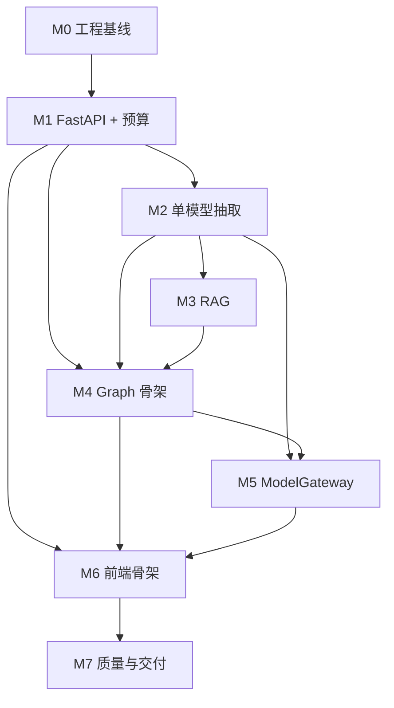

# TravelMindAI 功能模块实施文档

> 文档版本：v0.3（追加双角色改造顺序）
> 更新日期：2026-09-16
> 用途：回答“各模块怎么推进、做到什么算完成”  
> 关联文档：[PRD](./01-项目需求文档.md) · [技术设计](./02-技术设计文档.md) · [项目进度](./04-项目进度文档.md)

目录统一按 [项目分层约定](06-项目分层与审阅.md) 执行：`backend/app` 为正式包，API不设版本号文件夹，业务规则在services，模型调用在llm；当前M4-A工作流在services/itinerary，检索在services/document，聊天分支在services/chat。

## 1. 推进策略

项目按可独立验证的纵向里程碑推进。开发者已了解 Python、LangChain、LangGraph，直接进入产品工程，不新增基础学习模块。阶段划分用于控制依赖和验收范围：先形成最短业务闭环，再逐层加入 RAG、LangGraph、多模型和前端；不要求重复完成框架入门练习。

2026-09-08 已进入 M0 编码；工程验收结果见 [项目进度](./04-项目进度文档.md)。后续每批开发 2–3 个文件，说明用途、顺序和验证结果；手写源码与配置提供详细中文注释，自动生成的锁文件不手工编辑。飞书章节、技术取舍和样例缺口见 [参考文档对照](./05-参考文档实施取舍.md)。

```text
工程基线
  → FastAPI + 确定性预算 API
  → 单模型结构化需求抽取
  → 文档上传 + Milvus RAG
  → 账号归属 + 历史聊天 + 管理员资料简化
  → M4-A 最小文本行程智能体（LangGraph + 按需工具 + 草稿）
  → 私人附件理解 + M4-B 附件更新行程
  → M4-C 独立审查 + 持久暂停恢复
  → 四模型网关 + 降级
  → Vue 端到端产品
  → 评测、故障演练、部署与作品集包装
```

每个模块必须满足四个条件才可标记完成：代码存在、自动化测试通过、运行验证有记录、文档/进度已更新。只有阅读代码或写出类名不算完成。

## 2. 总体里程碑

| 阶段 | 目标产物 | 关键验证 | 前置 |
|---|---|---|---|
| M0 | 可复现工程基线 | 新环境安装、lint/test/secret scan | 无 |
| M1 | FastAPI + 预算闭环 | OpenAPI、预算 API、单元/集成测试 | M0 |
| M2 | 单模型需求抽取 | Pydantic 输出、缺字段追问、真实 smoke | M1 |
| M3 | 管理员多格式知识库 + Milvus RAG | 上传到引用闭环、Recall@5 基线；双角色改造见2.1 | M2 |
| M4 | LangGraph 多 Agent + 短期记忆 | 图路径、返工、interrupt、恢复 | M1–M3 |
| M5 | 四模型 ModelGateway | 契约、负载选择、熔断、降级演练 | M2/M4 |
| M6 | Vue 全栈交付 | 双角色页面完善、行程展示、SSE、E2E | M1–M5 |
| M7 | 质量、部署、作品集 | Compose、评测报告、演示脚本 | 全部 |

### 2.1 当前优先改造（2026-09-16，A～C基础已实现）

按[09方案](./09-双角色与对话附件改造方案.md)推进以下小步，A～C基础完成后就接入M4-A，不等待全部附件和管理增强。保留已有M1～M3成果与质量待办，不因方案更新将历史阶段重新标记完成。

| 顺序 | 交付 | 验证 |
|---|---|---|
| A（源码和实库已落地） | 用户表、登录态、会话归属、管理员API保护、旧数据迁移 | 两用户隔离、历史映射正确、普通用户无法直接操作知识库 |
| B（源码已实现，浏览器待验收） | 左侧历史与新建对话、移除用户资料导航/旅行需求面板 | 刷新重登恢复、新建保留历史、后台条件继续合并 |
| C（源码已实现，浏览器待验收） | 城市/类别两标签、城市折叠列表、紧凑上传与切片预览 | 文件名+两标签组合筛选、分组计数/分页、自动处理和重试 |
| M4-A（本轮范围已验收） | 单文本模型的受控工具选择、逐日草稿、校验、修改摘要和撤销 | 按需调用工具、草稿规则正确、版本保存与撤销幂等 |
| D（本轮已实现） | 私人附件存储、文字读取、百炼Qwen视觉模型接入 | 地名/顺序及模糊点定向样本、隔离与恢复见08第12.5；附件不进入公共向量库 |
| E / M4-B | 将附件理解及参考/必经/替换用途接入M4-A | 指定日更新、不误覆盖、预算校验、重试和撤销 |
| M4-C | 独立审查、有限返工、持久检查点及人工恢复 | 重启/暂停恢复、执行上限、恢复不重复副作用 |
| C后增强 / F | 批量两标签与失败重试；F实现文件替换 | 未选文件不变、新旧知识切换一致、失败旧版可用；不阻塞M4-A |

每步按“测试/契约 → 表和业务 → 接口 → 前端 → 真实验证 → 07/08同步”推进，每两三个文件说明作用。M4-A先具备文本草稿能力，D只证明附件理解，E/M4-B才证明附件更新草稿。批量管理、文件替换和四模型网关不作为智能体入场条件；切片质量以样本评测决定改法，不无限等待全库优化。

## 3. M0：工程基线

### 3.1 目标

把当前学习脚本目录变成可复现、可测试、不会导入即调用远程模型的正式项目。

### 3.2 实施步骤

1. 先建立 `backend/app/` 和 `backend/tests/`；前端、数据目录在有实际文件时创建；
2. 在 `backend/pyproject.toml` 声明 Python 3.11 和首阶段最小依赖，生成 `uv.lock`；
3. 增加 `.gitignore` 和 `.env.example`，确认 `.env`、上传文件、Milvus 数据、PostgreSQL 数据、会话检查点不进入版本库；
4. 当前 9 个实验脚本保留原位置，正式包及测试不导入它们；后续需要复用时只提取无网络副作用的函数，不为整理目录批量移动实验文件；
5. 配置 `ruff`、`mypy`（先检查核心包）和 `pytest`；pre-commit 可在首次提交前补入；
6. 建立 `README.md`：安装、配置、运行、测试、目录说明；
7. 初始化 Git；首次提交前检查工作树和历史中没有密钥。

### 3.3 最小文件

```text
backend/app/__init__.py
backend/app/config.py
backend/tests/
backend/pyproject.toml
backend/uv.lock
.env.example
.gitignore
README.md
```

### 3.4 验证

```powershell
cd E:\TravelMindAI\backend
python -m uv sync --locked --link-mode copy
python -m uv run --locked ruff check .
python -m uv run --locked ruff format --check .
python -m uv run --locked mypy app scripts
python -m uv run --locked python -X utf8 -m pytest
python -m uv run --locked python -m compileall src
```

### 3.5 完成标准

- 在独立临时目录或干净检出中按 README 可重新安装，不删除当前项目；
- 运行测试不需要真实模型密钥；
- 导入 `travelmind` 不发起网络请求；
- `.env` 和运行时数据未被跟踪；
- 当前 9 个实验脚本的保留与隔离方式有明确记录。

当前已有 `backend/pyproject.toml`、`uv.lock` 和项目环境；通过 `python -m uv` 调用工具，不依赖 uv.exe 是否在 PATH。请在 backend 目录执行上述命令，具体安装与配置示例见 [README](../README.md)。每条命令单独判断退出码。

## 4. M1：FastAPI 与确定性预算模块

### 4.1 目标

先交付第一个不依赖 LLM 的业务闭环：接收旅行条件、精确计算预算、返回结构化结果。

### 4.2 后端实现

1. `main.py` 使用应用工厂并注册 `/api/v1` router；
2. `config.py` 用 `pydantic-settings` 校验环境；
3. 建立 `TravelRequest`、`BudgetInput`、`BudgetSummary` Pydantic DTO；
4. `services/budget_service.py` 使用 `Decimal`，计算住宿、城际交通、市内交通、餐饮、门票和预留金；
5. 领域函数不依赖 FastAPI，输入非法时抛出领域异常；
6. API 层把领域异常映射为统一错误；
7. 增加 `/health/live`、`/health/ready` 和 `POST /budget/estimate`；
8. 将本阶段拆为 M1-A（预算 API，无数据库依赖）和 M1-B（SQLAlchemy 2 + Alembic，建立 session、travel_request 和 itinerary 草稿存储）；两部分分别验证，M1-B 完成后再进入需要保存会话的 M2。

### 4.3 关键测试

- 正常预算、恰好用尽、超支、0/负数、日期倒置、人数上限；
- 小数金额不会出现二进制浮点误差；
- API 422 和领域 400 错误格式一致；
- OpenAPI 能生成，health 语义正确；
- PostgreSQL migration 可从空库执行并回滚一次。

预算基准必须先固定计价单位：住宿为每间每晚，餐饮/市内交通/门票为每人每天，城际交通为每人全程，预留金基于各分类小计。晚数、房间数、价格版本和估算假设均返回响应；不把固定档位单价称为实时价格。精确公式及常量在 M1-A 测试夹具中版本化，至少验证两人三天、单人、奇数人数分房、恰好用尽和小数舍入。

### 4.4 完成标准

- 所有预算规则测试通过；
- Swagger UI 可提交并返回预算；
- 相同输入得到相同输出；
- 预算总额可由分类明细逐项复算；
- 不使用模型生成或修改金额。

### 4.5 M1-A 当前实现（2026-09-08）

- 已实现 `services/budget_service.py`、`schemas/budget.py`、`api/budget.py`、`main.py` 和相应测试；
- `POST /api/v1/budget/estimate` 返回 `{budget, request_id}`，包含计价单位、价格版本、房间/晚数、分类明细、预留金、总额、余额和假设；
- `demo-cny-v1`：每间每晚经济200/舒适400；每人全程城际400；每人每天市内30/餐饮80/门票60；预留金10%；
- 2–5天、1–8人，每间最多2人，晚数=天数−1；日期可不填，填写时校验成对、顺序和天数一致性；
- 24 个领域测试、25 个 API 测试及6个基线测试通过；真实 HTTP 和 Swagger 页面提交均验证；
- M1-A与M1-B均已完成：连接基础、三张业务表、首份迁移、Python存储及四个会话/草稿HTTP接口已验收。迁移仍为 `0001_business_tables`；105项测试通过，含34项真实 PostgreSQL测试。lifespan管理连接池，ready按配置检查数据库；完整旅行需求DTO仍归M2，`persistence.models.TravelRequest`只是ORM快照表。
- 会话表当前不含 `user_id`，认证/用户表在后续阶段接入；需求和行程以 JSONB 对象保存版本快照，金额约定使用字符串。草稿通过 `(request_id, session_id)` 复合外键保证需求属于同一会话；没有启用级联删除。`TripService.save_draft` 在同一事务中保存需求和草稿并更新 `updated_at`，锁会话行后分别分配版本，失败整体回滚。读取可取最新/指定行程版本，按外键取得对应需求。
- `../scripts/demo_trip.py` 是可写演示入口；HTTP接口为 `POST /sessions`、`GET /sessions/{id}`、`POST /sessions/{id}/drafts` 和 `GET /sessions/{id}/drafts?version=...`。保存输入复用BudgetInput并由服务端算钱，拒绝客户端指定费用/版本/状态。返回需求和草稿快照，错误采用统一格式；尚无归属鉴权、完整旅行领域校验、消息/确认接口或自动生成行程。
- 未配置数据库仍可算预算，存储请求503，ready报告disabled；配置后实际检查三张表及字段，连接/结构不可用时ready返回503，live仍200。SQLAlchemy约束冲突409、连接故障503、缺表/字段503，其余数据库异常脱敏500；非数据库意外异常仍使用框架默认行为。
- 函数说明按用户要求采用 `def` 上方的独立三引号字符串，有装饰器时置于装饰器上方，之间只留一行空行；不依赖这些字符串提供函数 `__doc__`。Ruff格式器的默认两行建议不覆盖此自定义约定。

学习脚本已迁至项目外 `E:/TravelMindAI-learning`，正式包不导入该目录。运行与文件阅读顺序见 [README](../README.md)。

## 5. M2：需求理解与单模型结构化输出

2026-09-11实施核对：按用户要求，Vue 3 + TypeScript + Vite + Arco Design的简易对话页提前到M2。单条抽取、多轮合并、对话保存/恢复和浏览器交互已实现；216项测试通过，真实DeepSeek固定开发集30组36轮全部通过，M2按本节完成标准验收。结果含确定性的日期及首次意图校正，不代表模型原始标签或独立盲测准确率。逐文件说明持续更新 [07-各阶段开发说明](./07-各阶段开发说明.md)，当前实际字段和路径以 [08-架构设计说明](./08-架构设计说明.md) 为准；下方设计示意不作为源码逐字复制。下一阶段进入M3资料上传与检索。

### 5.1 目标

先用一个已配置模型完成“自然语言 → 旅行约束”的稳定转换，再扩展到多 Agent 和多模型。

### 5.2 数据契约

`TravelRequestExtraction` 至少包含：

```python
class TravelRequestExtraction(BaseModel):
    intent: Intent
    destination: str | None
    origin: str | None
    start_date: date | None
    end_date: date | None
    days: int | None
    travelers: int | None
    total_budget: Decimal | None
    pace: Literal["relaxed", "balanced", "intensive"] | None
    interests: list[str]
    hard_constraints: list[str]
    excluded_items: list[str]
    missing_required_fields: list[str]
    assumptions: list[str]
```

模型输出经过 Pydantic 校验，再交给领域层做日期/天数一致性、预算、人数字段验证。模型不能自行把缺失预算伪造成用户输入。

### 5.3 实施步骤

1. 把 Prompt 放在 `agents/prompts/requirement.py`，包含正反例和字段规则；
2. 建立单一 `ModelClient` 接口，当前只接一个真实提供方；
3. 使用结构化输出；失败时允许一次“基于校验错误修复”，仍失败返回统一错误；
4. 实现 `merge_requirements(old, extraction)`，明确新消息覆盖、列表合并和硬约束删除规则；
5. 实现 `build_clarification(missing_fields)`，一次汇总必要字段；
6. 增加 `POST /sessions`、`POST /sessions/{id}/messages`；
7. 保存用户原消息、抽取结果和采用的默认值；
8. 建立 30 条带期望字段的本地数据集。

### 5.4 测试

- 完整请求不追问；
- “下周末”“三天”等相对时间基于显式当前日期解析，输出保留假设；
- 用户说“不是两个人，是三个人”能覆盖旧值；
- 用户说“预算还是 6000”不会清空其他字段；
- 恶意文本不能修改系统规则；
- fake model 返回无效 JSON、缺字段和错误类型时路径可测；
- 配置密钥时执行一条真实 smoke test，不打印响应中的敏感内容。

### 5.5 完成标准

- 必要字段离线准确率达到 PRD 目标；
- 条件完备输入直接进入下一状态；
- 缺字段只产生一个集中问题；
- 无密钥时应用能启动并给出“模型未配置”就绪状态，而不是导入崩溃；
- 所有远程调用都有超时。

## 6. M3：文档解析与 Milvus RAG

**2026-09-15当前进度：**资料生命周期、标签前置过滤、后台解析/索引与中断重试已接入页面；此段记录当时本机迁移至0007，最新双角色实库已至0010。固定29段33题完成真实评测，Recall@5达到80%基线（实测100%），无证据5/5、注入2/2；选定版本全文忠实度32/33，仍有一题条件丢失，不能外推全量知识库质量。工程闭环和召回基线已交付，事实忠实度仍须改进。最新契约见08第10.17/10.18，以下早期段落为历史记录。

2026-09-14第一小步已落地：PDF/DOCX/TXT/Markdown上传读取、原文件与PostgreSQL档案保存、SHA-256去重、列表/详情以及现有Vue资料页。同步读取结果存`documents.sections_json`；第二小步增加`document_chunks`表、按需生成/分页接口及Vue片段预览；800字符上限、100字符重叠，保留原文位置和固定编号。第三小步增加独立Embedding配置、兼容接口客户端和只读取样/小批量试跑命令；全量276项测试通过，用户填写配置后，阿里云text-embedding-v4真实短文本与3段资料调用均通过（1024维）。第四小步已接入本机Milvus 2.6.17、每批8段的索引续建、原文语义搜索及Vue入口，2444段杭州资料真实写入并通过重启恢复；最终283项测试通过。第五小步已将RAG接入原主聊天：每轮检索、证据回答、引用校验及整轮快照保存恢复，资料页无额外问答按钮；聊天自然回答、不展示引用，事实仍限于检索证据，后台保留引用校验与快照。本次继续补充景点介绍、默认门票说明与高德工具补查，新增7段公开内容；地图Key尚缺，不能视为真实地图验收。高德人均消费不当作票价。尚未实现后台parsing/重试、删除和完整引用含义评测。下列A～D仍是完整M3目标，不能当作已完成清单。当前契约、迁移和边界以[08](./08-架构设计说明.md)为准，逐文件顺序和验收见[07](./07-各阶段开发说明.md)。

### 6.1 目标

完成“管理员上传知识库 → 解析 → 切分 → 向量化 → 聊天按需检索 → 后台证据保存”的闭环。以下为目标要求；当前双角色基础实现见08，私人对话附件走2.1的D/E，不走知识库入库。

### 6.2 分步实施

#### A. 文档生命周期

1. 建立 `documents`/`document_chunks` 表和状态枚举；
2. 上传时检查大小、扩展名、MIME、owner，计算 SHA-256；
3. 用生成的文件名保存到受控目录；
4. 内容哈希重复时返回现有记录或显式冲突；
5. 首版以FastAPI后台任务执行解析重试或索引，状态保存于与资料一对一的document_jobs；documents仍表示正文可用性，索引幂等并复用已写向量；
6. 单进程服务启动时识别上次中断留下的queued/running任务，标记failed并提供显式重试；内存后台任务不承诺重启后自动续跑。多worker或持久队列需另行设计可靠调度，不把当前会话锁当作分布式任务队列。

#### B. 解析与切分

1. 为 PDF、DOCX、TXT/Markdown 实现统一 `DocumentParser`；
2. 输出 `ParsedSection(text, page_number, section_path, order)`；
3. 对空 PDF、扫描 PDF、损坏 DOCX 给出可读错误；
4. 按标题和段落切分，记录 chunk 与原位置；
5. 固定测试文档确保升级解析库后不会悄悄改变页码/顺序。

新增质量要求：以景点/住宿/餐馆记录为单位检查名称、地址、价格条件的关联；长记录仍遵守长度上限并保留记录标识，正文字符位置准确；目录/纯标题不单独充当推荐证据。先做代表样本与独立题目评测，再决定是否调整切片规则及新策略索引；详见09第12.3节。

#### C. Embedding 与 Milvus

1. 建立 `EmbeddingProvider`，维度和版本从配置读取；
2. 按 embedding version 创建 collection；
3. Windows 用 Compose 的 Milvus Standalone；Linux 可用 Lite 进行轻量开发；
4. 批量写入前生成 chunk id，失败可按 document id 清理重试；
5. 将业务记录的 vector status 与 Milvus 写入结果同步。

#### D. Retrieval 与引用

1. 服务端强制共享知识库范围，按city/category过滤；上传管理员仅作记录，不限制普通用户聊天的公共知识使用；
2. top 20 召回、去重后输出 top 5–8；
3. 返回 `Citation`，包含文档名、页码/标题、片段和 chunk id；
4. 回答生成后校验 citation id；
5. 文档删除执行状态标记、Milvus 删除、文件删除，失败保留重试记录。

### 6.3 测试与评测

- 三种文件类型的解析金丝雀测试；
- 重复上传、损坏文件、超大文件、跨 owner 检索隔离；
- Milvus 写入/查询/删除集成测试；
- 20–50 个固定片段、至少 30 个标注问题；
- 记录 Recall@5、MRR、检索延迟和引用有效率；
- 测试“文档中的提示注入”不会改变系统行为。

### 6.4 完成标准

- 文档状态可见且失败可重试；
- 固定问题能检索到期望片段并显示来源定位；
- 删除后无法再检索；
- Recall@5 达到 PRD 基线；
- 没有命中时明确回答知识库证据不足。

## 7. M4：LangGraph 多 Agent 与上下文记忆

### 7.1 目标

把已经独立验证的需求抽取、预算和RAG接到受控智能体流程，让模型能按需选择工具并形成行程。A～C基础完成后已进入M4-A：2026-09-16源码接入基于LangGraph的create_agent、逐日草稿、修改摘要及撤销，自动检查与真实验收分开记录于07和08第10.23节。私人附件和管理增强不是M4-A前置条件；普通知识问答与不完整需求仍使用原有固定业务链，不能将所有聊天都称为Agent。

#### M4-A：文本行程智能体（本轮范围已验收）

1. 定义逐日行程、工具请求/结果和最小图状态；复用会话、历史、预算与草稿服务，不复制第二套规划主流程。
2. 需求提取前，周边Agent用`search_nearby/ask_location/continue_chat`承接餐饮、住宿与价格追问，复用实际地图结果和历史查询；非周边请求继续原需求处理。需求提取后，完整规划请求进入`create_agent`标准工具循环；单文本模型ChatOpenAI直接绑定StructuredTool，中间件按证据开放工具，框架通过原生ToolMessage传递结果与校验错误。最多6轮模型决策、12次外部查询；预算、校验和事务保存由程序处理。
3. 单个现有文本模型先验证工具调用；不要求四提供方或多个独立Agent同时接通。缺必要条件就追问结束本轮，未使用的工具不调用。
4. 实现文本局部修改、新旧结构差异摘要与最近修改撤销；先验收预算/时间/约束、版本幂等和跨用户隔离。
5. 先固定替身验证路径，再真实模型/数据库/浏览器验证。此步失败后重试，不声称已有持久节点恢复。

当前规则核对天数完整、地点依据、时间重叠、节奏、明确排除项、某天明确开始时间和演示预算；其余无法核实的硬条件先说明并补问。交通预留不是路线验证，`demo-cny-v1`不是实时报价。只有明确点名某天且原行程天数、目的地、开始日期适配时，程序限定仅改指定天；未点名时允许全程重新规划。复用现有JSONB快照，不新增表或迁移。已完成本轮真实生成、第二天修改、撤销与刷新恢复验收，证据见08第10.23节，不外推广泛规划质量或M4-B/C能力。

#### M4-B：接入附件（对应09的D/E）

D私人附件读取与百炼Qwen识别已于2026-09-18落地，合同及验收见08第12.5节；当前附件轮次只解释附件并保留原草稿。下一步E把参考/必经/替换意图及地点核对结果送入M4-A同一图，复用规划、校验、保存和撤销。验收图片修改指定日、模糊点追问和失败保留原草稿，不新建一套独立附件规划器。

#### M4-C：补齐完整编排验收

在前两步基础上增加独立Reviewer、最多两次返工、人工取舍interrupt、PostgreSQL检查点和服务重启恢复。工具副作用与业务保存仍保持幂等；跨会话长期偏好继续是后续增强，不阻塞M4核心验收。

### 7.2 完整M4能力清单（按A/B/C分批落地）

以下是后续完整M4目标，不是M4-A当前节点或已实现能力；M4-A实际条件图与JSON合同以08第10.23节为准。独立Reviewer、interrupt和持久检查点属于M4-C。

1. 定义 `TravelGraphState` 和所有节点输入/输出 schema；
2. 先使用 fake model/fake retriever 连接 `intake → retrieve → budget → plan → review`；
3. 添加缺字段条件边和 `interrupt`；
4. 添加 Reviewer 规则：预算、日期、重复时段、硬约束、引用有效性；
5. 添加 `review → plan` 返工边，最大 2 次；
6. 添加“需用户取舍” interrupt 和恢复；
7. 接入实际 Requirement/RAG/Budget 服务；
8. 开发环境用 InMemory/SQLite checkpointer，集成环境切换 PostgreSQL；
9. 同一 `thread_id` 恢复多轮状态；
10. 实现局部修改影响分析，只重跑必要节点；
11. 后续增强再增加用户确认后的长期偏好写入，默认关闭隐式记忆，不作为本轮M4前提。

接入飞书中的“研究→筛选→编排→优化”业务步骤时，在 retrieve 后保留候选筛选结果，在 plan 后按天运行路线调整再进入 review；先在现有节点内部实现，只有独立重试/观测确有需要时才拆节点。路线输入来自当天实际活动，调整结果回写结构化 itinerary。天气、地图未接入时使用 unavailable 结果；测试使用固定 fixture，不以随机数据填充用户方案。

### 7.3 图路径测试矩阵

本表保留完整M4目标路径；当前M4-A使用`create_agent`标准工具循环，缺条件结束本轮，不创建interrupt或checkpoint。M4-A不允许缺少已核对具体POI的活动进入最终草稿。

| 用例 | 期望路径 |
|---|---|
| 完整新建 | intake → retrieve → budget → plan → review → persist |
| 缺预算 | intake → clarify → interrupt；补充后恢复 |
| 只问预算 | intake → budget → respond |
| 无 RAG 命中 | retrieve → budget → plan，带证据不足警告 |
| 方案超支可修复 | review → plan，返工 ≤ 2 |
| 硬约束冲突 | review → user_decision interrupt |
| 修改第三天 | intake → affected retrieve/plan → review，不重建无关天 |
| 节点崩溃 | 从最后成功 checkpoint 恢复 |
| 同用户不同 thread | 短期消息隔离；仅确认的长期偏好共享 |
| 增删第二天景点 | 更新当天活动/交通/预算，其他天保持，重新 review |
| 天气缺失或日期超预报范围 | 继续规划静态草案，明确待核实，不生成虚假天气 |
| 地点缺坐标 | 保留可解释顺序，跳过该点距离估算，返回警告 |
| 纯条件修改 | 仅更新约束和受影响草稿，无需检索时不访问Milvus |
| 同附件三种用途 | 参考不变必经，必经检查可行性，替换只作用于指定日 |
| 撤销最近修改 | 恢复对应需求/行程为新draft版本，保留历史；旧版本按钮冲突 |
| 工具名/参数非法或超次数 | 拒绝执行并给出可恢复失败，不扩大权限或无限循环 |

### 7.4 完成标准

- 每条关键条件边都有确定性测试；
- 返工和节点重试均不会无限循环；
- 服务重启后 PostgreSQL 环境可恢复 thread；
- Graph state 不包含模型客户端、数据库连接或整份文档；
- 运行详情能显示节点、耗时、错误和返工原因；
- “多 Agent”确实产生不同的结构化产物和审查反馈。

## 8. M5：四模型集成、负载与降级

### 8.1 目标

在业务图已经可运行后，用统一网关替换单模型客户端，接入 DeepSeek V3 系列、Qwen、Kimi、MiniMax；真实模型标识保持配置化。

### 8.2 实施步骤

1. 定义 `ProviderAdapter`、`ModelRequest`、`ModelResult` 和统一错误枚举；
2. 抽取 OpenAI-compatible 公共代码，但为四提供方保留独立配置和异常映射；
3. 为 `extract/research/plan/review/chat` 建立 capability registry；
4. 从配置加载业务别名、真实模型名、端点、密钥、超时、权重；
5. 实现近窗口成功率/延迟统计和加权选择；
6. 实现最大并发限制、超时、一次同模型重试；
7. 实现 Closed/Open/Half-open 熔断器；
8. 实现跨提供方 fallback，并记录原/目标 alias 和原因类别；
9. 对结构化输出执行 schema 校验和一次修复；
10. 流式响应在第一次输出 token 后不跨模型续写；中断时返回可重试事件；
11. 增加演示故障开关，仅在开发环境有效。

### 8.3 契约测试

每个适配器使用相同测试套件验证：

- 普通文本、结构化输出、流式事件；
- 请求参数和 provider 特殊参数；
- timeout、429、5xx、401、400、空响应、无效 JSON；
- usage/token 归一化；
- 日志不含 API Key；
- 未配置某提供方时从候选池排除，而不是启动失败。

### 8.4 真实验证

只有用户配置了对应密钥时才运行：每个提供方一条普通请求、一条目标能力所需的结构化请求。真实模型名和验证时间写入进度文档，不能根据适配器代码推断“已接通”。

### 8.5 完成标准

- 四个适配器契约测试全部通过；
- 已配置的四个提供方分别完成真实 smoke，未配置者明确标为未验证；
- 主模型 timeout/429/5xx 故障注入能自动降级；
- 401/内容安全拒绝不会形成重试风暴；
- P95、成功率、fallback 次数可观测；
- 故障注入降级成功率达到 PRD 目标。

## 9. M6：Vue 前端与全栈闭环

Vue工程和基础对话页已提前至M2。本阶段在现有`frontend/`上扩展资料、行程工作台、SSE、保存和导出，不重新建工程。

### 9.1 目标

交付可供真实用户操作和面试演示的前端，不以 Swagger 代替产品界面。

### 9.2 工程基础

1. Vue 3 + TypeScript + Vite + Arco Design Vue；基础布局使用 scoped CSS，TailwindCSS 不作为首版必需；
2. 延用现有Vue组合式函数管理会话、行程和角色页面状态，出现跨组件共享需求后再评估Pinia；
3. API client 由 OpenAPI 类型生成或共享明确 DTO；
4. 统一 loading、empty、error、retry 状态；
5. 测试使用 Vitest + Vue Test Utils，端到端使用 Playwright；
6. 预算图表按需使用 ECharts；地图视图进入 P1，先交付真实 API 驱动的地点/路线列表。

### 9.3 页面推进

#### A. 用户对话与历史

- 左侧历史列表和“新建对话”，按当前用户恢复；
- 聊天输入、私人附件和消息；
- 需求在后台保存，缺失项/默认值通过聊天说明，不显示固定需求卡；
- SSE 展示节点进度；
- 断线、取消、重试。

#### B. 行程工作台

- 按天/时段展示活动；
- 预算分类和余额；
- 冲突、系统假设、待核实项；
- 引用侧栏；
- 局部编辑、版本冲突提示、确认和导出。

#### C. 管理员知识库

- 紧凑多文件上传，支持PDF/DOCX/TXT/Markdown；
- 文件名查询及城市/类别两标签筛选，按城市展开文件；
- 切片预览，文件级处理状态和失败重试；移除顶部大型搜索区；
- 删除前确认，删除后刷新检索状态。

#### D. 运行详情

- Graph 节点时间线；
- 模型业务别名、延迟、fallback；
- RAG 命中数量和引用；
- 默认只在开发/演示模式显示。

### 9.4 E2E 场景

- 完整条件一轮成稿；
- 缺字段补充后恢复；
- 管理员知识库上传后聊天检索命中，普通用户不能访问管理接口；
- 用户私人附件识别并局部更新草稿，不进入公共向量库；
- 修改第三天并保留预算；
- 故障注入触发模型降级；
- 刷新页面恢复 session；
- 409 版本冲突不覆盖数据。

### 9.5 完成标准

- PRD 四个主界面均可使用；
- 核心 E2E 在 Compose 环境通过；
- 页面不展示内部堆栈、API Key 或完整敏感 Prompt；
- 桌面常见宽度无关键内容遮挡，移动端可读；
- 后端失败均有可执行的用户操作：补充、重试、重新连接或返回。

## 10. M7：质量、部署和作品集交付

### 10.1 质量收口

1. 建立 30+ 请求评测集和版本化结果；
2. 对 PRD 指标生成报告，不达标项记录原因和下一实验；
3. 运行单元、契约、集成、图、E2E 和 secret scan；
4. 运行依赖漏洞检查和日志脱敏检查；
5. 用固定种子和 fake provider 保证 CI 可复现。

### 10.2 部署

1. `compose.yaml` 启动 API、前端、PostgreSQL、Milvus；
2. 使用健康检查和迁移命令，不用固定等待时间；
3. 提供 `.env.example` 和最小/完整两套配置说明；
4. 提供备份/清理本地数据命令，命令目标必须是明确的数据目录；
5. 在全新环境走一遍 README。

### 10.3 作品集材料

- 一张架构图和一张 LangGraph 路径图；
- 3–5 分钟录屏；
- 主模型 timeout → fallback 的可观测演示；
- 文档上传 → 引用的演示；
- 一份评测报告，诚实标注静态知识与实时信息边界；
- README 中回答“为什么这些 Agent 必须分工”。

### 10.4 完成标准

- 新机器按文档启动成功；
- PRD 六个验收场景全部通过；
- 评测结果和真实 provider smoke 时间已写入进度文档；
- 仓库扫描不包含密钥和运行时用户数据；
- 演示不依赖临时手工改代码。

## 11. 功能依赖与并行边界



可安全并行的工作只有：M3 的文档解析与 M4 的 fake Graph 骨架、M6 的前端静态骨架与后端契约设计。共享 schema 未冻结前不要并行开发多个不一致 DTO。

## 12. 进度更新规则

每完成一个模块，在 [项目进度](./04-项目进度文档.md) 中记录：

```text
日期：
模块/验收项：
变更文件：
执行命令：
结果：通过/失败/未运行
外部依赖：使用 fake / 本地服务 / 真实 API
遗留风险：
下一步：
```

状态定义：

- `未开始`：没有目标代码；
- `进行中`：有代码，但至少一个完成标准未满足；
- `已实现未验证`：代码路径存在，但尚未运行对应测试/服务；
- `局部验证`：只通过单元或 fake 测试，真实集成尚未完成；
- `已完成`：模块所有完成标准均有当前工作区证据；
- `阻塞`：已明确阻塞条件和恢复方式。

禁止使用“代码看起来没问题”“应该可用”作为完成证据。

## 13. 首个建议执行切片

M0 工程基线的实施清单如下，当前结果见进度文档；下一步进入 M1-A：

1. 创建 `.gitignore`、`.env.example`、正式包、`pyproject.toml`、锁文件和 README；验证：配置示例不含真实凭据，独立环境可按锁文件安装；
2. 保留 9 个实验脚本，隔离正式包导入；验证：导入 `travelmind` 无网络请求、无交互输入；
3. 配置测试和静态检查入口；验证：ruff、核心包 mypy、pytest、compileall 通过，测试不是仅为凑数量的恒真断言；
4. 更新进度中的实际文件、命令和结果；验证：当前工作区证据能支撑 M0 每项完成标准；
5. 进入 M1-A，实现和测试 `services/budget_service.py`、预算 DTO、应用工厂及预算 API；再完成 M1-B 的持久化。

M0 不要求完成预算业务，也不提前创建空的 Agent/Provider 层。预算归属 M1，单模型结构化需求归属 M2；后续实现直接围绕这些业务产物推进。
