# TravelMindAI 架构设计说明

> 最近源码核对：2026-09-20（Asia/Shanghai，混合检索与同节原文展开见10.32；MinerU附件接入见12.15；M4-B用途与规划见12.12）
> 范围：当前工作区 `backend/app/`、`frontend/src/` 与数据库迁移文件。  
> 验证口径：当前百度MCP源码、自动检查与真实HTTP/SSE查询见10.25；10.24保留此前高德/可选百度HTTP和会话删除的历史验收，不能当成本轮百度证据；此前M4-A文本行程闭环见10.23，流式回复与餐饮历史验收见10.22。口语追问与字段容错见10.21，景点地址与定向补查见10.20，自动上传处理见10.19，元数据与后台基础见10.17，固定题库评测见10.18。本机已应用0008/0009/0010并完成共享范围数据迁移，双角色基础验收见12.8。旧节中的“尚未实现”描述仅对应当时；源码、自动检查和真实服务验收分别记录。
> 阅读配合：[07-各阶段开发说明](./07-各阶段开发说明.md) 讲开发顺序和逐文件写法；本文讲这些文件怎样组成系统。[02-技术设计文档](./02-技术设计文档.md) 包含目标设计，不能将其中尚未落地的模块视为当前能力。

> 2026-09-16源码核对：账号注册/登录、会话归属、管理员资料页、城市/类别与共享知识库范围已写入源码。本机已备份清理旧会话并完成0010和知识范围数据迁移；双角色自动检查与浏览器验收见12.8。M4-A LangGraph文本行程已进入源码，接口、JSON合同和本轮验收证据见10.23；私人附件、文件替换、独立审查与持久恢复仍是目标设计，见[09改造方案](./09-双角色与对话附件改造方案.md)。

## 1. 先用一句话理解现在的系统

TravelMindAI 当前采用 **Vue 前端 + FastAPI 后端 + DeepSeek需求理解与证据回答 + create_agent周边查询与文本行程（底层LangGraph） + PostgreSQL正文、词法检索和版本快照 + 阿里云Embedding与Milvus语义搜索**。

可以把它理解成一家旅行服务店：前端是接待窗口，后端是负责业务规则的工作人员，DeepSeek 负责提取用户条件，并根据检索原文整理知识回答，数据库是保存会话与草稿的档案柜。

当前源码里有四条业务主线：

1. **M2需求对话与周边查询**：登录后核对会话归属、历史与版本 → 周边Agent先理解本轮和商户上下文 → 查询餐饮/住宿或必要补问；普通聊天才继续提取、合并旅行需求并进入知识链或行程Agent → 公开实际步骤与知识草稿 → 校验并保存完整一轮 → 页面显示结果。刷新从服务端恢复；左侧确认删除可硬删本人整段会话。
2. **M1 预算与草稿**：提交预算输入 → 程序计算预算 → 按需要保存需求快照和行程草稿 → 读取最新或指定版本。
3. **M3 管理员资料**：管理员选择文件 → 读取正文及位置 → 保存原文件与档案、预填城市/类别 → 自动提交后台任务 → 切片并建立索引 → 服务端按共享范围与城市/类别限制资料 → 文字与向量混合搜索并按编号回查原文。旧`local-demo`资料尚存时资料业务返回503，须在维护窗口执行范围迁移。后台任务状态写入PostgreSQL；文件读取和标签识别不调用模型。

4. **M4-A文本行程**：必要条件齐全的规划请求 → LangGraph按模型原生工具调用选择知识库/网页/地图工具 → 程序校验逐日活动与演示预算 → 同事务保存需求、草稿和对话 → 消息行程卡。文字修改使用同一路径；撤销由程序恢复上版为新草稿。

**M1/M2旅行会话属于登录账号；M3资料属于管理员管理的共享知识库；主聊天把当轮引用原文快照关联到对话轮次。** 周边查询与行程规划分别使用框架Agent；周边Agent选择continue_chat后，普通知识问答和需求缺项处理仍沿用原业务链，完整规划请求才进入M4-A。“需求完整”仍只表示必要字段齐全，生成成功须同时有已保存的itinerary快照。

M3另保留独立的`demo_embedding`命令做少量试跑；该命令自身不写向量库。Web索引与搜索走`DocumentSearchService`，使用相同的阿里云`text-embedding-v4`配置，实际返回1024维向量。

聊天持久化已接入：前端按账号列出本人历史，再调用会话接口保存消息；旧需求由后端读取。2026-09-11的数据库与浏览器记录只对应当时单会话小步，最新验收见12.8。

## 2. 总体架构图

以下三张静态图保留M1～M3历史基础，未反映最新的周边Agent、M4-A与整段会话删除。当前调用顺序以2.5及10.23/10.25的Mermaid图为准；这些源码关系不等同于真实运行验收通过。

### 2.1 M1～M3总体架构

从上往下依次是使用入口、HTTP接口、业务服务、模型与数据资源。箭头表示M1～M3层间关系。M1预算/草稿接口继续保留；M4-A聊天规划复用预算计算和事务保存，扩展关系见2.5。


[打开高清总图](./diagram/travelmind-overview.png) · [打开可缩放SVG](./diagram/travelmind-overview.svg) · [查看Mermaid结构参考](./diagram/travelmind-overview.mmd)

### 2.2 一轮聊天：M2需求处理与M3知识回答

下图保留早期M2/M3链路供查阅，最新顺序已在2.5改为“先周边理解，再按需提取旅行需求”。普通知识链仍检索原文、网页补证并核对景点；地图Agent使用百度MCP回答天气、路线等问题，周边分支核对具体锚点后查百度商户，不经过知识检索。公开进度及知识草稿可先显示，完整保存后才返回done；已保存编号的重试直接返回原结果。检索或模型故障不保存半轮，地图工具失败可保存明确失败状态。


[打开高清聊天流程图](./diagram/travelmind-chat-rag.png) · [打开可缩放SVG](./diagram/travelmind-chat-rag.svg)

### 2.3 一份资料：M3知识库准备与使用

上半部分是上传、解析、分段和按需索引，中间是检索后供聊天回答或资料页原文搜索使用，底部是资料停用与清理。上传完成不代表已经建立索引；正文在PostgreSQL，向量及片段编号在Milvus。


[打开高清资料流程图](./diagram/travelmind-documents.png) · [打开可缩放SVG](./diagram/travelmind-documents.svg)

**图片维护约定：**三张SVG是排版源文件，对应PNG为2倍分辨率的文档预览。修改SVG后重新导出同名PNG，核对文字边界与整体预览；总图的`.mmd`只维护同等层次的结构参考，不再用它覆盖手工排版的PNG。具体文件路径、错误处理、健康检查和独立试跑命令继续在对应章节说明。


### 2.4 文件夹怎样找

目录采用“先按技术层，再按业务分组”。相同业务的数据格式与业务处理分别放在对应层，文件夹名保持一致。`models/document.py`当前只有一份资料表定义，预算、草稿也没有一组待归类文件，因此保留现有位置。

```text
backend/app/
├── api/                         接收HTTP请求、准备连接、返回结果
│   ├── document/                routes、search、jobs、dependencies、upload_limits
│   ├── requirement/             routes、history
│   ├── errors.py                统一错误响应
│   └── health.py                存活和依赖就绪检查
├── schemas/                     定义数据格式，不处理业务、不建数据库表
│   ├── document/                base、search、answer、job
│   ├── requirement/             base、update、chat、history
│   ├── itinerary.py             逐日活动、来源、版本与撤销格式
│   └── dining.py                餐饮/住宿商户和周边筛选快照
├── services/                    实际业务规则
│   ├── document/                parser、chunker、service、search、vector_store、jobs、answer、maps
│   ├── requirement/             prompt、extract、merge、history
│   ├── chat/                    service串联整轮，rag组织知识回答，dining运行周边Agent，events隔离公开事件
│   ├── itinerary/               graph受控工具图、tools证据查询、rules确定性校验
│   ├── baidu.py                 请求内共用的百度地点与商户业务核对
│   └── baidu_mcp.py             原生MCP适配、只读白名单与本轮依据
├── models/                      数据库表定义
├── llm/                         DeepSeek、Embedding客户端
└── main.py                      应用装配与生命周期
```

这里省略了未调整的预算、草稿和配置文件。各文件夹的`__init__.py`只说明用途，不自动创建客户端或转发旧导入。内部调用统一使用新路径，HTTP地址和数据库表名保持原样。

### 2.5 当前周边理解、聊天分流与M4-A保存关系

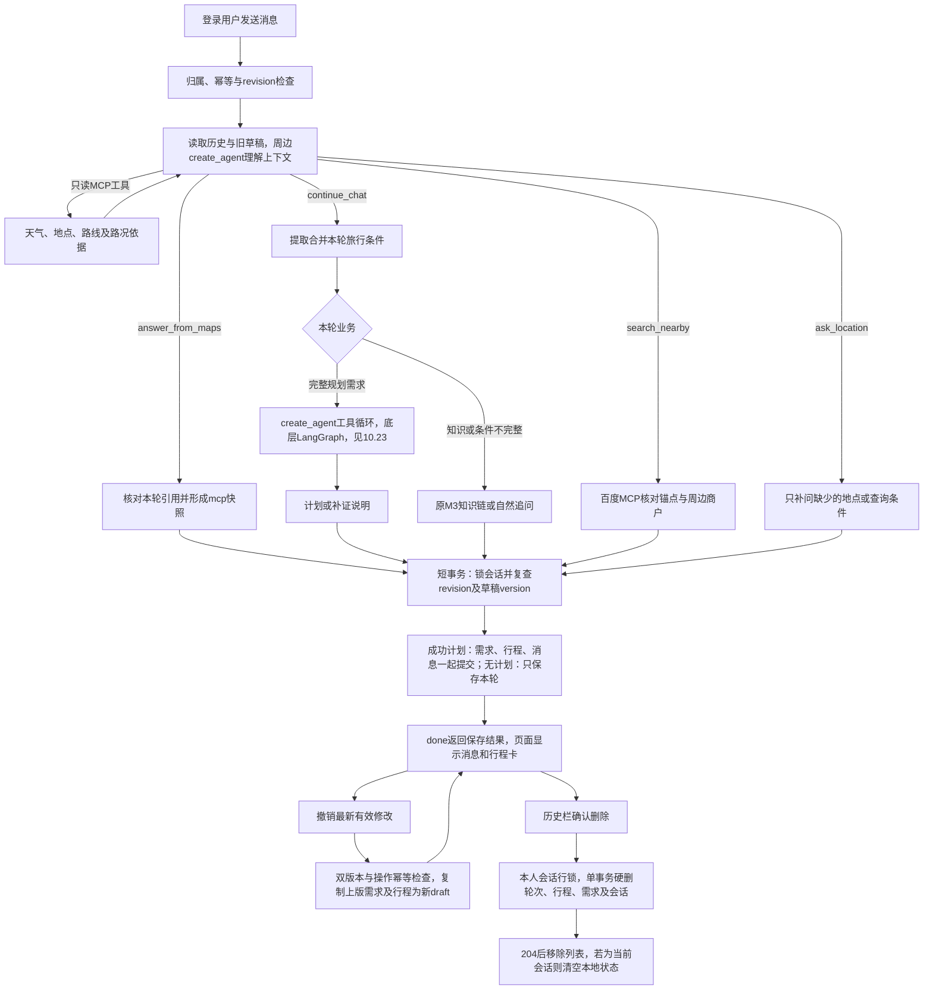

## 3. 前端每部分负责什么

以下路径均相对于项目根目录。

| 文件 | 职责 | 通俗理解 |
|---|---|---|
| `frontend/src/main.ts` | 创建 Vue 应用、加载样式 | 打开接待窗口 |
| `frontend/src/api/auth.ts` | 注册、登录、退出与恢复账号身份 | 登录入口的传话接口 |
| `frontend/src/App.vue` | 首页入口鉴权、登录后续发、角色导航、历史分页/选择/删除确认、聊天输入与资料入口 | 按身份连接首页与智能体 |
| `frontend/src/components/LandingPage.vue` | 青绿山景、品牌字标、旅行输入与规划按钮；只上报操作意图 | 用户进入智能体前的首页 |
| `frontend/public/brand/` | 已确认的山景、路线M图标与SVG字标 | 正式页面使用的静态品牌素材 |
| `frontend/src/useRequirementConversation.ts` | 当前会话新建/切换、发送、恢复、删除后的清空和冲突处理 | 管理这一次对话的过程 |
| `frontend/src/components/DocumentPanel.vue` | 管理员城市分组/分页、紧凑上传、原文/片段切换 | 共享资料柜的操作面板 |
| `frontend/src/components/DocumentUpload.vue` | 多文件选择、逐份上传、结果展示、暂停和单份重试 | 资料柜的上传入口 |
| `frontend/src/components/RestaurantCards.vue` | 展示已保存的餐饮/住宿、地图来源、评分、距离、参考消费和地图链接 | 缺失值不补造，住宿参考消费不冒充每晚房价 |
| `frontend/src/components/AttractionCards.vue` | 展示景点介绍、已核对门票说明、地址和百度位置链接 | 使用已保存的卡片，刷新不重新查询 |
| `frontend/src/components/ItineraryCard.vue` | 逐日活动、来源、演示预算、局限、差异摘要及撤销入口 | 显示保存后的版本，文字修改继续在聊天提交 |
| `frontend/src/components/DocumentChunks.vue` | 片段查询、生成、分页与位置展示 | 打开短片段查看出处 |
| `frontend/src/api/documents.ts` | 上传、查询、分段、索引、搜索及删除HTTP合同 | 将文件送给后端，读取状态与正文 |
| `frontend/src/mapLink.ts` | 共用百度网页marker链接，保留BD-09/GCJ-02坐标声明 | 三类卡片只传已核对的坐标与名称 |
| `frontend/src/api/http.ts` | 共用JSON响应解析与ApiError | 两类接口共用的错误读取规则 |
| `frontend/src/api/requirements.ts` | 定义 TypeScript 契约并封装后端请求 | 页面与后端之间的传话接口 |
| `frontend/src/style.css` | 页面视觉样式 | 调整窗口的外观和排版 |
| `frontend/vite.config.ts` | 本地端口、Vue 插件和API代理，保留浏览器Host供后端同源校验 | 让开发中的前后端连起来 |
| `frontend/src/components/DocumentJob.vue` | 轮询任务，完成时通知资料页重读当前片段 | 状态完成后更新预览 |

目前状态管理使用 Vue 的 `ref`、`computed` 与组合式函数，没有引入 Pinia。`App.vue` 按登录身份列出本人会话；不同对话的需求不放在模块级共享变量里。

页面发送使用POST SSE：progress显示实际业务步骤，draft/reset展示或清除待核对公开草稿，done才切换到已保存正式结果；原JSON发送入口继续保留。Enter 发送，Shift+Enter 换行，中文输入法选词时的回车不触发发送。

## 4. 一条消息的完整流程

2026-09-17核对：页面首先显示确认的青绿淡彩山景首页，加载时不读取登录身份或私人会话。点击“开始规划”或发送时，`App.enterAgent`调用`GET /auth/me`检查HttpOnly Cookie；成功后进入智能体，401才显示原生登录dialog，断网及其他错误留在首页提示重试。校验中禁用入口并拦截重复点击。原问题只暂存在页面内存，取消登录不丢输入，刷新不承诺保留。`POST /auth/register`创建普通用户，或`POST /auth/login`登录成功后，发送入口新建属于该账号的会话并自动续答一次，不接到账号以前的对话；“开始规划”入口恢复原有会话，已有首页文字带入聊天框但不自动发送。登录失败保留待回答问题；退出回到匿名首页并清除私人内容。左下角显示首字母圆形头像及完整账号名（作为当前昵称），菜单提供退出。登录、注册、账号创建统一校验6～12位密码，含边界。后端以Argon2校验口令，Cookie持有随机令牌7天，数据库只存SHA-256哈希。Cookie设置HttpOnly、SameSite Strict，生产环境或HTTPS设置Secure；所有写请求需`X-Requested-With: TravelMindAI`，有Origin时检查同源。登录/注册每IP每分钟最多10次，限频表单进程至多10000地址；多worker部署需共享限频。会话/草稿/历史在调用业务服务前按服务端当前用户检查归属，匿名401、跨用户404；资料旧路径和`/admin`别名均要求管理员，普通用户403。


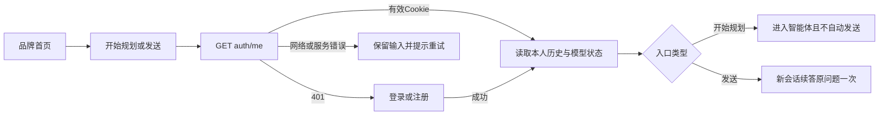

首次成功聊天将默认会话标题设为原话去多余空白后的前40字；后续成功轮次更新`updated_at`。用户历史按`updated_at/id`倒序游标分页，浏览器`sessionStorage`只记当前选择和待确认发送，服务端历史才是找回旧会话的依据。

### 4.1 需求抽取时序与当前持久化路径

下面先展示无状态抽取接口的核心处理过程，其中旧需求和日期基准由调用方提供。

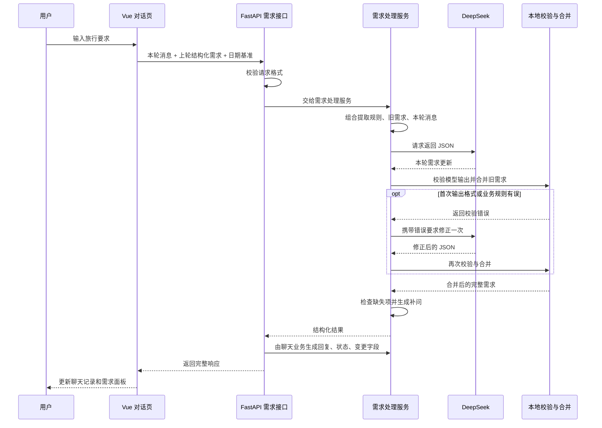

当前页面的持久化接口复用这套提取、校验、合并和补问逻辑，但旧需求与日期基准由后端读取数据库取得，成功保存整轮后才向前端返回成功。图中的“本地校验与合并”是后端程序内的处理步骤，不是独立部署的服务。

**当前持久化路径按以下顺序执行：**

1. 页面第一次真正发送时创建旅行会话，空白页面不会立即创建数据库记录。
2. 页面为本次发送生成 `message_id`，同时携带自己已知的 `expected_revision`。
3. 后端从数据库读取上下文，先检查该消息是否已经保存、页面是否基于旧版本发送。
4. 从历史中找到最近一次有效旅行需求，并沿用首轮记录的日期基准。
5. 按请求创建BaiduMaps，首次读取tools才连接百度MCP；handle_nearby的Agent结合最近对话决定查地图、查餐饮/住宿、补问地点/条件或continue_chat。周边结果保留原旅行需求，消费上限不写入全团预算；仅continue_chat继续调用build_requirement_response，提取、校验并合并本轮旅行条件。
6. 地图问答查询百度只读工具后用answer_from_maps提交本轮引用；周边查询用百度核对的锚点调用受控商户筛选；普通完整规划进入M4-A条件图，其他普通请求进入原知识链。新目的地尝试简介和自然补问，纯个人条件不加无关不足提示。SSE在实际步骤发送progress，知识回答生成时推送待核对draft，重新生成前reset；工具参数和内部推理不展示。
7. 抽取、工具查询与最终校验完成后才进入追加短事务，锁住会话行，复查revision；成功行程同时复查生成前的草稿version，再将需求、行程和整轮itinerary快照一起写入。知识/餐饮/地图回答分别保存knowledge、dining或mcp。
8. 提交成功后通过done返回完整SavedRequirementTurn；页面用正式结果替换临时草稿。知识或餐饮轮次不覆盖有效旅行需求。

等待模型期间没有持有追加事务或会话行锁。两个请求同时生成答案时，提交阶段仍会复查版本，防止较晚返回的旧答案覆盖新需求。

### 4.2 四类编号不要混淆

| 名称 | 作用 |
|---|---|
| `session_id` | 标识整段旅行会话，关联多轮消息与草稿 |
| `message_id` | 标识一次发送；超时重试保留同一个编号，避免重复保存 |
| `revision` / `expected_revision` | 已保存轮数 / 本轮发送依据的轮数，用于并发冲突检查 |
| HTTP `request_id` | 排查一次 HTTP 请求的追踪编号，不是旅行会话编号 |

已经提交的消息重试会复用原结果，不再次执行提取。并发请求在第一次提交前仍可能分别调用模型，因此“防止重复保存”不等于任何并发情况下都只调用一次模型。

### 4.3 原来的无状态接口仍然存在

`POST /api/v1/requirements/messages` 仍接收 `message`、`previous`、`reference_date`，完成提取并返回结果，不自动写数据库。

当前 Vue 页面使用 `POST /api/v1/sessions/{session_id}/requirement-messages/stream`；原 `POST /api/v1/sessions/{session_id}/requirement-messages` 保留JSON响应。这条路径不接受浏览器提交旧需求，旧需求由后端从已保存历史中取得。两条路径复用同一套抽取、合并、补问规则。

## 5. 自然语言怎样变成结构化需求

### 5.1 核心文件与数据格式

| 文件 | 责任 |
|---|---|
| `backend/app/schemas/requirement/base.py` | 完整旅行需求与提取结果格式、字段和业务约束 |
| `backend/app/schemas/requirement/update.py` | 本轮更新格式，以及清空字段、删除列表项的表达 |
| `backend/app/schemas/requirement/chat.py` | 原有无状态聊天接口的请求和响应格式 |
| `backend/app/schemas/requirement/history.py` | 持久化消息、已保存轮次和历史响应格式 |
| `backend/app/services/requirement/prompt.py` | 提取规则、日期基准、JSON schema 与提示词 |
| `backend/app/services/requirement/extract.py` | 模型调用、输出校验、一次修正、合并和缺失项检查 |
| `backend/app/services/requirement/merge.py` | 确定性的覆盖、追加、移除、清空和日期协调 |

完整需求中主要有以下字段：

| 字段 | 含义 |
|---|---|
| `intent` | 当前需求的业务意图 |
| `destination` / `origin` | 目的地 / 出发地 |
| `start_date` / `end_date` / `days` | 开始日期 / 结束日期 / 天数 |
| `travelers` / `total_budget` | 出行人数 / 全团人民币总预算 |
| `pace` | 轻松、均衡或紧凑 |
| `interests` | 兴趣 |
| `dietary` | 饮食要求 |
| `lodging_preferences` | 住宿偏好 |
| `hard_constraints` / `excluded_items` | 必须遵守的限制 / 明确排除的项目 |
| `assumptions` | 推算或解释依据 |

当前阶段支持 2～5 天、1～8 人和正数人民币预算。金额使用字符串传输，并通过 Decimal 规则校验，避免二进制浮点金额误差。

模型不能随便省略完整提取格式要求的字段：未知标量使用 `null`，未知列表使用 `[]`，额外字段会被拒绝。

### 5.2 多轮合并的规则

例如第一轮得到“杭州、3天、2人、5000元”，第二轮只说“改成3个人”，合并后应为“杭州、3天、3人、5000元”。

| 本轮表达 | 程序处理 |
|---|---|
| “人数改成3人” | 新值覆盖旧值 |
| 没再提目的地 | 保留旧目的地 |
| “还想去博物馆” | 在对应列表追加并去重 |
| “不要博物馆了” | 通过 `remove_items` 删除指定旧项目 |
| “预算先不定了” | 通过 `clear_fields` 明确清空预算 |
| 首轮给开始日及天数，或修改日期/天数 | 协调相关日期，并记录推算依据；首日计入，结束日＝开始日＋天数－1 |

在本轮更新语义中，`null` 或空列表表示没有提供更新，不能自动当成清空；明确清空需要 `clear_fields`。这样能区分“这次没说预算”和“明确取消预算”。

同一字段同时被清空和赋值、要求删除不存在的项目、日期与天数冲突等，会触发校验。输出格式和合并错误共享最多一次模型修正额度。

在合并之前，`extract_requirements`先检查无档案的删除/清空，再把无previous时的modify_trip校正为plan_trip。判断依据是已有有效需求，而不是会话轮数。后续真实修改仍为modify_trip；other等非规划意图不转换。`message_intent`表示经上下文规则校正后的本轮业务意图，HTTP回复、历史保存及评测使用同一结果；当前没有单独保存模型原始意图标签。第五小步补充混合输入规则：明确登记/修改条件同时提问知识时，提取器优先plan_trip/modify_trip，条件归需求处理，知识问题交RAG；纯知识问题仍不修改档案。

首轮只给开始日及天数时，`merge_requirements`也调用`reconcile_dates`补结束日；明确清空仍优先。首轮已给完整首尾日期时继续由`build_result`补天数。10月1日开始三天为1日至3日；最后一天早上返程不改变自然日数。到离时间与可游玩时段尚未建模，当前不生成交通接驳或每日活动。

### 5.3 谁负责判断信息齐不齐

程序检查目的地、天数、人数、总预算；日期齐全时可按包含首尾两天的方式推导天数。当前出发地不是必要条件。

接口状态有四种：

- `needs_clarification`：仍缺信息，程序生成集中补问。
- `complete`：必要需求齐全，可以继续修改；尚未生成每日行程。
- `unsupported`：旧历史或独立需求提取接口中的非规划意图，不覆盖需求。
- `knowledge`：主聊天知识问答（包括资料不足）；保存回答与引用，不覆盖此前有效旅行需求。

右侧面板来自 `result.extraction`；聊天文字来自 `reply`；修改提示来自 `changed_fields`。这些是同一次响应的不同部分。

## 6. 模型调用与“记忆”边界

```text
需求服务的 ModelClient 接口
    → DeepSeekClient.generate_json()
    → LangChain ChatOpenAI.invoke()
    → OpenAI 兼容客户端 / httpx
    → DeepSeek Chat Completions API
```

`ChatOpenAI` 是接入类名，实际提供方由地址和密钥决定。当前 `base_url` 指向 DeepSeek，模型名称来自配置，源码默认值为 `deepseek-v4-pro`。

需求抽取及知识回答使用JSON输出模式；主聊天SSE内由DeepSeekClient接收真实stream分片，只有经过公开回答筛选的草稿才显示。普通JSON入口仍invoke。周边和行程Agent直接绑定ChatOpenAI标准工具，使用原生AIMessage/ToolMessage，不经过自写行动JSON转换。思考模式关闭，SDK自动重试关闭；抽取输出错误的有限修正、周边3轮和行程6轮决策分别由各自业务/框架控制。默认模型网络超时30秒，浏览器等待整轮180秒，不是同一层限制。

**保存了聊天记录，不代表把整段聊天记录都发给模型。** 当前模型上下文仍主要由系统规则、最近有效的结构化需求、本轮原话组成；修正时再附加无效输出和校验原因。数据库历史用于恢复页面及查找最新有效需求。

DeepSeek负责理解自然语言；日期协调、需求合并、缺项检查、地图事实筛选、预算及数据库保存由程序负责。周边Agent先用最多最近6轮的条件和地点编号理解指代；选择continue_chat后进入原需求/知识链，完整规划再进入行程Agent，见10.23/10.24。尚无Redis记忆或持久图恢复，项目外`E:/TravelMindAI-learning`中的学习示例不代表产品能力。

## 7. 数据库结构与保存边界

### 7.1 当前源码中的业务表关系

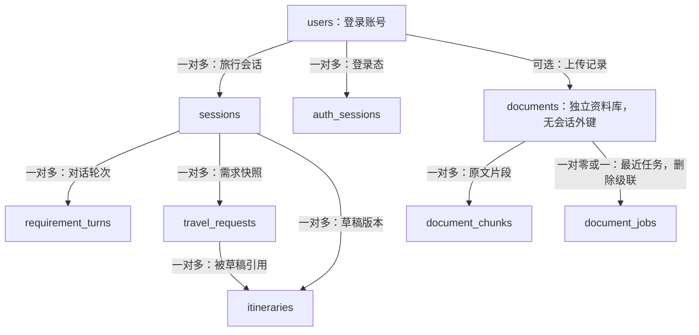

| 表 | 保存内容 | 对应代码 |
|---|---|---|
| `users` | 登录名、Argon2哈希、角色、启用状态 | `backend/app/models/auth.py` |
| `auth_sessions` | 登录令牌哈希与到期时间，不存原令牌 | `backend/app/models/auth.py` |
| `sessions` | 旅行会话编号、标题、状态、时间及预留 thread_id | `backend/app/models/trip.py` |
| `requirement_turns` | 每轮消息编号、轮次、原话、回复、参考日期、需求响应及引用原文快照 | `backend/app/models/requirement_turn.py` |
| `travel_requests` | M1预算草稿或M4-A成功行程保存的需求JSON快照和版本 | `backend/app/models/trip.py` |
| `itineraries` | 行程草稿 JSON、版本、状态和关联需求编号 | `backend/app/models/trip.py` |
| `documents` | 原文件信息、归属、读取结果、错误和提醒 | `backend/app/models/document.py` |
| `document_chunks` | 固定片段编号、完整短文字和原文位置 | `backend/app/models/document.py` |
| `document_jobs` | 最近后台任务、执行编号、进度和中断说明 | `backend/app/models/document_job.py` |
| `alembic_version` | 数据库已应用的结构版本，属于迁移管理表 | Alembic 管理 |

`requirement_turns.response_json`保存整个聊天响应，原话在`result.original_message`中；一行是一整轮，而不是用户和助手分别各存一行。knowledge包含回答与引用快照，dining保存附近餐饮/住宿及查询条件（10.22/10.24），itinerary保存M4-A逐日版本与差异（10.23）；三者均可空，旧行缺字段默认null，无需更新旧行或迁移表。

requirement_turns与travel_requests职责不同：前者保留每轮完整对话，后者保留生成某版草稿所用需求。普通知识/周边聊天只新增轮次；M4-A成功生成或撤销时，在同一事务同时新增轮次、需求与行程版本。

`itineraries.request_id` 是关联需求快照的数据库外键，与 HTTP 请求追踪的 `request_id` 含义不同。会话中的 `thread_id` 是预留字段，并不表示已经实现 LangGraph 检查点。

### 7.2 三种保存服务

**资料服务 `DocumentService`：**所有查询注入服务端owner；先按原始字节SHA-256查重，再解析、写UUID原文件、事务插入档案。并发重复通过`ON CONFLICT`及唯一约束裁决，失败请求清理自己的新文件。读取失败的文件也保存`failed`档案和可读原因。详情从数据库取正文，不重新解析原文件。原文件路径不返回浏览器。片段生成锁住资料行，核对归属与状态，有片段直接返回，没有才切分并在一个事务中保存；原文不改写，失败不会留下部分片段。分页查询只读取当前页，归属通过资料表核对。

**对话保存服务 `RequirementHistoryService`：**

- 按会话读取有序历史；读取不调用模型。
- 在短事务中锁定会话行，检查消息是否重复以及轮次是否冲突。
- 整轮结果和会话更新时间一起提交；失败不会留下半轮结果。
- 成功行程还复查草稿version，并与需求和行程版本一起保存；撤销复制上版完整内容为新版本。
- `(session_id, revision)` 与 `(session_id, message_id)` 分别限制轮次重复和消息重复。

**会话与草稿服务 `TripService`：**

- 需求快照和行程草稿在同一个事务里保存。
- 同会话通过行锁协调版本分配。
- 两份快照和会话更新时间一起提交或回滚。
- 读取最新或指定行程版本时，取出实际关联的需求快照。
- 整段删除先按session_id+user_id锁定本人会话，再在同一事务按外键顺序硬删所有子记录；与追加、保存和撤销共用会话锁。

M1预算草稿接口仍按演示费率计算并保存`days: []`；M4-A聊天路径另保存包含逐日活动、地点与来源的daily-plan-v1。读取时按格式区分，两者不能混作同一能力。

### 7.3 页面刷新后从哪里恢复

| 数据 | 保存位置 | 刷新时的行为 |
|---|---|---|
| 已提交原话、回复、需求快照 | PostgreSQL 的 `requirement_turns` | 后端读历史，前端重新展示 |
| 当前会话编号 | 浏览器按账号分隔的`sessionStorage` | 当前标签页刷新后恢复选择；重登也可从服务端列表找回 |
| 待确认发送的原话、消息编号、依据版本 | 浏览器 `sessionStorage` | 恢复时检查是否已保存，必要时沿用编号重试 |
| 消息气泡、需求对象、错误和加载状态 | Vue 页面内存 | 根据历史重新构建，历史字段高亮清除 |
| 尚未提交的普通输入草稿 | Vue 页面内存 | 没有通用的自动保存恢复机制 |
| M1 草稿快照 | PostgreSQL | 通过草稿接口单独读取 |
| 上传原文件 | `document_upload_dir`配置；本机实际为`E:/TravelMindAI/temp/uploads` | 不随刷新或重开对话删除；资料删除接口负责清理 |
| 资料列表与已读取正文 | PostgreSQL的`documents` | 打开资料页查列表，点击资料读正文；不记住刷新前选中的资料 |
| 资料片段 | PostgreSQL的`document_chunks` | 重新选择资料并打开片段时直接查询，编号保持一致 |

当前已有服务端本人历史列表和账号归属。`sessionStorage`不保证关闭标签页后还能自动找回；登录后从服务端列表选择历史。新建会话保留旧记录；左侧“删除”确认后才硬删数据库记录。删除当前会话清除其缓存而保留账号存储键，下一次发送正常创建新会话；删除其他会话保留当前内容，完整边界见10.24。

恢复失败时页面保留会话编号并阻止继续发送，避免在空上下文上覆盖旧需求。版本冲突返回409后，页面重新读取历史，再让用户确认并重新发送。

### 7.4 迁移状态的口径

源码迁移链包含`0001_business_tables`至`0010_required_session_owner`；0008新增账号与过渡归属，0009新增资料类别，0010在未归属会话存在时拒绝升级。2026-09-16本机PostgreSQL已升级到0010，Alembic check无差异；0006和0007的旧标签/任务仍保留，0008增users/auth_sessions，0009增category/uploaded_by并规范城市，0010要求会话所有者非空，共九张业务表。迁移往返、待清理状态阻止回滚及ORM一致性在临时schema验证。真实业务库只升级，回滚只在随机临时schema中测试。

当前就绪检查代码检查九张业务表及字段，不核对CHECK约束或迁移版本，因此仍须以alembic current/check确认，不能只看ready。数据库断开时应用保留存活检查，就绪接口返回503；首次恢复连接后的任务请求补做启动时未完成的中断识别。

### 7.5 当前表的详细数据字典

以下按2026-09-16的ORM和`0001`至`0010`迁移源码核对；本次真实数据库执行结果见最终验收记录。

原有四张业务表的下列字段均为`NOT NULL`；`documents.error_message`与`document_chunks.page_number`允许NULL，详见独立字典。UUID主键由应用的`uuid4`生成，当前迁移没有为其配置数据库端`gen_random_uuid()`默认值；不能把两种生成方式混写。时间字段为带时区的`TIMESTAMPTZ`。

**`users`：注册账号。迁移：`0008_accounts`。全部字段不允许NULL。**

| 字段 | 类型 | 默认值与含义 |
|---|---|---|
| `id` | UUID | 应用uuid4；主键 |
| `username` | VARCHAR(64) | 无；登录名，唯一 |
| `password_hash` | VARCHAR(255) | 无；Argon2口令哈希 |
| `role` | VARCHAR(10) | 数据库`user`；CHECK仅允许`admin/user` |
| `is_active` | BOOLEAN | 数据库true；停用账号的登录态也失效 |
| `created_at` | TIMESTAMPTZ | 数据库now() |
| `updated_at` | TIMESTAMPTZ | 数据库now()；服务更新账号时写入 |

`username`唯一约束同时提供索引；没有email或角色自选注册。注册接口只创建`user`；部署命令`manage_accounts init-admin`首次创建默认管理员`admin / 123456`，重复执行不会重置已有密码，也不会把同名普通用户提升为管理员。数据库继续保存Argon2哈希，本轮没有增加昵称、头像字段或迁移。

**`auth_sessions`：服务端登录态。迁移：`0008_accounts`。全部字段不允许NULL。**

| 字段 | 类型 | 默认值与含义 |
|---|---|---|
| `id` | UUID | 应用uuid4；主键，与旅行会话id不同 |
| `user_id` | UUID | 无；外键→`users.id`，无级联删除 |
| `token_hash` | VARCHAR(64) | 无；随机Cookie令牌的SHA-256摘要，唯一 |
| `created_at` | TIMESTAMPTZ | 数据库now() |
| `expires_at` | TIMESTAMPTZ | 无；登录到期时刻 |

`ix_auth_sessions_user(user_id)`用于账号登录态定位，`ix_auth_sessions_expires_at(expires_at)`用于到期清理；退出删除当前行。数据库未增加令牌长度或到期大于创建时间CHECK，不应把应用校验写成数据库约束。

**`sessions`：一段旅行会话。迁移：`0001_business_tables`，归属列由0008/0010增加。**

| 字段 | 数据库类型 | 含义、默认值及约束 |
|---|---|---|
| `id` | UUID | 主键；应用生成 |
| `thread_id` | UUID | 预留工作流编号；应用生成，唯一；尚无LangGraph检查点 |
| `user_id` | UUID | 0008过渡可空、0010当前非空；无默认值，外键→`users.id`，由服务端登录身份写入 |
| `title` | VARCHAR(200) | 会话标题；无数据库默认值 |
| `status` | VARCHAR(20) | 默认`active`；CHECK仅允许`active/archived` |
| `created_at` | TIMESTAMPTZ | 创建时间，数据库默认`now()` |
| `updated_at` | TIMESTAMPTZ | 默认`now()`；保存草稿或对话时由服务显式更新 |

索引由主键和`thread_id`唯一约束建立；增加`user_id` UUID外键→`users.id`；0008过渡可空，0010要求非空；`ix_sessions_user_updated(user_id, updated_at, id)`支持本人历史游标分页。

**`requirement_turns`：每轮已提交的对话和需求结果。迁移：`0002_requirement_turns`。**

| 字段 | 数据库类型 | 含义、默认值及约束 |
|---|---|---|
| `id` | UUID | 主键；应用生成 |
| `session_id` | UUID | 外键→`sessions.id`；无级联删除 |
| `message_id` | UUID | 浏览器生成的一次发送编号；同一次重试沿用 |
| `revision` | INTEGER | 会话内轮次；服务分配，CHECK要求≥1 |
| `response_json` | JSONB | 整轮响应及knowledge/dining/itinerary快照，非空、无默认值；CHECK要求JSON对象。旧快照缺可选字段时默认null；周边JSON见10.22，M4-A子字段见10.23 |
| `created_at` | TIMESTAMPTZ | 默认`now()` |

唯一约束：`(session_id, revision)`防止同轮重复，`(session_id, message_id)`防止同次发送重复。两者有对应唯一索引。JSON内部包含`result.original_message`、`result.extraction`、`result.reference_date`、`reply`、`status`等；这些是JSON键，不是独立数据库列。

**`travel_requests`：保存预算草稿时产生的需求快照。迁移：`0001_business_tables`。**

| 字段 | 数据库类型 | 含义、默认值及约束 |
|---|---|---|
| `id` | UUID | 主键；应用生成 |
| `session_id` | UUID | 外键→`sessions.id`；无级联删除 |
| `version` | INTEGER | 服务分配的需求版本；CHECK要求≥1 |
| `request_json` | JSONB | 需求快照，无默认值；CHECK要求JSON对象；M4-A保存完整TravelRequestExtraction，旧M1格式仍保留 |
| `created_at` | TIMESTAMPTZ | 默认`now()` |

唯一约束：`(session_id, version)`与`(id, session_id)`。第二项为行程的复合外键提供目标，保证行程引用的需求属于同一个会话。

**`itineraries`：版本化行程草稿。迁移：`0001_business_tables`。**

| 字段 | 数据库类型 | 含义、默认值及约束 |
|---|---|---|
| `id` | UUID | 主键；应用生成 |
| `session_id` | UUID | 外键→`sessions.id`；无级联删除 |
| `request_id` | UUID | 所依据的需求快照，不是HTTP追踪编号 |
| `version` | INTEGER | 服务分配的行程版本；CHECK要求≥1 |
| `status` | VARCHAR(20) | 默认`draft`；CHECK允许`draft/confirmed`，当前尚无确认接口 |
| `itinerary_json` | JSONB | 草稿内容，无默认值；CHECK要求JSON对象；M4-A保存daily-plan-v1格式，子字段见10.23；旧预算草稿不冒充逐日计划 |
| `created_at` | TIMESTAMPTZ | 默认`now()` |

唯一约束：`(session_id, version)`。复合外键：`(request_id, session_id)`→`travel_requests(id, session_id)`，无级联删除。当前JSON保存预算和空的逐日活动列表，尚无`itinerary_days/itinerary_spots`明细表。

**`documents`：上传原文件与读取档案。建表：`0003_documents`；状态约束：`0005_document_delete`；元数据：`0006_document_metadata`。**

| 字段 | 数据库类型 | 允许NULL | 数据库默认值 | 含义 |
|---|---|---|---|---|
| `id` | UUID | 否 | 无 | 主键；服务生成UUID |
| `owner_id` | VARCHAR(100) | 否 | 无 | 服务端固定`knowledge-base`共享范围；旧`local-demo`须维护迁移，与登录账号无关 |
| `file_name` | VARCHAR(255) | 否 | 无 | 去掉目录后的原文件名，仅用于展示 |
| `storage_name` | VARCHAR(50) | 否 | 无 | `UUID.hex + 扩展名`，受控目录内唯一原文件名 |
| `mime_type` | VARCHAR(100) | 否 | 无 | 校验后归一的标准MIME |
| `content_hash` | VARCHAR(64) | 否 | 无 | 原始字节SHA-256，小写十六进制 |
| `size_bytes` | INTEGER | 否 | 无 | 实际上传字节数，必须大于0 |
| `city` | VARCHAR(100) | 是 | 无 | 规则预填或人工修改的城市，NULL表示未标注 |
| `category` | VARCHAR(20) | 是 | 无 | 住宿/景点/餐馆；无法判断为NULL，0009增加CHECK |
| `uploaded_by` | UUID | 是 | 无 | 外键→`users.id`，ON DELETE SET NULL；旧资料为空 |
| `source` | VARCHAR(255) | 是 | 无 | 旧档案列，当前管理接口不筛选 |
| `review_status` | VARCHAR(20) | 是 | 无 | 旧档案列，当前管理接口不筛选 |
| `poi_id` | VARCHAR(100) | 是 | 无 | 旧档案列，当前管理接口不筛选 |
| `status` | VARCHAR(20) | 否 | 无 | `parsed`已读取；`failed`读取失败；`deleting`已停用待清理；不代表索引进度 |
| `error_message` | VARCHAR(500) | 是 | 无 | 读取失败原因或待清理说明；parsed时NULL，failed/deleting时非NULL |
| `sections_json` | JSONB | 否 | 无 | 阅读单元数组，失败时服务显式写`[]` |
| `warnings_json` | JSONB | 否 | 无 | 读取边界/无文字页提醒，服务显式写数组 |
| `created_at` | TIMESTAMPTZ | 否 | `now()` | 数据库记录上传时刻 |

主键：`id`。唯一约束：`storage_name`，以及`uq_documents_owner_hash(owner_id, content_hash)`。普通复合索引：`ix_documents_owner_created(owner_id, created_at)`，服务按创建时间和ID倒序分页。新增`uploaded_by→users.id`外键；无会话关联。

检查约束：`size_bytes > 0`；`ck_documents_status`只允许`parsed/failed/deleting`；两个JSON字段必须为数组；`ck_documents_result`要求parsed的错误为空且正文非空，failed的错误非空且正文为空，deleting的错误非空但可暂留原正文。其他主外键、唯一约束、索引和默认值不变。JSON中每个阅读单元为`{text, page_number, section_path, order}`：正文非空；PDF页码从1开始，其他格式为null；标题路径是字符串数组；顺序从1开始。子字段由Pydantic校验，数据库不单独建列检查。

**`document_chunks`：已生成的短片段。迁移：`0004_document_chunks`。**

| 字段 | 数据库类型 | 允许NULL | 数据库默认值 | 含义 |
|---|---|---|---|---|
| `id` | UUID | 否 | 无 | 主键；ORM保存时生成UUID，重复生成沿用已有编号 |
| `document_id` | UUID | 否 | 无 | 外键指向`documents.id`，不单独保存owner或会话编号 |
| `order` | INTEGER | 否 | 无 | 整份资料内的片段顺序，从1开始 |
| `text` | TEXT | 否 | 无 | 片段完整文字，长度1～800个Unicode字符 |
| `section_order` | INTEGER | 否 | 无 | 来源原文单元的order，从1开始 |
| `page_number` | INTEGER | 是 | 无 | PDF物理页码≥1；无可靠页码时服务写NULL |
| `section_path` | JSONB | 否 | 无 | 原文标题路径数组，由服务显式写入 |
| `start_char` | INTEGER | 否 | 无 | 单元内从0开始的字符起点，包含 |
| `end_char` | INTEGER | 否 | 无 | 单元内字符终点，不包含；不是文件字节偏移 |

主键索引：`id`。外键：`document_id → documents.id`，`ON DELETE CASCADE`，删除接口在外部清理完成后删除资料行并级联清理片段。唯一约束及其索引：`uq_document_chunks_order(document_id, order)`，同时支持按资料和顺序分页，无额外重复索引。

检查约束：`order/section_order > 0`；页码为空或大于0；标题路径必须是JSON数组；`start_char >= 0`、`end_char > start_char`、`end_char - start_char = char_length(text)`且正文长度≤800。标题数组元素由Pydantic校验；位置是否对应真实原文由切分函数和测试保证，数据库不跨表检查JSON内部位置。

原文`sections_json`继续保留。片段只按需生成一次，PostgreSQL中没有向量列或持久化向量状态；第四小步的向量存于Milvus，进度按真实编号计算，详见7.8。当前没有重新切分接口；生成式资料问答已接入主聊天，见10.8。

`alembic_version`是迁移管理表：`version_num VARCHAR(32)`、非空主键，由Alembic管理；业务代码不要把它当作需求或行程版本。

**元数据约束：**`ck_documents_review_status`允许NULL或pending/approved/rejected。旧source/review_status/poi_id列仅作档案保留；当前管理标签只有city/category，category有CHECK，沿用`ix_documents_owner_created`；文本长度由字段及输入格式限制，空白规范化为NULL。迁移不回填旧资料；新上传按规则预填，旧资料由用户点击补全空值。数据库默认值仍为空，与业务层填写pending区分。

**`document_jobs`：每份资料最近一次后台任务。建表：`0007_document_jobs`，依赖0006。**

| 字段 | 数据库类型 | 允许NULL | 数据库默认值 | 含义 |
|---|---|---|---|---|
| `document_id` | UUID | 否 | 无 | 主键，外键→documents.id，ON DELETE CASCADE |
| `run_id` | UUID | 否 | 无 | 服务生成的执行编号，每次显式重试更换，拦住旧回调 |
| `kind` | VARCHAR(10) | 否 | 无 | parse重读失败原件；index生成片段并续建索引 |
| `status` | VARCHAR(12) | 否 | 无 | queued/running/completed/failed/paused |
| `indexed` | INTEGER | 否 | 0 | 最近批次确认写入的片段数量 |
| `total` | INTEGER | 否 | 0 | 该批次读到的片段总数；尚未开始或解析任务可为0 |
| `error_message` | VARCHAR(500) | 是 | 无 | 安全的失败/中断说明，不保存外部异常原文 |
| `updated_at` | TIMESTAMPTZ | 否 | now() | ORM更新时也赋now()，不是数据库自动更新时间触发器 |

`ck_document_jobs_kind`限制parse/index，`ck_document_jobs_status`限制五种状态，`ck_document_jobs_progress`要求0≤indexed≤total。主键同时保证每份资料最多一个最近任务，并提供按资料查询的索引；没有额外索引或独立owner字段，归属通过documents核对。documents与document_jobs为一对零或一关系，删除档案时同时清除任务；历史任务不另建日志表。资料parsed/failed与后台任务状态分开，索引失败不破坏已读正文。

### 7.6 用户提供的后续参考表（尚未建表）

2026-09-15说明：本节保留原参考材料，不作为本次建表指令。账号与会话优先采用第12节最小目标方案；不照搬头像、风险偏好、预订、trips/days/spots等未需要的字段和表。

来源：用户2026-09-11提供的ER截图与五份CREATE TABLE参考。以下按文字SQL保留字段，清理粘贴产生的`&#x20;`、转义下划线等展示字符；不是可直接执行的迁移。截图另外出现`USER_PREFERENCE`和`BOOKING`，尚未提供完整DDL。

参考关系为：一个用户有多趟旅行，一趟旅行有多天，一天有多个按顺序安排的景点；每个安排引用景点库中的一个景点。它表达目标业务，但还要衔接当前会话和行程版本。

下表“可空”严格按参考SQL记录；`DEFAULT`不等于`NOT NULL`。“无”表示未定义默认值。后续实际采用的类型和约束须在对应开发小步确定，再写新的迁移。

**`users`：用户账号与长期偏好。**

| 字段 | 参考类型 | 可空／默认值 | 含义 |
|---|---|---|---|
| `id` | UUID | 否／`gen_random_uuid()` | 主键 |
| `username` | VARCHAR(50) | 否／无 | 唯一用户名 |
| `email` | VARCHAR(255) | 否／无 | 唯一邮箱 |
| `password_hash` | VARCHAR(255) | 否／无 | 密码哈希，不能保存明文密码 |
| `avatar_url` | VARCHAR(500) | 是／无 | 头像地址 |
| `preferences` | JSONB | 是／`{}` | 长期偏好 |
| `risk_level` | VARCHAR(20) | 是／`moderate` | 参考风险偏好；尚无本项目业务定义 |
| `created_at`、`updated_at` | TIMESTAMP | 是／`CURRENT_TIMESTAMP` | 创建与修改时间 |

参考索引：主键、用户名/邮箱唯一约束、`email`普通索引、`created_at`索引。邮箱普通索引与唯一约束产生的索引重复，应在实际设计中去掉重复项。`preferences`与截图中的独立偏好表先选一种事实来源，不同时维护两份长期偏好。

**`trips`：一趟旅行的业务主体。**

| 字段 | 参考类型 | 可空／默认值 | 含义 |
|---|---|---|---|
| `id` | UUID | 否／`gen_random_uuid()` | 主键 |
| `user_id` | UUID | 否／无 | 外键→`users.id`，参考为级联删除 |
| `title` | VARCHAR(200) | 否／无 | 旅行标题 |
| `destination` | VARCHAR(200) | 否／无 | 目的地 |
| `start_date`、`end_date` | DATE | 否／无 | 起止日期 |
| `budget` | INTEGER | 是／0 | 预算；原SQL未说明元还是分 |
| `status` | VARCHAR(20) | 是／`planning` | 旅行状态；原SQL未限制枚举 |
| `requirements` | JSONB | 是／`{}` | 旅行要求 |
| `generated_plan` | JSONB | 是／无 | 生成的行程 |
| `created_at`、`updated_at` | TIMESTAMP | 是／`CURRENT_TIMESTAMP` | 创建与修改时间 |

参考索引：`user_id`、`status`、`(start_date, end_date)`。它不能直接替换当前`sessions`：会话允许用户只说“想去杭州”，尚无日期或预算。`trips`与会话之间的关系需在旅行主体功能落地时确定；现有版本化`itineraries`继续保留，不把历史压缩成一个反复覆盖的`generated_plan`。

**`itinerary_days`：行程中的一天。**

| 字段 | 参考类型 | 可空／默认值 | 含义 |
|---|---|---|---|
| `id` | UUID | 否／`gen_random_uuid()` | 主键 |
| `trip_id` | UUID | 否／无 | 外键→`trips.id`，参考为级联删除 |
| `day_number` | INTEGER | 否／无 | 第几天 |
| `date` | DATE | 否／无 | 当天日期 |
| `theme` | VARCHAR(100) | 是／无 | 当天主题 |
| `summary` | TEXT | 是／无 | 当天概要 |
| `weather_info` | JSONB | 是／无 | 天气信息 |
| `created_at` | TIMESTAMP | 是／`CURRENT_TIMESTAMP` | 创建时间 |

参考索引：`trip_id`。适配当前版本模型时，建议关联具体`itineraries.id`，并约束`UNIQUE(itinerary_id, day_number)`和`day_number >= 1`；若不采用版本关联，也至少要防止同一旅行重复出现相同day_number。具体外键调整属于后续设计，不在此次文档更新中建表。

**`itinerary_spots`：一天内的某一次景点安排。**

| 字段 | 参考类型 | 可空／默认值 | 含义 |
|---|---|---|---|
| `id` | UUID | 否／`gen_random_uuid()` | 主键 |
| `day_id` | UUID | 否／无 | 外键→`itinerary_days.id`，参考为级联删除 |
| `spot_id` | UUID | 否／无 | 外键→`spots.id` |
| `order_index` | INTEGER | 否／无 | 当天访问顺序 |
| `start_time`、`end_time` | TIME | 是／无 | 计划开始、结束时间 |
| `duration_minutes` | INTEGER | 是／120 | 预计停留分钟数 |
| `transport_to_next` | VARCHAR(100) | 是／无 | 去下一站的交通方式 |
| `estimated_cost` | INTEGER | 是／0 | 预计费用；原SQL未说明金额单位 |
| `notes` | TEXT | 是／无 | 补充说明 |
| `created_at` | TIMESTAMP | 是／`CURRENT_TIMESTAMP` | 创建时间 |

参考索引：`day_id`、`(day_id, order_index)`。后续应使顺序组合唯一，明确从0还是1编号，约束停留时长和金额范围。相同景点可以多次安排，不应仅用`spot_id`作为安排记录的主键。跨午夜活动需定义日期语义，不能只用TIME比较大小处理。

**`spots`：景点基础资料库。**

| 字段 | 参考类型 | 可空／默认值 | 含义 |
|---|---|---|---|
| `id` | UUID | 否／`gen_random_uuid()` | 主键 |
| `name` | VARCHAR(200) | 否／无 | 中文或主要名称 |
| `name_en` | VARCHAR(200) | 是／无 | 英文名称 |
| `city`、`country` | VARCHAR(100) | 否／无 | 城市、国家 |
| `category` | VARCHAR(50) | 否／无 | 景点分类 |
| `latitude` | DECIMAL(10,8) | 是／无 | 纬度 |
| `longitude` | DECIMAL(11,8) | 是／无 | 经度 |
| `address` | VARCHAR(500) | 是／无 | 地址 |
| `description` | TEXT | 是／无 | 景点介绍 |
| `ticket_info` | JSONB | 是／`{}` | 门票资料 |
| `rating` | DECIMAL(3,2) | 是／0 | 评分，评分尺度需定义 |
| `review_count` | INTEGER | 是／0 | 评价数量 |
| `recommend_duration` | INTEGER | 是／120 | 推荐停留分钟数 |
| `tags`、`images` | JSONB | 是／`[]` | 标签与图片地址列表 |
| `opening_hours` | JSONB | 是／`{}` | 营业时间 |
| `best_season` | JSONB | 是／`[]` | 推荐季节 |
| `latitude_rad`、`longitude_rad` | INTEGER | 是／0 | 名称似乎表示弧度，参考未说明算法和单位，不直接采用 |
| `embedding_id` | INTEGER | 是／无 | 向量关联编号，不是向量本身 |
| `created_at`、`updated_at` | TIMESTAMP | 是／`CURRENT_TIMESTAMP` | 创建与修改时间 |

参考普通索引：`city`、`country`、`category`、`rating DESC`。参考中的`ivfflat (embedding_id vector_cosine_ops)`存在类型错误，不能直接执行，详见下一节。

截图中的`USER_PREFERENCE`没有字段，暂只记录概念；`BOOKING`列出了`id/trip_id/type/provider/details/price/status`，但没有完整类型约束和接口范围。预订支付当前不在首版功能中，不据此增加预订表或预订能力。

### 7.7 参考表落地前必须对齐的事项

| 项目 | 问题与本项目处理方向 |
|---|---|
| 建表依赖 | 参考SQL中`itinerary_spots`先于`spots`，直接按粘贴顺序执行会找不到外键目标。真正迁移应先建用户/旅行/景点父表，再建逐日和安排子表 |
| 向量索引 | `INTEGER embedding_id`只有编号，没有向量。pgvector索引应作用于实际向量列；不能对整数列使用`vector_cosine_ops`。参见[pgvector官方说明](https://github.com/pgvector/pgvector#ivfflat) |
| 向量库选择 | 继续使用Milvus，不另引入pgvector。2026-09-15目标取消资料级POI标签，不要求为本次改造建设spots/pois；地图地点编号仍用于定位核对，见技术设计18.4及第12节 |
| 重复索引 | PostgreSQL的UNIQUE约束会自动创建唯一B-tree索引，`users.email`一般无需再建同列普通索引。参见[PostgreSQL约束文档](https://www.postgresql.org/docs/18/ddl-constraints.html#DDL-CONSTRAINTS-UNIQUE-CONSTRAINTS) |
| 金额与缺失值 | 先统一人民币单位。可采用`NUMERIC(...,2)`保存元，或明确命名为`*_cents`的整数保存分；不使用浮点金额。需求未填写用NULL，不能默认0冒充已填写；未知门票或费用也不能默认免费 |
| 日期与草稿 | 当前支持仅天数、无具体日期的会话。参考的非空日期只能用于已确定日期的实体，不能阻止需求草稿保存；按实体状态分层校验。当前2～5天范围不因录入参考表而改变 |
| 行程版本 | 每日和景点明细需绑定具体行程版本。`generated_plan`、`itinerary_json`和明细表若同时保留，要明确谁是唯一事实来源、其余怎样生成，避免分别编辑后不一致 |
| 时间字段 | 新业务表优先与现有TIMESTAMPTZ保持一致。`updated_at DEFAULT CURRENT_TIMESTAMP`只提供插入默认值，不会在每次UPDATE时自动变化；需要服务显式更新或明确的触发器策略 |
| JSON与状态 | JSON对象/数组补类型CHECK，空值策略和字段契约明确；状态、评分尺度及数值范围按实际功能补CHECK。`risk_level`当前语义不明确，保留参考记录，不提前接入业务 |
| 景点事实 | 纬度限制[-90,90]、经度[-180,180]；记录坐标系。资料应有来源URL、采集/核验时间，门票、天气等动态事实注明有效期；无资料与0分/免费不能混淆 |
| 弧度字段 | 若`*_rad`确实表示弧度，普通整数会丢失小数；未说明定点缩放约定前不采用。可由经纬度按需计算，避免保存可推导的重复字段 |
| 删除策略 | 参考中的级联删除只是参考方案。现有记录没有级联删除；用户注销、景点下架、旅行删除时是否保留历史，需要另行确定，不能顺带改旧外键 |

后续每落地一张表，都把已决定的字段、约束和迁移版本移入“当前数据字典”，并修订参考表的状态；不是把整份参考SQL一次性放进数据库。

### 7.8 Milvus集合、字段和索引（第四小步已运行）

Milvus使用独立Docker单机容器`travelmind-milvus`，镜像`milvusdb/milvus:v2.6.17`；内嵌etcd、本地存储和Docker命名卷`milvus_milvus-data`保留向量及元数据。19530业务端口和9091健康端口只绑定`127.0.0.1`，etcd端口不向宿主机开放。本步客户端只接受本机地址，没有远程认证适配。部署参考[Milvus官方单机脚本](https://github.com/milvus-io/milvus/blob/v2.6.17/scripts/standalone_embed.sh)，REST契约参考[集合创建](https://milvus.io/api-reference/restful/v2.6.x/v2/Collection%20(v2)/Create.md)及[搜索接口](https://milvus.io/api-reference/restful/v2.6.x/v2/Vector%20(v2)/Search.md)，2026-09-14核对。

集合名称为`travelmind_chunks_`加24位SHA-256前缀。哈希输入包含Embedding提供方、API根地址、模型名、维度、项目版本标签及固定文本/字段策略`plain-text-800-schema1`。任何一项改变都使用不同集合；不会删除旧集合或原地混用向量。本机当前集合为`travelmind_chunks_90ad3086c54892f0423ea466`，1024维。

| 字段 | Milvus类型 | 可空／默认值 | 含义及约束 |
|---|---|---|---|
| `id` | VarChar(36) | 否／无 | 主键，值为PostgreSQL的document_chunks.id；autoID=false，由应用传固定UUID字符串 |
| `document_id` | VarChar(36) | 否／无 | 所属documents.id的UUID字符串；由业务层核对，不是跨库数据库外键 |
| `owner_id` | VarChar(100) | 否／无 | 资料归属，当前后端固定knowledge-base；检索强制过滤，不允许前端传值 |
| `vector` | FloatVector(dim=1024，本机配置) | 否／无 | 当前模型生成的浮点向量，客户端先校验维度、有限数字和非全零 |

集合关闭动态字段。显式向量索引名`vector_index`，类型`AUTOINDEX`，距离度量`COSINE`；未另建owner或document的标量索引。集合和查询使用`Strong`一致性。相似度越高越接近，不是事实正确率或预算可靠度。模型身份保存在集合命名规则中，正文、文件名、页码和标题仍从PostgreSQL取得。

`upsert`按固定主键覆盖同条向量。GET进度读取当前资料的向量编号，与PostgreSQL实际片段编号取交集；返回`total/indexed/complete`，不在资料表新增indexed状态。只有total>0且全部确认保存才complete=true。单份编号读取上限16383，达到上限直接报错而不误报完整进度；当前资料上传/切分限额下的样本远小于此值。

PostgreSQL与Milvus无联合事务。索引每批最多8段，在PostgreSQL资料行上使用`FOR UPDATE NOWAIT`排除同资料并发，冲突返回409。模型失败保留之前的向量；写入成功但响应丢失时，下次按真实编号恢复。部分完成即可搜索，页面明确说明覆盖范围。搜索回查时再次检查资料归属和parsed状态，孤立/失效编号不返回正文。删除使用相同行锁，先提交deleting状态，再跨模型版本清理向量；任何中断均保留待清理记录供重试，详见10.14。尚无重新切分接口。

第四小步引入Milvus时没有新增PostgreSQL迁移；本次元数据与任务表由0006/0007增加，Milvus字段及集合身份不变。集合仍由首次索引创建，之前的写入、容器重启及重新查询验收保留。

## 8. 接口地图

下面所有路径都以 `/api/v1` 开头。除健康检查外，旅行和资料接口均读取登录Cookie；普通用户管理资料返回403，旧`/documents`路径与`/admin/documents`别名同样受管理员保护。匿名返回401，别人的会话返回404。写请求需`X-Requested-With: TravelMindAI`并检查Origin。

| 方法与路径 | 作用 | 当前聊天页面是否使用 |
|---|---|---|
| `POST /auth/register`、`/login`、`/logout`、`GET /auth/me` | 注册普通账号、登录/退出、读取当前身份 | 是 |
| `GET /requirements/status` | 返回模型配置标志与名称，不调用模型 | 是 |
| `GET /sessions` | 按updated_at/id游标列出本人会话 | 历史栏 |
| `POST /sessions` | 创建本人旅行会话 | 首次发送或新建对话时 |
| `GET /sessions/{session_id}` | 读取会话基本信息 | 当前恢复路径不依赖它 |
| `PATCH /sessions/{session_id}` | 改名本人会话，title去首尾空白后1～200字符；成功返回session，缺失或他人404；不改排序时间 | 历史三点菜单重命名 |
| `DELETE /sessions/{session_id}` | 单事务硬删本人会话及全部消息/需求/行程；成功204，缺失或他人404 | 历史栏确认删除 |
| `GET /sessions/{session_id}/requirement-messages` | 读取已保存完整历史 | 是 |
| `POST /sessions/{session_id}/requirement-messages` | 基于服务端历史处理并保存一轮，返回JSON | 是 |
| `POST /sessions/{session_id}/requirement-messages/stream` | 同一业务的SSE入口；公开步骤/草稿，保存后done | 是 |
| `POST /requirements/messages` | 无状态提取，由调用方提供 previous | 页面已切换到持久化路径 |
| `POST /budget/estimate` | 单独计算预算 | 否 |
| `POST /sessions/{session_id}/drafts` | 计算预算并保存草稿 | 否 |
| `GET /sessions/{session_id}/drafts` | 读取最新或指定版本草稿 | 否 |
| `GET /health/live` | 应用存活检查 | 非聊天请求链 |
| `GET /health/ready` | 检查配置后的数据库业务表和Milvus连接 | 非聊天请求链 |
| `GET /documents/{id}/index` | 读取当前向量空间的已存片段进度，不调用Embedding | 非聊天请求链 |
| `POST /documents/{id}/index` | 索引最多8个缺失片段；确认保存后返回进度 | 非聊天请求链 |
| `POST /document-search` | 混合名称、关键词和语义搜索当前归属资料，返回原文片段及位置 | 非聊天请求链 |
| `POST /documents` | multipart字段`file`；新档案201、重复200 | 资料页使用 |
| `DELETE /documents/{id}` | 停用并清理资料；成功/已不存在204；处理中409；清理不可用503 | 资料页确认及重试使用 |
| `POST /documents/{id}/retry` | 重读失败资料原文件；200返回详情，是否成功看status；冲突409，未知404 | 资料页重新解析使用 |
| `POST /documents/{id}/metadata/prefill` | 识别并补全空标签，保留人工内容 | 旧资料补全按钮 |
| `PATCH /documents/{id}/metadata` | 只更新城市/类别；未传保持、null清空 | 管理员资料页标签编辑 |
| `POST /documents/{id}/job` | 提交parse/index任务，202返回持久状态 | 资料页后台处理 |
| `GET /documents/{id}/job` | 返回最近任务或null，不调用模型 | 资料页轮询 |
| `POST /documents/{id}/job/pause` | 暂停后续批次，当前批次允许完成 | 资料页暂停 |
| `GET /documents/cities` | 筛选后按城市统计文件数 | 管理员资料页 |
| `GET /documents/page` | 文件名/城市/类别筛选与游标分页 | 管理员资料页 |
| `GET /documents` | 保留旧列表合同，仍校验管理员 | 管理员资料页兼容接口 |
| `GET /documents/{document_id}` | 已保存的正文、页码、标题及错误提醒 | 资料页使用 |
| `POST /documents/{document_id}/chunks` | 无请求体；按需生成或复用已存片段，200返回首页 | 资料页使用 |
| `GET /documents/{document_id}/chunks?limit=50&offset=0` | 200返回片段总数和当前页；limit 1～100，offset≥0 | 资料页使用 |

上传返回`{document: DocumentDetail, duplicate: bool}`。创建档案返回201不保证正文成功：必须看`document.status`。空文件400、格式/MIME不符415、超限413、未知/其他归属ID404、数据库或磁盘暂不可用503。所有请求错误沿用`error + request_id`，上传详情不暴露owner或磁盘路径。已提供删除和重新解析接口，重试后的内容读取失败保存在DocumentDetail.error_message并返回200；尚无原文件下载接口。

片段接口返回`{total, items}`；每项为`{id, document_id, order, text, section_order, page_number, section_path, start_char, end_char}`。POST固定返回前50条；GET无写入，总数0表示尚未生成。未知或其他归属资料404，原文读取失败409，切分结果超限或分页参数不合法422，数据库未启用503；错误仍为统一格式。前端将0起点换成从1开始的字符范围显示，不用JavaScript UTF-16下标重新切片。

`/requirements/status` 的“已配置”不等于远端模型已经连通。数据库未配置时纯预算计算和无状态提取可以分别在其必要条件满足时工作，但当前页面的持久化对话需要数据库。

索引接口返回`{total,indexed,complete}`。无片段时GET返回0/0/false，POST返回409并提示先生成片段；资料不存在或不属于当前归属返回404，读取失败返回409。同资料正在处理返回409。Embedding或Milvus配置、连接和操作失败返回503，错误码`VECTOR_UNAVAILABLE`，前端可刷新进度后继续；不把失败写成空成功。

搜索请求为`{query,limit=5,document_id=null,city=null,category=null}`，query去除首尾空白后1～800字符，limit为1～10，可限定资料，否则搜索当前归属全库。响应仍为`{items:[{score,file_name,chunk}]}`；chunk复用原有DocumentChunk格式。score为混合排序分，不再是余弦相似度，也不是正确率。非法条件返回422；无集合时仍可从已切分正文按词法召回，无可用证据才为空。词法候选最多200个；语义先取limit×4个，去重后不足且候选取满时扩大，最多200个，始终复用同一次问题Embedding。标题命中仅接续同节正文，来源按编号和同文档正文去重。详细融合、故障与原文展开合同见10.32；不承诺每次返回恰好limit项。

主聊天页面使用`POST /sessions/{session_id}/requirement-messages/stream`；原JSON路由继续保留。请求原话1～6000字符、message_id和expected_revision合同不变。响应包含可空`knowledge`、`dining`（旧历史缺字段为null）及`status=knowledge`；needs_clarification/complete表示有效需求，knowledge轮次不覆盖需求卡片。

`knowledge={status,points,sources,map_lookups,attractions,web_search}`：status为answered或insufficient；points最多6条，每条`{text,source_ids}`，text去空白后1～1200字，source_ids为1～5个严格整数1～25（本地1～5、网页6～25），且必须指向本次提供的证据；sources为`[{id,hit}]`，hit复用SearchHit及DocumentChunk完整原文位置。answered必须有要点，insufficient的points必须为空，但可保留提供给自然回答的参考原文；模型不得输出sources、文件名或原文，后端从实际命中生成，结构化回答保存被引用的证据，自然降级保存实际传入的参考片段；web_search保存本轮有效网页摘要。前端以“本轮参考资料”展示，不把自由正文的每句话声称为已核对引用；卡片基础字段见10.11，地图按需策略见10.30。

结构化引用或JSON不合法时可修正一次；仍无法形成可靠卡片时不保存伪造卡片，转由自然回答使用用户原话、统一历史和已有证据。可选检索、网页或地图失败只降低对应事实的确定性，不阻断一般知识、景点介绍和正常闲聊；鉴权、归属、版本冲突、事务保存、请求格式及不可恢复的服务错误仍按原HTTP边界返回，不能伪装成功。实时价格、门牌地址、营业时间和路线耗时没有本轮依据时必须说明未核实。地图人均消费不能改写为门票或全团旅行预算。已有消息编号的重试与GET历史只读取旧快照。

## 9. 应用入口、配置与错误

后端入口是 `app.main:create_app`，由 Uvicorn 使用工厂方式创建。`main.py` 注册各组路由，在应用生命周期中管理数据库连接池，并调用`api/errors.py`注册统一异常处理；健康检查在`api/health.py`。

配置统一由 `backend/app/config.py` 的 Settings 管理。环境文件需要明确指定，不自动扫描根目录学习配置。DeepSeek 密钥和数据库连接地址保留在后端，本文不记录真实密码、密钥或包含密码的连接串。

地图只由Settings字段`baidu_map_api_key`读取`BAIDU_MAP_API_KEY`，留空时地图工具未配置；高德配置、客户端及百度直连HTTP分支已移除。`BaiduMaps(settings)`在请求内延迟建立官方MCP连接，知识、周边及行程查询复用该连接；新查询使用百度BD-09坐标。连接、工具白名单、调用额度与历史兼容见10.25；数据库或模型配置不因此改变。

Milvus配置为`TRAVELMIND_MILVUS_URL`（HttpUrl，默认None）和`TRAVELMIND_MILVUS_TIMEOUT_SECONDS`（有限正数，默认30秒）。URL为空时不启用；本机已设置`http://127.0.0.1:19530`。每个索引/搜索请求用独立httpx连接上下文，结束或异常时关闭。健康接口增加`dependencies.milvus=disabled/ready`；已配置但不能查询集合状态时返回503/MILVUS_NOT_READY。健康检查不创建集合、不调用收费模型；没有集合仍可视为Milvus连接就绪。

前端开发配置是 `127.0.0.1:5173`，Vite 将 `/api` 转发给 `127.0.0.1:8000`；构建预览端口是4173。2026-09-11开发验收时已启动8000后端与5173前端，并通过真实页面操作确认联通；4173预览端口本次没有启动。完整启动步骤以README与07文件为准。

当前`frontend/vite.config.ts`在开发与预览代理使用`changeOrigin: false`，保留浏览器访问的公开Host，使后端可把Origin与请求公开地址比较。正式同源反向代理同样应保留公开Host和原协议；HTTPS终止后若后端需要`X-Forwarded-Proto`还原原协议，只接受受信任代理传来的该头，不能无条件信任客户端任意转发头。否则同源登录写请求可能被误判为跨站，或被伪造头绕过来源检查。早期验收曾合并两份配置；2026-09-17正式配置已统一至`backend/.env`，通用启动命令见README。

常见错误处理包括：请求格式错误422、会话不存在404、对话版本冲突409、模型输出校验最终失败502、模型或数据库不可用503。错误响应包含可展示的消息和请求追踪编号；模型原始错误内容不会直接作为完整响应返回页面。

需求服务现按上下文生成失败提示：没有previous时引导先建立旅行档案、从目的地开始；已有需求时说明原需求已保留。无历史的删除/清空在合并前直接提示，不占用一次模型修复。沿用RequirementExtractionError及502错误契约，由原前端提示区域展示，不新增表或状态。

对模型识别出的超范围日期，提示词要求other意图、days/end_date为空，在assumptions保留原跨度及原因，使不支持请求也能通过schema校验。HTTP的unsupported回复由程序说明单目的地、2～5天、1～8人和人民币预算范围，已有需求保持原值。该意图识别仍依赖模型，若输出再次违反schema，最多修复一次后返回既有错误；不能保证任意自然语言都能正确分类。

Pydantic 的 schema 是“数据填写规则”，SQLAlchemy 的 model 是“数据库表定义”，service 是“实际业务处理”。这三层名称相近，但不是同一种东西。

## 10. 当前边界与验证证据

### 10.1 新增的独立评测路径

第四小步新增的评测运行在命令行，不属于在线HTTP请求链，不新增业务表或改变第7节数据字典。

**人工题库 → scripts/evaluate_requirements.py → scripts/requirement_eval.py → 正式extract_requirements/merge_requirements → DeepSeek → 逐字段评分 → JSON与Markdown报告。**

| 文件 | 作用 |
|---|---|
| `backend/evals/requirements.v1.json` | 固定30组36轮人工标注，含参考日期及中文标注理由 |
| `backend/scripts/requirement_eval.py` | 校验题库、维护实际多轮上下文、比较字段、统计分母和分子 |
| `backend/scripts/evaluate_requirements.py` | 显式模型运行与报告输出，默认只校验不联网 |
| `backend/tests/test_requirement_eval.py` | 防止漏题、错误值、模型失败或金标准泄漏造成虚假高分 |

标准答案只供评分，不传给模型。每组从空需求开始，组内多轮采用实际前次成功结果；失败也计分。金额按Decimal数值比较，列表仅忽略顺序，不由另一个模型猜同义。完整报告保存题库和提示词哈希、模型名、依赖版本、时间、调用计数及每个错误项。

评测不调用保存接口，也不写36条会话记录。在线前端继续沿用原有服务；脚本数据的固定日期与网页新会话的当前日期须区分。

### 10.2 M2历史证据


| 能力 | 当前证据 | 验证限制 |
|---|---|---|
| Vue对话及需求面板 | TypeScript检查与生产构建通过，真实网页展示和刷新恢复通过 | 未验收移动设备和完整E2E自动化套件 |
| 单模型提取、多轮合并、补问 | 第六小步同题库真实DeepSeek评测，30组36轮全部通过，36次调用且无修复 | 人工开发集，评分包含程序校正；不是模型原始意图准确率 |
| 聊天保存、恢复、版本冲突与重试 | 正式本地库0002迁移完成；HTTP、事务回滚、幂等及并发冲突自动测试通过；后端重启后网页读取恢复 | 不含账号归属、历史列表和跨设备找回；并发进行中的重复模型调用未合并 |
| 固定规则预算、版本化草稿保存 | 本轮全量回归包含真实PostgreSQL草稿测试 | 本次未手工检查正式库既有草稿的全部内容 |
| 自动每日行程、实时价格、LangGraph、Redis记忆和多模型路由 | M2当时未接入；M4-A逐日行程及LangGraph当前源码见10.23 | 实时价格、Redis记忆和多模型路由仍未实现 |

第四小步及提示改进最终检查：**208项测试通过、0跳过、1条既有依赖弃用提示**；其中PostgreSQL测试在随机临时schema运行并清理。新增8项判卷/CLI测试和3项错误提示HTTP测试，变更文件Ruff通过，mypy共38文件通过，compileall通过。第三小步Vue构建通过；本小步没有修改前端，实际复核发送和保存成功。

真实浏览器另验证了：断开本任务后端时保留卡片并禁止发送；重启后重新读取恢复；重新开始后旧人数、预算和出发地不会带入苏州会话。网页样例不代表准确率评测。逐文件步骤及命令见[07开发说明](07-各阶段开发说明.md)。

真实模型基线：四项字段（目的地、days、人数、预算）132/132；其中已提供值115/115、应未知17/17。另标注开始/结束日期11/12，意图35/36。共38次模型调用、2轮修复、1轮最终输出失败；该失败没有从评分中剔除。

上述基线曾暴露M2-16首次日期遗漏和M2-22六天输入未正常返回unsupported，第五小步已修复并使用同一题库复核。原报告保留：基线Markdown（历史报告`m2-baseline-20260911.md`，本地阶段产物已清理） · 逐字段JSON（历史报告`m2-baseline-20260911.json`，本地阶段产物已清理）。

第五小步最终自动检查：**214项测试通过、0跳过、1条既有依赖弃用提示**；新增四个首轮日期边界用例及两个超范围HTTP用例，真实PostgreSQL回归通过。变更文件Ruff及38文件mypy通过。真实模型新报告为29/30组、35/36轮，四项字段132/132、日期12/12，36次调用且无修复。M2-20意图分类失误如实保留，M2仍进行中。题库SHA-256与原基线一致，未修改标注：本次Markdown（历史报告`m2-date-fix-20260911.md`，本地阶段产物已清理） · 本次JSON（历史报告`m2-date-fix-20260911.json`，本地阶段产物已清理）。

第五小步真实前端复核：10.1开始三天显示2026-10-01～2026-10-03；改成1日至6日后展示范围引导并保留原需求；刷新后恢复两轮聊天与原卡片。前端源码没有变更，本次没有重复执行Vue构建。

第六小步验收：新增完整/缺预算两项首轮误标回归，扩展真实数据库HTTP测试验证校正结果保存、刷新重读及后续修改。最终216项测试通过、0跳过，1条既有依赖弃用提示；变更文件Ruff与38文件mypy通过。题库及提示词未变，四项必要字段132/132、日期12/12、最终业务意图36/36；历史两份失败报告保留。M2按实施文档当前标准完成，后续M3及交通时间/每日行程功能尚未接入。第六小步报告（历史报告`m2-intent-fix-20260911.md`，本地阶段产物已清理） · 逐字段JSON（历史报告`m2-intent-fix-20260911.json`，本地阶段产物已清理）。

第六小步真实前端：M2-20原话成功建档，刷新后“改成三个人”更新人数，杭州、3天、5000元及轻松节奏保留，两轮已保存。正式后端已重启；没有修改前端源码或重跑Vue构建。原始模型标签不在页面展示，因此意图校正本身由上述离线复现与真实数据库HTTP断言验证。

### 10.3 M3第一小步历史验收：资料上传与读取（2026-09-14）

开发分支为`codex/m3`，基于原`m0-engineering`当前提交建立，保留原分支。M3完整目标中的检索、引用等尚未完成；本次只完成资料上传、原文读取、持久化和前端预览。

**后端职责和调用顺序：**

1. `api/document/upload_limits.py`先限制上传请求总量，20MiB文件上限外给64KiB表单开销；既检查声明长度，也统计实际接收字节，超限停止交给multipart解析器。
2. `api/document/routes.py`接收文件，注入数据库、上传目录及固定`knowledge-base`共享范围。同步接口在线程池中运行读取任务。
3. `services/document/service.py`检查文件名、扩展名、MIME、实际大小与SHA-256。已存在内容直接返回原资料（包括原失败状态）。
4. `services/document/parser.py`读取正文，统一为`schemas/document/base.py`中的阅读单元；解析期间不持有数据库写事务。
5. 写入UUID命名原文件，再事务插入`documents`。数据库约束处理并发查重，重复请求清理自己的原文件；可捕获的保存异常也清理本次新文件。
6. 前端`DocumentUpload.vue`逐份调用`api/documents.ts`并记录结果，批次结束由`DocumentPanel.vue`刷新列表和预览。列表按文件名筛选后每页50条，正文每组渲染50个单元；资料全部仍保存在数据库中。

**格式与边界：**

- PDF按物理页码读取文字层，空白/扫描页列出提醒；整份无文字或加密文件记为失败。最多500页，单页解压内容流最多50MiB；复杂排版的阅读顺序不作像素级还原保证。
- DOCX读取正文段落和表格（含嵌套表格）；合并单元格只读取一次。保留标准Heading 1～9/标题样式层级，不猜测页码；图片、文本框、页眉页脚和修订内容不读，页面明确提示。ZIP声明的展开总量最多50MiB。
- TXT/Markdown支持UTF-8（含BOM）、带BOM的UTF-16及GB18030；按空行分段，Markdown支持ATX标题并避免把代码围栏中的`#`当标题。按纯文本展示，不执行HTML或Markdown中的脚本。
- 单文件最多20MiB；输出正文连同重复标题路径累计最多100万字符、5000个单元。表格在拼接阶段检查体积，避免先生成巨型结果再拒绝。
- 当前是同步有限大小文件读取，无后台`parsing`任务、恢复队列、OCR、Embedding、Milvus和片段引用；读取库没有进程级CPU/内存隔离，不代表可直接提供公网多租户文档处理。
- 原文件目录默认锚定`backend/data/uploads`，可用`TRAVELMIND_DOCUMENT_UPLOAD_DIR`指定；真实原文和验收样本目录均被Git忽略。数据库与文件系统不是同一事务，进程在写文件后被强制终止可能留下孤立原文件；尚无自动清扫、重试解析或删除接口。

**验证记录：**真实数据库全量测试、静态检查及最终数量统一见[07第一小步历史成果](./07-各阶段开发说明.md)。本地`0003_documents`已应用。真实浏览器验证Markdown上传/重复/刷新恢复、两页PDF页码、DOCX标题与表格、无文字PDF失败提醒、HTML按文本显示、资料与对话页签切换保留输入。使用生成的虚构验收材料，没有上传用户私人资料或调用付费模型。不能据此声称任意复杂文档都读取准确，或资料已经参与问答。

参考接口依据：[pypdf文字读取](https://pypdf.readthedocs.io/en/stable/user/extract-text.html)、[python-docx正文对象](https://python-docx.readthedocs.io/en/latest/api/document.html)、[FastAPI文件上传](https://fastapi.tiangolo.com/tutorial/request-files/)。

### 10.4 M3第二小步：正文切分与片段预览（2026-09-14）

`DocumentChunks.vue → api/documents.ts → api/document/routes.py → DocumentService.generate_chunks() → split_sections() → document_chunks`。读取已存原文，不重新打开原文件；不同原文单元独立切分，长单元最多800个Unicode字符一段，后半段优先找换行、其次句末，找不到按长度切；同单元相邻片段重叠100字符。空格、换行和位置不改写，最后一段到原文末尾即停止。

切分结果的正文与重复标题总量不超过200万字符；超限在构造数据库记录前返回422，原资料和读取状态保留。此限制针对极长标题的重复放大，不截短标题冒充完整位置。片段只生成一次，资料行锁防止并发重复；单事务提交全部片段，刷新和重试沿用固定UUID。数据字典见第7.5节，接口见第8节。

前端按资料编号创建独立片段组件，切换资料后旧请求只能更新已卸载组件；片段每页50条，失败显示原因，翻页成功才更新页码。读取失败资料没有片段生成入口。

验证记录：最终全量**248项通过、0跳过**，其中本步新增8项；1条既有Starlette/AnyIO依赖弃用提示。包含真实PostgreSQL临时schema中的幂等、并发、分页、归属、失败文档和超长标题拒绝；迁移往返及ORM一致性通过。变更Python目标Ruff、36个源码文件mypy、前端TypeScript与生产构建均通过。本机`0004_document_chunks (head)`已应用，`alembic check`无差异。浏览器实际验证已有两页PDF保留页码、虚构长Markdown的55段两页预览、刷新读取、原文/片段切换和失败PDF入口；总图PNG已重新生成并查看。

边界：按字符切分不是Embedding token预算，短标题/短段落不合并；尚无切分策略版本、重新切分、向量化、Milvus、检索、正式引用响应或资料问答。本次没有新增依赖、修改模型调用或运行付费评测。

### 10.5 已选语料来源与待接入规则（2026-09-14）

用户指定[ChinaTravel-Sandbox](https://huggingface.co/datasets/LAMDA-NeSy/ChinaTravel-Sandbox)为主参考，[LvBanGPT](https://github.com/yaosenJ/LvBanGPT/tree/main/dataset)为补充。之前维基导游样本不再作为主语料方案。来源选择已确定，来源优先级检索尚未实现。

**本地资料准备：**Hugging Face下载连接超时后，从项目提供的[ModelScope镜像](https://modelscope.cn/datasets/Cbphcr/ChinaTravel-Sandbox)取得`2026.08.2`中文包，大小1,027,737字节，SHA-256为`42d95ff7b8f96574d0ee972ca77599258e4854a219617868caeb462b79c715bd`，与目录信息及发布清单一致。2026-09-15整理后的原包位于`backend/data/runtime/chinatravel-sandbox/raw`，30份导出资料位于同级documents，保留manifest.json；下载目录不是运行时自动扫描入口。

景点3413条、餐馆4655条、住宿3866条，共11934条，按10座城市和3种类别导出30份Markdown；每条保留原始记录键、全部CSV字段、来源与静态样本说明。主资料全部通过当前读取/切分函数验证，共24048个片段（包括标题与来源说明），并核对所有记录键仍存在。原包的铁路、航班、POI及地铁信息没有转成攻略文字，后续应另定结构化查询接口；下载数据不代表实时交通工具已接入。

**后续接入规则：**主资料提供结构化景点、餐饮、住宿信息；补充攻略提供背景和游览描述。冲突信息保留各自来源，不能无提示地相互覆盖。价格、开放时间及预约等动态事实仍需官方核验，不能把Sandbox的0价格直接当成现实免费。文件内的来源标记目前只是文本，不是数据库来源字段，也没有检索权重；来源字段、过滤与引用契约需在对应开发小步实现，再同步字典和架构图。

**补充下载结果：**已取得LvBanGPT提交`ead1e3e3f34cba05732a6560776c4bb924ace435`中的杭州攻略PDF（8,534,754字节），分段下载后整文件Git对象校验一致。19页中18页能被现有解析器读取，28231字符、46片段；第1页无文字，未执行OCR。2026-09-15整理到`backend/data/runtime/lvbangpt/raw/杭州攻略.pdf`，已通过应用上传并完成46/46段真实索引，见10.15。苏州和南京PDF仍未取得；不把清单中的pending条目算作已下载或已索引。

数据卡许可为CC BY-NC-SA 4.0，整理版保留署名、非商业和相同方式共享条件。LvBanGPT各PDF的统一内容授权尚未确认；选择它作为补充不等于已取得商用或公开再分发授权。具体补充文件的下载、格式检查结果记录在本地资料清单。本次未修改业务表、API或运行时调用链。

### 10.6 M3第三小步：Embedding配置、客户端与试跑（2026-09-14）

**源码路径与契约：**`scripts/demo_embedding.py → Settings → DocumentService.list_chunks（可选）→ EmbeddingClient.embed → POST {embedding_base_url}/embeddings`。调用方用`with httpx.Client()`管理连接；没有自动重试，不跟随重定向。dry-run在模型调用前结束，仍可读取真实PostgreSQL中的片段。

向量配置统一使用`TRAVELMIND_EMBEDDING_`前缀，与DeepSeek独立：

| 后缀 | 类型／默认值 | 含义 |
|---|---|---|
| `PROVIDER` | 字符串／None | 提供方标签，阿里云示例为aliyun |
| `BASE_URL` | HTTP URL／None | 兼容接口根地址；远程必须HTTPS，不接受账号、密码、查询参数或片段 |
| `MODEL` | 字符串／None | 实际模型名，返回模型名必须匹配 |
| `API_KEY` | SecretStr／None | 独立密钥，不自动寻找或复用其他模型密钥 |
| `DIMENSIONS` | 整数1～65536／None | 期望的默认输出维度，本步不发送自定义降维参数 |
| `VERSION` | 字符串／None | 项目自定索引版本标签，不锁定服务商内部模型权重 |
| `TIMEOUT_SECONDS` | 有限正数／30 | 连接、读、写和连接池等待各自的超时秒数 |

所有空配置可用于未启用向量服务的Web应用；构造客户端时必须配齐。本机用户已填写新密钥，补齐项目版本标签后，阿里云`text-embedding-v4`真实返回1024维向量；API根地址从相应地域/业务空间取得，不能从DeepSeek地址推导。[阿里云官方接口](https://help.aliyun.com/zh/model-studio/text-embedding-synchronous-api/)（2026-09-14核对）。

客户端只接受1～8段非空文字，每段最多800 Unicode字符，不改变原文空白、不拼接标题。请求为`{model,input,encoding_format:"float"}`；响应校验模型名称、完整且不重复的`index=0..n-1`、期望维度、有限数字、非全零向量。按index恢复输入顺序。返回`EmbeddingBatch(provider,model,dimensions,version,vectors)`，CLI仅展示元信息、片段编号、字符数及向量数量。外部错误只显示分类或HTTP状态码，不回显响应正文。

**本步运行证据：**

- 全量测试276项通过、0跳过，含真实PostgreSQL临时schema，1条既有Starlette/AnyIO弃用提示；本步增加28项测试。变更Python目标Ruff通过，`mypy app scripts/demo_embedding.py`共38文件通过。
- 独立审阅未发现重要问题，另行复跑28项离线相关测试；真实数据库预览由主验证运行覆盖。
- 本地接口读到用户已上传的杭州景点760段、餐馆922段、住宿762段，共2444段；只读命令从景点资料offset=6读取3段，长度29、285、30字符，输出固定片段编号。数据库测试确认预览后片段与编号不变。
- 早先未配置密钥时请求模式返回1和配置缺失提示。用户随后填写`backend/.env`；配置检查仅输出齐全标志及非敏感模型信息，补齐版本标签`aliyun-text-embedding-v4-1024-v1`，密钥未展示，且`.env`确认被Git忽略。
- 配置验收实际调用2次，均返回`request_succeeded`：短文本“杭州西湖适合步行游览”（10字符）得到1个1024维向量；景点资料`12f37158-0101-4045-a557-2c8c9bb95a23`的offset=6、limit=3得到3个1024维向量。对应片段编号为`479dacc9-d9c5-4f7b-a418-54b61fc676ea`、`7ee03cbe-847a-4a78-890c-1ec9a0c37dfd`、`c7561097-7232-4668-8708-536783798911`，长度29、285、30字符。模型、完整序号、维度、有限数字与非零校验均通过，未保存向量。
- 此次真实验收证明这套配置可完成少量文字向量化，不代表语义召回质量、全部2444段索引或完整token预算已经验收。应用源码和测试未改，276项全量测试属于此前第三小步开发验收，本次未重跑。

**边界：**本步没有新增依赖、Web API、表、迁移或前端行为；数据库仍沿用第二小步的6张业务表和0004迁移，本步没有对真实库执行迁移。向量结果仅在命令内存中使用，不标记indexed、不写Milvus。正式批量索引、token预算、检索与引用、来源等级过滤、向量状态生命周期仍待后续小步；Web上传不会自动调用向量服务。完整测试通过不代表M3整阶段完成。

### 10.7 M3第四小步：Milvus索引与前端原文搜索（2026-09-14）

当时资料语义搜索页调用链：`DocumentSearch.vue → api/document/search.py → DocumentSearchService → EmbeddingClient + MilvusStore → PostgreSQL原文回查`。当前分支`codex/m3`，未提交或推送。没有增加Python依赖，复用httpx调用Milvus REST v2。当时前端搜索组件可建立索引、暂停、刷新续建、跨资料搜索并打开命中文件；当前已移除独立搜索页，管理员资料页仍保留索引与切片任务入口。

**自动验证：**最终全量283项通过、0跳过，1条既有Starlette/AnyIO弃用提示；变更目标Ruff、41文件mypy与Vue TypeScript/生产构建通过。真实PostgreSQL使用随机临时schema；Milvus测试使用随机版本集合，只清理该集合，收费Embedding在测试中用HTTP响应替代。覆盖配置隔离、REST错误、8+3分批续建、重复操作不调用模型、Embedding失败保留已存8段、Milvus写入成功后确认丢失恢复11段、归属、原文回查、行锁冲突409及空查询422。21段重复正文加4段不同正文曾复现仅返回1条，扩大候选后返回5条；问题Embedding仅调用一次。独立审阅提出的两项问题均修复并复查通过。

**真实运行：**Milvus 2.6.17容器healthy，后端就绪200且PostgreSQL/Milvus均ready。用户的杭州景点760段、餐馆922段、住宿762段共2444段，已使用阿里云text-embedding-v4生成1024维向量并写入当前集合；没有为旧的虚构验收资料建立索引。显式重启Milvus后，三份进度仍为760/760、922/922、762/762且complete=true，搜索仍可用。

**浏览器验收：**景点首批暂停停在8/760；继续后立即切回聊天，当前批次完成后停在16/760，多次读取数量不再增加；返回资料页不会自动继续，手动续建完成760/760。刷新页面后仍显示完整进度。搜索“杭州有哪些适合散步的景点？”返回5条原文片段，首条为湖滨路步行街；文件名、标题路径、片段编号和正文可见，窄窗口截图已查看。另通过真实HTTP分别搜索杭帮菜、住宿，均返回5条对应类别资料；这些只是连通性和合理性样例，不是标注集的召回评测。

**第四小步交付时尚未完成（证据回答现已由10.8实现）：**来源主次权重、城市/POI元数据过滤、删除/重新切分及跨库清理、后台任务恢复、正式模型token预算和Recall@5基线。当前索引可分批恢复但不是后台队列；页面关闭停止后续批次。短标题未与正文合并，搜索可能命中标题或同景点多个片段。M3整阶段仍未全部完成。

### 10.8 M3第五小步：主聊天默认RAG与后台证据持久化（2026-09-14）

**当前持久化聊天分支（页面SSE与保留的JSON入口共用，外层均检查登录与会话归属）：**`App/useRequirementConversation → api/requirement/history → chat/service.process_saved_message → context读取近期历史/摘要/回查 → requirement/extract.understand_turn → chat/map/plan路由 → 可选地图、检索或行程工具 → 自然回答或结构化结果 → RequirementHistoryService.append → SSE done`。旧的无状态requirements API/CLI仍只执行原需求提取合同。知识资料用于增强和可追溯卡片，不再限定普通回答范围；前端恢复旧历史时只隐藏旧正文中的已知证据编号，不改写数据库快照。

**统一上下文：**已提交轮次按revision旧到新展开为连续user/assistant消息，保留最终正文及页面可见卡片的顺序、城市、名称和地点编号。近期原文使用12000字符近似预算并保留连续后缀；最新轮单独超长也保留用户原话，只截断其助手回答并标记。旅行条件、最近旅行话题、摘要、按需回查原文和本轮外部证据分别标注，外部内容与旧助手回答都不能提升为用户要求。当前用户消息只在末尾出现一次。查询城市和独立检索问题来自同一次`TurnUnderstanding`，不再依赖固定三轮、倒序拼接或180字正则话题前缀。

**持久化：**沿用0004迁移、6张业务表，不新增列、索引或约束。requirement_turns.response_json保存knowledge完整快照；旧JSON缺字段时默认null。先完成抽取/RAG，再进入原有短事务、行锁、版本与幂等检查。已保存的重试不再检索，刷新只读取数据库。知识问答status=knowledge，后续需求从最近needs_clarification/complete轮恢复，避免知识问题覆盖已填写的档案。

**安全与证据边界：**问题、标题、文件名和正文作为不可信数据放在user消息；系统提示要求不执行其中指令、不用模型记忆补事实。模型只提供要点与编号，引用必须在本次证据集合内，后端生成来源原文。无命中时直接不足，有命中但不相关时由模型判断不足；暂无线性阈值、重排序或语义蕴含自动判定。沙盒价格和时段须保留沙盒限定，不能推断现实免费、全天开放或缺失单位。

**自动验证：**最终299项测试通过、0跳过，1条既有Starlette/AnyIO弃用提示；44文件mypy、变更目标Ruff和Vue构建通过。新增问答格式/引用与主聊天测试，覆盖空资料不调用回答模型、非法引用拒绝、长问题末尾保留、检索故障不降级、真实PostgreSQL保存恢复、幂等重试不检索及失败不提交。旧需求回归使用空知识库替身；原Milvus集成测试仍使用真实服务与临时集合。

**真实运行（展示引用版本的过程验收，最终展示调整见下一段）：**已在原聊天输入框发送杭州散步问题，自动检索并生成5个有引用要点；展开引用显示ChinaTravel原文、片段编号和标题。真实模型遵守了沙盒价格/时段限定。浏览器刷新已恢复整轮和引用。多轮票价问题曾复现历史话题被重复回答，修正question/context独立字段后重新验收。独立审阅发现连续追问丢话题、混合登记吞不足提示，均已补先失败再通过的回归；审阅提出的问题均已修复并复核通过；补充“杭州长问题→转问上海→那里怎么走”回归，检索摘要必须保留新地点。修正后主聊天对今日票价返回资料不足，没有自由补票价。混合输入曾被提取模型整体标成travel_info，补充意图优先规则后，真实复测同句“杭州三天、两人、五千＋西湖今日票价”同时保留完整需求并明确知识不足。同一会话继续问散步地点后返回3个原文引用，右侧杭州/3天/2人/5000元保持不变；刷新后两轮回答、引用和条件都恢复，展开首条引用并检查实际页面截图通过。模型意图判断仍需更大样本评测，不能据单例保证所有混合表达正确。

**最终表达与展示规则：**用户要求自然回答且不展示引用。提示词允许理解、筛选、归纳与组织语言，但所有事实仅来自本次sources及实际地图返回；禁止来源套话；景点介绍默认说明门票，其他无关数字不罗列。沙盒值不足以回答现实问题时直接无法确认，不能通过删除“沙盒”字样把模拟值包装成现实事实。后台仍强制编号合法并保存来源快照；前端仅呈现reply，旧历史的已知引用编号在显示时隐藏。真实浏览器重新发送杭州散步问题，新回复自然介绍三公园和三潭印月，没有“资料中”等来源套话、引用编号或展开区；已有引用编号刷新后也隐藏，需求卡片仍保留杭州/3天/2人/5000元。修改后全量299项再次通过，44文件mypy、Ruff及前端构建通过。旧回答文字不自动重写。

**尚未完成：**每日行程生成、正式Recall@5/引用蕴含评测、来源权重和城市/POI硬过滤、删除及跨库清理、完整后台队列。本步不保证任意模型回答零偏差；合法引用证明可追溯，不代替事实核对。

### 10.9 景点介绍与高德补查（2026-09-14）

本节及10.10～10.20中的高德配置、客户端、接口和地图页面均为当时历史记录；当前地图全部由百度MCP提供，配置与坐标合同以第9节和10.25为准。保留历史验收事实，不把旧高德调用改写为百度实测。

**源码调用链（按10.11更新）：**普通旅行知识链检索知识库，景点相关问题扩展介绍与门票检索词，最多保留5段原文；需要知识回答时补查允许域名内的网页。第一遍模型生成景点草稿，maps.py为每张卡片核对地点，即使已有历史门票也定位。城市与景点名必须同时出现在指定证据中，最多3处、同城同名去重；查询后生成最终回答；整轮可额外修正一次格式，不能再申请地图或增加未定位的卡片。本地和网页均无证据时不生成；地图失败允许保留有依据的介绍。

**工具边界：**固定GET `https://restapi.amap.com/v5/place/text`，按城市严格限制、返回business字段，单次HTTP超时5秒，无自动重试。只接受返回城市一致且景点名完全相同的唯一结果，别名/同名多点可能无法匹配。高德[搜索POI 2.0官方文档](https://developer.amap.com/api/webservice/guide/api-advanced/newpoisearch)将`business.cost`定义为人均消费，本实现不把它命名为ticket_price、不以零推断免费，也不保证接口有售票信息。Key缺失不发请求，异常不回显带Key的URL。尚未接百度或其他票务接口。

**契约与存储：**模型可提出`map_queries=[{city,name,source_id}]`（最多3个），city长度2～40，name长度2～80，source_id严格整数1～10。最终响应不包含map_queries；兼容读取旧快照中固定保存的空数组；`map_lookups`保留每次去重查询的`city/name/provider/checked_at/status/poi_id/address/reference_cost/location/entrance`。provider固定amap；checked_at为UTC查询尝试时间，并非数据更新日；status为found/no_match/ambiguous/unconfigured/error。后三个信息字段可空；reference_cost是非负有限金额字符串，含义为人均消费。新字段默认空列表，旧历史继续读取；所有内容存于既有`requirement_turns.response_json.knowledge`，无新列、约束、索引或迁移，仍为0004、6张业务表。已保存的重试和刷新均不再查地图。

**知识内容：**新增`data/knowledge/杭州-散步景点介绍与门票补充.md`，自行整理公开介绍并保留来源及日期，没有改写ChinaTravel的沙盒价格。文件已上传为`c9d63453-9703-4d81-a388-a8fc14a6c03c`，7/7段真实完成向量索引；当前应用共2451段。先补充三处杭州景点，并非所有城市都已有详细介绍；后续继续通过上传入口扩充。

**配置与尚未验收：**`TRAVELMIND_AMAP_API_KEY`已加入Settings、示例和本机backend/.env空占位。用户没有Key，因此没有真实高德请求，不将模拟HTTP测试称为真实地图验收。地图网页展示的票务信息不等于公开API会返回。当前自动为所有景点卡片定位；兼容正文回答时仍需要明确的结构化城市和景点字段。组织介绍和事实忠实度仍需持续真实样例检验，不能因编号校验通过就宣称零幻觉。

**最终自动验收：**312项通过、0跳过，1条既有Starlette/AnyIO弃用提示（28.65秒，含真实PostgreSQL临时schema与Milvus临时集合）。45文件mypy、目标Ruff、git diff --check和前端构建通过，架构图已重绘并查看。覆盖人均消费空值/零、异地同名/多匹配、超时/坏JSON、无Key不联网、伪造查询拒绝、工具去重、漏查补偿（含名称别名）、已知历史票价不额外补查、地图快照保存恢复和幂等重试。独立审阅发现“已知历史票价也补查”的P2，已先失败再通过修复并复核。

**真实运行验收：**最终版本用真实DeepSeek在原输入框提问“杭州有哪些适合散步的景点？”，回复390字，包含湖滨步行街与苏堤的介绍、游览侧重点和门票说明，没有数字引用。数据库实际保存2个原文引用及1个湖滨路步行街unconfigured地图结果；程序明确补出“地图查询尚未启用，暂时无法补查门票”，没有真实高德HTTP请求。刷新页面恢复同一回答，截图确认内容可滚动阅读、需求卡片保持空白。模型仍偶有“某部门介绍/媒体转述”等来源归因措辞，提示词风格限制未达到完全稳定；不能将本次测试描述为严格风格和全部事实都已自动保证。

### 10.10 M3结构整理（2026-09-15）

本轮已将23个正式模块归入对应业务文件夹，所有Python调用方、测试和命令脚本改用新路径。移动阶段逐模块比较AST（Python代码结构），确认除导入路径外逻辑不变。后续职责提取沿用相同业务规则：

- `services/chat/service.py`共用需求回复规则并组织持久化对话；HTTP处理函数不再互相调用。接口准备检索上下文，业务在确认不是重试、完成需求抽取后才进入它，避免当前向量配置影响已保存消息的重试。模型生成期间不持有追加事务；存储服务继续锁行、复查版本和消息编号。
- `services/document/answer.py`保留提示词、正常两遍生成与引用校验（10.13新增整轮一次输出修正）；`maps.py`处理景点定位、所有查询的证据检查以及去重。地图补查前提是有效本地或网页证据，最多3个地点；高德人均消费不当门票。
- `schemas/document/answer.py`中，AnswerContent共用状态与要点校验，ModelAnswer增加内部工具请求，AnswerResult增加实际证据结果。旧快照中的空map_queries读取时忽略；新返回值和OpenAPI不再暴露它，数据库原记录不重写。
- `api/errors.py`注册统一错误，`api/health.py`检查就绪状态，main仅负责装配。前端`api/http.ts`共用响应解析和HTTP错误状态，资料接口的无结构化错误提示统一为通用服务提示。
- `tests/helpers.py`保存共享示例与两种各有用途的假模型；测试模块之间不再互相导入辅助函数。

自动验证：重构前312项通过，重构后314项通过、0跳过、1条已有Starlette/AnyIO弃用提示；测试实际连接PostgreSQL和Milvus临时数据，DeepSeek与Embedding由离线替身提供。57个源码文件mypy通过，前端生产构建通过。全量Ruff仅剩未改动的api/trips.py两处与services/budget_service.py一处历史长行；本轮新增或修改的57份Python文件Ruff检查通过。

真实运行验收：已启动整理后的后端，live与ready均返回200，PostgreSQL与Milvus均为ready；模型状态显示已配置（不代表本轮调用云端成功）。资料列表读取成功（10份）；14个既有会话、23轮旧对话全部读取成功，其中12轮含证据，返回结果均不再带map_queries；OpenAPI最终回答结构核对通过。未重新调用收费模型或高德，未执行浏览器交互验收。本轮没有新增迁移、重新上传语料或重建正式向量索引。独立只读代码审查未发现需要修复的问题；总图PNG已重新生成并检查无裁切。


### 10.11 景点卡片、网页证据与标准定位（2026-09-15）

**调用顺序：**`chat/service → chat/rag → document/search → document/answer → web_search → DeepSeek景点草稿 → document/maps → AmapClient → DeepSeek最终回答 → document/places → 整轮保存 → AttractionCards`。先以知识库选取事实，网页补充知识和时效信息；模型负责理解、归纳和表达，不把模型记忆当成联网结果。纯旅行条件登记、缺入住条件的住宿价格筛选不向搜索服务发送查询；travel_info与trip_question均可联网。完整新问题直接使用原话搜索，只有明确指代追问才带最多180字历史；不再统一添加景点/门票/预约搜索词。每轮至多一次网页查询、三个不同地点、正常两次知识回答生成，遇格式错误最多额外修正一次（合计最多3次，需求提取单独计算）。

**文件职责（当前实现）：**`chat/context.py`统一历史、卡片顺序、话题/摘要恢复和同会话回查；`requirement/extract.py`一次生成本轮理解；`document/search.py`只负责资料检索，不再承担旅行意愿或话题状态；`web_search.py`处理受限网页补查；`document/places.py`核对景点、门票原句和金额并组装卡片；`baidu.py`通过百度MCP结果核对地点与BD-09坐标；`schemas/document/answer.py`约束传输格式。前端始终显示同轮最终文字，再按需显示景点、餐馆或行程卡片；历史卡片名称、顺序和地点编号只帮助理解“第一个”等指代，不作为新事实。

**新增JSON字段字典：**以下全部位于现有`requirement_turns.response_json.knowledge`内，不新增数据库表、列、索引或约束；迁移仍为0004，6张业务表。旧记录默认空卡片、未请求网页搜索；已有消息重试和刷新沿用快照，不再次查询。

| 对象/字段 | 类型、默认与限制 | 含义 |
|---|---|---|
| attractions | 数组，默认[]，最多3个 | 有依据并经过地点查询流程的景点卡片 |
| city / name | 非空字符串，2～40 / 2～80字 | 城市和景点名，必须同在一条所引证据中 |
| description / reason | 非空字符串，最多600 / 300字 | 特色介绍和适合用户的原因 |
| source_ids | 1～5个严格整数，1～10 | 后台证据编号，不在页面展示 |
| ticket.status | unknown/free/paid/partial，默认unknown | 不确定、免费范围、收费、部分收费 |
| ticket.summary | 字符串，最多400字 | unknown统一为门票暂无法确认；其他状态自然说明，数字须来自原句 |
| ticket.amount / currency | 可空非负有限Decimal（JSON字符串）/ 固定CNY | 人民币金额；未知时清空，不能拿人均消费代替 |
| ticket.ticket_type / applicable_date | 可空字符串，最多80 / 100字，默认null | 票种须逐字出现；适用日期允许同一天的中文与YYYY-MM-DD写法等价 |
| ticket.source_id / quote | 可空整数1～10 / 原句4～400字，默认null | 非unknown时必需；原句必须存在于所引证据，模拟资料价格不能作为门票 |
| ticket.basis | unknown/reference，默认unknown | 公开信息只做参考，不承诺当前可买或实际成交价格 |
| location | MapLookup对象，卡片必需 | 查询状态、POI编号、地址、坐标；不允许模型填坐标 |
| MapLookup.location / entrance | 可空GeoPoint，默认null | 景点中心 / 入口，分别保存；入口优先用于地图链接 |
| GeoPoint.longitude / latitude | 有限数字，范围[-180,180] / [-90,90] | 经度 / 纬度；新查询coordinate_system为BD-09；旧历史兼容GCJ-02 |
| web_search.status | found/empty/unconfigured/error/not_requested | 有结果、无结果、未配置、失败或不需要请求 |
| web_search.items | 数组，默认[]，最多5项 | 允许域名的网页摘要，供后台追溯 |
| WebEvidence.id / title | 整数6～10 / 字符串最多200字 | 网页编号与标题 |
| WebEvidence.url / content | HTTP(S) URL / 非空摘要最多2000字 | 搜索服务实际返回的页面与内容，不采用它代写的答案 |
| WebEvidence.fetched_at / published_date | UTC时间（默认当前）/ 可空字符串 | 查询记录时间 / 服务商返回的发布日；均不能推断为票价适用日 |

**证据限制：**门票原句、金额、票种和日期有程序检查；页面显示自然说明，并核对其中数字是否来自原句，防止summary另造价格；原句留在后台。景点描述及总体建议仍依赖模型忠实归纳，编号合法不等于语义完全正确。局部免费不能推断全景区免费，历史票价必须保留时间；公开网页也可能陈旧，网页查询不是实时票务库存。不能把高德`business.cost`当门票。地图只在明确匹配同城同名唯一POI时返回found，其他情况保留未确认状态。

**配置：**`backend/.env`当前已提供`TRAVELMIND_TAVILY_API_KEY`与`TRAVELMIND_AMAP_API_KEY`；密钥只由后端读取。搜索允许域名默认`TRAVELMIND_TRAVEL_WEB_DOMAINS='["gov.cn"]'`，外层单引号让uv读取时保留JSON内双引号；今后可加入已核实的景区官方域名。无Key不发送HTTP；超时、无结果和未配置分别记录。用户起初未提供搜索账号；本次运行时核对发现backend/.env已存在搜索Key，并已真实请求成功。10.11阶段高德为空；后续用户补齐Key并执行10.12真实验收。不在文档记录密钥内容。

**后续边界：**已准备地点、坐标和门票快照，尚无内嵌地图、多点路线、每日行程或MCP接入；本步不代表M3所有规划功能完成。

接口依据：[高德POI搜索](https://developer.amap.com/api/webservice/guide/api-advanced/newpoisearch)、[高德位置链接](https://developer.amap.com/api/uri-api/guide/mobile-web/point)、[Tavily搜索接口](https://docs.tavily.com/documentation/api-reference/endpoint/search)。


**自动验证：**最终327项通过、0跳过、1条既有Starlette/AnyIO弃用提示（30.93秒）。数据库测试使用真实PostgreSQL临时schema、向量测试使用真实Milvus临时集合，自动测试中的云端模型和搜索为替身。59个源码文件mypy、此次修改Python目标Ruff、前端构建通过；git diff --check无内容错误。三张SVG对应PNG已重新导出并检查排版，沿用浅色框架。独立审阅提出的卡片遗漏、票价说明金额串用、历史有序指代和搜索上下文截断问题已加回归修复。

**真实运行：**当前配置中的Tavily Key实际请求成功，返回gov.cn及其子域的网页摘要；未记录密钥。真实DeepSeek与Embedding在原聊天页面完成杭州散步提问，保存湖滨路步行街和苏堤两张卡片，介绍、理由、门票和位置状态可见；刷新恢复同一轮，后台不重新检索或生成。该成功页面轮次web_search为空结果，因此正文依赖本地证据，页面明确提示无可用网页补充；不能把独立搜索成功说成该轮引用了网页。两处地图状态均为unconfigured，未伪造地址、坐标或链接。此前一次页面请求被格式/引用校验以502拒绝，未保存半轮；没有捕获该次原始输出，不能确定具体字段原因，后续成功不等于稳定性问题已全部解决。仍需扩大真实问答与事实忠实度评测。


### 10.12 高德Key真实验证与日期格式修复（2026-09-15）

用户补齐高德Web服务Key后，重启后端加载配置。健康检查live/ready均200，PostgreSQL与Milvus为ready。使用项目AmapClient真实查询杭州苏堤，返回found，POI编号B0FFGQ6OHF，地址“西湖区”，中心坐标GCJ-02（120.135764,30.251448），入口坐标为空。响应未提供门票字段；位置连通不代表实时票价已确认。

同次查询“湖滨路步行街”返回no_match；诊断确认HTTP200、高德status=1/info=OK/infocode=10000，候选名称为“湖滨步行街”，POI编号B0FFL9RQ5O。现有规则要求同城同名唯一匹配，暂不自动将别名视为同一地点；这是已知匹配范围，非密钥或网络故障。没有为通过测试而放松匹配。

真实聊天曾返回502，随后捕获模型输出定位到日期写法误判：原句“2026年2月22日”，模型applicable_date为“2026-02-22”，旧规则逐字检查将其拒绝。仅修改document/places.py：比较时将中文年月日补齐为YYYY-MM-DD，保留原quote；不同日期仍拒绝。test_attraction_cards.py先复现再验证同日期通过、不同年份拒绝。37项相关测试通过，59文件mypy与这两个文件Ruff通过；本次未重跑全仓，上一小步327项全量结果仅为历史基线。没有新增依赖、字段、迁移或前端代码，调用链与架构图保持一致。


修复后真实页面重新提问苏堤，成功保存第2轮；卡片location为found且带上述POI编号，显示“西湖区”“地点已匹配”和“查看地图”。刷新恢复相同卡片与链接。链接已跳转到高德ditu.amap.com/regeo并携带正确坐标和名称，但外部地图页读取两次超时，未验证底图实际绘制，不将跳转等同地图完整展示。

**最新展示调整：**用户要求“保留卡片”，frontend/src/App.vue改为互斥显示：助手消息有非空attractions时只渲染AttractionCards，否则渲染文字气泡。用户原话、欢迎语和没有卡片的问答继续显示；后台reply和证据快照不删除，接口和数据库不变。原始文字中的综合说明不会与卡片重复显示；景点详情、门票限制、地址和匹配状态保留在卡片中。前端构建通过，浏览器刷新验证两轮三张卡片、无重复助手文字；第2轮高德链接保留。架构聊天图同步这一显示分支，普通文字与卡片由App选择。


### 10.13 换地点检索与住宿问题修正（2026-09-15）

截图两轮已通过数据库快照核实：贵州问题为travel_info，web_search为found，但网页标题实际来自黑龙江、上海和宏观统计；住宿问题同样联网，却搜回西湖免门票与景区政务页面。原因是所有网页查询都追加“官方 景点介绍 门票 预约”及历史杭州话题。用当前Tavily连接直接搜索贵州原问题时，已得到贵州双生村、黄果树等相关网页；住宿原问题在gov.cn允许域名内返回empty，不代表已确认某价格存在房源。

历史说明：早期`document/search.py::search_context`依靠中文指代和短追问正则接续地点；当前持久化聊天已经由`understand_turn`结合连续角色历史输出`query_cities`和`retrieval_query`，地图、RAG和自然回答共用，不再把该正则当主路由。旧独立调用仍可能保留兼容辅助，不能据此描述当前完整链路。历史文本只帮助理解指代，不作为外部事实依据。

住宿回答明确禁止把沙盒price当现实房价，也不根据景点街区介绍推断300元预算的酒店档次。按价格筛选住宿且缺入住日期、离店日期或人数时，知识库仍照常检索，程序直接补问缺项，不调用网页搜索与知识回答模型；其他住宿问题证据不足时也会按缺失情况补问；这只是补齐筛选条件，不代表已接实时酒店预订或房态接口。当前外部网页仍受gov.cn白名单限制，不擅自扩展到全部商业网站。


真实复测进一步捕获到模型格式错误：重复map_queries漏source_id，且city将“黔西南”“贵阳”自行扩成原文不存在的行政全称。提示词现在要求城市复制原称呼、地图请求留给程序按卡片生成。answer.py正常保留草稿→地图→最终回答两遍，在格式或证据校验失败时整轮最多修正一次，携带原输出和具体错误，仍须重新通过原校验。修正不会重复网页搜索、不会重复地点查询，网络异常不触发此修正；一次修正后仍失败返回502、不保存半轮。新增测试覆盖第一遍/地图后第二遍错误、错误重复失败和地图仅调用一次。


**当前自动验收：**334项测试通过、0跳过，包含真实PostgreSQL临时schema和Milvus测试集合，云端服务使用替身；59个源码文件mypy和本轮目标Ruff通过。前端源码未变，沿用上一小步构建结果。新增换城市、住宿检索词、入住条件前置、一次输出修正、重复错误失败和地图查询次数回归。

**真实住宿复测：**同一主聊天再次发送“杭州西湖附近有什么300元以下住宿？”，返回入住日期、离店日期和入住人数补问，保存为第6轮，没有再生成预算档次建议。此前仅加提示词时模型仍会根据片段推测住宿，因此最终采用程序检查缺项，不将这项行为归功于提示词稳定性。已保存的旧回复不回写，重新提问才使用新规则。


**真实贵州复测：**最新独立验收会话54716483-4a11-4716-94ed-a580571d2088使用原问题，HTTP200，answered，web_search=found，返回双生村、“红飘带”长征数字科技艺术馆、肇兴侗寨三张卡片；分别保留原文中的黔西南、贵阳、黎平县称呼。三处地图均no_match，当前严格名称/行政区匹配未确认位置，不生成坐标或地图链接，别名与市县层级匹配仍待后续完善。同一主会话此前第5轮曾在修正后返回无卡片的文字，本次没有回写该旧结果，不能称旧历史也自动生成卡片。最新成功是一次真实样例，不代表多城市卡片稳定性已完成评测。最终自动回归334项、0跳过、1条现有依赖提示，耗时29.77秒；导入与类型检查通过，没有新增依赖或迁移。


### 10.14 资料删除与中断重试（2026-09-15）

**调用链：**DocumentPanel确认 → api/documents.ts → DELETE /api/v1/documents/{id} → DocumentService.delete → MilvusStore.delete_document → 原文件unlink → PostgreSQL删除档案、级联删除片段。没有新增依赖、后台队列或模型调用，现有资料检索仍通过parsed状态过滤。

**状态与事务：**删除使用FOR UPDATE NOWAIT，避免同资料索引和清理同时写入；行锁冲突返回409。先在独立事务中把资料标为deleting并保存待清理说明，随后在第二事务持锁清理；Milvus或文件失败时第二事务回滚，第一事务的停用状态仍保留。页面刷新/服务重启不改变该状态，重试沿用同一DELETE。删除完成或当前归属下编号已不存在均返回204，不泄露其他归属是否存在。重复上传待清理内容返回原deleting档案，不重新启用；完成删除后可重新上传。

**跨库清理：**尚未生成片段的资料从未经过本应用索引接口，无需建立Milvus客户端；已有片段时必须连接向量服务，不能因缺配置跳过清理。枚举当前配置Milvus实例默认数据库中符合`travelmind_chunks_[0-9a-f]{24}`的集合，逐个按owner_id和document_id删除，强一致回查确认无残留后才删除文件。遵循[Milvus按条件删除接口](https://milvus.io/docs/delete-entities.md)。只删目标实体，不删集合；其他资料和其他归属不受影响。未加载或不可用的旧集合会使清理失败并保留重试记录，不假装清理完成。切换到其他Milvus实例前须先清理旧实例，本接口不持有历史服务器地址。

**文件与历史边界：**原文件目标必须解析到配置上传目录内，只删除一个文件，不递归清理目录；文件已不存在视为该步完成。读取失败资料也能删除。已有历史对话使用生成时的原文和回答快照，资料删除不改写历史，也不会追回删除前已开始生成的回答；停用后新检索不再返回该资料。

**数据库：**0005_document_delete仅修改ck_documents_status和ck_documents_result，逐字段字典及全部约束见7.5。仍为六张业务表，表关系、主外键、索引、字段默认值不变。有deleting记录时回滚0004被旧约束拒绝，必须先完成清理，避免把停用资料恢复成parsed。本机实际迁移已到0005，alembic check无差异，API就绪200；没有对正式库执行回滚。

**自动测试：**最终344项通过、0跳过、耗时36.95秒；1条既有Starlette/AnyIO弃用提示。包含真实PostgreSQL临时schema、迁移升级/回滚/一致性、Milvus两个随机模型版本的删除与其他归属保留、检索停用、锁冲突、磁盘失败、路径边界、重复删除、重新上传。向量服务错误用替身注入，真实Milvus用例不调用Embedding。首次全量运行误继承本机模型配置，4项原有缺配置测试失败；隔离测试进程环境后同一套代码344项通过，未为这些环境问题改业务源码。mypy app检查59文件通过，本步Python目标Ruff及Vue类型检查/生产构建通过。

**页面实测：**在正式本地应用创建测试资料m3-delete-ui-fixture.txt，编号3a952053-383c-4851-bad7-bd331da1a104。验证打开确认、取消保留；使用本机文件句柄占用该测试文件后确认删除，页面显示“待清理”和具体清理失败说明；刷新后仍可看到“重试删除”。关闭句柄后重试成功，页面显示完成提示、列表和预览移除测试资料；原有攻略保留。整个过程仅操作本步创建的测试资料，未删除用户上传的攻略。

本步未实现失败文件重新解析或后台解析恢复；固定召回题库、事实忠实度、来源/POI元数据与过滤仍待继续验收，M3不标记全阶段完成。

### 10.15 重新解析与知识来源目录整理（2026-09-15）

**调用链：**DocumentPanel重新解析 → api/documents.ts → POST /api/v1/documents/{id}/retry → DocumentService.retry_parse → 原文件路径/大小/SHA-256核对 → 现有parse_document → 保存状态、正文与原因。同步接口运行于FastAPI线程池；不调用Embedding或DeepSeek，不自动生成片段或索引。

**状态与事务：**只重新处理failed，parsed直接返回已有详情并保留片段/向量，deleting返回409，不允许重新启用待删除资料。按归属查询并使用FOR UPDATE NOWAIT，处理冲突立即409，未知/其他归属404。整个重试共用一个事务，进程中断或写库故障会回滚到原来的failed档案；没有新增parsing状态或后台任务恢复。原文件缺失、不可读、路径不合法、大小/指纹变化或解析失败时返回failed详情并持久化原因；200仅表示请求处理完成，不表示正文成功。原件不变，资料编号、文件名、内容指纹、创建时间不变。表、字段、约束、索引和迁移版本均未变化，仍为0005。

**目录约定：**`backend/data/runtime`根目录仅有chinatravel-sandbox和lvbangpt两个文件夹。主资料目录包含30份Markdown和原始压缩包，补充目录包含杭州PDF及来源信息；两套manifest中的相对路径已更新，30份主资料和1份补充PDF均通过原SHA-256核对。没有新增README，上游原包的说明保留作为来源。旧维基导游、m3-browser样本、自写README和4份调试JSON已移出项目。自动审批对递归删除及明确列表删除均只返回“blocked by policy”，因此没有永久删除；剩余临时文件在`C:/Users/admin/AppData/Local/Temp/travelmind-runtime-cleanup-273394c5aa764255bdc9e567e1eee5a9`等待用户手动清理。正式tests保留，新测试没有放进runtime。此次目录整理没有删除数据库中已上传的旧资料和历史快照，也没有限制通用上传接口只能上传两类文件。

**补充源真实接入：**杭州攻略-LvBanGPT.pdf上传编号87060ad6-08d0-4080-94bf-3b651bebda5a，保存18页正文（物理页2～19）和46片段，真实阿里云Embedding分6批写入Milvus并读回46/46。限定该资料查询“杭州西湖有什么景点介绍”返回5段，页码为7、5、7、3、8。页面已显示资料、正文和46/46进度。此PDF包含历史票价、交通等旧信息，只作为背景补充，不能把上传日当作信息更新日。ChinaTravel-Sandbox主参考、LvBanGPT补充仍是来源选择；数据库来源标签、检索优先级及冲突评测尚未实现。

**验收：**350项后端测试通过、0跳过，38.25秒，1条既有Starlette/AnyIO提示；59文件mypy、变更目标Ruff、前端类型检查和构建通过。自动测试包含临时读取故障恢复、成功后重试不重建片段、损坏/缺原件/替换/异常路径、归属、行锁及HTTP契约。真实页面对旧扫描PDF点击重新解析时，发现其原文件已缺失，页面返回准确的原文件读取失败原因；不将其描述成成功解析扫描件。真实恢复成功分支由数据库集成测试验证，PDF上传/索引由实际服务验证。本步无新依赖和迁移，未生成新的临时测试脚本或README。

M3仍待后台处理中断恢复、来源/POI元数据与过滤，以及固定30题的召回和事实忠实度评测。

### 10.16 M3批量上传与文件名查找（2026-09-15）

**上传调用链：**DocumentUpload选择多份File → 每次调用一次原POST /api/v1/documents → DocumentService.upload按内容哈希查重并解析保存 → 上传组件保存每份状态 → 批次结束通知DocumentPanel刷新列表并预览最后一份已保存资料。没有批量HTTP接口，也没有新后台进程；并发上传的数据库唯一约束仍保持原样。

**页面状态：**每个条目区分待上传、上传中、已读取、读取失败、结果未确认、文件不合格和已有待清理资料。格式/大小不合格的文件不发送；已保存但解析失败的文件通过“查看资料”进入既有重新解析流程；网络或HTTP失败保留File并提供单份上传重试。一次只处理一个文件，一份失败不挡住后面的有效文件。暂停或切回聊天只停止后续请求，当前请求允许完成；刷新或关闭页面后待传File不保留，已入库资料可以重新查到。这不等于后台任务或断点续传文件字节。

**文件名查找契约：**原GET /api/v1/documents增加可选q，默认空串，最长255字符。去掉首尾空白后做不区分英文大小写的字面子串匹配，SQLAlchemy对百分号/下划线进行转义。查询始终限制owner_id，先筛选后按created_at、id倒序分页；返回原DocumentSummary数组，不携带正文。没有变更数据库表、字段、约束或索引，迁移仍为0005。大量资料的性能扩展需有实际查询数据后再决定，不预先增加全文搜索依赖。

**筛选与聊天边界：**列表每页50条；加载更多、刷新沿用已提交条件，新条件成功返回才替换当前条件和列表。失败保留旧列表并显示错误。所选详情不必在当前筛选列表里，删除失败会直接按资料编号回读，恢复可重试状态。q只查文件名，不过滤正文语义检索，也不改变主聊天使用的知识范围。来源、城市和核对日期的正文写法见07，尚未新增source/city/POI数据库字段或来源排序。

**本次验证：**351项后端测试通过、0跳过、1条既有依赖弃用提醒，59文件mypy、目标Ruff、Vue类型检查及Vite构建通过。真实PostgreSQL测试覆盖筛选后分页、归属隔离、空关键词、英文大小写、符号转义和长度限制。真实浏览器验证5份混合选择：空文件不发送、损坏PDF保留失败原因、重复内容沿用编号、后续正常资料继续上传；另用8.1 MiB PDF验证暂停后下一份仍待传，再中断后端并恢复，未确认文件单份重试返回已有档案。资料查询、刷新恢复均使用实际运行服务；本轮无Embedding/DeepSeek调用。4份本轮新建档案经文件名及哈希核对后由正式删除接口清理，读回404；既有资料未删除。

**剩余范围：**仍需来源/POI元数据过滤、后台处理中断恢复、固定30题召回与事实忠实度评测。批量上传便利性不代表完整M3验收通过。runtime仍只保留chinatravel-sandbox和lvbangpt，没有新增README或测试脚本。

### 10.17 M3元数据与后台处理中断恢复（2026-09-15）

**标签接口：**`PATCH /api/v1/documents/{id}/metadata`接收city/source/review_status/poi_id，未传字段保持，null或空白清除，拒绝额外字段及非法状态。其他归属返回404，deleting返回409。列表GET /documents和POST /document-search支持同名可选筛选参数，精确匹配，空值不限。POI是资料级标签，不能把一份包含多个景点的文件都自动标成某一个地点。

**搜索调用链：**PostgreSQL先按owner、parsed、选定document_id和标签取得可用资料UUID → 每500个UUID一批传Milvus过滤表达式 → 各批相似度结果合并 → PostgreSQL再次核对归属、状态和条件并回查正文。标签修改无需再次Embedding，也不改变Milvus字段或现有集合名。原有top20起步、去重不足最多扩大至200候选的规则保留，但无关标签的资料已在候选产生前排除。资料页筛选不改变聊天默认搜索范围；来源标签不等于主次加权。匹配资料数超过500时，查询数随分批数量增加。

**后台接口：**POST /documents/{id}/job以`{"kind":"parse"}`或`{"kind":"index"}`提交，返回202与持久任务；GET同一路径返回任务或JSON null（尚未创建）；POST /job/pause保存暂停状态。前端HTTP公共函数仅在调用方明确允许时接受null，仍区分损坏JSON。重复提交同类型queued/running任务沿用run_id，其他类型冲突409。前端每次请求完成后约1.5秒轮询，离开页面不取消任务，暂停允许当前批次完成。旧轮询不能覆盖新操作状态；同资料后台完成刷新不覆盖用户未保存的标签。

**执行与恢复：**FastAPI BackgroundTasks响应后先等待应用内两份并发空位，再在线程池调用DocumentJobService，每个任务自己创建HTTP连接，复用retry_parse或generate_chunks/index_batch。数据库会话锁跨批次持有，执行者等待短暂提交锁后核对run_id；资料业务原有行锁与删除停用规则仍生效。每批最多8段，Milvus强一致读回后记录进度；不把模型返回向量视为存储成功。暂停后旧批次仍持锁时，立即续建返回409；释放后才允许新run_id。错误记录failed，不自动重试收费调用。启动只把未持存活锁的遗留queued/running标为failed，用户显式重试后按缺失向量继续，旧任务回调不能写新状态。

**适用边界：**当前按本机单Uvicorn进程运行，未承诺多worker滚动部署、持久队列自动调度或横向扩容；多worker启动可能将另一进程尚未执行的queued任务识别为中断，因此部署仍保持单进程。没有引入Celery/Redis、OCR或上传字节断点续传。初次上传仍同步读取；失败原件可选择后台重新读取，后台index自动生成缺失片段。任务进度是最近确认快照，服务在外部写入后中断时，下一次索引读回可能高于快照，这是跨库确认的正常边界。

**实测：**本机迁移已至0007，ORM无差异，health/ready为200。真实PG测试覆盖进程持锁强制退出后恢复、重复提交竞争、暂停/续建、归属、后台解析失败和删除级联。真实页面保存杭州/M3验收/test-poi标签，后台完成时未保存的来源草稿保留；80段索引完成。三条件搜索只返回本轮标签资料，不存在的来源返回空结果。另创建240段测试资料，在实际服务running时终止进程，重启后页面显示中断和重试入口；页面重试后离开并关闭，重开及接口读回任务与Milvus均为240/240。两份测试资料经名称和正文核对后通过DELETE清理，读回404，既有攻略不变。

**最终自动检查：**367项后端测试通过、0跳过，56.22秒，1条现有Starlette/AnyIO弃用提示；63个app源文件加2个评测脚本共65文件mypy通过，本轮目标Ruff通过，前端vue-tsc与Vite构建通过。全app Ruff仍有3条原有E501（api/trips.py两条、services/budget_service.py一条），范围外未改，不把目标通过称作全仓清洁。0007 head与alembic check再次通过。两张相关SVG与2倍PNG已同步并核对边界。

### 10.18 固定题库与事实忠实度评测（2026-09-15）

题库`backend/evals/documents.v1.json`包含29段固定原文、33题；16段ChinaTravel静态记录、12段LvBanGPT可定位摘录及1段合成注入。生产调用链为上传/解析/切分 → 真实Embedding → 独立Milvus集合 → 原文回查 → answer_from_sources与DeepSeek。没有调用Tavily/高德；每轮随机PG schema、独立模型版本集合与临时目录，结束后清理。运行命令、逐题答案、来源定位、题库/配置/提示词/源码hash及报告对比见评测对比（历史报告`m3-comparison-20260915.md`，本地阶段产物已清理）。

评分分开记录Recall@5、MRR@5、检索/问答延迟、预标事实覆盖、引用编号有效、无证据拒答、提示注入及完整回答语义忠实度。标签和逐题全文审查由Agent阅读原文完成，不是外部人工盲测；小语料直接类别题较多，不能外推为全库召回率。引用存在只说明可追溯，关键词覆盖也无法证明没有新编的句子。

首次基线全文忠实度23/33。据此移除景点介绍最低字数要求，类别问题少写、不从名称推断设施历史，沙盒经营参数不能当现实事实。第二轮同题库忠实度32/33，保留需自带野餐垫被改成场地提供的失败；第三轮增加条件提示仍未修复，且新增群体行为扩写，因此撤回这两行，当时保留第二轮已测提示词。本次10.20增加地址和门票补查规则后，未重跑33题；32/33仅为此前版本成绩。所有原始成绩保留，不改题库或放宽判定。这是开发集选版，不是独立盲测；条件语义仍是明确质量限制。

### 10.19 批量自动切片、索引与资料标签预填（2026-09-15）

**上传契约：**`POST /api/v1/documents?auto_process=true`仍一次接收一个file，前端一次多选后逐份提交；首次保存201、内容重复200。默认省略auto_process为false，原脚本/API可继续只保存。网页固定开启true，每份parsed资料在返回响应前持久化index任务，响应后由后台切片并索引。损坏资料仍保存failed和原因，不提交无效索引任务；一份失败不阻塞其他上传。返回新增可空`processing_error`：null表示没有提交异常，不代表索引已经成功；非空表示资料已保存但后台提交失败，页面可重试处理。正文读取失败以document.status/error_message为准。

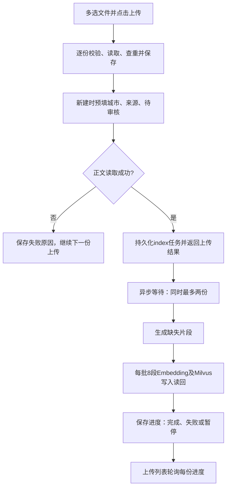

**执行边界：**应用lifespan创建`asyncio.Semaphore(2)`；`run_queued_job`在事件循环等待空位，拿到空位后才调用线程池里的`process_document_job`，等待者不持数据库连接。单进程同时最多两份资料，逐份仍每批最多8段。数据库恢复后的首次任务请求使用锁保证只执行一次中断识别；若后台入口尚未取得执行锁就断线，应用暂存对应资料编号和run_id，尝试标记失败，仍断线则在下一次任务请求时补写；仅更新对应queued/running任务，不影响已暂停、完成或新的重试。无请求时保留到下次任务查询或服务重启，后台不自动循环重试。手动后台按钮共用此入口；重复queued/running仍沿用run_id，不新增相同工作；已完成索引再次提交会检查已有向量，沿用原有幂等逻辑。只限制本后台入口，不限制仍保留的单批手动索引接口。服务中断、手动暂停和外部服务错误后的重试规则沿用10.17，不在启动时自动重试收费调用。

**标签契约：**新建资料时调用`infer_metadata`；重复内容返回已有资料，不重写人工标签。文件名识别常见城市；正文只读取独立的城市/city字段，支持2至12个中文字符并去掉末尾“市”；不会把“出发城市”“目的地城市”当作资料标签。多个城市或文件名与字段冲突时留空；不是完整的全国/海外地名识别。来源优先读取唯一来源/source标注，否则识别文件名中的ChinaTravel或LvBanGPT，未知留空。新建review_status由业务层写pending，poi_id留空；不会自动审核通过或猜测地图编号。标签只供筛选，待审核不构成禁止索引/聊天使用的审批门槛。

**旧资料：**`POST /documents/{id}/metadata/prefill`读已有正文，调用同一识别函数，再按归属锁住资料，只更新仍为NULL的字段。其他归属404，deleting409，处理锁冲突409；不改正文、编号或索引。界面“识别并补全空标签”也保留当前未保存的非空输入，人工修改须保存；无法识别的字段继续为空。没有批量重写旧资料或新增迁移。

**前端行为：**上传列表显示每份保存/排队/处理/完成/失败状态，约每轮请求结束2秒后继续轮询未结束任务，单份查询失败不妨碍其他条目；重试仅发送已保存的资料编号。切回聊天继续上传，显式暂停只停止尚未发送的文件；刷新、重新选择或关闭页面不保留浏览器File队列，已提交服务器任务继续，回到资料详情可查持久状态。详情的原1.5秒轮询保留。批量计数统计本批文件条目，重复内容可对应同一资料。

**数据库与外部调用：**七张表、字段类型、主外键/检查/唯一约束、索引与0007迁移均未变化；city/source/review_status/poi_id复用0006字段，任务复用0007。识别不调用DeepSeek、高德或外部地名库，自动索引使用现有Embedding与Milvus。原问答提示词和固定33题评测未改动，本轮不重跑问答模型评测。

**真实运行验收：**本机后端已重启加载本轮实现，无正在运行的旧任务被中断。浏览器一次选择重庆/深圳/杭州三份20段Markdown和一份.exe，三份均自动完成20/20段索引，无效文件单独拒绝。杭州预填城市/ChinaTravel/待审核且POI留空；清空城市并保存人工来源后点击补全，城市恢复杭州、人工来源保留。自动测试另覆盖向量配置缺失时保留正文和片段、任务提交失败仍返回保存成功、重复上传保护、六份任务最多同时执行两份，以及并发懒恢复和后台入口断线后可重试。三份验收资料的任务及真实Milvus均读回20/20，再核对文件名与全文测试标记后通过DELETE清理，回读404，既有攻略保留。

**本轮最终检查：**373项后端测试通过、0跳过，57.85秒，1条既有Starlette/AnyIO弃用提示；64个app文件及2个评测脚本共66文件mypy通过，本轮目标Ruff、vue-tsc和Vite构建通过，alembic check无新增迁移差异。两张既有SVG与2倍PNG同步并目视核对。独立审查提出两处断线排队边界，均先复现失败再修复并复核。未提交或推送。

### 10.20 详细地点、地图别名与定向门票补查（2026-09-15）

**问题证据：**截图对应最近轮次的三个地点为杭州/湖滨路步行街、淳安县/千岛湖珍珠广场、萧山/戴村，快照中的地图状态均为no_match。原实现只接受城市名及地点名完全相同，宽泛网页搜索也不会继续针对已选地点查询。按[高德POI接口文档](https://lbs.amap.com/api/webservice/guide/api/newpoisearch)核对region、adcode、cityname、adname及返回地址；读取原文件或重新索引不改变这些规则。

**地图核对：**先通过区划查询确定市或区县adcode，再用该区划限定POI范围。两个地点的已核验别名按区划限定（珍珠广场支持杭州市与淳安县两种范围），不使用任意模糊匹配；同名多个结果保持ambiguous。戴村以官方戴村镇行政中心定位，完整地址层级只采用同一区划且唯一一致的POI元数据，坐标不借用附近POI。真实查询曾因重复查县、市、省触发高德10021限流，已减少为区县、POI、镇中心三次请求。

**卡片合同：**MapLookup新增可空matched_name（地图真实名称）和match_kind（poi/administrative）；无字段的旧快照仍能读取。行政区划中心的poi_id保持NULL，不包装成景点或镇政府。AttractionDraft/Card新增可空address_evidence：text（5至250字符）、source_id、quote（5至500字符）。地址优先取真实地图完整地址；已有found地址时丢弃模型重复填写的address_evidence，避免模型把地图地址伪装成资料引文而导致502。其次使用通过原文校验的地址，明确其尚未地图定位；没有可靠结果时说明补查未成功，不生成虚构地址或链接。

**地址校验：**address_evidence.source_id必须属于卡片引用，quote必须逐字存在于该来源，text必须在quote里；地址原句中同一分句必须包含该地址与景点原名或已匹配地图结果的真实名称，同一来源还必须出现卡片所在地。句号、问号、感叹号、分号和换行用于切分，防止并列介绍其他景点时借用地址。补查网页与本地原文都仅作为数据，不能执行其中指令；坐标与POI编号仍只能来自地图工具。已匹配的行政镇显示“行政镇中心，非景点入口”。

**定向补查：**首次仍按用户问题搜索，不给所有问题统一加门票词。第一遍产生并校验至多三个景点，再查地图；对ticket=unknown或无地图/原文地址的景点，各发一次“所在地 + 引号包住的地图实际名/原名 + 缺项词”搜索。同一景点缺多个字段合并为一次请求，一轮至多1次首查+3次补查。返回摘要/标题不包含目标原名或地图名则丢弃，避免引入其他景点票价。第二遍使用新增证据完善卡片；格式修正仍整轮最多一次，不重新补查地图或网页。

**来源与保存：**本地编号1至5保留，网页从6接续到25，一轮至多20条网页，每次Tavily仍最多5条、每条2000字。按网址和摘要内容去重，同网址的新摘要也保留，已发给第一遍的编号不会变。各要点/卡片仍最多引用5个实际存在编号。WebSearchResult新增supplemental_queries（最多3条query/status），随完整回答JSON保存，能区分具体补查成功、为空、未配置或失败；不把查到网页等同确认某个票价。没有新增表、列、索引或迁移，仍复用requirement_turns.response_json，0007保持不变。

**门票显示：**只展示paid/partial，保留票种、日期及参考限制。free/unknown不显示门票区域，但后台原值不变，省略区域不等于免费。免费结论必须有明确原句，“免费/免票/无需门票/不收门票/无需购票”均可核对，否定或取消措辞不得反判为免费；外部网页的门票原句必须在同一分句中包含地点名、门票/免费措辞及所填金额；特殊人群、具体日期免费或同时出现正数元收费均拒绝free，要求按partial保留说明。原句核对不等同于完整语义理解，仍不保证所有复杂文章都能正确归属。沙盒price和高德人均消费依旧不能当门票。

**真实高德验证：**本次分别调用真实接口核对下列结果；行政镇中心没有冒用镇政府或附近景点POI。

| 原查询 | 实际匹配 | 详细地点 | 类型 |
|---|---|---|---|
| 杭州 / 湖滨路步行街 | 湖滨步行街 | 浙江省杭州市上城区凤起路539-4号 | POI |
| 淳安县或杭州 / 千岛湖珍珠广场 | 千岛湖风景区-千岛湖珍珠广场 | 浙江省杭州市淳安县千岛湖镇梦姑路348号千岛湖风景区 | POI |
| 萧山 / 戴村 | 戴村镇 | 浙江省杭州市萧山区戴村镇 | 行政镇中心，非景点入口 |

**真实页面验收：**最终以新会话发送原问题“杭州有哪些适合散步的景点？”，成功保存一轮，显示湖滨路步行街卡片及完整高德地址、实际地图名称和地图链接，没有门票占位区域；刷新后同一轮完整恢复。该轮只产生一张有依据卡片，不把前述三点独立高德查询混写成页面同时展示三张的结果。过程中曾出现模型把地图地址冒作资料原文而触发502，新增回归后改为使用工具地址并丢弃重复字段；另有空source_ids的模型输出，经已有一次修正后成功，未放宽引用校验。初始失败轮没有保存，模型输出稳定性仍不是全场景保证。

**自动检查：**本步最终后端397项测试通过，0跳过（含真实PostgreSQL与Milvus），1条既有Starlette/AnyIO弃用提示；66文件mypy、变更目标Ruff、前端类型检查与构建通过，alembic check无新增操作。回归覆盖别名/区县/行政镇、限定别名不越区、同篇文章错用地点、分号并列、特殊人群/日期免费、补查编号去重和重发/读取历史不重复联网。全app的既有长行未在本步清理。

**历史边界：**修复作用于新问答；旧消息保留原来的查询快照和来源，不在刷新历史时悄悄联网或修改原结论。前端隐藏门票栏的显示规则也适用于旧卡片。

### 10.21 口语偏好追问、接续与补充字段隔离（2026-09-15）

**问题复现：**用户原句“三五个离得不远”并未超出三个景点上限。真实复现是门票引用8未加入卡片引用列表，修正一次后仍漏填，整轮502。增加追问后，真实简短回答又暴露PDF分页片段有地点、无城市，模型遗漏本轮另一个“杭州+西湖”证据的引用。下述程序整理只使用本轮已有证据，不把文件名直接当城市归属依据。

**景点知识分支调用链：**需求提取 → 主聊天检索 → 明确模糊距离先追问；否则生成景点/自然追问 → 程序核对主体并整理可选详情 → 地图/网页补查 → 再次核对 → 保存回答和clarification → 页面卡片与追问同时显示。检索和模型服务本身故障仍按原接口报错，不混写成用户条件不明确。

**追问合同：**AnswerContent新增clarification，字符串1～400字符或NULL，默认NULL，由ModelAnswer和AnswerResult共用。只追问时status=insufficient、points=[]、attractions=[]，sources为空；存在有依据推荐时可同时返回clarification。追问/未核实项提示不能包含新的旅行事实，不需要source_ids。insufficient同时夹带景点或地图请求仍拒绝。JSON保存在requirement_turns.response_json，旧快照用默认值兼容；数据库逐字段定义、表关系及迁移仍为0007，没有新增列、约束或索引。

**偏好接续：**正在回答知识问答追问的接续偏好，如果没有明确新行程意图或天数，不因抽取器误判plan_trip而再索要目的地、天数、人数、预算；原始抽取结果仍留在快照，不伪造用户条件。常见“离得不远/挨着/近一点”等在缺交通方式或时间/距离范围时，程序先问关键条件，不先生成票价。其他模糊偏好由问答提示词引导模型询问。历史上下文带最近助手追问和用户原话；完整短回复以及待追问下短的时间/交通说明可以带回话题。完整新城市问题不按短回复处理。已确认距离只从用户原话读取，助手示例不当选择；更换交通方式且没说新范围时重新问范围。这是有限规则加模型理解，不是覆盖所有自然语言表达的解析器。

**证据与字段容错：**先严格核对主体名称、城市与引用；模型漏挂地点依据时，程序可补挂本轮确实同时包含城市和地点的另一条证据，引用仍最多5个。门票或地址source_id若实际存在，也可补入卡片列表，再核对原句、同地点、金额/日期/范围；不跳过事实核对。可选字段缺格式或原句不通过时，仅清除对应字段。门票回unknown，地址回NULL；总述不保留可能重复错误详情的内容，卡片中重复的收费/地址句也清理；原失败地址text用于精确清理，兼顾“路”“大道”等不同写法。无法通过的主体或非法整体JSON仍最多修正一次，不能悄悄作为真实推荐放行。

**页面与限制：**有卡片时依旧隐藏重复总述，但单独显示clarification，刷新可恢复；免费/未知门票栏仍省略，未知不代表免费。地图地址和入口继续来自真实工具。尚未接入步行路线和耗时计算，不把同城、坐标或用户给定的半小时直接当作路线验证结果。提示词变更后未重跑历史33题，既有32/33属于此前版本。

**本步验证：**后端全套412项通过、1条已有依赖弃用警告；修改范围Ruff通过，mypy检查app及资料评测脚本共66个文件通过，前端类型检查/Vite构建通过，Alembic检查无待生成迁移。真实浏览器与DeepSeek使用截图原句，先返回距离追问；“步行半小时以内”接续杭州景点问答，不再错误索要目的地/天数/人数/预算。两轮均保存且刷新恢复，页面截图核对完成。该次回答只有西湖、灵隐寺两张卡片，未验证三五个地点或半小时路线要求，不能据此宣称距离筛选已完成。

### 10.22 流式回复、目的地引导与附近餐饮（2026-09-16，源码已实现）

**当前调用顺序：**`App/useRequirementConversation → requirements.ts读取POST SSE → history.stream_saved_message → process_saved_message读取历史、幂等/版本检查 → handle_nearby周边Agent → 地图查询/补问，或continue_chat后提取需求并进入知识链/M4-A → 最终校验 → RequirementHistoryService.append短事务 → done → 页面正式结果`。当前周边使用`BaiduMaps.lookup/nearby_places`经百度MCP查询，不进入DocumentSearchService；原handle_dining与nearby_dining已替换。JSON入口调用同一业务函数。当前Agent及百度验证见10.25，本节末尾保留早期流式与高德餐饮验收。

**SSE合同：**完整路径为`POST /api/v1/sessions/{session_id}/requirement-messages/stream`，请求体仍为message（1～6000字符）、message_id、expected_revision；身份/归属和请求格式检查先于流建立，错误沿用普通HTTP处理。成功建立后返回`text/event-stream`、`Cache-Control: no-cache, no-transform`及`X-Accel-Buffering: no`。

| 事件 | 数据与含义 | 页面处理 |
|---|---|---|
| `progress` | stage/message；先received，后续只在实际进入历史、需求、检索、生成、地图或保存步骤时发出 | 展示公开处理步骤，不模拟百分比、不暴露内部推理 |
| `reset` | 清空当前临时回答 | 新一遍生成或修正前移除旧草稿 |
| `draft` | text：从模型真实分片中提取的公开points文字 | 标记待核对；尚未完成最终事实/引用校验及保存 |
| `done` | 完整SavedRequirementTurn | 仅成功提交后发送；替换草稿并确认该message_id已保存 |
| `error` | status/message/request_id；复用注册的HTTP异常处理器脱敏 | 保留原错误状态码语义，例如409恢复最新历史；未知异常使用通用提示 |
| 心跳注释 | 等待队列15秒无事件时发送`: heartbeat` | 保持连接，不属于回答内容 |

流建立后HTTP状态不能再次变更，因此错误码放在error事件的status中。`events.py`用ContextVar隔离当前请求的监听器和允许引用编号；只有`public_answer`范围内、status=answered、符合AnswerPoint且source_ids属于本轮允许集合的points才能形成草稿。还要求source_ids先于text出现，确认引用数组已闭合后才展示文字；不遵守字段顺序时不展示该点草稿，等待完整输出的最终校验。需求抽取JSON、工具参数、原始JSON和内部推理不发送到页面。DeepSeek客户端在SSE请求内调用真实`stream`并合并很小的增长分片，草稿缩短或清空立即推送，避免保留已撤回的内容；普通JSON入口继续invoke；`thinking.type=disabled`保持不变。所有完整输出仍执行原格式修正、引用和景点证据核对，草稿不能证明最终保存成功。

**断流与恢复：**工作线程自己持有模型、地图和检索所需连接；浏览器断开后停止向其队列积压事件，已开始的工作在服务进程存活时继续校验并保存。页面保留pending中的原message_id和expected_revision，刷新先读数据库，已保存则恢复结果，未确认则允许用同一编号重试，不自动重复发送。退出或换账号清除草稿与进度，并通过generation阻止旧连接回写。任务集合属于当前应用实例，正常关闭先等待已开始的工作再释放数据库；进程崩溃或强制终止后的未完成聊天没有持久任务队列。幂等仍保证不重复保存，不能保证并发请求不重复调用模型。

**目的地与个人条件：**`destination_action`只在用户明确建立、更换或清除旅行目的地时改变结构化旅行条件；咨询另一城市只更新`conversation`旅行话题和本轮`query_cities`。登记人数、日期、全团预算等个人条件时不附加无关的资料不足提示；同句包含知识问题时可以使用检索增强，也允许资料不足后自然回答一般建议，对实时事实保持未核实说明。周边与行程仍分别使用地图工具和完整规划路由，见10.25与10.23。

**周边范围：**Agent从本轮地点或历史已核实POI选择锚点，理解景点、餐馆和住宿的指代；切换城市不得沿用旧城，行政中心不可当商户或景点中心。当前由百度MCP搜索候选；首10条缺评分的候选可补查详情，详情UID必须与候选一致。半径默认2000米，允许1～50000米；逐条核对同城、真实类别、坐标圆形距离、编号、偏好与原始评分。仅保留4.0～5.0分，按评分降序、距离升序取最多5家；有消费上限时，缺失、零值或超限参考消费不入选。筛选作用于本轮地图候选，不只是过滤上轮5张卡片。消费、评分与距离缺失不补造；圆形范围不等于步行路线或耗时，首批结果不是全区域穷举，住宿参考消费不是入住日期对应的每晚房价或实时空房。

**JSON数据字典：**以下字段属于现有`requirement_turns.response_json.dining`，Pydantic负责格式校验，未增加数据库列、主外键、索引、约束或迁移；当前表结构和迁移仍是7.5节的0010。dining为可空对象，默认None；旧历史缺字段可直接读取，已保存结果刷新不重新查地图。

| 字段 | 类型、可空性与默认值 | 含义与校验 |
|---|---|---|
| `status` | 必填字符串，不可空 | found/empty/ratings_unavailable/unconfigured/error/needs_clarification；区分找到、无匹配、缺评分、工具未配置/失败、需澄清 |
| `items` | DiningItem数组，不可空，默认[]，最多5项 | 通过类别、评分、范围和可选参考消费核对的餐饮或住宿 |
| `anchor` | MapLookup或null，默认null | 复用已有地点、查询状态及坐标格式；不是新表外键 |
| `radius_m` | 整数，不可空，默认2000；1～50000 | 单位米；本轮查询的圆形半径，同查询省略时可继承 |
| `preference` / `clarification` | 字符串或null，默认null | 本轮商户偏好/需补充的问题；不限偏好时不加关键词 |
| `category` | dining/lodging，不可空，默认dining | 要查询的餐饮/住宿类别，不是锚点类别；旧餐饮快照保持默认 |
| `max_cost` | 有限浮点数或null，默认null；非空时>0 | 单个商户的参考消费上限；不是全团预算，不能证明每晚房价 |
| `rating_missing_count` | 整数，不可空，默认0，≥0 | 合格地点候选中缺少有效原始评分的数量 |
| `provider` | amap/baidu，不可空，默认amap | 本轮商户数据提供方；旧快照默认高德，不能混称评分来源 |
| `checked_at` | 日期时间，不可空，默认当前UTC | 查询尝试时间，不是地图资料更新时间 |
| `items[].poi_id` / `name` | 必填字符串，不可空 | 提供方地点编号（高德id/百度uid）和原始商户名称 |
| `items[].location` | 必填GeoPoint对象，不可空 | 有限经度[-180,180]、纬度[-90,90]，新查询coordinate_system为BD-09；旧历史兼容GCJ-02 |
| `items[].rating` | 必填有限浮点数，不可空，4～5 | 当前provider实际评分；缺评分不进入items |
| `items[].address` | 字符串或null，默认null | 高德行政区与地址拼接，或百度原始地址 |
| `items[].distance_m` | 有限浮点数或null，默认null，≥0 | 提供方返回的距离，单位米；缺失不使用自算距离填补 |
| `items[].reference_cost` | 字符串或null，默认null | 有效的原始人均/商户参考消费；不是账单或酒店每晚报价保证 |
| `anchor.provider` | amap/baidu，不可空，默认amap | 锚点本身的来源，可与本次查询provider不同；内部用provider:poi_id防编号冲突 |
| `anchor.poi_id` / `location` | 可空字符串/GeoPoint，默认null | 搜索工具实际执行前要求百度具体POI及有效BD-09坐标；旧来源先重新定位，行政中心不合格 |

周边回复status=knowledge，不覆盖已有有效旅行需求。未找到结果、没有有效评分或地图工具失败均用实际状态说明，可随整轮保存；它们不是伪造推荐。`RestaurantCards`显示餐饮/住宿和真实来源，链接统一用`mapLink.ts`打开百度标记，BD-09声明bd09ll、旧GCJ-02声明gcj02；评分来源仍按快照显示，不因跳转目标改变。历史dining字段保留，未另设nearby数据库列。

**流式与早期餐饮历史验证（周边Agent替换前）：**完整后端含真实PostgreSQL/Milvus回归479项通过，1条既有AnyIO弃用提示（70.72秒）；mypy 71文件、修改范围Ruff、前端构建及SSE Node契约测试通过。浏览器完成访客“想去杭州”首问登录续答、实际进度、城市简介与缺项引导；真实高德查湖滨路步行街附近返回5家4.5～4.7分餐厅，“火锅”短追问保留锚点并得到5家4.6～4.7分火锅店。单次城市简介观测首progress 0.062秒、首draft 10.078秒、done 10.625秒，不作时延承诺。上述历史记录不证明本轮周边Agent、住宿或百度已通过真实验收，当前百度验证见10.25。

### 10.23 M4-A文本行程图、版本快照与撤销（2026-09-16，本轮范围已验收）

**本次框架替换核对：**2026-09-16，三个核心文件467→378行；后端514项全量回归（真实隔离PostgreSQL/Milvus）、mypy 76文件、修改范围Ruff、前端协议与构建通过。真实DeepSeek通过Vite代理发送SSE，首次progress 0.09秒、done 19.58秒；浏览器修改第二天、撤销、刷新通过，HTTP核对恢复版本的完整计划及需求与首版一致。动态工具清单须同步剩余额度和地点提示；失败重试前没有保存半轮。逐文件审查、次数边界和QA清理见07“Ponytail：框架接管行程循环”节。以下末尾506项与原QA记录属于框架替换前的初次M4-A验收。

**入口与执行：**`chat/service.py`提取合并条件后，仅完整规划请求调用`itinerary/graph.py::plan_trip`。原M3知识问答、餐饮和缺项追问保留。正式DeepSeek的ChatOpenAI直接交给LangChain 1.4.0的`create_agent`，底层由LangGraph 1.2.11执行。`StructuredTool.from_function`生成工具参数契约，ToolNode负责分发与原生ToolMessage回传，不再维护JSON行动协议、ToolModel兼容分支或手写StateGraph路由。`wrap_model_call`按证据开放knowledge_search、web_search、map_lookup、submit_plan、ask_clarification，并同步剩余额度和已核对地点；在工具执行前拒绝越过当前清单、截断和混合提交。Pydantic参数模型显式forbid额外字段。没有独立Reviewer、interrupt或持久checkpointer。

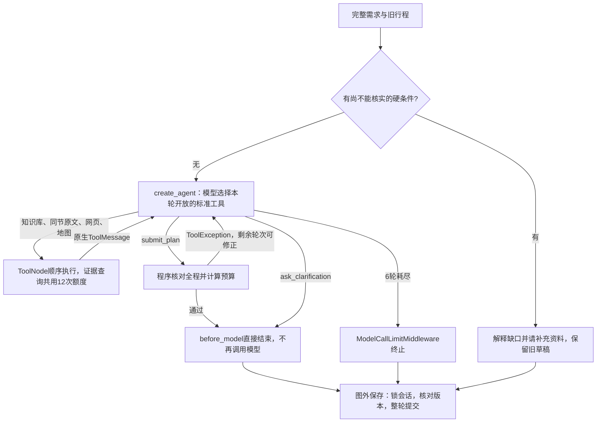

`ModelCallLimitMiddleware(run_limit=6)`限制模型次数；第6轮仅开放提交或补问。框架节点数变化后递归兜底为50，并不增加模型额度。工具计数在实际调用前共用12次上限；提交和修正行程不占外部查询额度，因此没有将所有工具一并计入通用ToolCallLimitMiddleware。`max_concurrency=1`保留来源编号、总额度和外部连接的顺序语义，不代表限制不同用户请求。

提交的业务规则失败通过ToolException成为错误ToolMessage，框架继续有限修正；校验通过或自然补问后，before_model直接跳转结束，避免一次多余模型调用。模型和工具均在追加数据库事务外执行；progress显示实际公开步骤，模型原始消息、工具参数和内部推理不进入SSE。普通JSON接口与SSE复用同一业务路径，done仍在整轮事务提交后发送。

`submit_plan`显式提交`days=[]`也属于合法行动：当target_days为空数组、旧计划仍适配时，程序保留全部活动，按新需求重算预算并再次校验。它不是新建零天行程，也不绕过最终TravelPlan的2～5天限制。明确“第一天不变”不会被解析为要修改第一天；未指定的天由程序复制保留。

**工具与证据：**`knowledge_search(query)`复用共享范围的DocumentSearchService，最多取5条原文；`knowledge_read(source_id)`仅接受本轮检索来源，展开附近同节原文，合同见10.32；`web_search(query)`复用已有网页客户端，正式主聊天目前传入None而不开放；`map_lookup(name, source_ids)`只能查询已返回原文中实际出现的地点名，查询限制当前目的地。最终活动只能引用本轮或同目的地旧行程保存的place.id，新核对地点必须是百度found、match_kind=poi且有BD-09坐标的地点；不把行政中心、模糊匹配或未核实名称放进草稿。工具没有知识库管理、文件读写或账号操作权限。

**规则与局限：**沿用2～5天、1～8人和单目的地。程序检查天数完整、同天不重复、全程地点不重复、明确排除项、活动在08:00～21:00、每项30～240分钟、前后不重叠及至少30分钟交通预留；轻松/均衡/紧凑每天活动加预留分别不超过360/480/600分钟。交通方式与预留不等于实际路线耗时，开放时间、预约和票价仍待核实。其他硬条件缺依据时先解释补证，不生成“已经满足”的草稿。只有用户明确点名“第N天”且旧计划的天数/目的地/开始日期适配时，程序只接收指定天并保留其余活动；未点名时可重新编排全程，日期按当前需求重算。

预算由现有Decimal服务使用`demo-cny-v1`计算，舒适住宿偏好选comfort，其余economy；超演示预算拒绝该计划并在剩余轮次内反馈调整，不将模型金额作为结果。预算与路程都不是实时报价或可达性验证。

`rules.start_constraint`识别明确某天开始时间，例如“第二天11点开始游玩”，程序要求当天第一项活动的start_time精确匹配；超出旅行天数或未匹配时拒绝计划，不能把该条件只写成一句承诺。到达、返程和模糊时段不当作开始时间；无障碍、步行耗时等其他未核实硬条件仍先解释和补证。

**JSON数据字典：**复用0010现有表结构，无新增表、列、外键、索引或迁移。下列子字段由Pydantic和业务规则校验，数据库仍只检查JSON对象及第7.5节已有关系；表内“默认”指DTO默认，必填项无默认值。

| JSON位置／字段 | 类型、可空与默认 | 含义与约束 |
|---|---|---|
| `response_json.itinerary` | PlanSnapshot对象，可空，默认null | 只有成功保存的逐日草稿才有快照；旧历史兼容 |
| `itinerary.itinerary_id` | UUID字符串，非空，无默认 | 本次保存的itineraries.id；JSON引用由服务核对，不是新增外键 |
| `itinerary.version` | 整数，非空，无默认，≥1 | 本次行程版本 |
| `itinerary.previous_version` | 整数，可空，默认null | 修改或撤销前的行程版本 |
| `itinerary.operation` | create/modify/undo，非空，无默认 | 首版、修改或撤销 |
| `itinerary.plan` | TravelPlan对象，非空，无默认 | 与itineraries.itinerary_json保存同一份计划内容 |
| `itinerary.changes` | 字符串数组，非空，无默认 | 程序比较实际计划及数据库前后完整需求得出的差异；仅需求变化也列出，不采用模型changed_fields充当证据，可为空 |
| `itinerary.can_undo` | 布尔，非空，默认false | 首版和撤销结果为false；有效性仍由最新轮次和双版本检查决定 |
| `TravelPlan.format` | 字符串，非空，默认且固定daily-plan-v1 | 区分旧M1预算草稿 |
| `TravelPlan.title` | 字符串，非空，无默认，1～100字 | 草稿标题 |
| `TravelPlan.destination` | 字符串，非空，无默认 | 当前目的地 |
| `TravelPlan.days` | PlanDay数组，非空，无默认，2～5项 | 覆盖1至需求天数，按日排序 |
| `TravelPlan.budget` | BudgetSummary对象，非空，无默认 | 复用M1天数/人数、间夜数、单价、分类费用、预留金、总额、余额、超支与假设；金额以字符串序列化 |
| `TravelPlan.warnings` | 字符串数组，非空，无默认 | 待确认草稿、路线未查、演示价格等局限 |
| `PlanDay.day` | 严格整数，非空，无默认，1～5 | 自然日编号 |
| `PlanDay.date` | ISO日期，可空，默认null | 有开始日期时由程序按日生成 |
| `PlanDay.activities` | PlannedActivity数组，非空，无默认，1～5项 | 当天有序活动 |
| `PlannedActivity.place` | PlanPlace对象，非空，无默认 | 保存地点及证据，模型只提交place_id |
| `PlannedActivity.start_time` | HH:mm字符串，非空，无默认 | 格式00:00～23:59，业务额外限制08:00～21:00内结束 |
| `PlannedActivity.duration_minutes` | 严格整数，非空，无默认，30～240 | 活动建议时长，单位分钟 |
| `PlannedActivity.transport` | walk/transit/taxi，非空，默认transit | 从上一活动到本活动的建议交通方式 |
| `PlannedActivity.transfer_minutes` | 严格整数，非空，无默认，0～120 | 本活动前交通预留分钟，非真实路线查询结果 |
| `PlanPlace.id` | 字符串，非空，无默认 | 请求内去重分配的地点编号，旧草稿可复用 |
| `PlanPlace.map` | MapLookup对象，非空，无默认 | 复用第10.9～10.20节地图字段合同，包含POI、坐标、地址和核对状态 |
| `PlanPlace.sources` | PlanSource数组，非空，无默认，1～5项 | 对应实际工具返回原文 |
| `PlanSource.id` | 字符串，非空，无默认 | 知识k或网页w前缀的来源编号 |
| `PlanSource.kind` | knowledge/web，非空，无默认 | 来源类型 |
| `PlanSource.title`、`text` | 字符串，非空，无默认 | 文件/网页标题与实际返回原文 |
| `PlanSource.url` | HTTP(S) URL，可空，默认null | 网页链接；知识片段无需网页URL |
| `PlanSource.document_id`、`chunk_id` | UUID字符串，可空，默认null | 共享资料及实际片段编号；应用核对的JSON引用，不是新增数据库外键 |
| `PlanSource.page_number` | 整数，可空，默认null，≥1 | 原片段物理页码；无页码不推测 |
| `PlanSource.section_path` | 字符串数组，非空，默认[] | 原片段标题路径；旧快照与非知识来源可为空 |
| `response_json.undo_request` | UndoDraftRequest对象，仅撤销轮次存储 | 后台幂等依据，不是公开RequirementChatResponse字段 |

`travel_requests.request_json`在M4-A保存该版完整TravelRequestExtraction，字段沿用第5节和schema；`itineraries.itinerary_json`保存TravelPlan。旧M1快照仍原样保留，只有format为daily-plan-v1的版本作为可复用逐日行程。旧快照不会因刷新重新检索或计算。

**原子保存与并发：**生成前读取会话revision和最新行程version，工具完成后锁`sessions`行，复查revision；有成功计划时还核对生成前version。使用同一事务写入完整需求、新行程、整轮响应和updated_at，异常一起回滚。复用`(session_id, message_id)`、`(session_id, revision)`及需求/行程`(session_id, version)`唯一约束；行程的`(request_id, session_id)`复合外键继续保证同会话需求关联。无成功计划可保存缺项说明，但保留旧行程版本。已保存消息重试返回原响应，消息编号复用于不同请求返回409。

**撤销HTTP合同：**`POST /api/v1/sessions/{session_id}/drafts/undo`沿用require_session_owner和同源保护；匿名401、跨用户404、格式非法422、过期/重复编号异参409、数据库未配置503。成功返回SavedRequirementTurn。

| 请求字段 | 类型、可空与默认 | 含义与约束 |
|---|---|---|
| `operation_id` | UUID字符串，非空，无默认 | 本次撤销幂等编号，作为新轮次message_id |
| `target_message_id` | UUID字符串，非空，无默认 | 要撤销的修改消息；必须仍是最新轮次 |
| `expected_revision` | 严格整数，非空，无默认，≥0 | 页面所见会话版本 |
| `expected_itinerary_version` | 严格整数，非空，无默认，≥1 | 页面所见最新行程版本 |

撤销先查同operation_id记录：四字段完全相同返回原结果，不再增加版本；异参返回409。新操作需满足最新轮次就是目标修改、快照指向当前行程且允许撤销；任何后续已保存消息都会使旧按钮失效。恢复previous_version关联的完整需求和计划为新的draft，增加撤销消息并同步updated_at，保留所有历史；不调用模型、不自动恢复confirmed。首次生成和撤销结果本身不可撤销。前端消息内显示版本、活动、来源、预算与限制，历史恢复沿用快照，实际服务再次检查权限与有效性。

**初次M4-A自动检查（框架替换前）：**后端全套506项通过、0跳过，使用真实隔离PostgreSQL/Milvus，1条既有Starlette/AnyIO弃用警告；mypy检查76个文件、修改范围Ruff、前端Node协议/撤销/滚动测试与Vue类型检查/Vite构建通过。

**真实运行：**专用QA账号在浏览器生成杭州两天v1：第一天10:00湖滨，第二天09:30苏堤；自然语言只改第二天11:00生成v2，第一天完整内容保持不变；点击撤销生成v3，恢复第二天09:30，刷新恢复一致。HTTP再次核对三版均为draft，v3完整plan与完整需求均等于v1。SSE公开节点可见，知识库、地图和网页原生工具选择均发生过真实调用。

**结构与清理：**本机Alembic current=`0010_required_session_owner (head)`，check=`No new upgrade operations detected`，未执行迁移。最新行程卡片滚动到顶部已真实截图复验。专用QA账号`qa_m4_0916`已退出，严格限定清理其1条测试会话、6轮对话、3份行程及3份需求，用户既有数据未动。

**验收范围：**过程发现并修复纯JSON行动不稳定、餐饮分流抢入规划、保留日误解析、重复地点和明确开始时间被误列待核实条件。上述证据覆盖本轮文本生成、指定日修改、原子保存、撤销及历史恢复；未据此宣称广泛质量题库稳定率、实际路线可达性或M4-B/C已完成。

### 10.24 周边查询Agent、查询接续与整段会话删除（2026-09-16）

周边业务规则继续适用；地图接入、工具额度和调用方式已按2026-09-17源码同步，完整MCP分支见10.25。本节末尾的高德验收保持历史口径。

**周边执行边界：**`chat/dining.py::handle_nearby`在旅行需求抽取之前运行。输入包含本轮原话、已有目的地、最近6轮原话/回复、按显示顺序排列的已核实地点编号/城市/名称及周边查询条件；不重复发送整批卡片的坐标、地址和价格，事实留在程序内。模型通过`create_agent`选择标准工具，程序不再用餐饮关键词或“先抽取全团需求”的顺序决定附近消费追问。只有最后一轮dining作为省略筛选的继承来源；更早的核实地点仍可按明确编号引用。没有模型自行填写坐标、数据库写入或会话删除工具。

| 标准工具 | 参数与约束 | 结果 |
|---|---|---|
| `search_nearby` | category必填dining/lodging；用已有anchor_id，或city+place_name核对新地点；两种地点表达不能并用 | 调用BaiduMaps.nearby_places，经百度MCP核对后返回DiningResult |
| `ask_location` | question为1～500字符；category默认dining；keep_query默认false | 必要补问；补充同类别口味时keep_query=true可保留上轮锚点、半径、消费与来源 |
| `continue_chat` | 无参数 | 退出周边分支，继续原需求提取、知识回答或行程Agent |

search_nearby的preference、max_cost、radius_m可省略；同类别且锚点provider/poi_id相同、未指定reset_filters时，省略值继承上轮。换类别或锚点不继承旧口味、消费及半径，未提供半径则回默认2000米；reset_filters=true同样清除旧筛选。preference="不限"取消偏好关键词，工具参数max_cost=0取消消费上限，保存结果中的max_cost变为null。max_cost参数必须为0～100000的有限数，radius_m为1～50000严格整数。新查询固定百度，不再给模型开放provider参数；旧来源锚点由地图服务按名称重新定位，历史评分与来源不改写。

模型上下文中的地点编号使用`provider:poi_id`，防止地图编号碰撞。商户卡片顺序用于解释“第一家/第二家”，原查询锚点单独保存，不插到餐馆列表前挤占序号。“这家饭店附近住宿”切换的是查询类别，锚点仍是用户指向的具体饭店；“住宿附近吃什么”没有已知酒店时先问酒店名和城市。新城市与旧锚点城市冲突、行政区中心、缺坐标或不存在的编号均不得直接发周边请求。

`StructuredTool.from_function`生成业务工具参数并拒绝额外字段，地图工具参数由原生MCPAdapter生成。MCP工具可用时最多8轮模型决策，无地图工具时保留3轮业务分流；查询提交、补问或continue_chat成功后结束。只读MCP工具允许同轮多个调用，由框架顺序执行，终止类动作必须单独选择。模型与地图请求都在保存事务之外；公开进度不包含原始工具参数和内部推理。次数用尽或模型调用不合法不保存半轮，地图明确返回error/unconfigured时可保存实情说明。

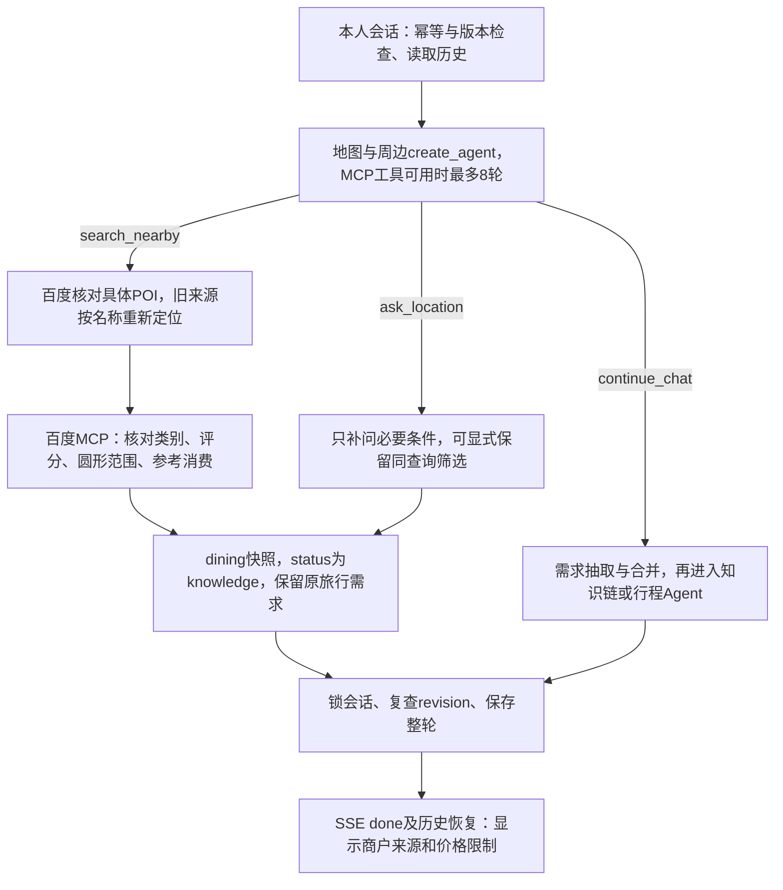

**地图与兼容：**当前只用百度MCP，按同城、类别、有效BD-09坐标、圆形范围、偏好、4.0～5.0分及可选消费上限筛选，最后取5家。新名称使用lookup核对；历史高德/GCJ-02锚点先按名称重新查询，不把旧坐标冒作百度坐标。商户参考消费不代表酒店每晚房价或实时空房。dining字段兼容默认值仍保留旧高德来源，新调用显式写入baidu；未另建nearby表或列。

**删除接口与事务：**`DELETE /api/v1/sessions/{session_id}`无请求体，沿用CurrentUser登录与同源/CSRF校验，返回204空响应。匿名401，写入来源缺失或跨站403，编号格式错误422，缺失或他人会话一律404；重复删除同样404，不透露归属。`TripService.delete_session`在单一事务以session_id+user_id查询并FOR UPDATE锁定会话，再按`requirement_turns → itineraries → travel_requests → sessions`顺序硬删。与append、save_draft、undo锁同一sessions行：写入先提交则删除全部最终版本，删除先提交则后来写入发现会话不存在。中途故障整笔回滚，不留下半删状态。

此删除仅处理本人选定会话的消息和所有需求/行程版本，不删除账号、其他会话、共享documents/document_chunks、原文件或Milvus向量；不采用归档标记或后台任务。它与资料的“先停用、再清理文件和向量”是不同业务。

**前端删除合同：**历史条目选择按钮与删除按钮互为独立元素，无嵌套button，并有含会话标题的可访问标签；中文Arco确认框明确不可恢复。未确认不请求，删除失败保留列表及当前内容。204后移除该项；如果是当前会话，清空消息、需求、版本、输入、草稿、进度、pending、pendingUndo、撤销目标和该账号sessionStorage记录，但保留内存中的账号storageKey，使下次发送仍能创建并记住新会话。删非当前项不重置当前对话。删除期间阻止切换/新建/发送/撤销；authGeneration、listGeneration及会话generation防止旧账号、旧分页或旧流响应复活已删除内容。

**数据库结构：**本步没有表、列、主外键、唯一/检查约束或索引变更，也没有新增迁移；当前结构仍为7.5节的0010。周边条件存入既有requirement_turns.response_json.dining；删除沿用现有会话外键关系，通过事务顺序满足约束。

**自动验证：**删除新增6项测试在随机PostgreSQL schema运行；连同会话、历史、草稿和撤销回归共51 passed，覆盖真实Cookie、CSRF、owner隔离、多版本删除、三类在途写入与失败回滚。前端Node测试使用实际会话状态及App.vue SSR状态验证确认前不删除、失败保留、当前/非当前处理、保留存储键后续发送、旧列表与跨账号响应隔离。补问筛选、商户序号及provider继承完成审查修正后，本轮全套557 passed（78.73秒）、1条既有Starlette/AnyIO警告；mypy 77文件、修改范围Ruff、前端类型/状态回归及生产构建通过。之后仅缩减Agent重复上下文，再跑71项相关回归通过；这71项是最后小改后的专项复验，不冒充再次全仓运行。

**历史真实验收（2026-09-16，统一百度MCP之前）：**当时DeepSeek与高德四轮依次完成附近餐馆、人均100元以内、第一家餐馆“炉鱼”附近住宿、第一家酒店“枕湖望星居”附近餐馆。100元筛选返回的5家参考消费为60/49/56/36/58元；后3轮完成时间4.11/2.01/2.22秒，首SSE事件约0.02～0.05秒。最终精简上下文后再次真实执行餐馆→100元上限→第一家餐馆附近酒店，分别2.52/2.78/2.03秒；这些均为单次观测，不作时延承诺。专用测试账号浏览器核对景点附近酒店卡片、中文删除确认、删除后刷新不恢复；删除当前会话后新问未知住宿位置，能够正常发送并补问酒店名和城市。百度没有配置密钥，本轮只有离线HTTP替身和合同检查证据，未进行真实百度调用。验收证明这些样例接续与删除闭环，不保证任意口语或所有商户召回。

**收尾核对：**最终后端已重启且健康检查200；浏览器专用账号已退出。清理严格限定本轮3个QA账号、3个剩余QA会话及关联消息/需求/行程，清理后回查为0；另1个QA会话已通过浏览器删除并刷新确认。既有用户及知识库数据未列入清理范围。

### 10.25 统一百度地图MCP与带依据回答（2026-09-17）

**当前实现：**高德配置与`services/amap.py`已移除，百度直连HTTP也已替换；地图唯一配置是后端`BAIDU_MAP_API_KEY`。`BaiduMaps(settings)`是请求范围的上下文管理器，构造和进入时不联网，首次读取tools才连接。聊天先检查归属、消息幂等和会话版本，已保存重试不连接MCP；本轮知识、周边及行程查询复用连接与调用计数，请求结束统一释放。

`baidu_mcp.py`使用`langchain.mcp.MCPAdapter`和FastMCP Client连接固定官方`https://mcp.map.baidu.com/mcp?ak=...`；AnyIO BlockingPortal只桥接同步业务与框架异步工具。协议、发现与参数校验交给框架，不手写协议或模型循环。密钥不进入回答、依据或普通异常信息。

**白名单与额度：**允许8类只读能力、9个兼容名称：`map_geocode`、`map_reverse_geocode`、`map_search_places`、`map_place_details`、`map_directions`、`map_directions_matrix`/`map_distance_matrix`、`map_weather`、`map_road_traffic`。实际工具取服务发现与白名单交集；分享地图、IP定位、未知工具和额外授权不开放。初始化超时10秒，框架调用15秒、外层等待20秒；每请求最多24次外部调用，含详情补查。MCP工具可用时Agent最多8轮决策，否则保留3轮业务分流；同轮多个只读MCP调用由框架`max_concurrency=1`顺序执行，回答提交、补问及continue_chat必须单独选择。`parallel_tool_calls=False`只是提供方提示，不能代替程序检查。

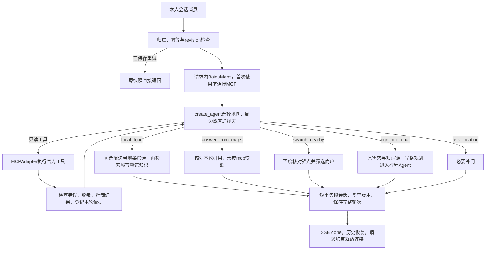

**地点与商户：**lookup只接受同名或百度`new_alias`中分号分隔的精确别名，且同city/area、唯一结果、有效UID和BD-09坐标。没有任意模糊匹配，也不再用行政中心补造新坐标，不宣称完整覆盖乡镇定位。旧高德/GCJ-02锚点再用于周边查询时先按名称重新定位，不改写原历史。商户核对城市、类别、偏好、圆形距离和4.0～5.0评分；首10条缺评分候选可以补查详情，详情UID必须相同。参考消费缺失、非正数或超限时不满足消费筛选，最终按评分降序、距离升序取最多5家。圆形范围不是步行时间，参考消费不是实时房价，候选列表不是区域内商户穷举。

**回答与JSON字典：**answer_from_maps只能引用本轮成功工具编号，保存所选依据并生成包含查询来源的reply。编号校验不是逐句语义验证，事实归纳仍依赖模型。HTTP/SSE及GET历史复用RequirementChatResponse，新增字段存于既有`requirement_turns.response_json.mcp`：

| 字段 | 类型、空值与默认 | 含义与约束 |
|---|---|---|
| `mcp` | MapToolAnswer或null，默认null | 旧历史缺字段无需迁移；原knowledge/dining/itinerary继续使用 |
| `mcp.reply` | 字符串，不可null，无默认 | 地图回答及来源；工具提交正文1～4000字符 |
| `mcp.source_ids` | 整数数组，不可null，无默认 | 工具提交1～6个严格整数1～24，必须属于本轮成功依据，保存去重 |
| `mcp.evidence` | MapToolEvidence数组，不可null，无默认 | 仅保存被引用的本轮工具依据 |
| `mcp.evidence[].id` | 整数≥1，不可null，无默认 | 本请求编号，不是数据库主键或外键 |
| `mcp.evidence[].tool_name` | 字符串，不可null，无默认 | 实际执行的白名单工具名 |
| `mcp.evidence[].content` | 字符串，不可null，无默认，最多48000字符 | 脱敏精简结果，空结果、超长结果及业务错误不作为依据 |
| `mcp.evidence[].provider` | 固定baidu，不可null，默认baidu | 实际查询来源 |
| `mcp.evidence[].checked_at` | 带时区时间，不可null，默认当前UTC | 查询核对时间，不是源数据更新时间 |
| `GeoPoint.coordinate_system` | BD-09/GCJ-02，不可null，默认GCJ-02 | 新百度查询显式BD-09；默认仅为旧历史兼容 |
| `MapLookup.provider` / `DiningResult.provider` | amap/baidu，不可null，默认amap | 新查询显式baidu；RAG无地图服务时也显式baidu；默认仅为旧历史兼容 |

结果精简递归删除`image`、`photos`、`children`、`regular_open_hour`、`polyline`和`path`，保留业务字段与路线文字指引，不宣称保存完整原始报文。百度业务status错误（含布尔值）即使MCP信封成功也拒绝。字段由Pydantic与业务服务校验；无新表、列、主外键、唯一/检查约束、索引或迁移，结构仍为7.5节0010。成功轮次原子保存，失败不留半轮，删除会话沿原事务清理快照。

**前端：**`mapLink.ts`供三类卡片共用，统一百度网页marker，纬度在前、经度在后；新BD-09传bd09ll，历史GCJ-02传gcj02，不猜坐标或自行转换。商户默认百度，明确保存的历史高德评分仍显示高德。参数依据：[百度网页地图调起官方文档](https://lbsyun.baidu.com/docs/webapi?title=mapadjustment%2Furi%2Fweb)。SSE只展示实际公开步骤和允许的公开草稿，不发送内部推理与工具参数。

**最终自动验证：**后端565 passed、2 warnings、84.05秒，包含真实隔离PostgreSQL/Milvus；两条提示为既有AnyIO及LangChain原生MCP beta。mypy检查78文件、修改范围Ruff、前端生产构建、Node SSE契约及diff检查通过。回归覆盖协议适配、同轮双只读调用、布尔status拒绝、长path精简、当轮引用、幂等/失败不落库、上下文和新旧坐标链接。此前563项与14项定向检查为中间结果，最终以本次全量为准。

**真实接口与浏览器：**用户修正AK访问白名单后，官方天气、地点和周边评分/消费筛选成功。真实DeepSeek经HTTP/SSE依次完成杭州明天天气、湖滨路步行街饭店、100元以内、第一家店附近住宿，单次耗时5.90/2.68/2.73/2.65秒，来源全baidu、坐标BD-09；历史读取revision=4。路线初测双地理编码被旧单调用规则拒绝；允许同轮只读工具顺序执行后完成两端定位、公交查询和带依据回答。最终最新后端重启健康200，杭州东站到西湖断桥公交HTTP200、10.40秒，接续100元内餐饮HTTP200、3.77秒。浏览器专用QA账号恢复两轮，核对百度公开评分及带bd09ll的marker链接；历史GCJ链接由自动回归覆盖。外部百度落地页未打开验收，不把链接存在说成底图已展示。账号退出，QA会话及用户清理回查为0。

以上是特定样例证据，不是时延承诺、全部商户召回或逐句正确保证。单独路线问答可用，不代表逐日行程自动逐段核实路线、开放时间、票价及可达性；D私人附件见12.5，后续M4-B附件修改行程见12.12，独立Reviewer和持久恢复仍未实现。

### 10.26 餐馆与特色菜问答边界（2026-09-17）

当前餐饮地图查询默认关键词/标签为餐厅。百度`cater`大类不足以证明是正餐店；`nearby_places`另外检查细分类标签和名称，排除咖啡、奶茶、茶饮、饮品、甜品及常见饮品品牌，然后执行原评分、距离、消费等核验。依赖提供方分类与名称，不能保证未知或错标商户零漏判；不以扩大地图调用量穷举整个区域。

`create_agent`新增`local_food(city, cuisine, include_nearby, anchor_id, place_name)`标准工具。城市特色语义由模型判断，不维护关键词路由表：明确全城特色问题不沿用原锚点/预算；承接餐馆上下文但范围含糊时，保留同一锚点的消费与半径，使用当地菜系检索词查附近，并同时回答城市特色。新地点仍走`lookup`，切换城市不套用旧城周边。只读外部工具与本轮结果修改的单调用约束仍然生效。

工具返回的`LocalFoodRequest`仅为请求内的城市和可选周边结果，不落新字段。`process_saved_message → ground_food_response → DocumentSearchService.search → answer_from_sources(text_only=True)`复用共享知识库的归属检查和引用校验。先以城市/餐馆元数据检索；无结果时也不补查网页，按现有资料说明可用信息。城市文字与周边筛选分别说明：城市餐馆不能冒充满足原预算和半径，不用沙盒price推断实际人均或消费档次；没有证据就说明缺少介绍，不编餐馆地址。

`text_only`要求菜品与城市饮食文化只填points；模型误填的草稿在地图补查前转为带引用的文字，清空attractions与map_queries，不再对“东坡肉”找地址。普通知识提示词也明确卡片只用于具体实体地点；真实周边餐厅继续用既有卡片展示。本轮不改前端响应合同，不修改旧快照。

保存仍使用已有`requirement_turns.response_json`：`dining`可同时与`knowledge`存在，`reply`保存组合正文；全城特色时dining=null，knowledge.attractions=[]。任何查询/回答校验失败都不提交半轮，重试命中原快照不再检索；无表、列、主外键、约束、索引及迁移变化。

验证：574项通过、4项旧题库测试因工作区题库已删除而排除，2条既有警告；mypy 78文件、修改范围Ruff、前端SSE Node回归通过。HTTP/SSE真实四轮验证饮品排除、100元条件接续、杭州餐馆知识引用及纯文字特色菜，GET历史revision=4；专用账号与会话已清理。最后独立精简美食提示词，避免景点规则把本轮不定位误解为地图未配置；定向39项通过，包含真实隔离PostgreSQL。具体测试与真实运行边界见07顶部，不把本轮接口验证写成新增浏览器视觉验收。

### 10.27 未定目的地时的需求引导（2026-09-17）

规划开场不以已经给出旅行条件为前提。`requirement/prompt.py`要求将想旅行、协助梳理需求、先提问等意愿识别为plan_trip，未知字段保持为空，不把对话方式当作偏好或硬约束。分类仍由模型执行，不为截图原句增加硬编码路由。

`build_result`继续检查destination、days、travelers、total_budget四项完整性；destination缺失时优先问未知origin和interests，示例不写入字段、已知条件不重复问。两者已知后继续收集其他缺项，不将origin或interests变成所有行程的新必填条件。

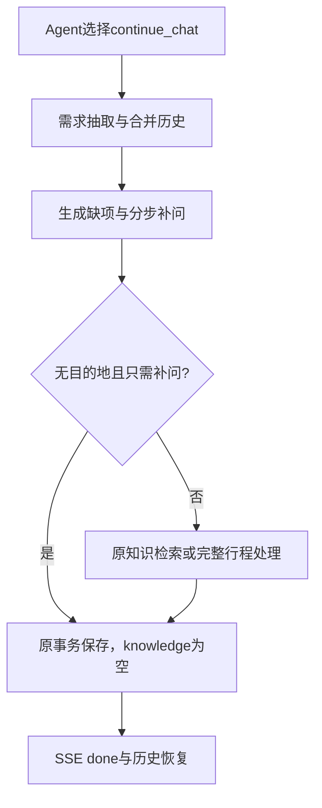

`chat/rag.is_knowledge_question`由聊天分流与RAG共用，问号不再单独构成知识问题。`process_saved_message`仅在needs_clarification、目的地为空且无知识问题时跳过检索上下文；混合门票、景点等外部事实不被吞掉，首次给出目的地的简介行为不变。仍执行原Agent工具发现和需求抽取，不承诺无需模型或地图连接。

无新表、字段、主外键、约束、索引或迁移。原response_json保存需求、clarification、status及knowledge=null，沿用归属、版本、幂等及整轮原子保存。正式服务只读取backend/.env，以README中的uvicorn工厂命令启动，日志在temp/logs。

验证：完整后端584项通过、2条既有警告、91.49秒，含真实隔离PostgreSQL/Milvus；固定题库已恢复且无排除项。mypy 78文件、修改范围Ruff通过。真实模型原句及两种改写均给出规划补问；HTTP/SSE两轮正确保存上海出发、自然风景、两天，历史revision=2且重试返回原快照，专用账号/会话已清理。未新增浏览器视觉验收，旧错误轮次保留原始历史。

### 10.28 确认稿对话页接入（2026-09-17）

**行程展示更新（2026-09-20）：** `useRequirementConversation.showTurn` 从该轮已保存的 `response.result.extraction.origin` 取出发城市，随消息传给 `App.vue → ItineraryCard.vue`。起终点作为主标题，人数/住宿晚数来自同份预算快照，日期来自同份plan.days；缺失出发地或日期明确显示待定，不回填当前需求或伪造历史值。逐日时间线连续展开，按天定位限定当前组件；宽卡片侧边显示预算，窄卡片通过容器查询改为上下排列。来源原文、地图坐标/链接、预算与警告仍直接使用快照，查询继续emit到输入框，撤销继续走既有版本检查接口。仅新增前端消息展示字段，无HTTP合同、数据库表或迁移变化。验证包含前端回归、类型/构建及正式组件隔离样例桌面/手机检查，不代表新一轮真实模型或真实账号验收。


`App.vue`接入已确认的淡绿侧栏和暖白对话区，`chat.css`限定对话样式，`ChatIcon.vue`复用线条图标。左侧包含新建、按日期分组的历史、搜索已加载列表及三点操作；左下角完整显示账号名，管理员另有知识库入口，服务端权限不变。新建仅清空当前选择，首次发送才创建数据库会话。空状态显示品牌、短句“这次，想去哪里？”与紧邻的居中输入框，不再显示推荐按钮和底部宣传小字；发送后消息独立滚动、输入框位于底部；原有流式过程、错误重试、景点/餐馆/行程及撤销继续使用原组件和状态。

重命名新增`SessionRename`、`TripService.rename_session`和`PATCH /sessions/{session_id}`：仅接收title，去首尾空白后校验1～200字符；当前账号由Cookie获得，事务内按会话和user_id查找并锁定。只更新已有title，不变更updated_at或历史消息，不新增表、字段或迁移。前端成功后采用响应名称，失败保留原名和弹窗；登录代数和列表代数防止迟到响应覆盖当前账号或改名结果。删除仍沿用已验收的整段删除接口。

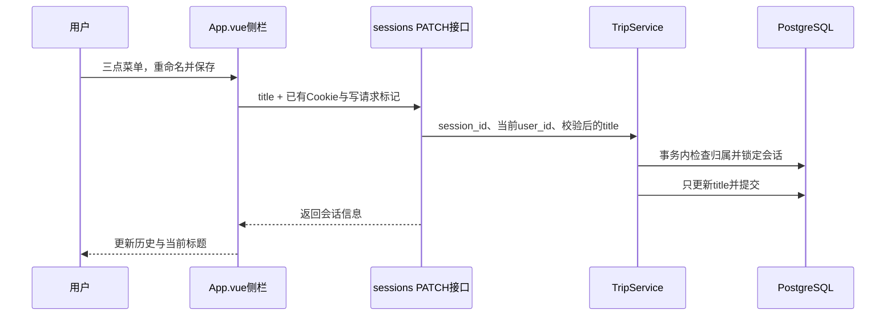

“＋”目前只展示私人资料上传未开放的提示，可粘贴攻略要点；不选择文件、不上传到管理员共享知识库。确认稿的示例回复、模拟身份切换和内存附件未带入正式服务。

验证：新增改名接口测试及原删除测试共8项在独立PostgreSQL测试schema通过；真实Vue组件配模拟HTTP的浏览器检查覆盖桌面/手机、历史改名删除、新建发送、完整姓名与附件状态提示。正式登录入口仍使用真实鉴权。本轮未使用真实用户调用模型，流式与会话回归通过情况见07本节记录。


### 10.29 统一对话上下文、话题状态与自然回答（2026-09-17）

持久化聊天不再让需求抽取、地图、RAG和行程各自裁剪历史。`chat/context.py`先从本人会话的已提交轮次恢复结构化旅行条件、最近旅行话题和最近有效摘要，再按revision旧到新构造连续角色消息。`requirement/extract.understand_turn`在一次结构化调用中返回需求增量、目的地动作、话题动作、当前查询城市、独立检索问题和回答方式；聊天编排据此选择`chat`、`map`或`plan`。

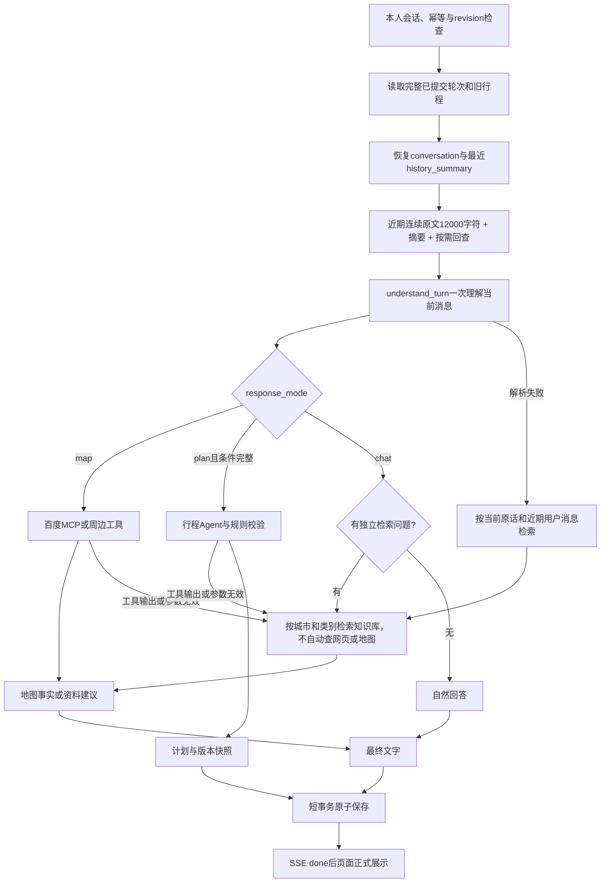

旅行目的地与咨询话题分开维护。`RequirementUpdate.destination`配合`destination_action=set/clear`只表示明确旅行意愿；`keep`时即使正在咨询杭州，也不覆盖已确认的苏州目的地。`conversation.topic_cities/topic_places`保存最近旅行话题，普通闲聊默认保留，明确清除才写入空列表。`query_cities`只约束当前地图或检索范围，`retrieval_query`是当前问题补全后的独立表达。检索文章、旧助手建议、公开流式草稿和工具原文均不能更新用户旅行条件。

历史输入使用字符数近似预算，不是精确token计数。近期窗口为12000字符并保留连续后缀；最新轮超过预算时保留用户原话，只截断最终助手回答并标记。页面可见景点、餐馆按顺序附上城市、名称和地点编号，帮助理解“第一个、附近”。较早轮次按覆盖版本连续组成单个摘要批次，每次请求至多调用一次摘要模型，批次总量上限12000字符，摘要正文最多2000字符。摘要失败不清空旧摘要、不推进覆盖版本，也不删除完整原文。`build_recall_messages`调用`recall_history`，最多选择3个命中及相邻轮，排除近期窗口重复后合计不超过6000字符；回查只证明对话里说过什么，不证明旧实时信息现在仍有效。

模型配置为`deepseek-v4-pro`；[DeepSeek官方价格页](https://api-docs.deepseek.com/quick_start/pricing)列出的上下文窗口为1M。应用另设更保守的64000个序列化字符总输入上限，这不是token计数，输出仍为2048 tokens。`llm/budget.py`计算消息、系统提示和实际工具schema的序列化体积；`budget_messages`完整保留必要系统/状态与当前用户原话，只按连续整轮裁剪较早普通历史，并插入省略标记。`llm/client.py`的文本、JSON及修复重试每次都重新检查；地图和行程Agent中间件也在每次调用前连同工具说明检查，工具调用和对应结果不拆分。若工具内容使主入口超限，改走自然回答并明确没有完成该查询；若必留状态自身无法无损容纳，则停止本次模型调用，已保存历史保持原样。

`requirement_turns.response_json`继续保存完整`RequirementChatResponse`，新增的是JSON子字段，不新增数据库列：

| JSON路径 | 类型、空值与默认 | 保存与覆盖语义 |
|---|---|---|
| `conversation` | `ConversationState \| null`，旧快照缺字段按null读取 | null表示旧版未保存；对象表示该轮完成后的旅行话题状态 |
| `conversation.topic_cities` | `list[str]`，默认`[]`，最多4项 | 显式空列表表示已清除，不能从更早非空状态恢复 |
| `conversation.topic_places` | `list[str]`，默认`[]`，最多20项 | 保存最近话题中的地点，不代表已加入行程 |
| `history_summary` | `HistorySummary \| null`，默认null | 只在摘要实际更新的轮次保存；恢复时取本会话最近非null值 |
| `history_summary.text` | `str`，默认空字符串，最多2000字符 | 空字符串仍可与覆盖版本组成有效摘要，不等同null |
| `history_summary.covered_revision` | `int`，必填且`>=0` | 只由程序按完整处理的最后轮次赋值；失败或冲突不推进 |

`response_json`原有`result/reply/status/changed_fields/knowledge/dining/itinerary/mcp`保持兼容。话题、候选摘要、最终回答、可选行程与版本检查在同一轮短事务提交；相同`message_id`重试直接返回原快照，不再调用模型或工具。没有新表、列、主外键、唯一/检查约束、索引或Alembic迁移。

自然回答由`chat/conversation.py`接收系统规则、不可信参考JSON、连续历史和末尾唯一一条当前用户消息，用于普通闲聊或资料结构化失败的降级。知识库可补充模型的一般建议；已成功生成的资料回答直接返回导语与景点列表，不再扩写第二份介绍（见10.31）。没有资料或可选检索失败时仍可回答一般知识，但实时价格、开放时间、地址、评分和路线耗时必须依据本轮工具结果，未查询就说明未核实，不自动网页补查。结构化JSON因输出截断或格式不完整产生ModelOutputError时可自然降级；网络、超时、鉴权和HTTP错误属于真实调用失败，继续向上报错。理解JSON连续两次无效时保留旧状态，以当前原话和近期用户消息检索资料，将实际片段传给自然回答，不生成猜测城市的地图卡片。已识别的旅行问答缺少检索词时使用当前问题，不因超出行程天数而取消检索；地图或行程工具的无效输出仍转资料建议，不提交无效行程。

地图地点核对排除公交站、入口、停车场等附属对象，省市前缀只有在主体后缀和地址同时印证时才接受。真实百度样例中“西湖”命中风景区，“同里国家湿地公园”命中“江苏同里国家湿地公园”；这是指定样例证据，不代表所有同名地点均已实网覆盖。

JSON模型调用完整读取，并将历史按原角色、原顺序包装为待分析材料，防止自然语言历史被当作JSON输出示范；包装后仍检查总输入预算。地图和行程Agent的已提交历史也放在任务材料中，本轮工具调用和ToolMessage保持原生角色。最终自然正文继续流式输出。

前端输入框点击发送同步清空，失败且输入仍为空时恢复原话，任何完成事件均不覆盖新草稿；pending继续保存重试编号。过程区显示实际知识库片段数，未命中或不可用时如实说明。

前端`ThinkingProcess.vue`以单行呼吸灯展示最新真实progress，生成中和完成后均默认折叠，用户可展开处理步骤；不展示回答草稿。内部样式由组件自身持有，父页面`chat.css`只负责排布，避免父级scoped作用域遗漏组件内部。SSE仍兼容接收草稿，但`App.vue`不向展示组件传递；草稿和进度不写入`sessionStorage`或服务端历史，刷新只恢复最终结果。`markdown.ts`使用MarkdownIt，`html=false`、禁用图片，不启用自动链接；最终正文始终独立展示，再显示景点、餐馆或行程卡片。此显示调整已通过前端回归、类型检查和构建，尚未新增真实聊天浏览器验收。

最新自动验证见07顶部：初步验收修补后，后端完整套件使用真实PostgreSQL隔离schema，`657 passed, 2 skipped`（两项缺少专用Milvus测试地址）；修改范围Ruff及83个源码文件mypy通过，前端发送流、登录回归及生产构建通过。前一轮统一上下文验收还覆盖了SSE/页面SSR/Markdown安全，以及专用PostgreSQL schema的真实长对话：先写入30轮，再用真实模型完成三轮，revision 31的摘要覆盖到第13轮，近期从第18轮开始，明确记录第14～17轮未覆盖缺口；按需回查原话恢复“不想爬山”并避开虎丘；revision 32改为杭州后仍保留偏好，摘要推进17且近期窗口无缺口；revision 33清空目的地和话题列表仍保留偏好。新服务逐轮读取一致，同编号重试不调用Mock模型，原30轮JSON逐字未改。

本轮另读取用户原有历史，使用正式模型、PostgreSQL、Milvus、网页及百度服务重放，不写入用户会话：杭州问答最终输入含《杭州攻略-LvBanGPT.pdf》的3段引用、8条网页依据和3张核对卡片；具体店名追问实际返回灵隐寺附近5家餐馆。知识库检索与实时地图增强分别记录；本轮没有新增浏览器人工验收记录。

浏览器在临时18080和隔离schema中连接真实模型、百度、网页服务并以Milvus空结果运行：“想去苏州”后追问“推荐热门景点”，得到苏州建议以及地址匹配的拙政园、苏州博物馆、狮子林卡片；`details`中的过程草稿已目视检查。刷新并重新进入规划页恢复原两轮和卡片，没有重新生成，过程没有持久化。这里只把上述样例记为真实服务验收；C01～C24中的其余项包含自动化替身边界。新会话独立回答算术问题，切回苏州会话后原文及卡片未受影响；专用QA schema已清理。用户查看效果使用正式backend/.env的8000后端与5173前端，PostgreSQL、Milvus就绪，保留运行中服务和日志。

### 10.30 地图按需调用与可展开参考资料（2026-09-18）

`chat/rag.ground_chat_response → document/answer.answer_from_sources(resolve_locations=False)`用于普通旅游咨询。资料模型仍可生成有依据的景点介绍，但程序在工具执行前清空map_queries，不调用supplement_maps，不进入逐景点地址/门票补查和地图后第二遍生成。明确地图问题继续由`response_mode=map → handle_nearby`执行百度工具，完整行程规划继续由行程Agent核对；管理员资料问答等既有调用的resolve_locations默认True，合同保持不变。本策略替代历史10.9中“普通聊天每张景点卡片都要定位”的做法。

MapLookup.status增加字符串枚举`not_requested`，表示本轮没有请求地图定位；普通卡片location仍为非空对象，provider=baidu、坐标/地址/POI编号为空，map_lookups为空列表。该对象的checked_at沿用模型默认生成时间，此状态下不代表查询时间。它与unconfigured、no_match、ambiguous、error分别展示，不能把未查当成匹配失败。旧快照状态不重写，仍可读取。本步没有新增数据库表、列、外键、索引或迁移，新增枚举及参考原文仍保存在requirement_turns.response_json。

`natural_chat_response`在结构化输出失败时保留实际传入的sources；历史快照兼容网页，新聊天不再搜索网页（见10.31）。knowledge.status可以仍为insufficient、points为空、attractions为空；有参考资料不意味着每句自然正文都通过引用核验。`useRequirementConversation.showTurn`在完成发送和历史恢复时保留knowledge；App把它交给AnswerSources，按需展开文件、页码、章节和纯文本原文，网页链接只允许HTTP(S)。AttractionCards显示来源编号；not_requested且没有原文地址时不显示地址栏，有原文地址时标明未经地图查询。客户端展开来源只读取本轮快照，不发起检索或地图调用。

已验证后端660项通过、2项跳过，前端回归、类型检查、生产构建通过；真实模型“想去深圳”生成3张卡片，地图连接与查询0次，本次结果选用网页依据而没有本地引用。浏览器完成组件数据的折叠、页码、原文和无地址失败提示验收；不宣称新增真实地图匹配验收。完整边界见07顶部。

### 10.31 知识库选材与单份景点列表（2026-09-18）

**调用链：**`understand_turn → ground_chat_response → DocumentSearchService.search → answer_from_sources → 保存快照 → 展示`。结构化资料回答成功后，直接使用points作为导语、attractions作为景点列表，不再接一次natural_chat_response重复扩写。自然聊天及格式降级仍保留已有路径和真实参考材料，输出错误不会因本步重新成为用户提问门槛。

**理解与检索契约：**TurnUnderstanding新增`retrieval_category: Literal["景点", "餐馆", "住宿"] | None = None`，含义是当前知识问题类别，不是旅行目的地或用户偏好。模型在原有理解调用中填写，缺失兼容为null；跨类别问题不强制分类。该字段仅请求内传递，不新增数据库字段或迁移。`DocumentSearchService.search`新增关键字`include_general=False`：只有调用方显式开启且填写category时，允许该类别或category为空的综合攻略；owner、city、parsed状态限制始终保留，管理接口原有严格筛选不变。

**标题与选材：**独立标题不直接作为回答证据；服务回查同一文档、相同标题路径、order恰好加1的正文，返回正文实际chunk编号/页码/字符范围，沿用标题相似度并按正文去重。没有对应正文则跳过，不跨下一景点补接。聊天每次最多召回20段，剔除纯来源网址，在召回范围内先按文件交替，再按城市交替，合计最多5段。不用文件名硬塞引用，不保证固定文件每轮都出现；专类沙盒文件仍不能证明现实票价和开放时段。

**外部调用：**聊天入口不向任何下游开放网页能力，普通RAG、特色餐饮、结构化失败兜底均不搜索网页；规划Agent不绑定web_search，仍可按需调用知识库和地图。地图、周边商户与路线按既有语义路由执行，普通介绍仍为resolve_locations=False、map_lookups=[]。网页客户端及旧快照格式保留用于既有独立能力与历史读取，不能据此认为聊天仍会联网搜索。

**回答展示：**普通推荐的points只负责短导语，attractions负责逐处介绍，clarification放在列表之后；只问文字知识或自然兜底时仍正常展示Markdown。未请求定位的景点采用无大边框列表、编号、城市标签和来源角标；地图结果卡片保留操作链接。来源按document_id分组，同名不同文件不合并；展开后显示每段原编号、页码、章节、转义后的原文，旧网页仅作为历史证据展示。所有展示使用保存的响应，展开和刷新不重查工具。未通过票据校验只删除介绍中涉及收费的完整句子，不清空其他已知看点；普通推荐不因此追加地址/门票补问，真正缺信息的模型补问仍可保留。

**验收边界：**真实PostgreSQL、Milvus及DeepSeek试跑使用内存提交替身，不写用户历史；杭州泛问能将景点文件送入模型，但并不强制引用；明确问西湖和大运河时实际引用`杭州-景点-ChinaTravel.md`及杭州攻略PDF，网页/地图调用0次。浏览器以真实响应快照和生产组件检查紧凑列表、文件分组与原文展开；不将组件验收记为正式用户对话提交。

本步最终验证：后端全套`667 passed, 2 skipped, 2 warnings`，两项跳过因未设置专用Milvus测试地址；使用backend/.env的真实PostgreSQL隔离schema。修改范围Ruff、83个源码文件mypy、前端发送流/登录回归、Vue类型检查和Vite生产构建全部通过。无数据库迁移、无原资料重建、无用户会话修改。

### 10.32 混合检索与同节原文展开（2026-09-20）

调用关系：普通问答`chat/rag.py`和行程`itinerary/tools.py::knowledge_search`共用`DocumentSearchService.search`；原文展开只由行程图按需调用。本步不增加SQL表、字段、约束、索引或迁移，沿用已有documents/document_chunks及行程JSON快照；不重建或清空Milvus。

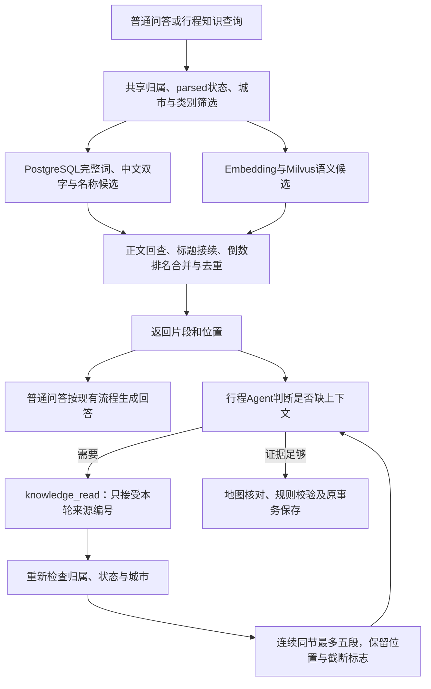

**词法与融合：**不引入分词服务；用完整词和中文连续双字补充向量召回，常见问法词作为拆分边界，最多64个不同词。城市只从独立词中排除，保留“苏州博物馆”这样的完整专名。识别末级标题中的“名称｜记录键”和“城市｜名称｜主题”；明确点名的完整名称优先，较长的具体名称优于其父地点。一般片段须命中完整词或至少两个双字词，避免单个双字巧合。SQL参数绑定且LIKE字符转义；最多200个词法候选。两个通道按同分同名次的倒数排名融合（分母60加名次，语义权重1、词法1.1），完整名称另按长度提升，不能把score当余弦值使用。去重保留真实正文自己的编号与位置。

**故障与范围：**新通道使用与语义相同的归属/parsed/城市/类别/资料编号限制；不允许由工具参数指定其他归属。正文已切分但尚未建向量也可词法命中；Embedding或Milvus运行异常时，若已有词法证据则返回这些证据，无词法证据保留原异常供聊天降级。构造服务时的数据库和模型配置要求沿用原依赖层；本步没有实现完全无Milvus配置的运行模式。通道降级不代表取得实时事实，不改变门票、开放时间与路线核对边界。

**原文读取合同：**内部`read_context(chunk_id, metadata)`返回`{file_name,items,truncated}`，items为原有DocumentChunk，最多五段、正文最多4000字；truncated为非空布尔，表示同节还有未返回片段。围绕命中点保留连续同标题路径片段，同名标题再次出现也中止；无标题仅同一section_order，不跨原文页/段。未知、其他归属、停用或异城片段统一404。`knowledge_read(source_id)`只接受本轮共享检索或此前展开返回的编号，外部UUID及旧草稿编号不能直接授权读取；不可用片段转换为工具错误，模型可在剩余额度中重新检索。输出sources保留文件名、正文、资料/片段编号、页码及标题路径；与新检索不同，展开重遇已读片段会复用编号。

**行程JSON合同：**新增的PlanSource.document_id、chunk_id、page_number默认null，section_path默认[]，具体类型见10.23数据字典。字段随itineraries.itinerary_json及requirement_turns.response_json原快照保存，旧记录不回写，也不依赖这些字段恢复原行程。模型决策仍最多六轮，检索/展开/地图等共用十二次查询；仅有本轮共享来源时才开放knowledge_read。普通聊天继续现有回答流程及自然回答降级，不强制引入多轮Agent。

**验证边界：**最终后端全量795项通过、0跳过，使用真实隔离PostgreSQL及Milvus，模型按用例替换，两条既有依赖警告；mypy 94文件及修改范围Ruff通过。审查修复短名称问句和相邻同名章节越界，独立27项回归通过。真实共享库只读比较四个问题：苏州博物馆从第4升到第1，西湖游船和灵隐寺保持第1，老人轻松游的前五候选不变；同查询复用一次真实Embedding，旧检索27～89ms、新检索156～238ms，不含Embedding、不是稳定性能基线或总体正确率。真实展开同一文件两段、317字。Agent主动调用新工具目前由原生框架及模型替身闭环验证，本次未宣称真实模型/浏览器端到端验收。

**运行交付：**正常关闭旧8000后端后按README命令重启，live/ready均返回200，PostgreSQL和Milvus均ready；运行OpenAPI已加载四个新增来源定位字段。该检查证明服务已加载修改，不替代真实模型/浏览器端到端验收。运行日志位于`temp/logs/retrieval-backend-20260920-152723*.log`，保留供当前服务使用。

## 11. 后续如何同步维护本文

本文是持续更新的当前架构说明，不另建一份新的阶段架构文件。后续每个涉及架构的开发小步，在交付前同步检查：

1. **增加或拆分模块**：更新总体图、职责表和真实文件路径。
2. **修改接口或数据契约**：更新接口地图、请求字段、响应状态和调用顺序。
3. **改变会话或存储方式**：更新上下文来源、表关系、迁移文件、事务与刷新恢复说明。
   新增或修改表还须同步逐字段数据字典：字段名、数据库类型、中文含义、可空性、默认值、主外键、唯一/检查约束、索引、金额/时间单位及迁移版本。明确哪些来自参考、哪些已经实现、哪些已执行迁移。
4. **接入模型、工具或工作流**：更新外部调用链，明确哪些工作由模型完成、哪些由程序完成。
5. **完成运行验收**：更新核对日期和验证口径；区分源码已实现、测试通过、真实服务验证。
6. **替换旧流程**：改写对应的当前描述，不能只在末尾追加新结论却保留相互矛盾的“当前行为”。

07文件继续负责开发顺序、逐文件功能与教学说明；08文件负责整体结构与模块关系。源码和文档冲突时，先核对当前源码与运行证据，再修正文档。

此维护要求是在后续开发交付时同步执行，不表示存在后台自动监听或定时任务。

## 12. 私人附件现状、文件替换与后续智能体设计

核对日期：2026-09-20。账号、会话归属和共享知识库字段见第7.5节；M4-A文本行程与撤销见10.23，D附件字段见12.5，M4-B用途与同图规划见12.12。文件替换及M4-C继续作为目标；识别成功本身不等同行程修改。产品和交互详情见[09方案](./09-双角色与对话附件改造方案.md)。

### 12.1 职责与调用链

| 边界 | 目标调用顺序 | 复用与新增 |
|---|---|---|
| 登录与身份（已实现） | 注册/登录 → 密码校验 → 服务端登录态 → 后续请求解析当前用户 | users/auth_sessions及身份依赖 |
| 私人会话（已实现） | 当前用户 → sessions.user_id归属检查 → 历史/需求/草稿服务 | 复用sessions、requirement_turns、travel_requests、itineraries |
| 管理员知识库（已实现） | 管理员校验 → 上传/两标签 → 解析/切片/索引 → 共享知识库 | 复用services/document；不按上传管理员划分可见文件 |
| 用户附件（D及本轮M4-B已实现） | 当前用户与会话校验 → 原件保存 → 文字/图像理解 → 本轮用途 → 地点核对与同图规划 → 轮次/草稿快照 | 附件业务和视觉适配器；文字读取复用parser，不调用chunker/向量入库；用途不明或仅读取时保留草稿 |
| 知识问答 | 聊天业务判断需要知识 → 服务端knowledge-base检索 → 校验依据 → 保存轮次 | 检索业务保留；纯条件修改/附件识别不再强制访问Milvus |

目标关系：一个users对应多个sessions和auth_sessions；一个sessions对应多个requirement_turns、travel_requests、itineraries、conversation_attachments。知识库documents不属于旅行会话，uploaded_by仅记录上传管理员；documents继续拥有chunks和job。管理员不能越过sessions.user_id读取别人的私人附件。

第2节三张静态图保留M1～M3基础，2.5及10.23展示M4-A源码；D数据流见12.5，M4-B同图数据流见12.12，M4-C仍是目标。

### 12.2～12.4 已落地的账号与会话归属

users、auth_sessions和sessions.user_id的实际字段、NULL、默认、主外键、CHECK和索引见第7.5节。0008先允许旧会话user_id为空，0010在孤立会话仍存在时拒绝收紧；本次用户已授权删除全部32条旧本地会话；已备份并清理32会话、42轮次、2需求、2草稿，保留32资料与24101片段，随后在真实库应用0010。

### 12.5 conversation_attachments（D已落地，2026-09-18）

| 字段 | PostgreSQL类型 | 可空 | 默认值 | 含义 |
|---|---|---|---|---|
| id | UUID | 否 | 应用uuid4 | 附件主键 |
| session_id | UUID | 否 | 无 | 外键sessions.id，归属当前旅行会话 |
| file_name | VARCHAR(255) | 否 | 无 | 去除目录后的展示名 |
| storage_name | VARCHAR(50) | 否 | 应用生成UUID加允许扩展名 | 私人目录中的存储名 |
| mime_type | VARCHAR(100) | 否 | 无 | 校验后的文件类型 |
| size_bytes | INTEGER | 否 | 无 | 文件大小，字节；PDF为1～30000000，其他类型1～10485760 |
| content_hash | VARCHAR(64) | 否 | 无 | 原件SHA-256，去重与完整性核对 |
| status | VARCHAR(30) | 否 | 数据库'uploaded' | uploaded/ready/needs_confirmation/failed |
| analysis_json | JSONB | 是 | NULL | 文字/路线识别结果，未识别为空 |
| parsed_json | JSONB | 是 | NULL | 0013新增：私人附件完整解析缓存，包含parser_version和document；不返回到附件列表或每条历史快照 |
| error_message | VARCHAR(500) | 是 | NULL | 失败原因；不给前端异常堆栈 |
| created_at | TIMESTAMPTZ | 否 | 数据库now() | 上传时刻 |

主键id；storage_name唯一；(session_id, content_hash)唯一，只在同会话去重；(session_id, created_at)索引用于读取，查询另以id稳定排序。session_id外键sessions.id，默认限制删除。迁移0011_conversation_attachments接0010，0012调整PDF大小，0013_attachment_parsed增加完整正文缓存；本机已应用。0013不新增主外键、索引、唯一或检查约束，parsed_json内容由应用校验。没有processing、updated_at和处理超时索引：当前同步识别，成功/失败才写状态，进程中断仍可重新发送。

大小CHECK由0012_private_pdf_size替换：size_bytes必须为正，mime_type='application/pdf'时最多30000000字节，其他类型最多10485760字节；哈希长度64、status限定枚举；uploaded时analysis_json和error_message均SQL NULL；ready/needs_confirmation时analysis_json为JSON对象且error_message为空；failed时error_message非空、analysis_json为空。JSONB使用none_as_null=True。迟到失败不覆盖已有成功结果，历史快照保持独立。

2026-09-18 PDF上限调整：前端及服务端均允许私人PDF最大30MB（含上限），表单接收上限为30000000字节加64KiB，再按已校验类型检查实际文件大小。其他附件维持10MiB，公共知识库资料20MiB不变。本机备份public后应用0012，结构检查无差异；53项相关回归、Ruff、mypy 91文件、前端附件检查与构建通过。真实5173代理上传19,574,663字节《长沙.pdf》返回201，数据库保存及原件回读哈希一致，专用验收数据已清理，正式后端已更新。该PDF提取到21,689字，第1页无文字；本次验证上传和解析，未调用模型，不代表扫描页已识别。

analysis_json（2026-09-20核对）：city为可空字符串（1～100字）；summary为1～3000字；waypoints最多300项，每项name为1～200字、order为可空1～100整数、evidence为1～1000字、needs_confirmation为布尔；warnings最多30个字符串。数组默认空；不接受额外模型字段。只有所有地点编号按出现次序连续从1起才保留顺序；重复、缺失或不连续时统一置null并提醒确认，不让多路线攻略整份失败，也不擅自重新排序。无箭头或文字顺序使用null。文字的city/name/evidence须出现在原文。所有识别地点由程序标待核对，尚未调用地图，不保存matched_place或虚构坐标。扫描和错码PDF优先由MinerU页面OCR处理，图片页由Qwen补读；parser_version由程序标注，完整正文保存于parsed_json，详见12.15。DOCX内嵌图片、动画、多页图仍不完整支持。未启用MinerU的旧文字路径仍有24000字上限。

前端附件调用链（2026-09-18）：加号菜单选择或输入框drop → 同一个addAttachments执行格式/大小/数量检查 → 创建本人会话（如需）→ 上传原件 → 卡片展示服务端名称、size_bytes和已上传状态 → 用户补充文字并发送 → 原识别及快照流程。拖入不会自动调用模型，窗口文件drop防止误导航，普通文字/链接拖动保持浏览器行为；跨会话、退出及迟到上传仍由原generation隔离。输入框和消息复用AttachmentFileCard，卡片可打开原件；用户已发送附件位于对应文字气泡上方并右对齐。旧快照缺少大小时读取当前会话附件元数据补齐，仅补展示字段，不覆盖历史识别结果；元数据不可用时省略大小，不伪造大小。无数据库迁移。验证和真实模型局限见07本轮记录；原历史失败快照不改写。

附件表不放message_id外键，上传不调用模型；请求SavedRequirementMessage.attachment_ids默认为[]、最多3个不同UUID。2026-09-20消息合同补充：message最长6000字，有附件时允许空字符串；没有文字也没有附件返回422。原话字段保持真实空值，不自动填写读取指令；首次会话标题可取附件文件名。响应response_json.attachments默认[]，保存{id,file_name,size_bytes,analysis,error_message}快照；size_bytes为可空正整数，默认null，旧历史自动兼容，不补跑模型；这是JSON快照字段扩展，不新增表列或迁移。保存时再次检查全部id属于当前会话。相同message_id但文字、前置版本或附件列表不同返回409；已提交重试返回原快照。识别结果可以先缓存到附件表，消息冲突不会修改旅行条件、行程或已有消息；并发未提交请求仍可能重复调用模型，不承诺恰好一次模型执行。

上传路径为POST /api/v1/sessions/{session_id}/attachments；同路径GET列出附件，GET /{attachment_id}读取详情，GET /{attachment_id}/content下载原件。每条路径使用require_session_owner，管理员也不能读取他人附件；文件放在temp/uploads/conversations，UUID文件名与展示名分离，无静态目录。默认以attachment disposition下载；卡片使用?preview=true，仅已校验PDF/PNG/JPEG/WebP改为inline。所有原件响应设置no-store与nosniff，PDF内联CSP为default-src none、object-src self、frame-ancestors none，其余使用sandbox、default-src none、img-src self。PDF实际展示由浏览器查看器支持，本机内置验收浏览器未完成页面渲染验收。正文解析复用parser，不调用DocumentService或索引流水线。


删除先取得同会话的PostgreSQL事务咨询锁，再锁sessions，写入私有.delete-{session_id}.json清理记录，记录本人编号及服务端文件名，再在事务中删除消息、行程、需求、附件记录和会话。提交后清原件，成功后删除清理记录；数据库失败不清原件，磁盘失败记录保留，本人可重试。cleanup_attachment_files命令取得相同咨询锁，再读取清理记录、确认数据库会话不存在、删除原件和记录，锁覆盖整个清理过程，防止旧记录覆盖并发删除的新清理依据；存在会话直接跳过。未发送附件自动24小时清理仍未实现，不将正在使用的uploads视为临时日志。

真实验收：本机先备份public（temp/backups/d-attachments-20260918/before-0011.dump），再应用0011且check无结构差异。专用QA会话通过真实百炼qwen3-vl-plus识别“断桥→白堤→孤山”及1/2/3顺序；HTTP核对保存、历史恢复、相同消息重试不增轮次、换附件409，行程保持空。浏览器在独立5174/8001验收上传、附件单独发送、结果及原件链接、刷新后重新进入恢复。文字模型另验杭州路线；无箭头图片返回null顺序和模糊点待确认。此为少量定向样本，不代表广泛视觉准确率；图片证据及概述仍可能误读，警告中仍可能出现候选名称猜测，M4-B需地图与用户确认后才能据此改草稿。

自动检查：真实隔离PostgreSQL/Milvus全量713 passed、0 skipped、2 warnings（Starlette弃用别名及LangChain MCP beta提示）；mypy app 91文件、修改范围Ruff、前端attachments/requirement-stream/landing-auth三组Node检查与Vue/Vite生产构建通过。复审及真实数据库锁等待测试覆盖删除失败恢复和并发清理。正式8000后端已更新，PostgreSQL/Milvus就绪，正式HTTP核对附件路由与两轮历史快照通过；仅清理本轮QA账号、会话、原件及已关闭的验收临时产物，迁移前备份保留。

### 12.6 共享知识库已落地字段

当前documents.city/category/uploaded_by/owner_id及旧source/review_status/poi_id档案列见第7.5节。0009规范城市末尾“市”，只依据文件名唯一明确出现住宿、景点或餐馆时回填类别，混合文件维持NULL。共享范围改写脚本复用现有向量编号和值，不调用Embedding；维护窗口锁住资料和任务、写入待确认JSON日志、逐批读回，再提交PostgreSQL范围。旧local-demo资料存在时资料接口返回503；本机已实际迁移32份资料和22685条向量，逐项核对编号和值后提交PG，未重新Embedding。

### 12.7 轮次、需求与行程版本（复用，目标契约扩展）

不新增messages或第二套trips/days主表。M4-A在requirement_turns.response_json.itinerary内保存行程编号、版本和计划，见10.23；D增加请求attachment_ids和响应attachments识别快照，见12.5，旧快照按空列表兼容。M4-B增加可空的attachment_use、attachment_request_ids和私人来源字段，见12.12。子字段由Pydantic和业务检查，JSON中的行程编号不是新的数据库外键；itineraries已有(request_id, session_id)复合外键继续保证草稿与需求同会话。

后台仍保存并合并结构化需求；前端去掉RequirementPanel不删除该数据。生成草稿必须先通过逐日活动格式、日期/人数/预算约束；本次不把现有“JSON为对象”检查当作完整行程校验。金额沿用Decimal字符串约定。

最终保存时锁会话、核对expected_revision及草稿基础版本，在同一事务提交轮次、需求快照、草稿新版本和会话updated_at。模型/地图调用置于事务外。复用(session_id, message_id)幂等及(session_id, revision/version)唯一约束；同message_id但正文或附件集合不同返回409。服务失败不留下半轮或半份草稿；识别成功但需追问可保存一轮待确认结果而不生成新草稿。

### 12.8 阶段状态与验证记录

0008账号与过渡会话归属、0009城市/类别/上传管理员、0010强制会话归属已在本机真实库执行，此前备份记录为`backend/data/runtime/backups/m3-roles-20260916-095334`；清理及范围迁移数量见12.2与12.6。2026-09-18备份public后应用D的0011附件表，随后0012放宽私人PDF至30MB，记录见07。M4-A/B复用既有JSONB，本轮M4-B无新迁移；文件替换F及M4-C仍待实现。

本机真实PostgreSQL/Milvus全量自动测试431 passed、1 warning（Starlette/AnyIO弃用别名），mypy app 68文件通过，前端build通过；Alembic check无差异。追加令牌过期断言后test_auth.py 13项通过，目标修改Python Ruff通过。管理员账号最初由部署流程初始化；后续按本次验收要求改为`admin / 123456`，并撤销此前管理员登录令牌。真实浏览器：普通用户登录后无资料菜单，新建两会话，发送“想去杭州”得到真实DeepSeek回答并使用Embedding/Milvus原文检索，自动标题、会话切换及刷新恢复通过；退出清空页面，管理员登录时历史为空、看不到普通用户会话。管理员资料按城市展开、文件名过滤与计数一致，当前文件默认752段片段预览、原文切换和紧凑完成状态通过。自助注册真实HTTP返回201并核对新会话owner；页面注册入口展示通过，未在本次声称页面提交验收。

### 12.9 五项补充涉及的数据合同（目标，尚未迁移）

**附件用途与撤销：**M4-A已保存修改前后行程版本、实际差异摘要和撤销幂等依据，实际字段见10.23。M4-B按轮次保存read/reference/required/replace/unclear用途及目标日，实际字段见12.12，不是附件永久标签。跨表JSON引用由服务核对归属，不冒充外键约束。

撤销接口以operation_id作幂等标识，携带expected_revision和expected_itinerary_version；只撤销最近仍有效修改。读取该操作保存的修改前行程及对应需求，在同一事务生成新需求/行程draft版本、撤销轮次及会话更新时间，不覆盖历史。新需求变化会使旧撤销入口失效；首次生成无可恢复草稿，不提供该操作。重复operation_id且参数不同返回409。撤销本身不调用模型或自动确认行程。

**批量标签：**复用city/category，不新增业务标签或任务平台。明确区分未提交字段与显式NULL；对选中ID逐份进行管理员授权、更新和结果反馈。失败任务批量重试复用现有document_jobs，不处理已经成功文件。

**切片质量：**现有document_chunks正文、标题路径和字符位置合同保留。超长地点记录仍需分段，不能为拼接名称而破坏字符范围；若需增加实体关联字段，先在小样本证明必要性再补迁移字典。本轮没有改变800字符上限或既有片段。

**文件替换F阶段拟增加documents字段：**

| 字段 | PostgreSQL类型 | 可空 | 默认值 | 含义 |
|---|---|---|---|---|
| document_family_id | UUID | 否 | 新资料由应用uuid4，替换复制原资料组ID；旧记录以自身id回填 | 关联同一逻辑文件的多个版本，不是新用户或会话ID |
| is_current | BOOLEAN | 否 | 数据库true；替换上传显式false | 当前可检索版本；候选新版与已替换旧版均为false |

保留documents.id主键及原chunks/jobs外键；document_family_id为分组值，不宣称外键。增加(owner_id, document_family_id) WHERE is_current=true的部分唯一索引，保证同知识库同组至多一个当前版本；普通(owner_id, document_family_id, created_at)索引用于管理员版本定位。status仍表达正文/删除状态，is_current表达检索版本，两个维度不互相替代。

替换先保存新document_id及片段，is_current=false；后台允许管理员处理候选版，但检索预筛选和原文回查都要求is_current=true。新版索引完成且读回核对后，事务锁当前版本、核对预期旧ID，先将旧版设false，再将新版设true；并发竞争或失败回滚，旧版保持可用。已提交切换的重试按同操作身份返回结果，不重复切换。旧版向量/原件暂保留但不参与新检索，后续物理清理另行执行。

现有(owner_id, content_hash)去重继续有效，重复内容返回提示，不为替换复制记录或静默切换其他资料组。此组字段、索引及切换数据迁移只在F单独创建；当前尚无该迁移和运行验收。

### 12.10 智能体当前状态与目标接入

2026-09-17重新核对：正式app通过LangChain 1.4.0 create_agent及LangGraph 1.2.11运行地图/周边查询和文本行程两类工具循环。周边Agent先决定查询餐饮/住宿、必要补问或continue_chat；普通问题再进入原需求/知识链，完整规划才进入行程Agent。没有checkpointer或interrupt。当前源码、JSON字典与验收分别见10.23/10.25，不能将M4-A等同完整M4交付。

当前聊天调用顺序：身份/会话与幂等/版本检查 → 读取统一历史与话题 → 显式附件由D读取，补问候选沿用紧接上一轮快照 → 统一理解当前消息和附件用途 → 附件读取/补问/同图规划，或普通地图、行程、资料回答 → 图外事务保存。附件理解失败保留条件和草稿，普通消息仍保留原有自然问答降级。整段会话删除是独立受认证HTTP接口，不开放给模型。D读取见12.5，M4-B规划见12.12；M4-C才增加独立审查、有限返工、人工暂停及持久恢复。详情见03第7节、09第13节。

当前`services/chat/dining.py`绑定周边标准工具、整理查询上下文并限制3轮决策；`services/itinerary/graph.py`绑定行程工具与框架中间件，不再手写StateGraph路由，`tools.py`包装证据查询，`rules.py`负责确定性校验，`schemas/itinerary.py`定义保存格式。`services/requirement/history.py`与`trip_service.py`承担事务、版本、本人会话硬删，不将这些规则交给模型。框架消息状态不持有数据库连接，客户端由业务调用传入，当前没有持久检查点；未来检查点也不能代替权限校验和业务表。

M4-C持久检查点的实际表名、字段和迁移方式，必须在选定兼容版本并核对官方schema后补入当前数据字典；本次不凭空宣称已建检查点表。恢复时仍验证user_id/session_id/thread_id关联，工具执行与业务提交保持幂等，不声称图重放自动带来“恰好一次”副作用。

### 12.11 首问登录与渐变页面（2026-09-16）

匿名首页使用青绿淡彩山景，登录弹窗使用淡绿底色。`App.vue`负责首问暂存、dialog、左侧历史导航及左下角账号菜单；`useRequirementConversation.initialize`支持首问登录后不恢复旧会话，仍由既有发送方法创建会话、锁定消息并保存。`api/http.ts`的登录代数继续隔离迟到401。默认管理员由显式部署命令初始化，应用启动不重置密码。

实际浏览器已验证匿名首页、首次发送弹窗、Escape保留输入、错误口令保留问题、admin六位口令登录后自动回答、右上角账号菜单与退出。普通用户六位密码已通过页面注册并触发自动续答。口令5/6/12/13位边界和默认管理员重复初始化由真实PostgreSQL测试覆盖。全量真实PostgreSQL/Milvus回归436项通过，mypy 68文件、修改范围Ruff和前端构建通过；390像素窄屏检查通过。临时注册账号和本轮浏览器验收会话在验证后清理。


### 12.12 M4-B 附件用途与同图规划（2026-09-20）

用户选择文件或拖入后仍只上传，发送时才识别。统一理解层同时判断本轮用途read（读取）、reference（参考）、required（地点都要去）、replace（替换指定日）或unclear（补问），以及是否明确要求生成/修改草稿。用途来自当前用户消息，附件原文与摘要均为数据，不是执行指令。不新增用途表或另一套规划器，普通旅行问答保留原有处理链。

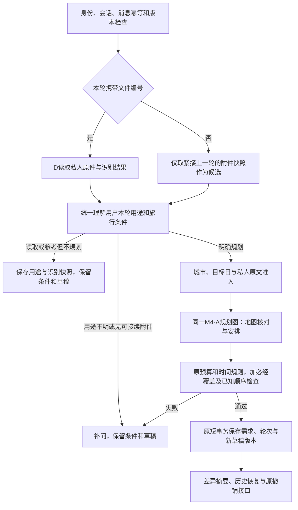

**数据字典（M4-B用途JSON扩展）：**此用途改造本身沿用0012；后续MinerU的0013解析缓存见12.15。以下用途字段没有新增SQL字段、索引或约束。以下字段通过Pydantic和业务规则检查，JSON引用不是数据库外键。原主外键、唯一约束和归属锁沿用7.5、10.23、12.5。

| 位置 / 字段 | 类型 | 空值、缺省与约束 | 含义 |
|---|---|---|---|
| 理解结果及`requirement_turns.response_json.attachment_use` | object或null | 可空，默认null，旧历史可读 | 当前轮用途，不永久写回附件 |
| `attachment_use.mode` | string枚举 | 非空，默认unclear；read/reference/required/replace/unclear | 读取、参考、必经、替换或待澄清 |
| `attachment_use.apply_to_plan` | boolean | 非空，默认false | 只有本轮明确要求规划才进入图 |
| `attachment_use.target_days` | integer数组 | 非空，默认[]，最多5项；每项严格整数1～5 | 目标旅行日；replace要求已有草稿，单点替换可由程序定位目标日 |
| `attachment_use.target_places` | string数组 | 非空，默认[]，最多12项，每项2～80字符 | 被替换的旧景点完整名称；必须在旧计划唯一匹配，其他活动及时间不变 |
| `response_json.attachment_request_ids` | UUID数组或null | 可空，默认null，最多3项 | 原始请求编号；隐式沿用为[]，旧历史null时用attachments编号比较重试 |
| `response_json.attachments` | AttachmentSnapshot数组 | 原有，默认[]，最多3项 | 本轮实际使用的识别快照；补问可沿用上一轮 |
| 行程活动`place.sources[].kind` | string枚举 | 非空，knowledge/web/attachment | 增加私人附件来源类型 |
| 行程活动`place.sources[].attachment_id` | UUID或null | 可空，默认null | 私人来源对应本会话附件，其他来源和旧历史为空 |
| 私人来源的`id/title/text` | string | 非空，沿用PlanSource合同 | 编号为附件UUID加地点序号，标题是文件名，正文是地点名与原文依据 |

**调用与边界：**`chat/service.py`把识别快照和本轮理解交给`chat/attachments.py`；后者按用途读取、补问或调用已有`itinerary/graph.py`。`itinerary/attachments.py`拒绝明确异城、缺失识别、空必经点、不完整名称、超过12个必经点及不适用的目标日；多城市文档city=null时，参考/替换按用户目的地选候选，每个入选地点仍必须通过同城地图核对，required则先确认城市。局部修改要求原目的地、天数、开始日期兼容。模型给出的目标日与本轮程序解析范围冲突时拒绝，不能覆盖要求保留的日期。required地点全部核实地图；replace选用点核实后提交，程序核对同一附件证据、指定日范围及明确1..N顺序。顺序未知按地点清单使用，保留原提醒，不宣称恢复了路线顺序。参考不要求全部采用。

已有地图点可以复用，但附加来源在副本中合并，不修改旧计划。来源不进入documents、片段或Milvus。需求缺项时先补问；已有草稿的失败修改恢复原条件，原行程不变。新建草稿尚缺条件时保留用户本轮明确给出的条件以便补齐。附带文件但用途理解失败只读取并补问，不生成草稿。补问只自动接续紧接上一轮的附件，普通无附件轮结束后不继续隐式沿用；需要再次使用时重新选择文件。保存时再次检查附件所属会话，撤销沿用原版本合同。

**本轮验收修复：**明确要求根据本轮所选附件做攻略时默认reference并规划，不再重复追问用途；人数、天数、目的地或总预算缺失时一次补问，补齐再规划。历史附件不由程序默认加入新攻略，仍由统一理解判断本轮指代。待补问附件遇到理解格式失败时保留快照和用途，下一轮可继续。普通旅行问答仍允许自然回答；明确规划的检索/格式失败则返回未完成状态和重试说明，不能伪装已完成攻略。

replace从攻略选择合适候选替换指定日或指定点，只有required要求全部必经点；replace新增点须有附件原文及地图证据，选用点保留已知顺序。单点替换须移除指定旧点并保留同日及其他日活动和时间。required遇“未确认地点：”提醒先确认或改为参考，不能悄悄遗漏。目标日之外继续由旧草稿原样合并。

新建无附件草稿必须先knowledge_search获取来源，按目的地city筛选并允许通用资料，查询带玩法偏好；没有本城资料时说明缺口，不能把异地资料当成本城。2026-09-20实查共享库32份资料、10个城市，没有独立长沙攻略；仅给已有资料添加“打卡”等标签不能补齐城市覆盖。标签应依据原文提炼玩法、人群、强度和场景；本轮未新增标签表，也未自动导入私人长沙附件。

**页面：**用途、目标日和是否成功用于草稿由本轮快照恢复。发送开始立即清空输入及选中附件，原消息批次保存在待发送快照，失败且未编辑新草稿时才恢复。用户已发送附件仍显示在文字气泡上方，卡片可以打开原件；原始识别结果作为历史证据不改写，地图核实依据展示在新行程卡片的“私人附件”中。读取成功和规划成功分别展示。草稿增加天气和逐日路线入口，仅填入输入框，发送后走已有地图工具；票务标为待查询，提供12306及国航官网链接，门票由景区官方核对。未确定日期不把当前天气当旅行预报，演示预算不作为实时报价。

PDF处理：已配置MinerU的本机走12.15完整页面OCR与私有正文缓存；上传只检查真实PDF封装、加密及500页上限，允许扫描件。未配置MinerU时保留旧pypdf文字读取及Qwen整份回退，旧视觉路径最多24页。MinerU路径只对含图片块的PDF页补充Qwen读取，每批最多4页，每张图片携带实际物理页码，非连续页不按相邻页误标。单页约260万像素、单批渲染累计上限30MiB；失败批次不保存为全文成功。前端附件总期限900秒，普通请求180秒，attachment事件仅延长一次。超长或图片密集文件可能需要拆分，500页上传上限不等于承诺能在一次前端请求内完成。

Milvus恢复：原内嵌etcd尚未就绪时初始化会话失败。compose改用同版本etcd 3.5.23先通过健康检查，Milvus 2.6.17再连接；仍使用原milvus-data卷中的etcd目录，未清空、重建或重新Embedding。实际重启后健康、原集合22685条向量和1024维COSINE检索正常。恢复前备份保留在`temp/runtime/milvus-recovery-20260920/`，不能按普通临时日志删除。历史故障数字见下段，已不代表当前就绪状态。

**本轮最终自动验证：**全量754项通过、0跳过，使用真实隔离PostgreSQL与Milvus；两条既有AnyIO/MCP提示。修改范围Ruff、mypy 93文件、前端三组Node回归及Vue/Vite构建通过。正式8000服务已重启，`/api/v1/health/ready`返回PostgreSQL/Milvus均ready。先前725通过、2项Milvus失败是恢复前的历史结果。

真实验收：长沙PDF完整16页、四批Qwen调用约308.6秒；最终121个地点候选、9条提醒，含异地延伸章节，city=null。真实响应按最终容量及校验规则归并，随后保存到专用验收附件缓存。通过正式聊天业务链验证“银川去长沙三天”先问人数和预算；补充“一人4000元，别太紧凑”后，复用该真实缓存及百度地图生成三天草稿，全部活动位于长沙。缓存用于分段验收，不声称一次浏览器请求完成了完整5分钟识别链。无附件杭州样例真实调用共享检索与地图后生成两天草稿；首次排满超轻松上限被拒，提示补充360分钟明确上限后再试成功，不外推广泛稳定率。

此前浏览器真实登录专用账号恢复杭州和长沙草稿，核对路线按钮只填问题；重新选择同会话长沙PDF发送“只读取附件”时，连接中已显示附件在用户气泡上方，输入及移除附件按钮均清空；已识别缓存可复用。当时长附件明细默认折叠；当前已按12.13移除用户侧识别清单。此前文字小样本的指定日替换、幂等和撤销证据保留在07历史节。真实票价、逐段路线自动核对及M4-C独立审查/持久恢复仍待后续。

### 12.13 纯附件接续与后台核对（2026-09-20）

后续修改的完整候选接续补充见12.14：旧草稿所采用附件不限于紧接上一轮，按当前草稿来源编号回查同会话完整快照。

消息合同见12.5：纯附件发送保持`message=""`，前端不补写读取指令，也不绘制空气泡。原件仍可打开。`process_saved_message`在无旧草稿、已建立规划条件且上一轮`needs_clarification`时，将纯附件消息直接交给`understand_turn`的规划接续分支；该分支保留原条件，不再次请求用途理解模型，按`reference/apply_to_plan=true`进入既有行程图。人数或预算等缺项仍集中补问。已有草稿、指定日替换、显式读取等情况继续结合真实对话理解用途；不把任何文件自动视作覆盖草稿的授权。

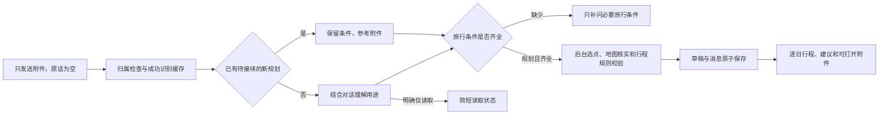

核对责任在后台：附件概述、候选地点、证据和疑点保留在私有快照，用于选点和地图核实，不再由`attachment_reply`或`AttachmentCards`全文展示。参考攻略按当前目的地选择可用候选，不能要求用户确认整篇地点清单；人数、预算、日期与修改范围才是需要用户补充的意愿。行程仍区分已核实地图位置、建议活动时长与尚未查询的实际交通/票务信息，不将隐藏清单等同于完成这些实时核实。模型或工具异常由服务日志保存请求编号和错误类别，用户侧提示生成服务失败，保留附件与旧安排。

空原话仍存于`response_json.result.original_message`；仅构造模型历史时以附件事件说明补足空内容，首轮标题可使用文件名，无新表、字段或迁移。已有历史回复不回写。自动验证：全量760项通过后，追加服务错误提示测试及相关33项回归通过；mypy 93文件、修改范围Ruff、前端三组回归与构建通过。真实专用会话缓存84点长沙PDF，首次规划失败、重试保存三日草稿，浏览器恢复及纯附件发送通过；首次失败未重现，不作稳定率承诺，首次OCR耗时未重新测试。

### 12.14 已用攻略完整候选与景区名称匹配（2026-09-20）

普通行程修改也需要已用攻略中的未入选景点。`process_saved_message → plan_attachment_candidates(同会话历史, 当前草稿, 本轮目的地) → plan_trip(完整附件快照, reference)`；来源编号取自`old_plan.days[].activities[].place.sources[].attachment_id`，仅当前草稿已经引用、存在有效识别快照且目的地未变的附件可自动接续。按历史逆序取每份最新有效快照，避免聊天后丢失材料；从未采用的附件不自动加入，不跨会话取原件，不重新识别。这些候选仅用于后台规划，HTTP的单次选择上限、保存归属检查及普通问答路径不变。

地图名称核实继续要求唯一同城主体，严格末尾称谓增加“国家重点风景名胜区/国家风景名胜区”；不做任意包含匹配，景区东门、停车场和码头不能冒充主体。模型必须区分“原文已识别但地图匹配失败”与“原文不存在”，前者不能要求重新上传清晰页面。数据库与快照结构不变。

真实只读验收确认原84点快照本就包含岳麓山；修复后地图匹配景区主体，内存重跑在第二天安排岳麓山、岳麓书院，其他两天完全保留，用户数据库版本和草稿不变。尚未采用新OCR引擎，也未重新评价全篇文字及地点召回率。

自动验证767项通过、0跳过（真实隔离PostgreSQL/Milvus），mypy 93文件及修改范围Ruff通过；正式后端重启并ready。本步未修改前端。

本轮长沙单点实测中，天心阁和爱晚亭未通过地图地点核对，因此没有提交替换，旧草稿保留；单点成功替换、原活动保护及来源拒绝由自动回归覆盖，不称这两个真实地点已替换成功。地图召回与别名核对仍是后续质量改进项。验收仅创建专用账号和三份会话，交付前清理；用户原会话、上传原件和Milvus备份保留。

## 本地文件存储补充（源码核对：2026-09-17）

正式应用仅使用`backend/.env`和对应`.env.example`；模型、数据库、Embedding和百度MCP配置从同一文件显式加载。学习示例及其原配置已迁至项目外`E:/TravelMindAI-learning`。不自动寻找父目录配置，不改变操作系统环境变量优先级，也未新增依赖。

| 文件类型 | 当前位置 | 清理和Git约定 |
|---|---|---|
| 固定评测输入 | `backend/evals/documents.v1.json`、`requirements.v1.json` | 从原Git版本恢复，继续跟踪；不可按报告清理 |
| 研究数据集 | `data/chinatravel`、`data/lvbangpt` | 保留，不提交Git |
| 上传原文与补充资料 | `temp/uploads`、`temp/knowledge` | 保留，不提交Git |
| 日志、报告、验收临时文件 | `temp/logs`、`temp/reports`、`temp/runtime` | 不提交Git；阶段结束仅清理已关闭且不用的本阶段产物 |
| 依赖、构建结果、检查缓存 | 工具默认目录 | 不提交Git；Python检查从backend执行 |

Settings默认上传目录为`<项目根>/temp/uploads`，环境变量`TRAVELMIND_DOCUMENT_UPLOAD_DIR`契约不变。DocumentService初始化时解析实际目录，再拼接数据库storage_name；无数据库字段或迁移变化。两处旧uploads联接仍指向该实际目录，29份原文保留。

调用关系：后端命令显式加载`.env` → Settings校验 → DocumentService使用temp/uploads；评测命令读取受版本管理的evals题库 → 生成temp/reports报告。显式--output仍优先且拒绝覆盖；README启动命令将控制台日志同步写入temp/logs。Milvus持久数据由Docker卷保存，不属于temp清理范围。

尚未收尾：backend/data/runtime只剩运行中前端占用的两份日志，未中断服务；两个uploads兼容联接、空assets及旧根目录缓存暂留。目录删除命令被自动审批审查拦截，未改用其他方式绕过。待停止相关服务并允许清理时再移除旧入口，禁止删除联接目标或递归清空temp。原backups目录在本轮开始时已不存在，本轮未删除备份、数据库或上传原文。

验证：配置及评测回归18项通过、1项依赖弃用提示；单独读取后端.env通过模型/数据库/百度配置存在性及上传目录检查，未输出密钥、未调用外部模型。历史章节记录当时的路径和结果，不代表旧报告或备份现在仍存在；可执行目录和启动方式以本节及README为准。


### 12.15 智能体上传附件的 MinerU 接入（2026-09-20）

范围是现有聊天输入框内的私人附件读取，不新增独立阅读智能体。共享知识库、行程图和附件用途合同不变。设置 `TRAVELMIND_MINERU_BASE_URL` 后，PDF/PNG/JPEG/WebP使用本机MinerU 4.0.4 Standard并强制页面OCR，避免错码文字层被自动模式复用；DOCX使用Flash原生结构解析；TXT/Markdown沿用直接读取。PDF和图片均保留原件，图片关系继续由百炼视觉补读；DOCX内嵌图片暂不补读，保留明确提醒，XLSX/PPTX未开放上传。

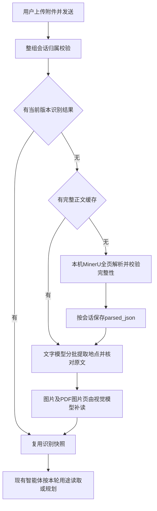

调用顺序：`api/requirement/history.py → AttachmentReader → MinerUClient → /v1/parse/jobs → 轮询完整成功 → /v1/files/{id}/content → parse_result → save_parsed → analyze_parsed → 必要视觉补读 → save_analysis`。普通HTTP与SSE均接入。MinerU单进程独立环境，只监听127.0.0.1:8010，并发1；小模型ONNX CPU，VLM为llama.cpp，本机模型保存在deploy/mineru/.runtime。部署锁与正式启动命令见README。

MinerU输入使用inline原件字节，不暴露用户文件路径；PDF显式请求all。服务失败、partial、缺失页、重复页、超时都不能当作成功。解析结果按物理页码严格核对，Word不编造页码。最多100万字符、5000段；每批提取约6000字，超长单段拆分但保留页码。附件专用DeepSeek输出上限8192，普通需求模型保持2048。地点名须出现在该批引用页；模型改写了引用句但名称确在该页时，程序从该页原文直接截取依据，不保存改写内容。多批不推测全局路线顺序，地点超过300或疑点超过容量时明确失败，摘要限3000字。识别不能授予地图核实状态。

**0013新增数据字典与缓存合同：**`conversation_attachments.parsed_json`为可空JSONB，SQL默认NULL，未设数据库对象形状CHECK；应用保存的对象如下。原主外键、唯一约束、索引和表关系全部沿用12.5。

| JSON路径 | 类型 | 可空／默认 | 含义 |
|---|---|---|---|
| parser_version | string | 非空，无默认 | 程序生成的解析版本，当前mineru-4.0.4-ocr-v1 |
| document.sections | array | 非空，无默认 | 按原件顺序保留完整正文单元 |
| sections[].text | string | 非空，至少1字 | 文字、表格Markdown/HTML或明确图片占位 |
| sections[].page_number | integer/null | 可空，默认null | PDF物理页码从1开始；Word及独立图片不编造页码 |
| sections[].section_path | string[] | 非空，默认空数组 | 当前图片块为[图片]，其他单元为空 |
| sections[].order | integer | 非空，至少1 | 全文单元顺序 |
| document.warnings | string[] | 非空，默认空数组 | 解析限制或未完成内容说明 |
| analysis_json.parser_version | string/null | 可空，默认null | 本轮成功识别所用版本；旧结果为空，不代表已用MinerU |

解析先保存，后续文字或视觉失败可重用正文。完整正文不复制进每轮消息或公共知识库。旧消息保持原快照；旧附件再次明确选择发送时才升级，升级失败本轮报告失败但保留数据库旧结果，迟到旧结果不能覆盖新版。删除会话沿用原事务删除附件行，正文缓存随行删除；原件清理由原清理机制完成。

本机已备份数据库至temp/backups/mineru-20260920并执行0013，Alembic结构检查通过。真实16页长沙PDF页面OCR约79.7秒，564段、22183字；原自动模式出现的“岳麓乢院”“湖南省単物馆”“夛心阁”在页面OCR结果中未再出现，对应正确名称已识别。这是指定样本检查，不是全文准确率统计。扫描PDF与DOCX表格独立解析各约4秒；真实HTTP扫描附件上传、解析、模型提取、会话保存返回200，首次约10.4秒、复用约3.1秒。

最终验收：同一16页原件的全文提取约72.5秒、54个地点，四批图片补读约226.9秒，合并113个地点及25条待确认提醒；使用分阶段真实模型调用，未把这些耗时称作单次大文件HTTP请求实测。最新真实SSE扫描件约11.8秒、9条进度事件，提取6个地点，包含备注中的杭州东站。全量后端777项通过、2项因测试Milvus未配置而跳过、2条警告；修改范围Ruff、mypy 94文件通过。本步没有新增浏览器验收。服务已按正式脚本重启并通过健康检查；专用验收账号、会话及其上传副本已清理。临时文件删除被自动审批审查拦截（blocked by policy），未绕过，剩余验收输出、旧日志及旧blobs均被Git忽略；备份、用户原件、运行模型和当前日志保留。
