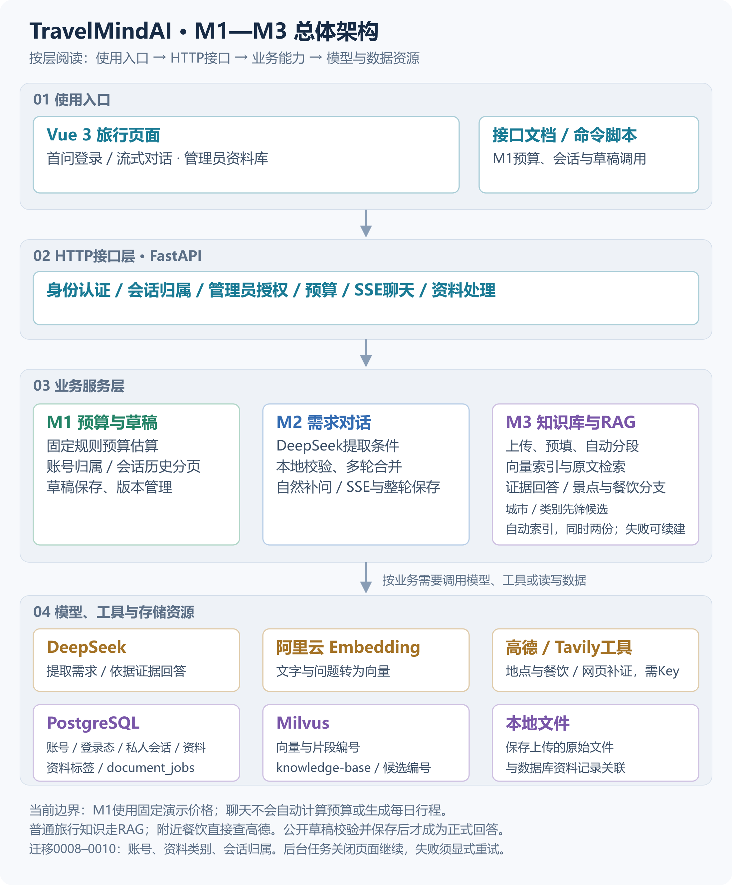
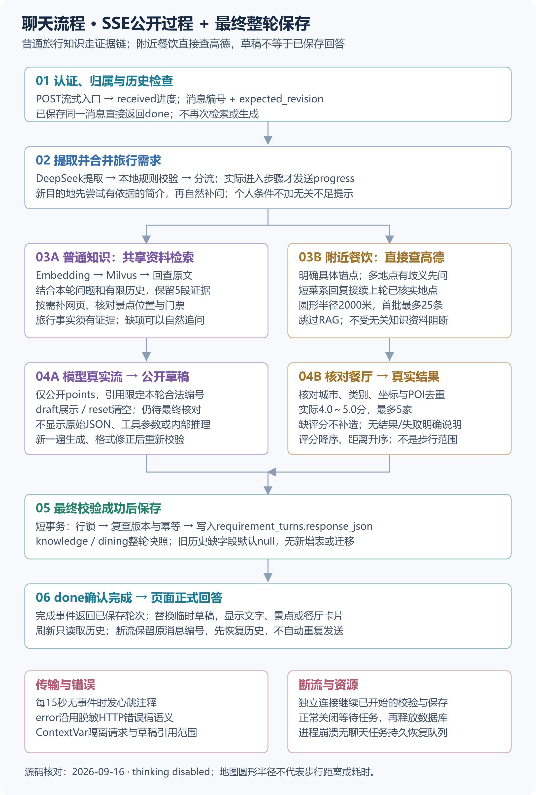
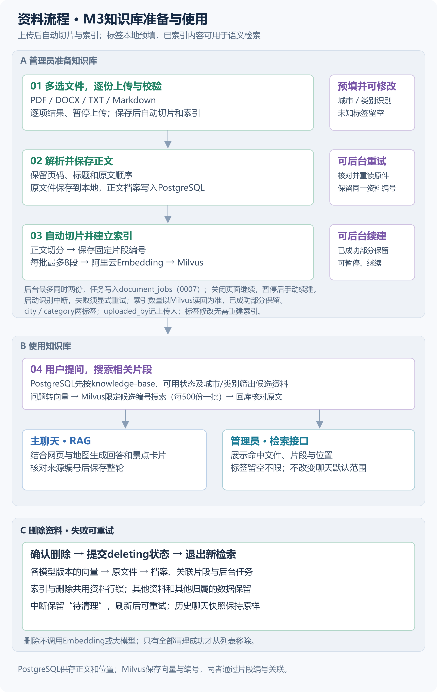
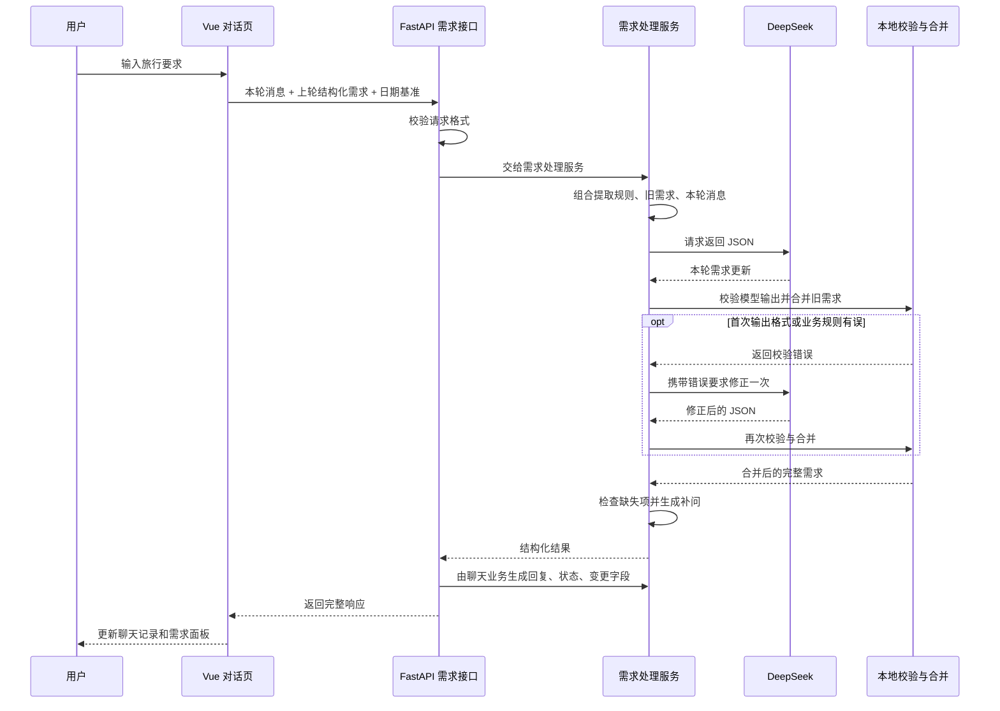
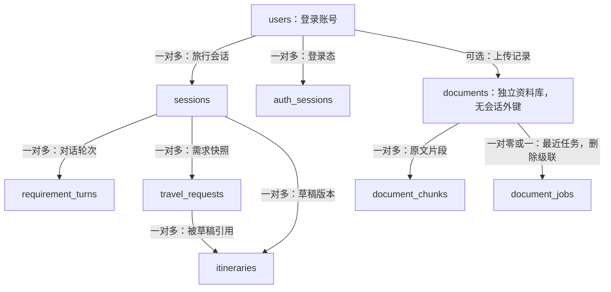
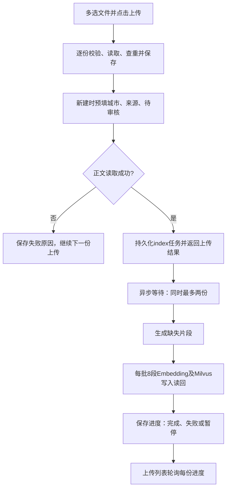

# TravelMindAI 架构设计说明

> 最近源码核对：2026-09-16（Asia/Shanghai，流式回复、目的地引导与附近餐饮）
> 范围：当前工作区 `backend/app/`、`frontend/src/` 与数据库迁移文件。  
> 验证口径：本轮新增流式回复与餐饮源码、契约及最终验证见10.22，自动测试与真实服务证据分开记录；此前口语追问与字段容错见10.21，景点地址与定向补查契约见10.20，自动上传处理见10.19，元数据与后台基础见10.17，固定题库评测见10.18；本机已应用0008/0009/0010并完成共享范围数据迁移，最新自动检查与浏览器验收见12.8。10.3至10.16保留历史小步验收，其中“尚未实现”描述仅对应当时。源码、自动检查和真实服务验收分别记录。
> 阅读配合：[07-各阶段开发说明](./07-各阶段开发说明.md) 讲开发顺序和逐文件写法；本文讲这些文件怎样组成系统。[02-技术设计文档](./02-技术设计文档.md) 包含目标设计，不能将其中尚未落地的模块视为当前能力。

> 2026-09-16源码核对：账号注册/登录、会话归属、管理员资料页、城市/类别与共享知识库范围已写入源码。本机已备份清理旧会话并完成0010和知识范围数据迁移；最新自动检查与浏览器验收见12.8。私人附件、文件替换与LangGraph仍是目标设计，见[09改造方案](./09-双角色与对话附件改造方案.md)。

## 1. 先用一句话理解现在的系统

TravelMindAI 当前采用 **Vue 前端 + FastAPI 后端 + DeepSeek 需求理解与证据回答 + PostgreSQL 正文和引用快照存储 + 阿里云Embedding与Milvus语义搜索**。

可以把它理解成一家旅行服务店：前端是接待窗口，后端是负责业务规则的工作人员，DeepSeek 负责提取用户条件，并根据检索原文整理知识回答，数据库是保存会话与草稿的档案柜。

当前源码里有三条业务主线：

1. **M2 需求对话**：打开对话首页并输入问题 → 首次发送时注册或登录 → 自动续发原问题 → 服务端核对会话归属 → 读取本人已保存需求 → 模型提取本轮修改 → 程序校验与合并 → 普通旅行知识检索证据，附近餐饮直接查询高德 → 公开步骤与临时草稿 → 最终校验并保存完整一轮 → 页面显示正式回答；刷新或重登后从服务端历史列表恢复本人会话。
2. **M1 预算与草稿**：提交预算输入 → 程序计算预算 → 按需要保存需求快照和行程草稿 → 读取最新或指定版本。
3. **M3 管理员资料**：管理员选择文件 → 读取正文及位置 → 保存原文件与档案、预填城市/类别 → 自动提交后台任务 → 切片并建立索引 → 服务端按共享范围与城市/类别限制资料 → 向量搜索并按编号回查原文。旧`local-demo`资料尚存时资料业务返回503，须在维护窗口执行范围迁移。后台任务状态写入PostgreSQL；文件读取和标签识别不调用模型。

**M1/M2旅行会话属于登录账号；M3资料属于管理员管理的共享知识库；主聊天把当轮引用原文快照关联到对话轮次。** 聊天完成后还不会自动计算预算或生成行程草稿。页面说“需求完整”，仅表示必要需求已齐全。

M3另保留独立的`demo_embedding`命令做少量试跑；该命令自身不写向量库。Web索引与搜索走`DocumentSearchService`，使用相同的阿里云`text-embedding-v4`配置，实际返回1024维向量。

聊天持久化已接入：前端按账号列出本人历史，再调用会话接口保存消息；旧需求由后端读取。2026-09-11的数据库与浏览器记录只对应当时单会话小步，最新验收见12.8。

## 2. 总体架构图

以下三张图沿用浅色背景、白色卡片和竖向布局；总图与聊天图同步流式事件和餐饮地图分支。总图覆盖M1预算与草稿、M2需求对话、M3知识库与RAG；它展示当前已实现能力，不表示M3所有计划功能均已完成。先看总图辨认分层，再看流程图了解一条消息或一份资料怎样处理。

### 2.1 M1～M3总体架构

从上往下依次是使用入口、HTTP接口、业务服务、模型与数据资源。箭头表示层间关系，具体业务调用看后续流程图。M1目前通过接口文档或脚本调用，聊天页面不会自动计算预算或生成每日行程。



[打开高清总图](./diagram/travelmind-overview.png) · [打开可缩放SVG](./diagram/travelmind-overview.svg) · [查看Mermaid结构参考](./diagram/travelmind-overview.mmd)

### 2.2 一轮聊天：M2需求处理与M3知识回答

新消息先检查身份、历史和版本，再整理需求。普通知识链检索原文、网页补证并核对景点；餐饮分支核对具体锚点后直接查高德。进度及知识回答草稿可先展示，最终校验并保存整轮后才返回done。已保存消息的重试直接返回原结果；知识问题无证据时说明无法确认，纯个人条件登记只自然补问。检索或模型故障不保存半轮，餐饮工具失败可保存明确的失败状态。



[打开高清聊天流程图](./diagram/travelmind-chat-rag.png) · [打开可缩放SVG](./diagram/travelmind-chat-rag.svg)

### 2.3 一份资料：M3知识库准备与使用

上半部分是上传、解析、分段和按需索引，中间是检索后供聊天回答或资料页原文搜索使用，底部是资料停用与清理。上传完成不代表已经建立索引；正文在PostgreSQL，向量及片段编号在Milvus。



[打开高清资料流程图](./diagram/travelmind-documents.png) · [打开可缩放SVG](./diagram/travelmind-documents.svg)

**图片维护约定：**三张SVG是排版源文件，对应PNG为2倍分辨率的文档预览。修改SVG后重新导出同名PNG，核对文字边界与整体预览；总图的`.mmd`只维护同等层次的结构参考，不再用它覆盖手工排版的PNG。具体文件路径、错误处理、健康检查和独立试跑命令继续在对应章节说明。


### 2.4 文件夹怎样找

目录采用“先按技术层，再按业务分组”。相同业务的数据格式与业务处理分别放在对应层，文件夹名保持一致。`models/document.py`当前只有一份资料表定义，预算、草稿也没有一组待归类文件，因此保留现有位置。

```text
backend/app/
├── api/                         接收HTTP请求、准备连接、返回结果
│   ├── document/                routes、search、jobs、dependencies、upload_limits
│   ├── requirement/             routes、history
│   ├── errors.py                统一错误响应
│   └── health.py                存活和依赖就绪检查
├── schemas/                     定义数据格式，不处理业务、不建数据库表
│   ├── document/                base、search、answer、job
│   ├── requirement/             base、update、chat、history
│   └── dining.py                餐厅和周边查询快照
├── services/                    实际业务规则
│   ├── document/                parser、chunker、service、search、vector_store、jobs、answer、maps
│   ├── requirement/             prompt、extract、merge、history
│   ├── chat/                    service串联整轮，rag组织知识回答，dining处理餐饮，events隔离公开事件
│   └── amap.py                  高德HTTP客户端
├── models/                      数据库表定义
├── llm/                         DeepSeek、Embedding客户端
└── main.py                      应用装配与生命周期
```

这里省略了未调整的预算、草稿和配置文件。各文件夹的`__init__.py`只说明用途，不自动创建客户端或转发旧导入。内部调用统一使用新路径，HTTP地址和数据库表名保持原样。

## 3. 前端每部分负责什么

以下路径均相对于项目根目录。

| 文件 | 职责 | 通俗理解 |
|---|---|---|
| `frontend/src/main.ts` | 创建 Vue 应用、加载样式 | 打开接待窗口 |
| `frontend/src/api/auth.ts` | 注册、登录、退出与恢复账号身份 | 登录入口的传话接口 |
| `frontend/src/App.vue` | 登录/注册、角色导航、历史选择、聊天输入与资料入口 | 用户看见并操作的页面 |
| `frontend/src/useRequirementConversation.ts` | 本人历史分页、新建/切换会话、发送、刷新恢复和冲突处理 | 管理这一次对话的过程 |
| `frontend/src/components/DocumentPanel.vue` | 管理员城市分组/分页、紧凑上传、原文/片段切换 | 共享资料柜的操作面板 |
| `frontend/src/components/DocumentUpload.vue` | 多文件选择、逐份上传、结果展示、暂停和单份重试 | 资料柜的上传入口 |
| `frontend/src/components/RestaurantCards.vue` | 展示已保存的真实餐厅评分、距离、人均参考和地图链接 | 缺失值不补造，刷新沿用快照 |
| `frontend/src/components/AttractionCards.vue` | 展示景点介绍、已核对门票说明、地址和高德位置链接 | 使用已保存的卡片，刷新不重新查询 |
| `frontend/src/components/DocumentChunks.vue` | 片段查询、生成、分页与位置展示 | 打开短片段查看出处 |
| `frontend/src/api/documents.ts` | 上传、查询、分段、索引、搜索及删除HTTP合同 | 将文件送给后端，读取状态与正文 |
| `frontend/src/api/http.ts` | 共用JSON响应解析与ApiError | 两类接口共用的错误读取规则 |
| `frontend/src/api/requirements.ts` | 定义 TypeScript 契约并封装后端请求 | 页面与后端之间的传话接口 |
| `frontend/src/style.css` | 页面视觉样式 | 调整窗口的外观和排版 |
| `frontend/vite.config.ts` | 本地端口、Vue 插件和API代理，保留浏览器Host供后端同源校验 | 让开发中的前后端连起来 |
| `frontend/src/components/DocumentJob.vue` | 轮询任务，完成时通知资料页重读当前片段 | 状态完成后更新预览 |

目前状态管理使用 Vue 的 `ref`、`computed` 与组合式函数，没有引入 Pinia。`App.vue` 按登录身份列出本人会话；不同对话的需求不放在模块级共享变量里。

页面发送使用POST SSE：progress显示实际业务步骤，draft/reset展示或清除待核对公开草稿，done才切换到已保存正式结果；原JSON发送入口继续保留。Enter 发送，Shift+Enter 换行，中文输入法选词时的回车不触发发送。

## 4. 一条消息的完整流程

页面显示对话首页，并在后台调用`GET /auth/me`恢复身份；匿名401不弹窗，也不清空正在输入的问题。访客首次发送时用原生dialog提示登录，将原问题暂存于当前页面内存；取消后仍保留输入，刷新页面不承诺保留。`POST /auth/register`创建普通用户，或`POST /auth/login`登录成功后，新建属于该账号的会话并自动续答一次，不接到账号以前的会话。只点击右上角登录则恢复原有会话，不自动发送。登录失败保留待回答问题；退出回到匿名首页并清除私人内容。右上角显示首字母圆形头像及账号名（作为当前昵称），菜单提供退出。登录、注册、账号创建统一校验6～12位密码，含边界。后端以Argon2校验口令，Cookie持有随机令牌7天，数据库只存SHA-256哈希。Cookie设置HttpOnly、SameSite Strict，生产环境或HTTPS设置Secure；所有写请求需`X-Requested-With: TravelMindAI`，有Origin时检查同源。登录/注册每IP每分钟最多10次，限频表单进程至多10000地址；多worker部署需共享限频。会话/草稿/历史在调用业务服务前按服务端当前用户检查归属，匿名401、跨用户404；资料旧路径和`/admin`别名均要求管理员，普通用户403。

首次成功聊天将默认会话标题设为原话去多余空白后的前40字；后续成功轮次更新`updated_at`。用户历史按`updated_at/id`倒序游标分页，浏览器`sessionStorage`只记当前选择和待确认发送，服务端历史才是找回旧会话的依据。

### 4.1 需求抽取时序与当前持久化路径

下面先展示无状态抽取接口的核心处理过程，其中旧需求和日期基准由调用方提供。



当前页面的持久化接口复用这套提取、校验、合并和补问逻辑，但旧需求与日期基准由后端读取数据库取得，成功保存整轮后才向前端返回成功。图中的“本地校验与合并”是后端程序内的处理步骤，不是独立部署的服务。

**当前持久化路径按以下顺序执行：**

1. 页面第一次真正发送时创建旅行会话，空白页面不会立即创建数据库记录。
2. 页面为本次发送生成 `message_id`，同时携带自己已知的 `expected_revision`。
3. 后端从数据库读取上下文，先检查该消息是否已经保存、页面是否基于旧版本发送。
4. 从历史中找到最近一次有效旅行需求，并沿用首轮记录的日期基准。
5. 由聊天业务调用共用的build_requirement_response，调用 DeepSeek，执行格式校验、业务校验和新旧需求合并。
6. 选择业务分支：餐饮请求核对锚点后直接查高德；其他请求进入原知识链，按消息和近期话题检索、回查原文，DeepSeek依据证据生成回答。新目的地尝试简短简介并自然补问；纯个人条件不加无关不足提示。SSE在实际步骤发送progress，知识回答生成时推送待核对draft，重新生成前reset。
7. 抽取、工具查询与最终引用校验完成后才进入追加短事务，锁住会话行，复查版本并写入回答、knowledge或dining整轮快照。
8. 提交成功后通过done返回完整SavedRequirementTurn；页面用正式结果替换临时草稿。知识或餐饮轮次不覆盖有效旅行需求。

等待模型期间没有持有追加事务或会话行锁。两个请求同时生成答案时，提交阶段仍会复查版本，防止较晚返回的旧答案覆盖新需求。

### 4.2 四类编号不要混淆

| 名称 | 作用 |
|---|---|
| `session_id` | 标识整段旅行会话，关联多轮消息与草稿 |
| `message_id` | 标识一次发送；超时重试保留同一个编号，避免重复保存 |
| `revision` / `expected_revision` | 已保存轮数 / 本轮发送依据的轮数，用于并发冲突检查 |
| HTTP `request_id` | 排查一次 HTTP 请求的追踪编号，不是旅行会话编号 |

已经提交的消息重试会复用原结果，不再次执行提取。并发请求在第一次提交前仍可能分别调用模型，因此“防止重复保存”不等于任何并发情况下都只调用一次模型。

### 4.3 原来的无状态接口仍然存在

`POST /api/v1/requirements/messages` 仍接收 `message`、`previous`、`reference_date`，完成提取并返回结果，不自动写数据库。

当前 Vue 页面使用 `POST /api/v1/sessions/{session_id}/requirement-messages/stream`；原 `POST /api/v1/sessions/{session_id}/requirement-messages` 保留JSON响应。这条路径不接受浏览器提交旧需求，旧需求由后端从已保存历史中取得。两条路径复用同一套抽取、合并、补问规则。

## 5. 自然语言怎样变成结构化需求

### 5.1 核心文件与数据格式

| 文件 | 责任 |
|---|---|
| `backend/app/schemas/requirement/base.py` | 完整旅行需求与提取结果格式、字段和业务约束 |
| `backend/app/schemas/requirement/update.py` | 本轮更新格式，以及清空字段、删除列表项的表达 |
| `backend/app/schemas/requirement/chat.py` | 原有无状态聊天接口的请求和响应格式 |
| `backend/app/schemas/requirement/history.py` | 持久化消息、已保存轮次和历史响应格式 |
| `backend/app/services/requirement/prompt.py` | 提取规则、日期基准、JSON schema 与提示词 |
| `backend/app/services/requirement/extract.py` | 模型调用、输出校验、一次修正、合并和缺失项检查 |
| `backend/app/services/requirement/merge.py` | 确定性的覆盖、追加、移除、清空和日期协调 |

完整需求中主要有以下字段：

| 字段 | 含义 |
|---|---|
| `intent` | 当前需求的业务意图 |
| `destination` / `origin` | 目的地 / 出发地 |
| `start_date` / `end_date` / `days` | 开始日期 / 结束日期 / 天数 |
| `travelers` / `total_budget` | 出行人数 / 全团人民币总预算 |
| `pace` | 轻松、均衡或紧凑 |
| `interests` | 兴趣 |
| `dietary` | 饮食要求 |
| `lodging_preferences` | 住宿偏好 |
| `hard_constraints` / `excluded_items` | 必须遵守的限制 / 明确排除的项目 |
| `assumptions` | 推算或解释依据 |

当前阶段支持 2～5 天、1～8 人和正数人民币预算。金额使用字符串传输，并通过 Decimal 规则校验，避免二进制浮点金额误差。

模型不能随便省略完整提取格式要求的字段：未知标量使用 `null`，未知列表使用 `[]`，额外字段会被拒绝。

### 5.2 多轮合并的规则

例如第一轮得到“杭州、3天、2人、5000元”，第二轮只说“改成3个人”，合并后应为“杭州、3天、3人、5000元”。

| 本轮表达 | 程序处理 |
|---|---|
| “人数改成3人” | 新值覆盖旧值 |
| 没再提目的地 | 保留旧目的地 |
| “还想去博物馆” | 在对应列表追加并去重 |
| “不要博物馆了” | 通过 `remove_items` 删除指定旧项目 |
| “预算先不定了” | 通过 `clear_fields` 明确清空预算 |
| 首轮给开始日及天数，或修改日期/天数 | 协调相关日期，并记录推算依据；首日计入，结束日＝开始日＋天数－1 |

在本轮更新语义中，`null` 或空列表表示没有提供更新，不能自动当成清空；明确清空需要 `clear_fields`。这样能区分“这次没说预算”和“明确取消预算”。

同一字段同时被清空和赋值、要求删除不存在的项目、日期与天数冲突等，会触发校验。输出格式和合并错误共享最多一次模型修正额度。

在合并之前，`extract_requirements`先检查无档案的删除/清空，再把无previous时的modify_trip校正为plan_trip。判断依据是已有有效需求，而不是会话轮数。后续真实修改仍为modify_trip；other等非规划意图不转换。`message_intent`表示经上下文规则校正后的本轮业务意图，HTTP回复、历史保存及评测使用同一结果；当前没有单独保存模型原始意图标签。第五小步补充混合输入规则：明确登记/修改条件同时提问知识时，提取器优先plan_trip/modify_trip，条件归需求处理，知识问题交RAG；纯知识问题仍不修改档案。

首轮只给开始日及天数时，`merge_requirements`也调用`reconcile_dates`补结束日；明确清空仍优先。首轮已给完整首尾日期时继续由`build_result`补天数。10月1日开始三天为1日至3日；最后一天早上返程不改变自然日数。到离时间与可游玩时段尚未建模，当前不生成交通接驳或每日活动。

### 5.3 谁负责判断信息齐不齐

程序检查目的地、天数、人数、总预算；日期齐全时可按包含首尾两天的方式推导天数。当前出发地不是必要条件。

接口状态有四种：

- `needs_clarification`：仍缺信息，程序生成集中补问。
- `complete`：必要需求齐全，可以继续修改；尚未生成每日行程。
- `unsupported`：旧历史或独立需求提取接口中的非规划意图，不覆盖需求。
- `knowledge`：主聊天知识问答（包括资料不足）；保存回答与引用，不覆盖此前有效旅行需求。

右侧面板来自 `result.extraction`；聊天文字来自 `reply`；修改提示来自 `changed_fields`。这些是同一次响应的不同部分。

## 6. 模型调用与“记忆”边界

```text
需求服务的 ModelClient 接口
    → DeepSeekClient.generate_json()
    → LangChain ChatOpenAI.invoke()
    → OpenAI 兼容客户端 / httpx
    → DeepSeek Chat Completions API
```

`ChatOpenAI` 是接入类名，实际提供方由地址和密钥决定。当前 `base_url` 指向 DeepSeek，模型名称来自配置，源码默认值为 `deepseek-v4-pro`。

当前开启 JSON 输出模式、关闭思考模式，使用同步调用，没有接入 SSE 或流式输出。SDK 自动重试关闭；输出校验失败的修正由需求服务控制，网络失败不会走这条修正循环。默认网络超时为30秒，前端停止等待的超时为180秒，两者不是同一层的限制。

**保存了聊天记录，不代表把整段聊天记录都发给模型。** 当前模型上下文仍主要由系统规则、最近有效的结构化需求、本轮原话组成；修正时再附加无效输出和校验原因。数据库历史用于恢复页面及查找最新有效需求。

DeepSeek 负责理解自然语言；确定性的日期协调、需求合并、缺项检查、预算计算和数据库保存由程序负责。当前已将固定RAG流程接入主聊天；尚未引入 LangGraph 或 Redis 记忆，`old_learn/` 中的学习示例不代表产品功能已经接通。

## 7. 数据库结构与保存边界

### 7.1 当前源码中的业务表关系



| 表 | 保存内容 | 对应代码 |
|---|---|---|
| `users` | 登录名、Argon2哈希、角色、启用状态 | `backend/app/models/auth.py` |
| `auth_sessions` | 登录令牌哈希与到期时间，不存原令牌 | `backend/app/models/auth.py` |
| `sessions` | 旅行会话编号、标题、状态、时间及预留 thread_id | `backend/app/models/trip.py` |
| `requirement_turns` | 每轮消息编号、轮次、原话、回复、参考日期、需求响应及引用原文快照 | `backend/app/models/requirement_turn.py` |
| `travel_requests` | M1 草稿保存路径产生的需求 JSON 快照和版本 | `backend/app/models/trip.py` |
| `itineraries` | 行程草稿 JSON、版本、状态和关联需求编号 | `backend/app/models/trip.py` |
| `documents` | 原文件信息、归属、读取结果、错误和提醒 | `backend/app/models/document.py` |
| `document_chunks` | 固定片段编号、完整短文字和原文位置 | `backend/app/models/document.py` |
| `document_jobs` | 最近后台任务、执行编号、进度和中断说明 | `backend/app/models/document_job.py` |
| `alembic_version` | 数据库已应用的结构版本，属于迁移管理表 | Alembic 管理 |

`requirement_turns.response_json` 保存整个聊天响应，原话在 `result.original_message` 中；一行是一整轮，而不是用户消息和助手消息分别各存一行。knowledge可选快照包含回答状态、要点、来源原文、网页证据、景点卡片与地图结果；本轮新增同级可空dining快照保存真实附近餐厅及查询状态（10.22）。两字段旧行均默认null，无需更新旧行或迁移表。

这张新表不等于 `travel_requests`：聊天需求快照随轮次保存，M1 需求快照则随草稿保存。当前没有自动把一轮聊天同步转换成 M1 的需求和行程记录。

`itineraries.request_id` 是关联需求快照的数据库外键，与 HTTP 请求追踪的 `request_id` 含义不同。会话中的 `thread_id` 是预留字段，并不表示已经实现 LangGraph 检查点。

### 7.2 三种保存服务

**资料服务 `DocumentService`：**所有查询注入服务端owner；先按原始字节SHA-256查重，再解析、写UUID原文件、事务插入档案。并发重复通过`ON CONFLICT`及唯一约束裁决，失败请求清理自己的新文件。读取失败的文件也保存`failed`档案和可读原因。详情从数据库取正文，不重新解析原文件。原文件路径不返回浏览器。片段生成锁住资料行，核对归属与状态，有片段直接返回，没有才切分并在一个事务中保存；原文不改写，失败不会留下部分片段。分页查询只读取当前页，归属通过资料表核对。

**对话保存服务 `RequirementHistoryService`：**

- 按会话读取有序历史；读取不调用模型。
- 在短事务中锁定会话行，检查消息是否重复以及轮次是否冲突。
- 整轮结果和会话更新时间一起提交；失败不会留下半轮结果。
- `(session_id, revision)` 与 `(session_id, message_id)` 分别限制轮次重复和消息重复。

**草稿保存服务 `TripService`：**

- 需求快照和行程草稿在同一个事务里保存。
- 同会话通过行锁协调版本分配。
- 两份快照和会话更新时间一起提交或回滚。
- 读取最新或指定行程版本时，取出实际关联的需求快照。

M1 草稿接口仍接收预算输入，由固定费率规则计算预算后保存。当前草稿中的逐日安排为 `days: []`，尚未产生景点、交通和每日活动。

### 7.3 页面刷新后从哪里恢复

| 数据 | 保存位置 | 刷新时的行为 |
|---|---|---|
| 已提交原话、回复、需求快照 | PostgreSQL 的 `requirement_turns` | 后端读历史，前端重新展示 |
| 当前会话编号 | 浏览器按账号分隔的`sessionStorage` | 当前标签页刷新后恢复选择；重登也可从服务端列表找回 |
| 待确认发送的原话、消息编号、依据版本 | 浏览器 `sessionStorage` | 恢复时检查是否已保存，必要时沿用编号重试 |
| 消息气泡、需求对象、错误和加载状态 | Vue 页面内存 | 根据历史重新构建，历史字段高亮清除 |
| 尚未提交的普通输入草稿 | Vue 页面内存 | 没有通用的自动保存恢复机制 |
| M1 草稿快照 | PostgreSQL | 通过草稿接口单独读取 |
| 上传原文件 | `document_upload_dir`配置；本机实际为`E:/TravelMindAI/data/uploads` | 不随刷新或重开对话删除；资料删除接口负责清理 |
| 资料列表与已读取正文 | PostgreSQL的`documents` | 打开资料页查列表，点击资料读正文；不记住刷新前选中的资料 |
| 资料片段 | PostgreSQL的`document_chunks` | 重新选择资料并打开片段时直接查询，编号保持一致 |

当前已有服务端本人历史列表和账号归属。`sessionStorage` 不保证关闭标签页后还能自动找回；登录后可由服务端历史列表找回本人旧会话，页面选择后才按会话编号读取。“重新开始”清除当前页面的会话关联，下一次发送创建新会话，不删除数据库旧记录。

恢复失败时页面保留会话编号并阻止继续发送，避免在空上下文上覆盖旧需求。版本冲突返回409后，页面重新读取历史，再让用户确认并重新发送。

### 7.4 迁移状态的口径

源码迁移链包含`0001_business_tables`至`0010_required_session_owner`；0008新增账号与过渡归属，0009新增资料类别，0010在未归属会话存在时拒绝升级。2026-09-16本机PostgreSQL已升级到0010，Alembic check无差异；0006和0007的旧标签/任务仍保留，0008增users/auth_sessions，0009增category/uploaded_by并规范城市，0010要求会话所有者非空，共九张业务表。迁移往返、待清理状态阻止回滚及ORM一致性在临时schema验证。真实业务库只升级，回滚只在随机临时schema中测试。

当前就绪检查代码检查九张业务表及字段，不核对CHECK约束或迁移版本，因此仍须以alembic current/check确认，不能只看ready。数据库断开时应用保留存活检查，就绪接口返回503；首次恢复连接后的任务请求补做启动时未完成的中断识别。

### 7.5 当前表的详细数据字典

以下按2026-09-16的ORM和`0001`至`0010`迁移源码核对；本次真实数据库执行结果见最终验收记录。

原有四张业务表的下列字段均为`NOT NULL`；`documents.error_message`与`document_chunks.page_number`允许NULL，详见独立字典。UUID主键由应用的`uuid4`生成，当前迁移没有为其配置数据库端`gen_random_uuid()`默认值；不能把两种生成方式混写。时间字段为带时区的`TIMESTAMPTZ`。

**`users`：注册账号。迁移：`0008_accounts`。全部字段不允许NULL。**

| 字段 | 类型 | 默认值与含义 |
|---|---|---|
| `id` | UUID | 应用uuid4；主键 |
| `username` | VARCHAR(64) | 无；登录名，唯一 |
| `password_hash` | VARCHAR(255) | 无；Argon2口令哈希 |
| `role` | VARCHAR(10) | 数据库`user`；CHECK仅允许`admin/user` |
| `is_active` | BOOLEAN | 数据库true；停用账号的登录态也失效 |
| `created_at` | TIMESTAMPTZ | 数据库now() |
| `updated_at` | TIMESTAMPTZ | 数据库now()；服务更新账号时写入 |

`username`唯一约束同时提供索引；没有email或角色自选注册。注册接口只创建`user`；部署命令`manage_accounts init-admin`首次创建默认管理员`admin / 123456`，重复执行不会重置已有密码，也不会把同名普通用户提升为管理员。数据库继续保存Argon2哈希，本轮没有增加昵称、头像字段或迁移。

**`auth_sessions`：服务端登录态。迁移：`0008_accounts`。全部字段不允许NULL。**

| 字段 | 类型 | 默认值与含义 |
|---|---|---|
| `id` | UUID | 应用uuid4；主键，与旅行会话id不同 |
| `user_id` | UUID | 无；外键→`users.id`，无级联删除 |
| `token_hash` | VARCHAR(64) | 无；随机Cookie令牌的SHA-256摘要，唯一 |
| `created_at` | TIMESTAMPTZ | 数据库now() |
| `expires_at` | TIMESTAMPTZ | 无；登录到期时刻 |

`ix_auth_sessions_user(user_id)`用于账号登录态定位，`ix_auth_sessions_expires_at(expires_at)`用于到期清理；退出删除当前行。数据库未增加令牌长度或到期大于创建时间CHECK，不应把应用校验写成数据库约束。

**`sessions`：一段旅行会话。迁移：`0001_business_tables`，归属列由0008/0010增加。**

| 字段 | 数据库类型 | 含义、默认值及约束 |
|---|---|---|
| `id` | UUID | 主键；应用生成 |
| `thread_id` | UUID | 预留工作流编号；应用生成，唯一；尚无LangGraph检查点 |
| `user_id` | UUID | 0008过渡可空、0010当前非空；无默认值，外键→`users.id`，由服务端登录身份写入 |
| `title` | VARCHAR(200) | 会话标题；无数据库默认值 |
| `status` | VARCHAR(20) | 默认`active`；CHECK仅允许`active/archived` |
| `created_at` | TIMESTAMPTZ | 创建时间，数据库默认`now()` |
| `updated_at` | TIMESTAMPTZ | 默认`now()`；保存草稿或对话时由服务显式更新 |

索引由主键和`thread_id`唯一约束建立；增加`user_id` UUID外键→`users.id`；0008过渡可空，0010要求非空；`ix_sessions_user_updated(user_id, updated_at, id)`支持本人历史游标分页。

**`requirement_turns`：每轮已提交的对话和需求结果。迁移：`0002_requirement_turns`。**

| 字段 | 数据库类型 | 含义、默认值及约束 |
|---|---|---|
| `id` | UUID | 主键；应用生成 |
| `session_id` | UUID | 外键→`sessions.id`；无级联删除 |
| `message_id` | UUID | 浏览器生成的一次发送编号；同一次重试沿用 |
| `revision` | INTEGER | 会话内轮次；服务分配，CHECK要求≥1 |
| `response_json` | JSONB | 整轮响应及knowledge原文/网页/景点/地图、dining餐饮快照，非空、无默认值；CHECK要求JSON对象。旧快照可无knowledge/dining字段，读取默认null |
| `created_at` | TIMESTAMPTZ | 默认`now()` |

唯一约束：`(session_id, revision)`防止同轮重复，`(session_id, message_id)`防止同次发送重复。两者有对应唯一索引。JSON内部包含`result.original_message`、`result.extraction`、`result.reference_date`、`reply`、`status`等；这些是JSON键，不是独立数据库列。

**`travel_requests`：保存预算草稿时产生的需求快照。迁移：`0001_business_tables`。**

| 字段 | 数据库类型 | 含义、默认值及约束 |
|---|---|---|
| `id` | UUID | 主键；应用生成 |
| `session_id` | UUID | 外键→`sessions.id`；无级联删除 |
| `version` | INTEGER | 服务分配的需求版本；CHECK要求≥1 |
| `request_json` | JSONB | 需求快照，无默认值；CHECK要求JSON对象 |
| `created_at` | TIMESTAMPTZ | 默认`now()` |

唯一约束：`(session_id, version)`与`(id, session_id)`。第二项为行程的复合外键提供目标，保证行程引用的需求属于同一个会话。

**`itineraries`：版本化行程草稿。迁移：`0001_business_tables`。**

| 字段 | 数据库类型 | 含义、默认值及约束 |
|---|---|---|
| `id` | UUID | 主键；应用生成 |
| `session_id` | UUID | 外键→`sessions.id`；无级联删除 |
| `request_id` | UUID | 所依据的需求快照，不是HTTP追踪编号 |
| `version` | INTEGER | 服务分配的行程版本；CHECK要求≥1 |
| `status` | VARCHAR(20) | 默认`draft`；CHECK允许`draft/confirmed`，当前尚无确认接口 |
| `itinerary_json` | JSONB | 草稿内容，无默认值；CHECK要求JSON对象 |
| `created_at` | TIMESTAMPTZ | 默认`now()` |

唯一约束：`(session_id, version)`。复合外键：`(request_id, session_id)`→`travel_requests(id, session_id)`，无级联删除。当前JSON保存预算和空的逐日活动列表，尚无`itinerary_days/itinerary_spots`明细表。

**`documents`：上传原文件与读取档案。建表：`0003_documents`；状态约束：`0005_document_delete`；元数据：`0006_document_metadata`。**

| 字段 | 数据库类型 | 允许NULL | 数据库默认值 | 含义 |
|---|---|---|---|---|
| `id` | UUID | 否 | 无 | 主键；服务生成UUID |
| `owner_id` | VARCHAR(100) | 否 | 无 | 服务端固定`knowledge-base`共享范围；旧`local-demo`须维护迁移，与登录账号无关 |
| `file_name` | VARCHAR(255) | 否 | 无 | 去掉目录后的原文件名，仅用于展示 |
| `storage_name` | VARCHAR(50) | 否 | 无 | `UUID.hex + 扩展名`，受控目录内唯一原文件名 |
| `mime_type` | VARCHAR(100) | 否 | 无 | 校验后归一的标准MIME |
| `content_hash` | VARCHAR(64) | 否 | 无 | 原始字节SHA-256，小写十六进制 |
| `size_bytes` | INTEGER | 否 | 无 | 实际上传字节数，必须大于0 |
| `city` | VARCHAR(100) | 是 | 无 | 规则预填或人工修改的城市，NULL表示未标注 |
| `category` | VARCHAR(20) | 是 | 无 | 住宿/景点/餐馆；无法判断为NULL，0009增加CHECK |
| `uploaded_by` | UUID | 是 | 无 | 外键→`users.id`，ON DELETE SET NULL；旧资料为空 |
| `source` | VARCHAR(255) | 是 | 无 | 旧档案列，当前管理接口不筛选 |
| `review_status` | VARCHAR(20) | 是 | 无 | 旧档案列，当前管理接口不筛选 |
| `poi_id` | VARCHAR(100) | 是 | 无 | 旧档案列，当前管理接口不筛选 |
| `status` | VARCHAR(20) | 否 | 无 | `parsed`已读取；`failed`读取失败；`deleting`已停用待清理；不代表索引进度 |
| `error_message` | VARCHAR(500) | 是 | 无 | 读取失败原因或待清理说明；parsed时NULL，failed/deleting时非NULL |
| `sections_json` | JSONB | 否 | 无 | 阅读单元数组，失败时服务显式写`[]` |
| `warnings_json` | JSONB | 否 | 无 | 读取边界/无文字页提醒，服务显式写数组 |
| `created_at` | TIMESTAMPTZ | 否 | `now()` | 数据库记录上传时刻 |

主键：`id`。唯一约束：`storage_name`，以及`uq_documents_owner_hash(owner_id, content_hash)`。普通复合索引：`ix_documents_owner_created(owner_id, created_at)`，服务按创建时间和ID倒序分页。新增`uploaded_by→users.id`外键；无会话关联。

检查约束：`size_bytes > 0`；`ck_documents_status`只允许`parsed/failed/deleting`；两个JSON字段必须为数组；`ck_documents_result`要求parsed的错误为空且正文非空，failed的错误非空且正文为空，deleting的错误非空但可暂留原正文。其他主外键、唯一约束、索引和默认值不变。JSON中每个阅读单元为`{text, page_number, section_path, order}`：正文非空；PDF页码从1开始，其他格式为null；标题路径是字符串数组；顺序从1开始。子字段由Pydantic校验，数据库不单独建列检查。

**`document_chunks`：已生成的短片段。迁移：`0004_document_chunks`。**

| 字段 | 数据库类型 | 允许NULL | 数据库默认值 | 含义 |
|---|---|---|---|---|
| `id` | UUID | 否 | 无 | 主键；ORM保存时生成UUID，重复生成沿用已有编号 |
| `document_id` | UUID | 否 | 无 | 外键指向`documents.id`，不单独保存owner或会话编号 |
| `order` | INTEGER | 否 | 无 | 整份资料内的片段顺序，从1开始 |
| `text` | TEXT | 否 | 无 | 片段完整文字，长度1～800个Unicode字符 |
| `section_order` | INTEGER | 否 | 无 | 来源原文单元的order，从1开始 |
| `page_number` | INTEGER | 是 | 无 | PDF物理页码≥1；无可靠页码时服务写NULL |
| `section_path` | JSONB | 否 | 无 | 原文标题路径数组，由服务显式写入 |
| `start_char` | INTEGER | 否 | 无 | 单元内从0开始的字符起点，包含 |
| `end_char` | INTEGER | 否 | 无 | 单元内字符终点，不包含；不是文件字节偏移 |

主键索引：`id`。外键：`document_id → documents.id`，`ON DELETE CASCADE`，删除接口在外部清理完成后删除资料行并级联清理片段。唯一约束及其索引：`uq_document_chunks_order(document_id, order)`，同时支持按资料和顺序分页，无额外重复索引。

检查约束：`order/section_order > 0`；页码为空或大于0；标题路径必须是JSON数组；`start_char >= 0`、`end_char > start_char`、`end_char - start_char = char_length(text)`且正文长度≤800。标题数组元素由Pydantic校验；位置是否对应真实原文由切分函数和测试保证，数据库不跨表检查JSON内部位置。

原文`sections_json`继续保留。片段只按需生成一次，PostgreSQL中没有向量列或持久化向量状态；第四小步的向量存于Milvus，进度按真实编号计算，详见7.8。当前没有重新切分接口；生成式资料问答已接入主聊天，见10.8。

`alembic_version`是迁移管理表：`version_num VARCHAR(32)`、非空主键，由Alembic管理；业务代码不要把它当作需求或行程版本。

**元数据约束：**`ck_documents_review_status`允许NULL或pending/approved/rejected。旧source/review_status/poi_id列仅作档案保留；当前管理标签只有city/category，category有CHECK，沿用`ix_documents_owner_created`；文本长度由字段及输入格式限制，空白规范化为NULL。迁移不回填旧资料；新上传按规则预填，旧资料由用户点击补全空值。数据库默认值仍为空，与业务层填写pending区分。

**`document_jobs`：每份资料最近一次后台任务。建表：`0007_document_jobs`，依赖0006。**

| 字段 | 数据库类型 | 允许NULL | 数据库默认值 | 含义 |
|---|---|---|---|---|
| `document_id` | UUID | 否 | 无 | 主键，外键→documents.id，ON DELETE CASCADE |
| `run_id` | UUID | 否 | 无 | 服务生成的执行编号，每次显式重试更换，拦住旧回调 |
| `kind` | VARCHAR(10) | 否 | 无 | parse重读失败原件；index生成片段并续建索引 |
| `status` | VARCHAR(12) | 否 | 无 | queued/running/completed/failed/paused |
| `indexed` | INTEGER | 否 | 0 | 最近批次确认写入的片段数量 |
| `total` | INTEGER | 否 | 0 | 该批次读到的片段总数；尚未开始或解析任务可为0 |
| `error_message` | VARCHAR(500) | 是 | 无 | 安全的失败/中断说明，不保存外部异常原文 |
| `updated_at` | TIMESTAMPTZ | 否 | now() | ORM更新时也赋now()，不是数据库自动更新时间触发器 |

`ck_document_jobs_kind`限制parse/index，`ck_document_jobs_status`限制五种状态，`ck_document_jobs_progress`要求0≤indexed≤total。主键同时保证每份资料最多一个最近任务，并提供按资料查询的索引；没有额外索引或独立owner字段，归属通过documents核对。documents与document_jobs为一对零或一关系，删除档案时同时清除任务；历史任务不另建日志表。资料parsed/failed与后台任务状态分开，索引失败不破坏已读正文。

### 7.6 用户提供的后续参考表（尚未建表）

2026-09-15说明：本节保留原参考材料，不作为本次建表指令。账号与会话优先采用第12节最小目标方案；不照搬头像、风险偏好、预订、trips/days/spots等未需要的字段和表。

来源：用户2026-09-11提供的ER截图与五份CREATE TABLE参考。以下按文字SQL保留字段，清理粘贴产生的`&#x20;`、转义下划线等展示字符；不是可直接执行的迁移。截图另外出现`USER_PREFERENCE`和`BOOKING`，尚未提供完整DDL。

参考关系为：一个用户有多趟旅行，一趟旅行有多天，一天有多个按顺序安排的景点；每个安排引用景点库中的一个景点。它表达目标业务，但还要衔接当前会话和行程版本。

下表“可空”严格按参考SQL记录；`DEFAULT`不等于`NOT NULL`。“无”表示未定义默认值。后续实际采用的类型和约束须在对应开发小步确定，再写新的迁移。

**`users`：用户账号与长期偏好。**

| 字段 | 参考类型 | 可空／默认值 | 含义 |
|---|---|---|---|
| `id` | UUID | 否／`gen_random_uuid()` | 主键 |
| `username` | VARCHAR(50) | 否／无 | 唯一用户名 |
| `email` | VARCHAR(255) | 否／无 | 唯一邮箱 |
| `password_hash` | VARCHAR(255) | 否／无 | 密码哈希，不能保存明文密码 |
| `avatar_url` | VARCHAR(500) | 是／无 | 头像地址 |
| `preferences` | JSONB | 是／`{}` | 长期偏好 |
| `risk_level` | VARCHAR(20) | 是／`moderate` | 参考风险偏好；尚无本项目业务定义 |
| `created_at`、`updated_at` | TIMESTAMP | 是／`CURRENT_TIMESTAMP` | 创建与修改时间 |

参考索引：主键、用户名/邮箱唯一约束、`email`普通索引、`created_at`索引。邮箱普通索引与唯一约束产生的索引重复，应在实际设计中去掉重复项。`preferences`与截图中的独立偏好表先选一种事实来源，不同时维护两份长期偏好。

**`trips`：一趟旅行的业务主体。**

| 字段 | 参考类型 | 可空／默认值 | 含义 |
|---|---|---|---|
| `id` | UUID | 否／`gen_random_uuid()` | 主键 |
| `user_id` | UUID | 否／无 | 外键→`users.id`，参考为级联删除 |
| `title` | VARCHAR(200) | 否／无 | 旅行标题 |
| `destination` | VARCHAR(200) | 否／无 | 目的地 |
| `start_date`、`end_date` | DATE | 否／无 | 起止日期 |
| `budget` | INTEGER | 是／0 | 预算；原SQL未说明元还是分 |
| `status` | VARCHAR(20) | 是／`planning` | 旅行状态；原SQL未限制枚举 |
| `requirements` | JSONB | 是／`{}` | 旅行要求 |
| `generated_plan` | JSONB | 是／无 | 生成的行程 |
| `created_at`、`updated_at` | TIMESTAMP | 是／`CURRENT_TIMESTAMP` | 创建与修改时间 |

参考索引：`user_id`、`status`、`(start_date, end_date)`。它不能直接替换当前`sessions`：会话允许用户只说“想去杭州”，尚无日期或预算。`trips`与会话之间的关系需在旅行主体功能落地时确定；现有版本化`itineraries`继续保留，不把历史压缩成一个反复覆盖的`generated_plan`。

**`itinerary_days`：行程中的一天。**

| 字段 | 参考类型 | 可空／默认值 | 含义 |
|---|---|---|---|
| `id` | UUID | 否／`gen_random_uuid()` | 主键 |
| `trip_id` | UUID | 否／无 | 外键→`trips.id`，参考为级联删除 |
| `day_number` | INTEGER | 否／无 | 第几天 |
| `date` | DATE | 否／无 | 当天日期 |
| `theme` | VARCHAR(100) | 是／无 | 当天主题 |
| `summary` | TEXT | 是／无 | 当天概要 |
| `weather_info` | JSONB | 是／无 | 天气信息 |
| `created_at` | TIMESTAMP | 是／`CURRENT_TIMESTAMP` | 创建时间 |

参考索引：`trip_id`。适配当前版本模型时，建议关联具体`itineraries.id`，并约束`UNIQUE(itinerary_id, day_number)`和`day_number >= 1`；若不采用版本关联，也至少要防止同一旅行重复出现相同day_number。具体外键调整属于后续设计，不在此次文档更新中建表。

**`itinerary_spots`：一天内的某一次景点安排。**

| 字段 | 参考类型 | 可空／默认值 | 含义 |
|---|---|---|---|
| `id` | UUID | 否／`gen_random_uuid()` | 主键 |
| `day_id` | UUID | 否／无 | 外键→`itinerary_days.id`，参考为级联删除 |
| `spot_id` | UUID | 否／无 | 外键→`spots.id` |
| `order_index` | INTEGER | 否／无 | 当天访问顺序 |
| `start_time`、`end_time` | TIME | 是／无 | 计划开始、结束时间 |
| `duration_minutes` | INTEGER | 是／120 | 预计停留分钟数 |
| `transport_to_next` | VARCHAR(100) | 是／无 | 去下一站的交通方式 |
| `estimated_cost` | INTEGER | 是／0 | 预计费用；原SQL未说明金额单位 |
| `notes` | TEXT | 是／无 | 补充说明 |
| `created_at` | TIMESTAMP | 是／`CURRENT_TIMESTAMP` | 创建时间 |

参考索引：`day_id`、`(day_id, order_index)`。后续应使顺序组合唯一，明确从0还是1编号，约束停留时长和金额范围。相同景点可以多次安排，不应仅用`spot_id`作为安排记录的主键。跨午夜活动需定义日期语义，不能只用TIME比较大小处理。

**`spots`：景点基础资料库。**

| 字段 | 参考类型 | 可空／默认值 | 含义 |
|---|---|---|---|
| `id` | UUID | 否／`gen_random_uuid()` | 主键 |
| `name` | VARCHAR(200) | 否／无 | 中文或主要名称 |
| `name_en` | VARCHAR(200) | 是／无 | 英文名称 |
| `city`、`country` | VARCHAR(100) | 否／无 | 城市、国家 |
| `category` | VARCHAR(50) | 否／无 | 景点分类 |
| `latitude` | DECIMAL(10,8) | 是／无 | 纬度 |
| `longitude` | DECIMAL(11,8) | 是／无 | 经度 |
| `address` | VARCHAR(500) | 是／无 | 地址 |
| `description` | TEXT | 是／无 | 景点介绍 |
| `ticket_info` | JSONB | 是／`{}` | 门票资料 |
| `rating` | DECIMAL(3,2) | 是／0 | 评分，评分尺度需定义 |
| `review_count` | INTEGER | 是／0 | 评价数量 |
| `recommend_duration` | INTEGER | 是／120 | 推荐停留分钟数 |
| `tags`、`images` | JSONB | 是／`[]` | 标签与图片地址列表 |
| `opening_hours` | JSONB | 是／`{}` | 营业时间 |
| `best_season` | JSONB | 是／`[]` | 推荐季节 |
| `latitude_rad`、`longitude_rad` | INTEGER | 是／0 | 名称似乎表示弧度，参考未说明算法和单位，不直接采用 |
| `embedding_id` | INTEGER | 是／无 | 向量关联编号，不是向量本身 |
| `created_at`、`updated_at` | TIMESTAMP | 是／`CURRENT_TIMESTAMP` | 创建与修改时间 |

参考普通索引：`city`、`country`、`category`、`rating DESC`。参考中的`ivfflat (embedding_id vector_cosine_ops)`存在类型错误，不能直接执行，详见下一节。

截图中的`USER_PREFERENCE`没有字段，暂只记录概念；`BOOKING`列出了`id/trip_id/type/provider/details/price/status`，但没有完整类型约束和接口范围。预订支付当前不在首版功能中，不据此增加预订表或预订能力。

### 7.7 参考表落地前必须对齐的事项

| 项目 | 问题与本项目处理方向 |
|---|---|
| 建表依赖 | 参考SQL中`itinerary_spots`先于`spots`，直接按粘贴顺序执行会找不到外键目标。真正迁移应先建用户/旅行/景点父表，再建逐日和安排子表 |
| 向量索引 | `INTEGER embedding_id`只有编号，没有向量。pgvector索引应作用于实际向量列；不能对整数列使用`vector_cosine_ops`。参见[pgvector官方说明](https://github.com/pgvector/pgvector#ivfflat) |
| 向量库选择 | 继续使用Milvus，不另引入pgvector。2026-09-15目标取消资料级POI标签，不要求为本次改造建设spots/pois；地图地点编号仍用于定位核对，见技术设计18.4及第12节 |
| 重复索引 | PostgreSQL的UNIQUE约束会自动创建唯一B-tree索引，`users.email`一般无需再建同列普通索引。参见[PostgreSQL约束文档](https://www.postgresql.org/docs/18/ddl-constraints.html#DDL-CONSTRAINTS-UNIQUE-CONSTRAINTS) |
| 金额与缺失值 | 先统一人民币单位。可采用`NUMERIC(...,2)`保存元，或明确命名为`*_cents`的整数保存分；不使用浮点金额。需求未填写用NULL，不能默认0冒充已填写；未知门票或费用也不能默认免费 |
| 日期与草稿 | 当前支持仅天数、无具体日期的会话。参考的非空日期只能用于已确定日期的实体，不能阻止需求草稿保存；按实体状态分层校验。当前2～5天范围不因录入参考表而改变 |
| 行程版本 | 每日和景点明细需绑定具体行程版本。`generated_plan`、`itinerary_json`和明细表若同时保留，要明确谁是唯一事实来源、其余怎样生成，避免分别编辑后不一致 |
| 时间字段 | 新业务表优先与现有TIMESTAMPTZ保持一致。`updated_at DEFAULT CURRENT_TIMESTAMP`只提供插入默认值，不会在每次UPDATE时自动变化；需要服务显式更新或明确的触发器策略 |
| JSON与状态 | JSON对象/数组补类型CHECK，空值策略和字段契约明确；状态、评分尺度及数值范围按实际功能补CHECK。`risk_level`当前语义不明确，保留参考记录，不提前接入业务 |
| 景点事实 | 纬度限制[-90,90]、经度[-180,180]；记录坐标系。资料应有来源URL、采集/核验时间，门票、天气等动态事实注明有效期；无资料与0分/免费不能混淆 |
| 弧度字段 | 若`*_rad`确实表示弧度，普通整数会丢失小数；未说明定点缩放约定前不采用。可由经纬度按需计算，避免保存可推导的重复字段 |
| 删除策略 | 参考中的级联删除只是参考方案。现有记录没有级联删除；用户注销、景点下架、旅行删除时是否保留历史，需要另行确定，不能顺带改旧外键 |

后续每落地一张表，都把已决定的字段、约束和迁移版本移入“当前数据字典”，并修订参考表的状态；不是把整份参考SQL一次性放进数据库。

### 7.8 Milvus集合、字段和索引（第四小步已运行）

Milvus使用独立Docker单机容器`travelmind-milvus`，镜像`milvusdb/milvus:v2.6.17`；内嵌etcd、本地存储和Docker命名卷`milvus_milvus-data`保留向量及元数据。19530业务端口和9091健康端口只绑定`127.0.0.1`，etcd端口不向宿主机开放。本步客户端只接受本机地址，没有远程认证适配。部署参考[Milvus官方单机脚本](https://github.com/milvus-io/milvus/blob/v2.6.17/scripts/standalone_embed.sh)，REST契约参考[集合创建](https://milvus.io/api-reference/restful/v2.6.x/v2/Collection%20(v2)/Create.md)及[搜索接口](https://milvus.io/api-reference/restful/v2.6.x/v2/Vector%20(v2)/Search.md)，2026-09-14核对。

集合名称为`travelmind_chunks_`加24位SHA-256前缀。哈希输入包含Embedding提供方、API根地址、模型名、维度、项目版本标签及固定文本/字段策略`plain-text-800-schema1`。任何一项改变都使用不同集合；不会删除旧集合或原地混用向量。本机当前集合为`travelmind_chunks_90ad3086c54892f0423ea466`，1024维。

| 字段 | Milvus类型 | 可空／默认值 | 含义及约束 |
|---|---|---|---|
| `id` | VarChar(36) | 否／无 | 主键，值为PostgreSQL的document_chunks.id；autoID=false，由应用传固定UUID字符串 |
| `document_id` | VarChar(36) | 否／无 | 所属documents.id的UUID字符串；由业务层核对，不是跨库数据库外键 |
| `owner_id` | VarChar(100) | 否／无 | 资料归属，当前后端固定knowledge-base；检索强制过滤，不允许前端传值 |
| `vector` | FloatVector(dim=1024，本机配置) | 否／无 | 当前模型生成的浮点向量，客户端先校验维度、有限数字和非全零 |

集合关闭动态字段。显式向量索引名`vector_index`，类型`AUTOINDEX`，距离度量`COSINE`；未另建owner或document的标量索引。集合和查询使用`Strong`一致性。相似度越高越接近，不是事实正确率或预算可靠度。模型身份保存在集合命名规则中，正文、文件名、页码和标题仍从PostgreSQL取得。

`upsert`按固定主键覆盖同条向量。GET进度读取当前资料的向量编号，与PostgreSQL实际片段编号取交集；返回`total/indexed/complete`，不在资料表新增indexed状态。只有total>0且全部确认保存才complete=true。单份编号读取上限16383，达到上限直接报错而不误报完整进度；当前资料上传/切分限额下的样本远小于此值。

PostgreSQL与Milvus无联合事务。索引每批最多8段，在PostgreSQL资料行上使用`FOR UPDATE NOWAIT`排除同资料并发，冲突返回409。模型失败保留之前的向量；写入成功但响应丢失时，下次按真实编号恢复。部分完成即可搜索，页面明确说明覆盖范围。搜索回查时再次检查资料归属和parsed状态，孤立/失效编号不返回正文。删除使用相同行锁，先提交deleting状态，再跨模型版本清理向量；任何中断均保留待清理记录供重试，详见10.14。尚无重新切分接口。

第四小步引入Milvus时没有新增PostgreSQL迁移；本次元数据与任务表由0006/0007增加，Milvus字段及集合身份不变。集合仍由首次索引创建，之前的写入、容器重启及重新查询验收保留。

## 8. 接口地图

下面所有路径都以 `/api/v1` 开头。除健康检查外，旅行和资料接口均读取登录Cookie；普通用户管理资料返回403，旧`/documents`路径与`/admin/documents`别名同样受管理员保护。匿名返回401，别人的会话返回404。写请求需`X-Requested-With: TravelMindAI`并检查Origin。

| 方法与路径 | 作用 | 当前聊天页面是否使用 |
|---|---|---|
| `POST /auth/register`、`/login`、`/logout`、`GET /auth/me` | 注册普通账号、登录/退出、读取当前身份 | 是 |
| `GET /requirements/status` | 返回模型配置标志与名称，不调用模型 | 是 |
| `GET /sessions` | 按updated_at/id游标列出本人会话 | 历史栏 |
| `POST /sessions` | 创建本人旅行会话 | 首次发送或新建对话时 |
| `GET /sessions/{session_id}` | 读取会话基本信息 | 当前恢复路径不依赖它 |
| `GET /sessions/{session_id}/requirement-messages` | 读取已保存完整历史 | 是 |
| `POST /sessions/{session_id}/requirement-messages` | 基于服务端历史处理并保存一轮，返回JSON | 是 |
| `POST /sessions/{session_id}/requirement-messages/stream` | 同一业务的SSE入口；公开步骤/草稿，保存后done | 是 |
| `POST /requirements/messages` | 无状态提取，由调用方提供 previous | 页面已切换到持久化路径 |
| `POST /budget/estimate` | 单独计算预算 | 否 |
| `POST /sessions/{session_id}/drafts` | 计算预算并保存草稿 | 否 |
| `GET /sessions/{session_id}/drafts` | 读取最新或指定版本草稿 | 否 |
| `GET /health/live` | 应用存活检查 | 非聊天请求链 |
| `GET /health/ready` | 检查配置后的数据库业务表和Milvus连接 | 非聊天请求链 |
| `GET /documents/{id}/index` | 读取当前向量空间的已存片段进度，不调用Embedding | 非聊天请求链 |
| `POST /documents/{id}/index` | 索引最多8个缺失片段；确认保存后返回进度 | 非聊天请求链 |
| `POST /document-search` | 按含义搜索当前归属资料，返回原文片段及位置 | 非聊天请求链 |
| `POST /documents` | multipart字段`file`；新档案201、重复200 | 资料页使用 |
| `DELETE /documents/{id}` | 停用并清理资料；成功/已不存在204；处理中409；清理不可用503 | 资料页确认及重试使用 |
| `POST /documents/{id}/retry` | 重读失败资料原文件；200返回详情，是否成功看status；冲突409，未知404 | 资料页重新解析使用 |
| `POST /documents/{id}/metadata/prefill` | 识别并补全空标签，保留人工内容 | 旧资料补全按钮 |
| `PATCH /documents/{id}/metadata` | 只更新城市/类别；未传保持、null清空 | 管理员资料页标签编辑 |
| `POST /documents/{id}/job` | 提交parse/index任务，202返回持久状态 | 资料页后台处理 |
| `GET /documents/{id}/job` | 返回最近任务或null，不调用模型 | 资料页轮询 |
| `POST /documents/{id}/job/pause` | 暂停后续批次，当前批次允许完成 | 资料页暂停 |
| `GET /documents/cities` | 筛选后按城市统计文件数 | 管理员资料页 |
| `GET /documents/page` | 文件名/城市/类别筛选与游标分页 | 管理员资料页 |
| `GET /documents` | 保留旧列表合同，仍校验管理员 | 管理员资料页兼容接口 |
| `GET /documents/{document_id}` | 已保存的正文、页码、标题及错误提醒 | 资料页使用 |
| `POST /documents/{document_id}/chunks` | 无请求体；按需生成或复用已存片段，200返回首页 | 资料页使用 |
| `GET /documents/{document_id}/chunks?limit=50&offset=0` | 200返回片段总数和当前页；limit 1～100，offset≥0 | 资料页使用 |

上传返回`{document: DocumentDetail, duplicate: bool}`。创建档案返回201不保证正文成功：必须看`document.status`。空文件400、格式/MIME不符415、超限413、未知/其他归属ID404、数据库或磁盘暂不可用503。所有请求错误沿用`error + request_id`，上传详情不暴露owner或磁盘路径。已提供删除和重新解析接口，重试后的内容读取失败保存在DocumentDetail.error_message并返回200；尚无原文件下载接口。

片段接口返回`{total, items}`；每项为`{id, document_id, order, text, section_order, page_number, section_path, start_char, end_char}`。POST固定返回前50条；GET无写入，总数0表示尚未生成。未知或其他归属资料404，原文读取失败409，切分结果超限或分页参数不合法422，数据库未启用503；错误仍为统一格式。前端将0起点换成从1开始的字符范围显示，不用JavaScript UTF-16下标重新切片。

`/requirements/status` 的“已配置”不等于远端模型已经连通。数据库未配置时纯预算计算和无状态提取可以分别在其必要条件满足时工作，但当前页面的持久化对话需要数据库。

索引接口返回`{total,indexed,complete}`。无片段时GET返回0/0/false，POST返回409并提示先生成片段；资料不存在或不属于当前归属返回404，读取失败返回409。同资料正在处理返回409。Embedding或Milvus配置、连接和操作失败返回503，错误码`VECTOR_UNAVAILABLE`，前端可刷新进度后继续；不把失败写成空成功。

搜索请求为`{query,limit=5,document_id=null}`，query去除首尾空白后1～800字符，limit为1～10，可限定资料，否则搜索当前归属全库。响应为`{items:[{score,file_name,chunk}]}`；chunk复用原有DocumentChunk格式。非法条件返回422；尚无集合或无可用命中返回空列表。先取limit×4个候选，去重不足且候选取满时扩大，最多200个；始终复用同一次问题Embedding。不承诺每次返回恰好limit项，也没有相似度阈值或Recall@5基线。标题片段和正文是独立片段，同一景点可能出现多条不同原文命中。

主聊天页面使用`POST /sessions/{session_id}/requirement-messages/stream`；原JSON路由继续保留。请求原话1～6000字符、message_id和expected_revision合同不变。响应包含可空`knowledge`、`dining`（旧历史缺字段为null）及`status=knowledge`；needs_clarification/complete表示有效需求，knowledge轮次不覆盖需求卡片。

`knowledge={status,points,sources,map_lookups,attractions,web_search}`：status为answered或insufficient；points最多6条，每条`{text,source_ids}`，text去空白后1～1200字，source_ids为1～5个严格整数1～25（本地1～5、网页6～25），且必须指向本次提供的证据；sources为`[{id,hit}]`，hit复用SearchHit及DocumentChunk完整原文位置。answered必须有要点，insufficient必须为空；模型不得输出sources、文件名或原文，后端从实际命中生成，本地sources只返回被引用的证据；web_search保存本轮有效网页摘要；新增卡片字段见10.11。

引用或JSON不合法返回502/HTTP_502；DeepSeek故障503/MODEL_UNAVAILABLE；检索故障503/VECTOR_UNAVAILABLE或数据库统一错误。均不保存半轮，不自动改为自由回答，网络故障不自动重试；格式或证据校验失败可让模型修正一次，再失败仍返回502；地图结果后的第二次生成属于正常补查流程，整轮知识生成最多3次。对用户使用自然表达，不出现“资料中”“根据知识库”等来源套话；资料不足的reply为“这部分信息目前还无法确认，暂时不能给出可靠结论。”。模型生成的事实限于sources、web_search与实际返回的地图结果；地图人均消费不能改写为门票。本地与网页均没有证据时不调用回答模型；纯个人条件登记只返回自然补问，不附加无关的不足提示；同句混合知识问题且缺少证据时才说明知识部分无法确认，避免静默遗漏。已有消息编号的重试与GET历史只读取旧快照。

## 9. 应用入口、配置与错误

后端入口是 `app.main:create_app`，由 Uvicorn 使用工厂方式创建。`main.py` 注册各组路由，在应用生命周期中管理数据库连接池，并调用`api/errors.py`注册统一异常处理；健康检查在`api/health.py`。

配置统一由 `backend/app/config.py` 的 Settings 管理。环境文件需要明确指定，不自动扫描根目录学习配置。DeepSeek 密钥和数据库连接地址保留在后端，本文不记录真实密码、密钥或包含密码的连接串。

Milvus配置为`TRAVELMIND_MILVUS_URL`（HttpUrl，默认None）和`TRAVELMIND_MILVUS_TIMEOUT_SECONDS`（有限正数，默认30秒）。URL为空时不启用；本机已设置`http://127.0.0.1:19530`。每个索引/搜索请求用独立httpx连接上下文，结束或异常时关闭。健康接口增加`dependencies.milvus=disabled/ready`；已配置但不能查询集合状态时返回503/MILVUS_NOT_READY。健康检查不创建集合、不调用收费模型；没有集合仍可视为Milvus连接就绪。

前端开发配置是 `127.0.0.1:5173`，Vite 将 `/api` 转发给 `127.0.0.1:8000`；构建预览端口是4173。2026-09-11开发验收时已启动8000后端与5173前端，并通过真实页面操作确认联通；4173预览端口本次没有启动。完整启动步骤以README与07文件为准。

当前`frontend/vite.config.ts`在开发与预览代理使用`changeOrigin: false`，保留浏览器访问的公开Host，使后端可把Origin与请求公开地址比较。正式同源反向代理同样应保留公开Host和原协议；HTTPS终止后若后端需要`X-Forwarded-Proto`还原原协议，只接受受信任代理传来的该头，不能无条件信任客户端任意转发头。否则同源登录写请求可能被误判为跨站，或被伪造头绕过来源检查。本机验收模型、数据库与Embedding配置在两份既有本地环境文件中显式合并加载，未改密钥；通用启动仍可把所需配置统一放在`backend/.env`，见README。

常见错误处理包括：请求格式错误422、会话不存在404、对话版本冲突409、模型输出校验最终失败502、模型或数据库不可用503。错误响应包含可展示的消息和请求追踪编号；模型原始错误内容不会直接作为完整响应返回页面。

需求服务现按上下文生成失败提示：没有previous时引导先建立旅行档案、从目的地开始；已有需求时说明原需求已保留。无历史的删除/清空在合并前直接提示，不占用一次模型修复。沿用RequirementExtractionError及502错误契约，由原前端提示区域展示，不新增表或状态。

对模型识别出的超范围日期，提示词要求other意图、days/end_date为空，在assumptions保留原跨度及原因，使不支持请求也能通过schema校验。HTTP的unsupported回复由程序说明单目的地、2～5天、1～8人和人民币预算范围，已有需求保持原值。该意图识别仍依赖模型，若输出再次违反schema，最多修复一次后返回既有错误；不能保证任意自然语言都能正确分类。

Pydantic 的 schema 是“数据填写规则”，SQLAlchemy 的 model 是“数据库表定义”，service 是“实际业务处理”。这三层名称相近，但不是同一种东西。

## 10. 当前边界与验证证据

### 10.1 新增的独立评测路径

第四小步新增的评测运行在命令行，不属于在线HTTP请求链，不新增业务表或改变第7节数据字典。

**人工题库 → scripts/evaluate_requirements.py → scripts/requirement_eval.py → 正式extract_requirements/merge_requirements → DeepSeek → 逐字段评分 → JSON与Markdown报告。**

| 文件 | 作用 |
|---|---|
| `backend/evals/requirements.v1.json` | 固定30组36轮人工标注，含参考日期及中文标注理由 |
| `backend/scripts/requirement_eval.py` | 校验题库、维护实际多轮上下文、比较字段、统计分母和分子 |
| `backend/scripts/evaluate_requirements.py` | 显式模型运行与报告输出，默认只校验不联网 |
| `backend/tests/test_requirement_eval.py` | 防止漏题、错误值、模型失败或金标准泄漏造成虚假高分 |

标准答案只供评分，不传给模型。每组从空需求开始，组内多轮采用实际前次成功结果；失败也计分。金额按Decimal数值比较，列表仅忽略顺序，不由另一个模型猜同义。完整报告保存题库和提示词哈希、模型名、依赖版本、时间、调用计数及每个错误项。

评测不调用保存接口，也不写36条会话记录。在线前端继续沿用原有服务；脚本数据的固定日期与网页新会话的当前日期须区分。

### 10.2 当前证据


| 能力 | 当前证据 | 验证限制 |
|---|---|---|
| Vue对话及需求面板 | TypeScript检查与生产构建通过，真实网页展示和刷新恢复通过 | 未验收移动设备和完整E2E自动化套件 |
| 单模型提取、多轮合并、补问 | 第六小步同题库真实DeepSeek评测，30组36轮全部通过，36次调用且无修复 | 人工开发集，评分包含程序校正；不是模型原始意图准确率 |
| 聊天保存、恢复、版本冲突与重试 | 正式本地库0002迁移完成；HTTP、事务回滚、幂等及并发冲突自动测试通过；后端重启后网页读取恢复 | 不含账号归属、历史列表和跨设备找回；并发进行中的重复模型调用未合并 |
| 固定规则预算、版本化草稿保存 | 本轮全量回归包含真实PostgreSQL草稿测试 | 本次未手工检查正式库既有草稿的全部内容 |
| 自动每日行程、实时价格、LangGraph、Redis记忆和多模型路由 | 当前主链路未接入；RAG已接入，见10.8 | 不作为本小步成果 |

第四小步及提示改进最终检查：**208项测试通过、0跳过、1条既有依赖弃用提示**；其中PostgreSQL测试在随机临时schema运行并清理。新增8项判卷/CLI测试和3项错误提示HTTP测试，变更文件Ruff通过，mypy共38文件通过，compileall通过。第三小步Vue构建通过；本小步没有修改前端，实际复核发送和保存成功。

真实浏览器另验证了：断开本任务后端时保留卡片并禁止发送；重启后重新读取恢复；重新开始后旧人数、预算和出发地不会带入苏州会话。网页样例不代表准确率评测。逐文件步骤及命令见[07开发说明](07-各阶段开发说明.md)。

真实模型基线：四项字段（目的地、days、人数、预算）132/132；其中已提供值115/115、应未知17/17。另标注开始/结束日期11/12，意图35/36。共38次模型调用、2轮修复、1轮最终输出失败；该失败没有从评分中剔除。

上述基线曾暴露M2-16首次日期遗漏和M2-22六天输入未正常返回unsupported，第五小步已修复并使用同一题库复核。原报告保留：[基线Markdown](../backend/evals/reports/m2-baseline-20260911.md) · [逐字段JSON](../backend/evals/reports/m2-baseline-20260911.json)。

第五小步最终自动检查：**214项测试通过、0跳过、1条既有依赖弃用提示**；新增四个首轮日期边界用例及两个超范围HTTP用例，真实PostgreSQL回归通过。变更文件Ruff及38文件mypy通过。真实模型新报告为29/30组、35/36轮，四项字段132/132、日期12/12，36次调用且无修复。M2-20意图分类失误如实保留，M2仍进行中。题库SHA-256与原基线一致，未修改标注：[本次Markdown](../backend/evals/reports/m2-date-fix-20260911.md) · [本次JSON](../backend/evals/reports/m2-date-fix-20260911.json)。

第五小步真实前端复核：10.1开始三天显示2026-10-01～2026-10-03；改成1日至6日后展示范围引导并保留原需求；刷新后恢复两轮聊天与原卡片。前端源码没有变更，本次没有重复执行Vue构建。

第六小步验收：新增完整/缺预算两项首轮误标回归，扩展真实数据库HTTP测试验证校正结果保存、刷新重读及后续修改。最终216项测试通过、0跳过，1条既有依赖弃用提示；变更文件Ruff与38文件mypy通过。题库及提示词未变，四项必要字段132/132、日期12/12、最终业务意图36/36；历史两份失败报告保留。M2按实施文档当前标准完成，后续M3及交通时间/每日行程功能尚未接入。[第六小步报告](../backend/evals/reports/m2-intent-fix-20260911.md) · [逐字段JSON](../backend/evals/reports/m2-intent-fix-20260911.json)。

第六小步真实前端：M2-20原话成功建档，刷新后“改成三个人”更新人数，杭州、3天、5000元及轻松节奏保留，两轮已保存。正式后端已重启；没有修改前端源码或重跑Vue构建。原始模型标签不在页面展示，因此意图校正本身由上述离线复现与真实数据库HTTP断言验证。

### 10.3 M3第一小步历史验收：资料上传与读取（2026-09-14）

开发分支为`codex/m3`，基于原`m0-engineering`当前提交建立，保留原分支。M3完整目标中的检索、引用等尚未完成；本次只完成资料上传、原文读取、持久化和前端预览。

**后端职责和调用顺序：**

1. `api/document/upload_limits.py`先限制上传请求总量，20MiB文件上限外给64KiB表单开销；既检查声明长度，也统计实际接收字节，超限停止交给multipart解析器。
2. `api/document/routes.py`接收文件，注入数据库、上传目录及固定`knowledge-base`共享范围。同步接口在线程池中运行读取任务。
3. `services/document/service.py`检查文件名、扩展名、MIME、实际大小与SHA-256。已存在内容直接返回原资料（包括原失败状态）。
4. `services/document/parser.py`读取正文，统一为`schemas/document/base.py`中的阅读单元；解析期间不持有数据库写事务。
5. 写入UUID命名原文件，再事务插入`documents`。数据库约束处理并发查重，重复请求清理自己的原文件；可捕获的保存异常也清理本次新文件。
6. 前端`DocumentUpload.vue`逐份调用`api/documents.ts`并记录结果，批次结束由`DocumentPanel.vue`刷新列表和预览。列表按文件名筛选后每页50条，正文每组渲染50个单元；资料全部仍保存在数据库中。

**格式与边界：**

- PDF按物理页码读取文字层，空白/扫描页列出提醒；整份无文字或加密文件记为失败。最多500页，单页解压内容流最多50MiB；复杂排版的阅读顺序不作像素级还原保证。
- DOCX读取正文段落和表格（含嵌套表格）；合并单元格只读取一次。保留标准Heading 1～9/标题样式层级，不猜测页码；图片、文本框、页眉页脚和修订内容不读，页面明确提示。ZIP声明的展开总量最多50MiB。
- TXT/Markdown支持UTF-8（含BOM）、带BOM的UTF-16及GB18030；按空行分段，Markdown支持ATX标题并避免把代码围栏中的`#`当标题。按纯文本展示，不执行HTML或Markdown中的脚本。
- 单文件最多20MiB；输出正文连同重复标题路径累计最多100万字符、5000个单元。表格在拼接阶段检查体积，避免先生成巨型结果再拒绝。
- 当前是同步有限大小文件读取，无后台`parsing`任务、恢复队列、OCR、Embedding、Milvus和片段引用；读取库没有进程级CPU/内存隔离，不代表可直接提供公网多租户文档处理。
- 原文件目录默认锚定`backend/data/uploads`，可用`TRAVELMIND_DOCUMENT_UPLOAD_DIR`指定；真实原文和验收样本目录均被Git忽略。数据库与文件系统不是同一事务，进程在写文件后被强制终止可能留下孤立原文件；尚无自动清扫、重试解析或删除接口。

**验证记录：**真实数据库全量测试、静态检查及最终数量统一见[07第一小步历史成果](./07-各阶段开发说明.md)。本地`0003_documents`已应用。真实浏览器验证Markdown上传/重复/刷新恢复、两页PDF页码、DOCX标题与表格、无文字PDF失败提醒、HTML按文本显示、资料与对话页签切换保留输入。使用生成的虚构验收材料，没有上传用户私人资料或调用付费模型。不能据此声称任意复杂文档都读取准确，或资料已经参与问答。

参考接口依据：[pypdf文字读取](https://pypdf.readthedocs.io/en/stable/user/extract-text.html)、[python-docx正文对象](https://python-docx.readthedocs.io/en/latest/api/document.html)、[FastAPI文件上传](https://fastapi.tiangolo.com/tutorial/request-files/)。

### 10.4 M3第二小步：正文切分与片段预览（2026-09-14）

`DocumentChunks.vue → api/documents.ts → api/document/routes.py → DocumentService.generate_chunks() → split_sections() → document_chunks`。读取已存原文，不重新打开原文件；不同原文单元独立切分，长单元最多800个Unicode字符一段，后半段优先找换行、其次句末，找不到按长度切；同单元相邻片段重叠100字符。空格、换行和位置不改写，最后一段到原文末尾即停止。

切分结果的正文与重复标题总量不超过200万字符；超限在构造数据库记录前返回422，原资料和读取状态保留。此限制针对极长标题的重复放大，不截短标题冒充完整位置。片段只生成一次，资料行锁防止并发重复；单事务提交全部片段，刷新和重试沿用固定UUID。数据字典见第7.5节，接口见第8节。

前端按资料编号创建独立片段组件，切换资料后旧请求只能更新已卸载组件；片段每页50条，失败显示原因，翻页成功才更新页码。读取失败资料没有片段生成入口。

验证记录：最终全量**248项通过、0跳过**，其中本步新增8项；1条既有Starlette/AnyIO依赖弃用提示。包含真实PostgreSQL临时schema中的幂等、并发、分页、归属、失败文档和超长标题拒绝；迁移往返及ORM一致性通过。变更Python目标Ruff、36个源码文件mypy、前端TypeScript与生产构建均通过。本机`0004_document_chunks (head)`已应用，`alembic check`无差异。浏览器实际验证已有两页PDF保留页码、虚构长Markdown的55段两页预览、刷新读取、原文/片段切换和失败PDF入口；总图PNG已重新生成并查看。

边界：按字符切分不是Embedding token预算，短标题/短段落不合并；尚无切分策略版本、重新切分、向量化、Milvus、检索、正式引用响应或资料问答。本次没有新增依赖、修改模型调用或运行付费评测。

### 10.5 已选语料来源与待接入规则（2026-09-14）

用户指定[ChinaTravel-Sandbox](https://huggingface.co/datasets/LAMDA-NeSy/ChinaTravel-Sandbox)为主参考，[LvBanGPT](https://github.com/yaosenJ/LvBanGPT/tree/main/dataset)为补充。之前维基导游样本不再作为主语料方案。来源选择已确定，来源优先级检索尚未实现。

**本地资料准备：**Hugging Face下载连接超时后，从项目提供的[ModelScope镜像](https://modelscope.cn/datasets/Cbphcr/ChinaTravel-Sandbox)取得`2026.08.2`中文包，大小1,027,737字节，SHA-256为`42d95ff7b8f96574d0ee972ca77599258e4854a219617868caeb462b79c715bd`，与目录信息及发布清单一致。2026-09-15整理后的原包位于`backend/data/runtime/chinatravel-sandbox/raw`，30份导出资料位于同级documents，保留manifest.json；下载目录不是运行时自动扫描入口。

景点3413条、餐馆4655条、住宿3866条，共11934条，按10座城市和3种类别导出30份Markdown；每条保留原始记录键、全部CSV字段、来源与静态样本说明。主资料全部通过当前读取/切分函数验证，共24048个片段（包括标题与来源说明），并核对所有记录键仍存在。原包的铁路、航班、POI及地铁信息没有转成攻略文字，后续应另定结构化查询接口；下载数据不代表实时交通工具已接入。

**后续接入规则：**主资料提供结构化景点、餐饮、住宿信息；补充攻略提供背景和游览描述。冲突信息保留各自来源，不能无提示地相互覆盖。价格、开放时间及预约等动态事实仍需官方核验，不能把Sandbox的0价格直接当成现实免费。文件内的来源标记目前只是文本，不是数据库来源字段，也没有检索权重；来源字段、过滤与引用契约需在对应开发小步实现，再同步字典和架构图。

**补充下载结果：**已取得LvBanGPT提交`ead1e3e3f34cba05732a6560776c4bb924ace435`中的杭州攻略PDF（8,534,754字节），分段下载后整文件Git对象校验一致。19页中18页能被现有解析器读取，28231字符、46片段；第1页无文字，未执行OCR。2026-09-15整理到`backend/data/runtime/lvbangpt/raw/杭州攻略.pdf`，已通过应用上传并完成46/46段真实索引，见10.15。苏州和南京PDF仍未取得；不把清单中的pending条目算作已下载或已索引。

数据卡许可为CC BY-NC-SA 4.0，整理版保留署名、非商业和相同方式共享条件。LvBanGPT各PDF的统一内容授权尚未确认；选择它作为补充不等于已取得商用或公开再分发授权。具体补充文件的下载、格式检查结果记录在本地资料清单。本次未修改业务表、API或运行时调用链。

### 10.6 M3第三小步：Embedding配置、客户端与试跑（2026-09-14）

**源码路径与契约：**`scripts/demo_embedding.py → Settings → DocumentService.list_chunks（可选）→ EmbeddingClient.embed → POST {embedding_base_url}/embeddings`。调用方用`with httpx.Client()`管理连接；没有自动重试，不跟随重定向。dry-run在模型调用前结束，仍可读取真实PostgreSQL中的片段。

向量配置统一使用`TRAVELMIND_EMBEDDING_`前缀，与DeepSeek独立：

| 后缀 | 类型／默认值 | 含义 |
|---|---|---|
| `PROVIDER` | 字符串／None | 提供方标签，阿里云示例为aliyun |
| `BASE_URL` | HTTP URL／None | 兼容接口根地址；远程必须HTTPS，不接受账号、密码、查询参数或片段 |
| `MODEL` | 字符串／None | 实际模型名，返回模型名必须匹配 |
| `API_KEY` | SecretStr／None | 独立密钥，不自动寻找或复用其他模型密钥 |
| `DIMENSIONS` | 整数1～65536／None | 期望的默认输出维度，本步不发送自定义降维参数 |
| `VERSION` | 字符串／None | 项目自定索引版本标签，不锁定服务商内部模型权重 |
| `TIMEOUT_SECONDS` | 有限正数／30 | 连接、读、写和连接池等待各自的超时秒数 |

所有空配置可用于未启用向量服务的Web应用；构造客户端时必须配齐。本机用户已填写新密钥，补齐项目版本标签后，阿里云`text-embedding-v4`真实返回1024维向量；API根地址从相应地域/业务空间取得，不能从DeepSeek地址推导。[阿里云官方接口](https://help.aliyun.com/zh/model-studio/text-embedding-synchronous-api/)（2026-09-14核对）。

客户端只接受1～8段非空文字，每段最多800 Unicode字符，不改变原文空白、不拼接标题。请求为`{model,input,encoding_format:"float"}`；响应校验模型名称、完整且不重复的`index=0..n-1`、期望维度、有限数字、非全零向量。按index恢复输入顺序。返回`EmbeddingBatch(provider,model,dimensions,version,vectors)`，CLI仅展示元信息、片段编号、字符数及向量数量。外部错误只显示分类或HTTP状态码，不回显响应正文。

**本步运行证据：**

- 全量测试276项通过、0跳过，含真实PostgreSQL临时schema，1条既有Starlette/AnyIO弃用提示；本步增加28项测试。变更Python目标Ruff通过，`mypy app scripts/demo_embedding.py`共38文件通过。
- 独立审阅未发现重要问题，另行复跑28项离线相关测试；真实数据库预览由主验证运行覆盖。
- 本地接口读到用户已上传的杭州景点760段、餐馆922段、住宿762段，共2444段；只读命令从景点资料offset=6读取3段，长度29、285、30字符，输出固定片段编号。数据库测试确认预览后片段与编号不变。
- 早先未配置密钥时请求模式返回1和配置缺失提示。用户随后填写`backend/.env`；配置检查仅输出齐全标志及非敏感模型信息，补齐版本标签`aliyun-text-embedding-v4-1024-v1`，密钥未展示，且`.env`确认被Git忽略。
- 配置验收实际调用2次，均返回`request_succeeded`：短文本“杭州西湖适合步行游览”（10字符）得到1个1024维向量；景点资料`12f37158-0101-4045-a557-2c8c9bb95a23`的offset=6、limit=3得到3个1024维向量。对应片段编号为`479dacc9-d9c5-4f7b-a418-54b61fc676ea`、`7ee03cbe-847a-4a78-890c-1ec9a0c37dfd`、`c7561097-7232-4668-8708-536783798911`，长度29、285、30字符。模型、完整序号、维度、有限数字与非零校验均通过，未保存向量。
- 此次真实验收证明这套配置可完成少量文字向量化，不代表语义召回质量、全部2444段索引或完整token预算已经验收。应用源码和测试未改，276项全量测试属于此前第三小步开发验收，本次未重跑。

**边界：**本步没有新增依赖、Web API、表、迁移或前端行为；数据库仍沿用第二小步的6张业务表和0004迁移，本步没有对真实库执行迁移。向量结果仅在命令内存中使用，不标记indexed、不写Milvus。正式批量索引、token预算、检索与引用、来源等级过滤、向量状态生命周期仍待后续小步；Web上传不会自动调用向量服务。完整测试通过不代表M3整阶段完成。

### 10.7 M3第四小步：Milvus索引与前端原文搜索（2026-09-14）

当时资料语义搜索页调用链：`DocumentSearch.vue → api/document/search.py → DocumentSearchService → EmbeddingClient + MilvusStore → PostgreSQL原文回查`。当前分支`codex/m3`，未提交或推送。没有增加Python依赖，复用httpx调用Milvus REST v2。当时前端搜索组件可建立索引、暂停、刷新续建、跨资料搜索并打开命中文件；当前已移除独立搜索页，管理员资料页仍保留索引与切片任务入口。

**自动验证：**最终全量283项通过、0跳过，1条既有Starlette/AnyIO弃用提示；变更目标Ruff、41文件mypy与Vue TypeScript/生产构建通过。真实PostgreSQL使用随机临时schema；Milvus测试使用随机版本集合，只清理该集合，收费Embedding在测试中用HTTP响应替代。覆盖配置隔离、REST错误、8+3分批续建、重复操作不调用模型、Embedding失败保留已存8段、Milvus写入成功后确认丢失恢复11段、归属、原文回查、行锁冲突409及空查询422。21段重复正文加4段不同正文曾复现仅返回1条，扩大候选后返回5条；问题Embedding仅调用一次。独立审阅提出的两项问题均修复并复查通过。

**真实运行：**Milvus 2.6.17容器healthy，后端就绪200且PostgreSQL/Milvus均ready。用户的杭州景点760段、餐馆922段、住宿762段共2444段，已使用阿里云text-embedding-v4生成1024维向量并写入当前集合；没有为旧的虚构验收资料建立索引。显式重启Milvus后，三份进度仍为760/760、922/922、762/762且complete=true，搜索仍可用。

**浏览器验收：**景点首批暂停停在8/760；继续后立即切回聊天，当前批次完成后停在16/760，多次读取数量不再增加；返回资料页不会自动继续，手动续建完成760/760。刷新页面后仍显示完整进度。搜索“杭州有哪些适合散步的景点？”返回5条原文片段，首条为湖滨路步行街；文件名、标题路径、片段编号和正文可见，窄窗口截图已查看。另通过真实HTTP分别搜索杭帮菜、住宿，均返回5条对应类别资料；这些只是连通性和合理性样例，不是标注集的召回评测。

**第四小步交付时尚未完成（证据回答现已由10.8实现）：**来源主次权重、城市/POI元数据过滤、删除/重新切分及跨库清理、后台任务恢复、正式模型token预算和Recall@5基线。当前索引可分批恢复但不是后台队列；页面关闭停止后续批次。短标题未与正文合并，搜索可能命中标题或同景点多个片段。M3整阶段仍未全部完成。

### 10.8 M3第五小步：主聊天默认RAG与后台证据持久化（2026-09-14）

**普通旅行知识分支（JSON入口路径；当前页面SSE入口见10.22，外层均检查登录与会话归属）：**`App/useRequirementConversation → api/requirement/history.send_saved_message → chat/service.process_saved_message → build_requirement_response需求提取 → chat/rag.ground_chat_response → DocumentSearchService → document/answer.answer_from_sources → DeepSeekClient → RequirementHistoryService.append`。普通旅行知识链检索，无额外问答按钮；2026-09-16餐饮分支在service中直接查高德、绕过RAG，完整当前链见10.22。依据用户最终要求，聊天不显示引用编号/原文展开区；knowledge仅用于后台校验和证据快照。前端恢复旧历史时，只隐藏已知证据编号，不改写旧数据库记录。纯需求补问是程序规则，不从资料猜用户条件；知识性回答只能经过证据生成与引用校验。旧的无状态requirements接口仍只提取需求，不提供知识回答。

**检索上下文：**目的地和最近三轮原话（每条最多800字）、引用标题（每轮最多5条、每条160字）帮助理解指代，混合需求登记轮也参与。历史按最近轮优先、每轮引用标题先于长原话排列，防止旧长消息挤掉新地点；检索话题前缀最多180字；回答模型的question仅本轮原话，历史放独立conversation_context字段，不重复回答历史问题，也不作为事实证据。原始6000字消息完整分段，每段连同前缀不超过800字，最多10次检索；通常一次。各段取5条，按片段编号去重并按相似度选最终5条，每段原文最多800字。模型收到完整本轮问题和这5段证据，当前生成次数按10.13限制；这仍是字符限额，不等同于正式token预算，长消息可能超过浏览器180秒等待时间。

**持久化：**沿用0004迁移、6张业务表，不新增列、索引或约束。requirement_turns.response_json保存knowledge完整快照；旧JSON缺字段时默认null。先完成抽取/RAG，再进入原有短事务、行锁、版本与幂等检查。已保存的重试不再检索，刷新只读取数据库。知识问答status=knowledge，后续需求从最近needs_clarification/complete轮恢复，避免知识问题覆盖已填写的档案。

**安全与证据边界：**问题、标题、文件名和正文作为不可信数据放在user消息；系统提示要求不执行其中指令、不用模型记忆补事实。模型只提供要点与编号，引用必须在本次证据集合内，后端生成来源原文。无命中时直接不足，有命中但不相关时由模型判断不足；暂无线性阈值、重排序或语义蕴含自动判定。沙盒价格和时段须保留沙盒限定，不能推断现实免费、全天开放或缺失单位。

**自动验证：**最终299项测试通过、0跳过，1条既有Starlette/AnyIO弃用提示；44文件mypy、变更目标Ruff和Vue构建通过。新增问答格式/引用与主聊天测试，覆盖空资料不调用回答模型、非法引用拒绝、长问题末尾保留、检索故障不降级、真实PostgreSQL保存恢复、幂等重试不检索及失败不提交。旧需求回归使用空知识库替身；原Milvus集成测试仍使用真实服务与临时集合。

**真实运行（展示引用版本的过程验收，最终展示调整见下一段）：**已在原聊天输入框发送杭州散步问题，自动检索并生成5个有引用要点；展开引用显示ChinaTravel原文、片段编号和标题。真实模型遵守了沙盒价格/时段限定。浏览器刷新已恢复整轮和引用。多轮票价问题曾复现历史话题被重复回答，修正question/context独立字段后重新验收。独立审阅发现连续追问丢话题、混合登记吞不足提示，均已补先失败再通过的回归；审阅提出的问题均已修复并复核通过；补充“杭州长问题→转问上海→那里怎么走”回归，检索摘要必须保留新地点。修正后主聊天对今日票价返回资料不足，没有自由补票价。混合输入曾被提取模型整体标成travel_info，补充意图优先规则后，真实复测同句“杭州三天、两人、五千＋西湖今日票价”同时保留完整需求并明确知识不足。同一会话继续问散步地点后返回3个原文引用，右侧杭州/3天/2人/5000元保持不变；刷新后两轮回答、引用和条件都恢复，展开首条引用并检查实际页面截图通过。模型意图判断仍需更大样本评测，不能据单例保证所有混合表达正确。

**最终表达与展示规则：**用户要求自然回答且不展示引用。提示词允许理解、筛选、归纳与组织语言，但所有事实仅来自本次sources及实际地图返回；禁止来源套话；景点介绍默认说明门票，其他无关数字不罗列。沙盒值不足以回答现实问题时直接无法确认，不能通过删除“沙盒”字样把模拟值包装成现实事实。后台仍强制编号合法并保存来源快照；前端仅呈现reply，旧历史的已知引用编号在显示时隐藏。真实浏览器重新发送杭州散步问题，新回复自然介绍三公园和三潭印月，没有“资料中”等来源套话、引用编号或展开区；已有引用编号刷新后也隐藏，需求卡片仍保留杭州/3天/2人/5000元。修改后全量299项再次通过，44文件mypy、Ruff及前端构建通过。旧回答文字不自动重写。

**尚未完成：**每日行程生成、正式Recall@5/引用蕴含评测、来源权重和城市/POI硬过滤、删除及跨库清理、完整后台队列。本步不保证任意模型回答零偏差；合法引用证明可追溯，不代替事实核对。

### 10.9 景点介绍与高德补查（2026-09-14）

**源码调用链（按10.11更新）：**普通旅行知识链检索知识库，景点相关问题扩展介绍与门票检索词，最多保留5段原文；需要知识回答时补查允许域名内的网页。第一遍模型生成景点草稿，maps.py为每张卡片核对地点，即使已有历史门票也定位。城市与景点名必须同时出现在指定证据中，最多3处、同城同名去重；查询后生成最终回答；整轮可额外修正一次格式，不能再申请地图或增加未定位的卡片。本地和网页均无证据时不生成；地图失败允许保留有依据的介绍。

**工具边界：**固定GET `https://restapi.amap.com/v5/place/text`，按城市严格限制、返回business字段，单次HTTP超时5秒，无自动重试。只接受返回城市一致且景点名完全相同的唯一结果，别名/同名多点可能无法匹配。高德[搜索POI 2.0官方文档](https://developer.amap.com/api/webservice/guide/api-advanced/newpoisearch)将`business.cost`定义为人均消费，本实现不把它命名为ticket_price、不以零推断免费，也不保证接口有售票信息。Key缺失不发请求，异常不回显带Key的URL。尚未接百度或其他票务接口。

**契约与存储：**模型可提出`map_queries=[{city,name,source_id}]`（最多3个），city长度2～40，name长度2～80，source_id严格整数1～10。最终响应不包含map_queries；兼容读取旧快照中固定保存的空数组；`map_lookups`保留每次去重查询的`city/name/provider/checked_at/status/poi_id/address/reference_cost/location/entrance`。provider固定amap；checked_at为UTC查询尝试时间，并非数据更新日；status为found/no_match/ambiguous/unconfigured/error。后三个信息字段可空；reference_cost是非负有限金额字符串，含义为人均消费。新字段默认空列表，旧历史继续读取；所有内容存于既有`requirement_turns.response_json.knowledge`，无新列、约束、索引或迁移，仍为0004、6张业务表。已保存的重试和刷新均不再查地图。

**知识内容：**新增`data/knowledge/杭州-散步景点介绍与门票补充.md`，自行整理公开介绍并保留来源及日期，没有改写ChinaTravel的沙盒价格。文件已上传为`c9d63453-9703-4d81-a388-a8fc14a6c03c`，7/7段真实完成向量索引；当前应用共2451段。先补充三处杭州景点，并非所有城市都已有详细介绍；后续继续通过上传入口扩充。

**配置与尚未验收：**`TRAVELMIND_AMAP_API_KEY`已加入Settings、示例和本机backend/.env空占位。用户没有Key，因此没有真实高德请求，不将模拟HTTP测试称为真实地图验收。地图网页展示的票务信息不等于公开API会返回。当前自动为所有景点卡片定位；兼容正文回答时仍需要明确的结构化城市和景点字段。组织介绍和事实忠实度仍需持续真实样例检验，不能因编号校验通过就宣称零幻觉。

**最终自动验收：**312项通过、0跳过，1条既有Starlette/AnyIO弃用提示（28.65秒，含真实PostgreSQL临时schema与Milvus临时集合）。45文件mypy、目标Ruff、git diff --check和前端构建通过，架构图已重绘并查看。覆盖人均消费空值/零、异地同名/多匹配、超时/坏JSON、无Key不联网、伪造查询拒绝、工具去重、漏查补偿（含名称别名）、已知历史票价不额外补查、地图快照保存恢复和幂等重试。独立审阅发现“已知历史票价也补查”的P2，已先失败再通过修复并复核。

**真实运行验收：**最终版本用真实DeepSeek在原输入框提问“杭州有哪些适合散步的景点？”，回复390字，包含湖滨步行街与苏堤的介绍、游览侧重点和门票说明，没有数字引用。数据库实际保存2个原文引用及1个湖滨路步行街unconfigured地图结果；程序明确补出“地图查询尚未启用，暂时无法补查门票”，没有真实高德HTTP请求。刷新页面恢复同一回答，截图确认内容可滚动阅读、需求卡片保持空白。模型仍偶有“某部门介绍/媒体转述”等来源归因措辞，提示词风格限制未达到完全稳定；不能将本次测试描述为严格风格和全部事实都已自动保证。

### 10.10 M3结构整理（2026-09-15）

本轮已将23个正式模块归入对应业务文件夹，所有Python调用方、测试和命令脚本改用新路径。移动阶段逐模块比较AST（Python代码结构），确认除导入路径外逻辑不变。后续职责提取沿用相同业务规则：

- `services/chat/service.py`共用需求回复规则并组织持久化对话；HTTP处理函数不再互相调用。接口准备检索上下文，业务在确认不是重试、完成需求抽取后才进入它，避免当前向量配置影响已保存消息的重试。模型生成期间不持有追加事务；存储服务继续锁行、复查版本和消息编号。
- `services/document/answer.py`保留提示词、正常两遍生成与引用校验（10.13新增整轮一次输出修正）；`maps.py`处理景点定位、所有查询的证据检查以及去重。地图补查前提是有效本地或网页证据，最多3个地点；高德人均消费不当门票。
- `schemas/document/answer.py`中，AnswerContent共用状态与要点校验，ModelAnswer增加内部工具请求，AnswerResult增加实际证据结果。旧快照中的空map_queries读取时忽略；新返回值和OpenAPI不再暴露它，数据库原记录不重写。
- `api/errors.py`注册统一错误，`api/health.py`检查就绪状态，main仅负责装配。前端`api/http.ts`共用响应解析和HTTP错误状态，资料接口的无结构化错误提示统一为通用服务提示。
- `tests/helpers.py`保存共享示例与两种各有用途的假模型；测试模块之间不再互相导入辅助函数。

自动验证：重构前312项通过，重构后314项通过、0跳过、1条已有Starlette/AnyIO弃用提示；测试实际连接PostgreSQL和Milvus临时数据，DeepSeek与Embedding由离线替身提供。57个源码文件mypy通过，前端生产构建通过。全量Ruff仅剩未改动的api/trips.py两处与services/budget_service.py一处历史长行；本轮新增或修改的57份Python文件Ruff检查通过。

真实运行验收：已启动整理后的后端，live与ready均返回200，PostgreSQL与Milvus均为ready；模型状态显示已配置（不代表本轮调用云端成功）。资料列表读取成功（10份）；14个既有会话、23轮旧对话全部读取成功，其中12轮含证据，返回结果均不再带map_queries；OpenAPI最终回答结构核对通过。未重新调用收费模型或高德，未执行浏览器交互验收。本轮没有新增迁移、重新上传语料或重建正式向量索引。独立只读代码审查未发现需要修复的问题；总图PNG已重新生成并检查无裁切。


### 10.11 景点卡片、网页证据与标准定位（2026-09-15）

**调用顺序：**`chat/service → chat/rag → document/search → document/answer → web_search → DeepSeek景点草稿 → document/maps → AmapClient → DeepSeek最终回答 → document/places → 整轮保存 → AttractionCards`。先以知识库选取事实，网页补充知识和时效信息；模型负责理解、归纳和表达，不把模型记忆当成联网结果。纯旅行条件登记、缺入住条件的住宿价格筛选不向搜索服务发送查询；travel_info与trip_question均可联网。完整新问题直接使用原话搜索，只有明确指代追问才带最多180字历史；不再统一添加景点/门票/预约搜索词。每轮至多一次网页查询、三个不同地点、正常两次知识回答生成，遇格式错误最多额外修正一次（合计最多3次，需求提取单独计算）。

**文件职责：**`document/search.py`中的search_context供知识库和联网查询共用，避免换地点后仍带旧话题；`web_search.py`通过现有httpx调用Tavily；`document/places.py`检查景点、门票原句和金额并组装卡片；`amap.py`解析POI中心与入口坐标；`schemas/document/answer.py`约束传输格式；前端`AttractionCards.vue`展示卡片并按工具坐标生成高德位置链接；App.vue有景点卡片时隐藏同轮文字气泡，没有卡片时保留普通文字。第二遍模型遗漏卡片时保留已核对的第一遍草稿；历史上下文携带卡片名称和顺序，仅用来理解“第二个”等指代。

**新增JSON字段字典：**以下全部位于现有`requirement_turns.response_json.knowledge`内，不新增数据库表、列、索引或约束；迁移仍为0004，6张业务表。旧记录默认空卡片、未请求网页搜索；已有消息重试和刷新沿用快照，不再次查询。

| 对象/字段 | 类型、默认与限制 | 含义 |
|---|---|---|
| attractions | 数组，默认[]，最多3个 | 有依据并经过地点查询流程的景点卡片 |
| city / name | 非空字符串，2～40 / 2～80字 | 城市和景点名，必须同在一条所引证据中 |
| description / reason | 非空字符串，最多600 / 300字 | 特色介绍和适合用户的原因 |
| source_ids | 1～5个严格整数，1～10 | 后台证据编号，不在页面展示 |
| ticket.status | unknown/free/paid/partial，默认unknown | 不确定、免费范围、收费、部分收费 |
| ticket.summary | 字符串，最多400字 | unknown统一为门票暂无法确认；其他状态自然说明，数字须来自原句 |
| ticket.amount / currency | 可空非负有限Decimal（JSON字符串）/ 固定CNY | 人民币金额；未知时清空，不能拿人均消费代替 |
| ticket.ticket_type / applicable_date | 可空字符串，最多80 / 100字，默认null | 票种须逐字出现；适用日期允许同一天的中文与YYYY-MM-DD写法等价 |
| ticket.source_id / quote | 可空整数1～10 / 原句4～400字，默认null | 非unknown时必需；原句必须存在于所引证据，模拟资料价格不能作为门票 |
| ticket.basis | unknown/reference，默认unknown | 公开信息只做参考，不承诺当前可买或实际成交价格 |
| location | MapLookup对象，卡片必需 | 查询状态、POI编号、地址、坐标；不允许模型填坐标 |
| MapLookup.location / entrance | 可空GeoPoint，默认null | 景点中心 / 入口，分别保存；入口优先用于地图链接 |
| GeoPoint.longitude / latitude | 有限数字，范围[-180,180] / [-90,90] | 经度 / 纬度；coordinate_system固定GCJ-02 |
| web_search.status | found/empty/unconfigured/error/not_requested | 有结果、无结果、未配置、失败或不需要请求 |
| web_search.items | 数组，默认[]，最多5项 | 允许域名的网页摘要，供后台追溯 |
| WebEvidence.id / title | 整数6～10 / 字符串最多200字 | 网页编号与标题 |
| WebEvidence.url / content | HTTP(S) URL / 非空摘要最多2000字 | 搜索服务实际返回的页面与内容，不采用它代写的答案 |
| WebEvidence.fetched_at / published_date | UTC时间（默认当前）/ 可空字符串 | 查询记录时间 / 服务商返回的发布日；均不能推断为票价适用日 |

**证据限制：**门票原句、金额、票种和日期有程序检查；页面显示自然说明，并核对其中数字是否来自原句，防止summary另造价格；原句留在后台。景点描述及总体建议仍依赖模型忠实归纳，编号合法不等于语义完全正确。局部免费不能推断全景区免费，历史票价必须保留时间；公开网页也可能陈旧，网页查询不是实时票务库存。不能把高德`business.cost`当门票。地图只在明确匹配同城同名唯一POI时返回found，其他情况保留未确认状态。

**配置：**`backend/.env`当前已提供`TRAVELMIND_TAVILY_API_KEY`与`TRAVELMIND_AMAP_API_KEY`；密钥只由后端读取。搜索允许域名默认`TRAVELMIND_TRAVEL_WEB_DOMAINS='["gov.cn"]'`，外层单引号让uv读取时保留JSON内双引号；今后可加入已核实的景区官方域名。无Key不发送HTTP；超时、无结果和未配置分别记录。用户起初未提供搜索账号；本次运行时核对发现backend/.env已存在搜索Key，并已真实请求成功。10.11阶段高德为空；后续用户补齐Key并执行10.12真实验收。不在文档记录密钥内容。

**后续边界：**已准备地点、坐标和门票快照，尚无内嵌地图、多点路线、每日行程或MCP接入；本步不代表M3所有规划功能完成。

接口依据：[高德POI搜索](https://developer.amap.com/api/webservice/guide/api-advanced/newpoisearch)、[高德位置链接](https://developer.amap.com/api/uri-api/guide/mobile-web/point)、[Tavily搜索接口](https://docs.tavily.com/documentation/api-reference/endpoint/search)。


**自动验证：**最终327项通过、0跳过、1条既有Starlette/AnyIO弃用提示（30.93秒）。数据库测试使用真实PostgreSQL临时schema、向量测试使用真实Milvus临时集合，自动测试中的云端模型和搜索为替身。59个源码文件mypy、此次修改Python目标Ruff、前端构建通过；git diff --check无内容错误。三张SVG对应PNG已重新导出并检查排版，沿用浅色框架。独立审阅提出的卡片遗漏、票价说明金额串用、历史有序指代和搜索上下文截断问题已加回归修复。

**真实运行：**当前配置中的Tavily Key实际请求成功，返回gov.cn及其子域的网页摘要；未记录密钥。真实DeepSeek与Embedding在原聊天页面完成杭州散步提问，保存湖滨路步行街和苏堤两张卡片，介绍、理由、门票和位置状态可见；刷新恢复同一轮，后台不重新检索或生成。该成功页面轮次web_search为空结果，因此正文依赖本地证据，页面明确提示无可用网页补充；不能把独立搜索成功说成该轮引用了网页。两处地图状态均为unconfigured，未伪造地址、坐标或链接。此前一次页面请求被格式/引用校验以502拒绝，未保存半轮；没有捕获该次原始输出，不能确定具体字段原因，后续成功不等于稳定性问题已全部解决。仍需扩大真实问答与事实忠实度评测。


### 10.12 高德Key真实验证与日期格式修复（2026-09-15）

用户补齐高德Web服务Key后，重启后端加载配置。健康检查live/ready均200，PostgreSQL与Milvus为ready。使用项目AmapClient真实查询杭州苏堤，返回found，POI编号B0FFGQ6OHF，地址“西湖区”，中心坐标GCJ-02（120.135764,30.251448），入口坐标为空。响应未提供门票字段；位置连通不代表实时票价已确认。

同次查询“湖滨路步行街”返回no_match；诊断确认HTTP200、高德status=1/info=OK/infocode=10000，候选名称为“湖滨步行街”，POI编号B0FFL9RQ5O。现有规则要求同城同名唯一匹配，暂不自动将别名视为同一地点；这是已知匹配范围，非密钥或网络故障。没有为通过测试而放松匹配。

真实聊天曾返回502，随后捕获模型输出定位到日期写法误判：原句“2026年2月22日”，模型applicable_date为“2026-02-22”，旧规则逐字检查将其拒绝。仅修改document/places.py：比较时将中文年月日补齐为YYYY-MM-DD，保留原quote；不同日期仍拒绝。test_attraction_cards.py先复现再验证同日期通过、不同年份拒绝。37项相关测试通过，59文件mypy与这两个文件Ruff通过；本次未重跑全仓，上一小步327项全量结果仅为历史基线。没有新增依赖、字段、迁移或前端代码，调用链与架构图保持一致。


修复后真实页面重新提问苏堤，成功保存第2轮；卡片location为found且带上述POI编号，显示“西湖区”“地点已匹配”和“查看地图”。刷新恢复相同卡片与链接。链接已跳转到高德ditu.amap.com/regeo并携带正确坐标和名称，但外部地图页读取两次超时，未验证底图实际绘制，不将跳转等同地图完整展示。

**最新展示调整：**用户要求“保留卡片”，frontend/src/App.vue改为互斥显示：助手消息有非空attractions时只渲染AttractionCards，否则渲染文字气泡。用户原话、欢迎语和没有卡片的问答继续显示；后台reply和证据快照不删除，接口和数据库不变。原始文字中的综合说明不会与卡片重复显示；景点详情、门票限制、地址和匹配状态保留在卡片中。前端构建通过，浏览器刷新验证两轮三张卡片、无重复助手文字；第2轮高德链接保留。架构聊天图同步这一显示分支，普通文字与卡片由App选择。


### 10.13 换地点检索与住宿问题修正（2026-09-15）

截图两轮已通过数据库快照核实：贵州问题为travel_info，web_search为found，但网页标题实际来自黑龙江、上海和宏观统计；住宿问题同样联网，却搜回西湖免门票与景区政务页面。原因是所有网页查询都追加“官方 景点介绍 门票 预约”及历史杭州话题。用当前Tavily连接直接搜索贵州原问题时，已得到贵州双生村、黄果树等相关网页；住宿原问题在gov.cn允许域名内返回empty，不代表已确认某价格存在房源。

修复范围：document/search.py增加共用search_context，只有明确的中文指代/短追问才借用历史；chat/rag.py和document/answer.py同时使用，完整问题按自己的地点搜索，联网不再追加统一景点词。知识追问trip_question纳入联网入口。简单中文规则仍不等同完整查询改写，复杂省略句需要后续评测。上下文完整文本仍交给回答模型理解，不作为事实依据。

住宿回答明确禁止把沙盒price当现实房价，也不根据景点街区介绍推断300元预算的酒店档次。按价格筛选住宿且缺入住日期、离店日期或人数时，知识库仍照常检索，程序直接补问缺项，不调用网页搜索与知识回答模型；其他住宿问题证据不足时也会按缺失情况补问；这只是补齐筛选条件，不代表已接实时酒店预订或房态接口。当前外部网页仍受gov.cn白名单限制，不擅自扩展到全部商业网站。


真实复测进一步捕获到模型格式错误：重复map_queries漏source_id，且city将“黔西南”“贵阳”自行扩成原文不存在的行政全称。提示词现在要求城市复制原称呼、地图请求留给程序按卡片生成。answer.py正常保留草稿→地图→最终回答两遍，在格式或证据校验失败时整轮最多修正一次，携带原输出和具体错误，仍须重新通过原校验。修正不会重复网页搜索、不会重复地点查询，网络异常不触发此修正；一次修正后仍失败返回502、不保存半轮。新增测试覆盖第一遍/地图后第二遍错误、错误重复失败和地图仅调用一次。


**当前自动验收：**334项测试通过、0跳过，包含真实PostgreSQL临时schema和Milvus测试集合，云端服务使用替身；59个源码文件mypy和本轮目标Ruff通过。前端源码未变，沿用上一小步构建结果。新增换城市、住宿检索词、入住条件前置、一次输出修正、重复错误失败和地图查询次数回归。

**真实住宿复测：**同一主聊天再次发送“杭州西湖附近有什么300元以下住宿？”，返回入住日期、离店日期和入住人数补问，保存为第6轮，没有再生成预算档次建议。此前仅加提示词时模型仍会根据片段推测住宿，因此最终采用程序检查缺项，不将这项行为归功于提示词稳定性。已保存的旧回复不回写，重新提问才使用新规则。


**真实贵州复测：**最新独立验收会话54716483-4a11-4716-94ed-a580571d2088使用原问题，HTTP200，answered，web_search=found，返回双生村、“红飘带”长征数字科技艺术馆、肇兴侗寨三张卡片；分别保留原文中的黔西南、贵阳、黎平县称呼。三处地图均no_match，当前严格名称/行政区匹配未确认位置，不生成坐标或地图链接，别名与市县层级匹配仍待后续完善。同一主会话此前第5轮曾在修正后返回无卡片的文字，本次没有回写该旧结果，不能称旧历史也自动生成卡片。最新成功是一次真实样例，不代表多城市卡片稳定性已完成评测。最终自动回归334项、0跳过、1条现有依赖提示，耗时29.77秒；导入与类型检查通过，没有新增依赖或迁移。


### 10.14 资料删除与中断重试（2026-09-15）

**调用链：**DocumentPanel确认 → api/documents.ts → DELETE /api/v1/documents/{id} → DocumentService.delete → MilvusStore.delete_document → 原文件unlink → PostgreSQL删除档案、级联删除片段。没有新增依赖、后台队列或模型调用，现有资料检索仍通过parsed状态过滤。

**状态与事务：**删除使用FOR UPDATE NOWAIT，避免同资料索引和清理同时写入；行锁冲突返回409。先在独立事务中把资料标为deleting并保存待清理说明，随后在第二事务持锁清理；Milvus或文件失败时第二事务回滚，第一事务的停用状态仍保留。页面刷新/服务重启不改变该状态，重试沿用同一DELETE。删除完成或当前归属下编号已不存在均返回204，不泄露其他归属是否存在。重复上传待清理内容返回原deleting档案，不重新启用；完成删除后可重新上传。

**跨库清理：**尚未生成片段的资料从未经过本应用索引接口，无需建立Milvus客户端；已有片段时必须连接向量服务，不能因缺配置跳过清理。枚举当前配置Milvus实例默认数据库中符合`travelmind_chunks_[0-9a-f]{24}`的集合，逐个按owner_id和document_id删除，强一致回查确认无残留后才删除文件。遵循[Milvus按条件删除接口](https://milvus.io/docs/delete-entities.md)。只删目标实体，不删集合；其他资料和其他归属不受影响。未加载或不可用的旧集合会使清理失败并保留重试记录，不假装清理完成。切换到其他Milvus实例前须先清理旧实例，本接口不持有历史服务器地址。

**文件与历史边界：**原文件目标必须解析到配置上传目录内，只删除一个文件，不递归清理目录；文件已不存在视为该步完成。读取失败资料也能删除。已有历史对话使用生成时的原文和回答快照，资料删除不改写历史，也不会追回删除前已开始生成的回答；停用后新检索不再返回该资料。

**数据库：**0005_document_delete仅修改ck_documents_status和ck_documents_result，逐字段字典及全部约束见7.5。仍为六张业务表，表关系、主外键、索引、字段默认值不变。有deleting记录时回滚0004被旧约束拒绝，必须先完成清理，避免把停用资料恢复成parsed。本机实际迁移已到0005，alembic check无差异，API就绪200；没有对正式库执行回滚。

**自动测试：**最终344项通过、0跳过、耗时36.95秒；1条既有Starlette/AnyIO弃用提示。包含真实PostgreSQL临时schema、迁移升级/回滚/一致性、Milvus两个随机模型版本的删除与其他归属保留、检索停用、锁冲突、磁盘失败、路径边界、重复删除、重新上传。向量服务错误用替身注入，真实Milvus用例不调用Embedding。首次全量运行误继承本机模型配置，4项原有缺配置测试失败；隔离测试进程环境后同一套代码344项通过，未为这些环境问题改业务源码。mypy app检查59文件通过，本步Python目标Ruff及Vue类型检查/生产构建通过。

**页面实测：**在正式本地应用创建测试资料m3-delete-ui-fixture.txt，编号3a952053-383c-4851-bad7-bd331da1a104。验证打开确认、取消保留；使用本机文件句柄占用该测试文件后确认删除，页面显示“待清理”和具体清理失败说明；刷新后仍可看到“重试删除”。关闭句柄后重试成功，页面显示完成提示、列表和预览移除测试资料；原有攻略保留。整个过程仅操作本步创建的测试资料，未删除用户上传的攻略。

本步未实现失败文件重新解析或后台解析恢复；固定召回题库、事实忠实度、来源/POI元数据与过滤仍待继续验收，M3不标记全阶段完成。

### 10.15 重新解析与知识来源目录整理（2026-09-15）

**调用链：**DocumentPanel重新解析 → api/documents.ts → POST /api/v1/documents/{id}/retry → DocumentService.retry_parse → 原文件路径/大小/SHA-256核对 → 现有parse_document → 保存状态、正文与原因。同步接口运行于FastAPI线程池；不调用Embedding或DeepSeek，不自动生成片段或索引。

**状态与事务：**只重新处理failed，parsed直接返回已有详情并保留片段/向量，deleting返回409，不允许重新启用待删除资料。按归属查询并使用FOR UPDATE NOWAIT，处理冲突立即409，未知/其他归属404。整个重试共用一个事务，进程中断或写库故障会回滚到原来的failed档案；没有新增parsing状态或后台任务恢复。原文件缺失、不可读、路径不合法、大小/指纹变化或解析失败时返回failed详情并持久化原因；200仅表示请求处理完成，不表示正文成功。原件不变，资料编号、文件名、内容指纹、创建时间不变。表、字段、约束、索引和迁移版本均未变化，仍为0005。

**目录约定：**`backend/data/runtime`根目录仅有chinatravel-sandbox和lvbangpt两个文件夹。主资料目录包含30份Markdown和原始压缩包，补充目录包含杭州PDF及来源信息；两套manifest中的相对路径已更新，30份主资料和1份补充PDF均通过原SHA-256核对。没有新增README，上游原包的说明保留作为来源。旧维基导游、m3-browser样本、自写README和4份调试JSON已移出项目。自动审批对递归删除及明确列表删除均只返回“blocked by policy”，因此没有永久删除；剩余临时文件在`C:/Users/admin/AppData/Local/Temp/travelmind-runtime-cleanup-273394c5aa764255bdc9e567e1eee5a9`等待用户手动清理。正式tests保留，新测试没有放进runtime。此次目录整理没有删除数据库中已上传的旧资料和历史快照，也没有限制通用上传接口只能上传两类文件。

**补充源真实接入：**杭州攻略-LvBanGPT.pdf上传编号87060ad6-08d0-4080-94bf-3b651bebda5a，保存18页正文（物理页2～19）和46片段，真实阿里云Embedding分6批写入Milvus并读回46/46。限定该资料查询“杭州西湖有什么景点介绍”返回5段，页码为7、5、7、3、8。页面已显示资料、正文和46/46进度。此PDF包含历史票价、交通等旧信息，只作为背景补充，不能把上传日当作信息更新日。ChinaTravel-Sandbox主参考、LvBanGPT补充仍是来源选择；数据库来源标签、检索优先级及冲突评测尚未实现。

**验收：**350项后端测试通过、0跳过，38.25秒，1条既有Starlette/AnyIO提示；59文件mypy、变更目标Ruff、前端类型检查和构建通过。自动测试包含临时读取故障恢复、成功后重试不重建片段、损坏/缺原件/替换/异常路径、归属、行锁及HTTP契约。真实页面对旧扫描PDF点击重新解析时，发现其原文件已缺失，页面返回准确的原文件读取失败原因；不将其描述成成功解析扫描件。真实恢复成功分支由数据库集成测试验证，PDF上传/索引由实际服务验证。本步无新依赖和迁移，未生成新的临时测试脚本或README。

M3仍待后台处理中断恢复、来源/POI元数据与过滤，以及固定30题的召回和事实忠实度评测。

### 10.16 M3批量上传与文件名查找（2026-09-15）

**上传调用链：**DocumentUpload选择多份File → 每次调用一次原POST /api/v1/documents → DocumentService.upload按内容哈希查重并解析保存 → 上传组件保存每份状态 → 批次结束通知DocumentPanel刷新列表并预览最后一份已保存资料。没有批量HTTP接口，也没有新后台进程；并发上传的数据库唯一约束仍保持原样。

**页面状态：**每个条目区分待上传、上传中、已读取、读取失败、结果未确认、文件不合格和已有待清理资料。格式/大小不合格的文件不发送；已保存但解析失败的文件通过“查看资料”进入既有重新解析流程；网络或HTTP失败保留File并提供单份上传重试。一次只处理一个文件，一份失败不挡住后面的有效文件。暂停或切回聊天只停止后续请求，当前请求允许完成；刷新或关闭页面后待传File不保留，已入库资料可以重新查到。这不等于后台任务或断点续传文件字节。

**文件名查找契约：**原GET /api/v1/documents增加可选q，默认空串，最长255字符。去掉首尾空白后做不区分英文大小写的字面子串匹配，SQLAlchemy对百分号/下划线进行转义。查询始终限制owner_id，先筛选后按created_at、id倒序分页；返回原DocumentSummary数组，不携带正文。没有变更数据库表、字段、约束或索引，迁移仍为0005。大量资料的性能扩展需有实际查询数据后再决定，不预先增加全文搜索依赖。

**筛选与聊天边界：**列表每页50条；加载更多、刷新沿用已提交条件，新条件成功返回才替换当前条件和列表。失败保留旧列表并显示错误。所选详情不必在当前筛选列表里，删除失败会直接按资料编号回读，恢复可重试状态。q只查文件名，不过滤正文语义检索，也不改变主聊天使用的知识范围。来源、城市和核对日期的正文写法见07，尚未新增source/city/POI数据库字段或来源排序。

**本次验证：**351项后端测试通过、0跳过、1条既有依赖弃用提醒，59文件mypy、目标Ruff、Vue类型检查及Vite构建通过。真实PostgreSQL测试覆盖筛选后分页、归属隔离、空关键词、英文大小写、符号转义和长度限制。真实浏览器验证5份混合选择：空文件不发送、损坏PDF保留失败原因、重复内容沿用编号、后续正常资料继续上传；另用8.1 MiB PDF验证暂停后下一份仍待传，再中断后端并恢复，未确认文件单份重试返回已有档案。资料查询、刷新恢复均使用实际运行服务；本轮无Embedding/DeepSeek调用。4份本轮新建档案经文件名及哈希核对后由正式删除接口清理，读回404；既有资料未删除。

**剩余范围：**仍需来源/POI元数据过滤、后台处理中断恢复、固定30题召回与事实忠实度评测。批量上传便利性不代表完整M3验收通过。runtime仍只保留chinatravel-sandbox和lvbangpt，没有新增README或测试脚本。

### 10.17 M3元数据与后台处理中断恢复（2026-09-15）

**标签接口：**`PATCH /api/v1/documents/{id}/metadata`接收city/source/review_status/poi_id，未传字段保持，null或空白清除，拒绝额外字段及非法状态。其他归属返回404，deleting返回409。列表GET /documents和POST /document-search支持同名可选筛选参数，精确匹配，空值不限。POI是资料级标签，不能把一份包含多个景点的文件都自动标成某一个地点。

**搜索调用链：**PostgreSQL先按owner、parsed、选定document_id和标签取得可用资料UUID → 每500个UUID一批传Milvus过滤表达式 → 各批相似度结果合并 → PostgreSQL再次核对归属、状态和条件并回查正文。标签修改无需再次Embedding，也不改变Milvus字段或现有集合名。原有top20起步、去重不足最多扩大至200候选的规则保留，但无关标签的资料已在候选产生前排除。资料页筛选不改变聊天默认搜索范围；来源标签不等于主次加权。匹配资料数超过500时，查询数随分批数量增加。

**后台接口：**POST /documents/{id}/job以`{"kind":"parse"}`或`{"kind":"index"}`提交，返回202与持久任务；GET同一路径返回任务或JSON null（尚未创建）；POST /job/pause保存暂停状态。前端HTTP公共函数仅在调用方明确允许时接受null，仍区分损坏JSON。重复提交同类型queued/running任务沿用run_id，其他类型冲突409。前端每次请求完成后约1.5秒轮询，离开页面不取消任务，暂停允许当前批次完成。旧轮询不能覆盖新操作状态；同资料后台完成刷新不覆盖用户未保存的标签。

**执行与恢复：**FastAPI BackgroundTasks响应后先等待应用内两份并发空位，再在线程池调用DocumentJobService，每个任务自己创建HTTP连接，复用retry_parse或generate_chunks/index_batch。数据库会话锁跨批次持有，执行者等待短暂提交锁后核对run_id；资料业务原有行锁与删除停用规则仍生效。每批最多8段，Milvus强一致读回后记录进度；不把模型返回向量视为存储成功。暂停后旧批次仍持锁时，立即续建返回409；释放后才允许新run_id。错误记录failed，不自动重试收费调用。启动只把未持存活锁的遗留queued/running标为failed，用户显式重试后按缺失向量继续，旧任务回调不能写新状态。

**适用边界：**当前按本机单Uvicorn进程运行，未承诺多worker滚动部署、持久队列自动调度或横向扩容；多worker启动可能将另一进程尚未执行的queued任务识别为中断，因此部署仍保持单进程。没有引入Celery/Redis、OCR或上传字节断点续传。初次上传仍同步读取；失败原件可选择后台重新读取，后台index自动生成缺失片段。任务进度是最近确认快照，服务在外部写入后中断时，下一次索引读回可能高于快照，这是跨库确认的正常边界。

**实测：**本机迁移已至0007，ORM无差异，health/ready为200。真实PG测试覆盖进程持锁强制退出后恢复、重复提交竞争、暂停/续建、归属、后台解析失败和删除级联。真实页面保存杭州/M3验收/test-poi标签，后台完成时未保存的来源草稿保留；80段索引完成。三条件搜索只返回本轮标签资料，不存在的来源返回空结果。另创建240段测试资料，在实际服务running时终止进程，重启后页面显示中断和重试入口；页面重试后离开并关闭，重开及接口读回任务与Milvus均为240/240。两份测试资料经名称和正文核对后通过DELETE清理，读回404，既有攻略不变。

**最终自动检查：**367项后端测试通过、0跳过，56.22秒，1条现有Starlette/AnyIO弃用提示；63个app源文件加2个评测脚本共65文件mypy通过，本轮目标Ruff通过，前端vue-tsc与Vite构建通过。全app Ruff仍有3条原有E501（api/trips.py两条、services/budget_service.py一条），范围外未改，不把目标通过称作全仓清洁。0007 head与alembic check再次通过。两张相关SVG与2倍PNG已同步并核对边界。

### 10.18 固定题库与事实忠实度评测（2026-09-15）

题库`backend/evals/documents.v1.json`包含29段固定原文、33题；16段ChinaTravel静态记录、12段LvBanGPT可定位摘录及1段合成注入。生产调用链为上传/解析/切分 → 真实Embedding → 独立Milvus集合 → 原文回查 → answer_from_sources与DeepSeek。没有调用Tavily/高德；每轮随机PG schema、独立模型版本集合与临时目录，结束后清理。运行命令、逐题答案、来源定位、题库/配置/提示词/源码hash及报告对比见[评测对比](../backend/evals/reports/m3-comparison-20260915.md)。

评分分开记录Recall@5、MRR@5、检索/问答延迟、预标事实覆盖、引用编号有效、无证据拒答、提示注入及完整回答语义忠实度。标签和逐题全文审查由Agent阅读原文完成，不是外部人工盲测；小语料直接类别题较多，不能外推为全库召回率。引用存在只说明可追溯，关键词覆盖也无法证明没有新编的句子。

首次基线全文忠实度23/33。据此移除景点介绍最低字数要求，类别问题少写、不从名称推断设施历史，沙盒经营参数不能当现实事实。第二轮同题库忠实度32/33，保留需自带野餐垫被改成场地提供的失败；第三轮增加条件提示仍未修复，且新增群体行为扩写，因此撤回这两行，当时保留第二轮已测提示词。本次10.20增加地址和门票补查规则后，未重跑33题；32/33仅为此前版本成绩。所有原始成绩保留，不改题库或放宽判定。这是开发集选版，不是独立盲测；条件语义仍是明确质量限制。

### 10.19 批量自动切片、索引与资料标签预填（2026-09-15）

**上传契约：**`POST /api/v1/documents?auto_process=true`仍一次接收一个file，前端一次多选后逐份提交；首次保存201、内容重复200。默认省略auto_process为false，原脚本/API可继续只保存。网页固定开启true，每份parsed资料在返回响应前持久化index任务，响应后由后台切片并索引。损坏资料仍保存failed和原因，不提交无效索引任务；一份失败不阻塞其他上传。返回新增可空`processing_error`：null表示没有提交异常，不代表索引已经成功；非空表示资料已保存但后台提交失败，页面可重试处理。正文读取失败以document.status/error_message为准。



**执行边界：**应用lifespan创建`asyncio.Semaphore(2)`；`run_queued_job`在事件循环等待空位，拿到空位后才调用线程池里的`process_document_job`，等待者不持数据库连接。单进程同时最多两份资料，逐份仍每批最多8段。数据库恢复后的首次任务请求使用锁保证只执行一次中断识别；若后台入口尚未取得执行锁就断线，应用暂存对应资料编号和run_id，尝试标记失败，仍断线则在下一次任务请求时补写；仅更新对应queued/running任务，不影响已暂停、完成或新的重试。无请求时保留到下次任务查询或服务重启，后台不自动循环重试。手动后台按钮共用此入口；重复queued/running仍沿用run_id，不新增相同工作；已完成索引再次提交会检查已有向量，沿用原有幂等逻辑。只限制本后台入口，不限制仍保留的单批手动索引接口。服务中断、手动暂停和外部服务错误后的重试规则沿用10.17，不在启动时自动重试收费调用。

**标签契约：**新建资料时调用`infer_metadata`；重复内容返回已有资料，不重写人工标签。文件名识别常见城市；正文只读取独立的城市/city字段，支持2至12个中文字符并去掉末尾“市”；不会把“出发城市”“目的地城市”当作资料标签。多个城市或文件名与字段冲突时留空；不是完整的全国/海外地名识别。来源优先读取唯一来源/source标注，否则识别文件名中的ChinaTravel或LvBanGPT，未知留空。新建review_status由业务层写pending，poi_id留空；不会自动审核通过或猜测地图编号。标签只供筛选，待审核不构成禁止索引/聊天使用的审批门槛。

**旧资料：**`POST /documents/{id}/metadata/prefill`读已有正文，调用同一识别函数，再按归属锁住资料，只更新仍为NULL的字段。其他归属404，deleting409，处理锁冲突409；不改正文、编号或索引。界面“识别并补全空标签”也保留当前未保存的非空输入，人工修改须保存；无法识别的字段继续为空。没有批量重写旧资料或新增迁移。

**前端行为：**上传列表显示每份保存/排队/处理/完成/失败状态，约每轮请求结束2秒后继续轮询未结束任务，单份查询失败不妨碍其他条目；重试仅发送已保存的资料编号。切回聊天继续上传，显式暂停只停止尚未发送的文件；刷新、重新选择或关闭页面不保留浏览器File队列，已提交服务器任务继续，回到资料详情可查持久状态。详情的原1.5秒轮询保留。批量计数统计本批文件条目，重复内容可对应同一资料。

**数据库与外部调用：**七张表、字段类型、主外键/检查/唯一约束、索引与0007迁移均未变化；city/source/review_status/poi_id复用0006字段，任务复用0007。识别不调用DeepSeek、高德或外部地名库，自动索引使用现有Embedding与Milvus。原问答提示词和固定33题评测未改动，本轮不重跑问答模型评测。

**真实运行验收：**本机后端已重启加载本轮实现，无正在运行的旧任务被中断。浏览器一次选择重庆/深圳/杭州三份20段Markdown和一份.exe，三份均自动完成20/20段索引，无效文件单独拒绝。杭州预填城市/ChinaTravel/待审核且POI留空；清空城市并保存人工来源后点击补全，城市恢复杭州、人工来源保留。自动测试另覆盖向量配置缺失时保留正文和片段、任务提交失败仍返回保存成功、重复上传保护、六份任务最多同时执行两份，以及并发懒恢复和后台入口断线后可重试。三份验收资料的任务及真实Milvus均读回20/20，再核对文件名与全文测试标记后通过DELETE清理，回读404，既有攻略保留。

**本轮最终检查：**373项后端测试通过、0跳过，57.85秒，1条既有Starlette/AnyIO弃用提示；64个app文件及2个评测脚本共66文件mypy通过，本轮目标Ruff、vue-tsc和Vite构建通过，alembic check无新增迁移差异。两张既有SVG与2倍PNG同步并目视核对。独立审查提出两处断线排队边界，均先复现失败再修复并复核。未提交或推送。

### 10.20 详细地点、地图别名与定向门票补查（2026-09-15）

**问题证据：**截图对应最近轮次的三个地点为杭州/湖滨路步行街、淳安县/千岛湖珍珠广场、萧山/戴村，快照中的地图状态均为no_match。原实现只接受城市名及地点名完全相同，宽泛网页搜索也不会继续针对已选地点查询。按[高德POI接口文档](https://lbs.amap.com/api/webservice/guide/api/newpoisearch)核对region、adcode、cityname、adname及返回地址；读取原文件或重新索引不改变这些规则。

**地图核对：**先通过区划查询确定市或区县adcode，再用该区划限定POI范围。两个地点的已核验别名按区划限定（珍珠广场支持杭州市与淳安县两种范围），不使用任意模糊匹配；同名多个结果保持ambiguous。戴村以官方戴村镇行政中心定位，完整地址层级只采用同一区划且唯一一致的POI元数据，坐标不借用附近POI。真实查询曾因重复查县、市、省触发高德10021限流，已减少为区县、POI、镇中心三次请求。

**卡片合同：**MapLookup新增可空matched_name（地图真实名称）和match_kind（poi/administrative）；无字段的旧快照仍能读取。行政区划中心的poi_id保持NULL，不包装成景点或镇政府。AttractionDraft/Card新增可空address_evidence：text（5至250字符）、source_id、quote（5至500字符）。地址优先取真实地图完整地址；已有found地址时丢弃模型重复填写的address_evidence，避免模型把地图地址伪装成资料引文而导致502。其次使用通过原文校验的地址，明确其尚未地图定位；没有可靠结果时说明补查未成功，不生成虚构地址或链接。

**地址校验：**address_evidence.source_id必须属于卡片引用，quote必须逐字存在于该来源，text必须在quote里；地址原句中同一分句必须包含该地址与景点原名或已匹配地图结果的真实名称，同一来源还必须出现卡片所在地。句号、问号、感叹号、分号和换行用于切分，防止并列介绍其他景点时借用地址。补查网页与本地原文都仅作为数据，不能执行其中指令；坐标与POI编号仍只能来自地图工具。已匹配的行政镇显示“行政镇中心，非景点入口”。

**定向补查：**首次仍按用户问题搜索，不给所有问题统一加门票词。第一遍产生并校验至多三个景点，再查地图；对ticket=unknown或无地图/原文地址的景点，各发一次“所在地 + 引号包住的地图实际名/原名 + 缺项词”搜索。同一景点缺多个字段合并为一次请求，一轮至多1次首查+3次补查。返回摘要/标题不包含目标原名或地图名则丢弃，避免引入其他景点票价。第二遍使用新增证据完善卡片；格式修正仍整轮最多一次，不重新补查地图或网页。

**来源与保存：**本地编号1至5保留，网页从6接续到25，一轮至多20条网页，每次Tavily仍最多5条、每条2000字。按网址和摘要内容去重，同网址的新摘要也保留，已发给第一遍的编号不会变。各要点/卡片仍最多引用5个实际存在编号。WebSearchResult新增supplemental_queries（最多3条query/status），随完整回答JSON保存，能区分具体补查成功、为空、未配置或失败；不把查到网页等同确认某个票价。没有新增表、列、索引或迁移，仍复用requirement_turns.response_json，0007保持不变。

**门票显示：**只展示paid/partial，保留票种、日期及参考限制。free/unknown不显示门票区域，但后台原值不变，省略区域不等于免费。免费结论必须有明确原句，“免费/免票/无需门票/不收门票/无需购票”均可核对，否定或取消措辞不得反判为免费；外部网页的门票原句必须在同一分句中包含地点名、门票/免费措辞及所填金额；特殊人群、具体日期免费或同时出现正数元收费均拒绝free，要求按partial保留说明。原句核对不等同于完整语义理解，仍不保证所有复杂文章都能正确归属。沙盒price和高德人均消费依旧不能当门票。

**真实高德验证：**本次分别调用真实接口核对下列结果；行政镇中心没有冒用镇政府或附近景点POI。

| 原查询 | 实际匹配 | 详细地点 | 类型 |
|---|---|---|---|
| 杭州 / 湖滨路步行街 | 湖滨步行街 | 浙江省杭州市上城区凤起路539-4号 | POI |
| 淳安县或杭州 / 千岛湖珍珠广场 | 千岛湖风景区-千岛湖珍珠广场 | 浙江省杭州市淳安县千岛湖镇梦姑路348号千岛湖风景区 | POI |
| 萧山 / 戴村 | 戴村镇 | 浙江省杭州市萧山区戴村镇 | 行政镇中心，非景点入口 |

**真实页面验收：**最终以新会话发送原问题“杭州有哪些适合散步的景点？”，成功保存一轮，显示湖滨路步行街卡片及完整高德地址、实际地图名称和地图链接，没有门票占位区域；刷新后同一轮完整恢复。该轮只产生一张有依据卡片，不把前述三点独立高德查询混写成页面同时展示三张的结果。过程中曾出现模型把地图地址冒作资料原文而触发502，新增回归后改为使用工具地址并丢弃重复字段；另有空source_ids的模型输出，经已有一次修正后成功，未放宽引用校验。初始失败轮没有保存，模型输出稳定性仍不是全场景保证。

**自动检查：**本步最终后端397项测试通过，0跳过（含真实PostgreSQL与Milvus），1条既有Starlette/AnyIO弃用提示；66文件mypy、变更目标Ruff、前端类型检查与构建通过，alembic check无新增操作。回归覆盖别名/区县/行政镇、限定别名不越区、同篇文章错用地点、分号并列、特殊人群/日期免费、补查编号去重和重发/读取历史不重复联网。全app的既有长行未在本步清理。

**历史边界：**修复作用于新问答；旧消息保留原来的查询快照和来源，不在刷新历史时悄悄联网或修改原结论。前端隐藏门票栏的显示规则也适用于旧卡片。

### 10.21 口语偏好追问、接续与补充字段隔离（2026-09-15）

**问题复现：**用户原句“三五个离得不远”并未超出三个景点上限。真实复现是门票引用8未加入卡片引用列表，修正一次后仍漏填，整轮502。增加追问后，真实简短回答又暴露PDF分页片段有地点、无城市，模型遗漏本轮另一个“杭州+西湖”证据的引用。下述程序整理只使用本轮已有证据，不把文件名直接当城市归属依据。

**景点知识分支调用链：**需求提取 → 主聊天检索 → 明确模糊距离先追问；否则生成景点/自然追问 → 程序核对主体并整理可选详情 → 地图/网页补查 → 再次核对 → 保存回答和clarification → 页面卡片与追问同时显示。检索和模型服务本身故障仍按原接口报错，不混写成用户条件不明确。

**追问合同：**AnswerContent新增clarification，字符串1～400字符或NULL，默认NULL，由ModelAnswer和AnswerResult共用。只追问时status=insufficient、points=[]、attractions=[]，sources为空；存在有依据推荐时可同时返回clarification。追问/未核实项提示不能包含新的旅行事实，不需要source_ids。insufficient同时夹带景点或地图请求仍拒绝。JSON保存在requirement_turns.response_json，旧快照用默认值兼容；数据库逐字段定义、表关系及迁移仍为0007，没有新增列、约束或索引。

**偏好接续：**正在回答知识问答追问的接续偏好，如果没有明确新行程意图或天数，不因抽取器误判plan_trip而再索要目的地、天数、人数、预算；原始抽取结果仍留在快照，不伪造用户条件。常见“离得不远/挨着/近一点”等在缺交通方式或时间/距离范围时，程序先问关键条件，不先生成票价。其他模糊偏好由问答提示词引导模型询问。历史上下文带最近助手追问和用户原话；完整短回复以及待追问下短的时间/交通说明可以带回话题。完整新城市问题不按短回复处理。已确认距离只从用户原话读取，助手示例不当选择；更换交通方式且没说新范围时重新问范围。这是有限规则加模型理解，不是覆盖所有自然语言表达的解析器。

**证据与字段容错：**先严格核对主体名称、城市与引用；模型漏挂地点依据时，程序可补挂本轮确实同时包含城市和地点的另一条证据，引用仍最多5个。门票或地址source_id若实际存在，也可补入卡片列表，再核对原句、同地点、金额/日期/范围；不跳过事实核对。可选字段缺格式或原句不通过时，仅清除对应字段。门票回unknown，地址回NULL；总述不保留可能重复错误详情的内容，卡片中重复的收费/地址句也清理；原失败地址text用于精确清理，兼顾“路”“大道”等不同写法。无法通过的主体或非法整体JSON仍最多修正一次，不能悄悄作为真实推荐放行。

**页面与限制：**有卡片时依旧隐藏重复总述，但单独显示clarification，刷新可恢复；免费/未知门票栏仍省略，未知不代表免费。地图地址和入口继续来自真实工具。尚未接入步行路线和耗时计算，不把同城、坐标或用户给定的半小时直接当作路线验证结果。提示词变更后未重跑历史33题，既有32/33属于此前版本。

**本步验证：**后端全套412项通过、1条已有依赖弃用警告；修改范围Ruff通过，mypy检查app及资料评测脚本共66个文件通过，前端类型检查/Vite构建通过，Alembic检查无待生成迁移。真实浏览器与DeepSeek使用截图原句，先返回距离追问；“步行半小时以内”接续杭州景点问答，不再错误索要目的地/天数/人数/预算。两轮均保存且刷新恢复，页面截图核对完成。该次回答只有西湖、灵隐寺两张卡片，未验证三五个地点或半小时路线要求，不能据此宣称距离筛选已完成。

### 10.22 流式回复、目的地引导与附近餐饮（2026-09-16，源码已实现）

**当前调用顺序：**`App/useRequirementConversation → requirements.ts读取POST SSE → history.stream_saved_message → process_saved_message读取历史、幂等/版本检查 → build_requirement_response → handle_dining或ground_chat_response → 最终校验 → RequirementHistoryService.append短事务 → done → 页面正式结果`。餐饮专门调用`AmapClient.lookup/nearby_dining`，不进入DocumentSearchService。其他请求继续走原检索链；普通旅行知识仍受引用约束，不把模型记忆当成已核实事实。JSON入口调用相同业务函数。

**SSE合同：**完整路径为`POST /api/v1/sessions/{session_id}/requirement-messages/stream`，请求体仍为message（1～6000字符）、message_id、expected_revision；身份/归属和请求格式检查先于流建立，错误沿用普通HTTP处理。成功建立后返回`text/event-stream`、`Cache-Control: no-cache, no-transform`及`X-Accel-Buffering: no`。

| 事件 | 数据与含义 | 页面处理 |
|---|---|---|
| `progress` | stage/message；先received，后续只在实际进入历史、需求、检索、生成、地图或保存步骤时发出 | 展示公开处理步骤，不模拟百分比、不暴露内部推理 |
| `reset` | 清空当前临时回答 | 新一遍生成或修正前移除旧草稿 |
| `draft` | text：从模型真实分片中提取的公开points文字 | 标记待核对；尚未完成最终事实/引用校验及保存 |
| `done` | 完整SavedRequirementTurn | 仅成功提交后发送；替换草稿并确认该message_id已保存 |
| `error` | status/message/request_id；复用注册的HTTP异常处理器脱敏 | 保留原错误状态码语义，例如409恢复最新历史；未知异常使用通用提示 |
| 心跳注释 | 等待队列15秒无事件时发送`: heartbeat` | 保持连接，不属于回答内容 |

流建立后HTTP状态不能再次变更，因此错误码放在error事件的status中。`events.py`用ContextVar隔离当前请求的监听器和允许引用编号；只有`public_answer`范围内、status=answered、符合AnswerPoint且source_ids属于本轮允许集合的points才能形成草稿。还要求source_ids先于text出现，确认引用数组已闭合后才展示文字；不遵守字段顺序时不展示该点草稿，等待完整输出的最终校验。需求抽取JSON、工具参数、原始JSON和内部推理不发送到页面。DeepSeek客户端在SSE请求内调用真实`stream`并合并很小的增长分片，草稿缩短或清空立即推送，避免保留已撤回的内容；普通JSON入口继续invoke；`thinking.type=disabled`保持不变。所有完整输出仍执行原格式修正、引用和景点证据核对，草稿不能证明最终保存成功。

**断流与恢复：**工作线程自己持有模型、地图和检索所需连接；浏览器断开后停止向其队列积压事件，已开始的工作在服务进程存活时继续校验并保存。页面保留pending中的原message_id和expected_revision，刷新先读数据库，已保存则恢复结果，未确认则允许用同一编号重试，不自动重复发送。退出或换账号清除草稿与进度，并通过generation阻止旧连接回写。任务集合属于当前应用实例，正常关闭先等待已开始的工作再释放数据库；进程崩溃或强制终止后的未完成聊天没有持久任务队列。幂等仍保证不重复保存，不能保证并发请求不重复调用模型。

**目的地与个人条件：**本轮有效规划首次设定或更换destination，且没有显式知识问题时，知识链改为查询一两句目的地整体特色，先展示有证据的简介，再附自然的缺项引导，不罗列景点卡片。无证据时只用不含新旅行事实的过渡语。继续登记人数、日期、预算等个人条件时不附加无关“无法确认”提示；同句确实有知识问题时仍说明证据不足。此处改变表达和检索问题，不新增自动行程规划或Agent。

**餐饮范围：**从本轮明确地点、历史已核实的单一景点、景点序号或上一轮餐饮锚点取得中心；切换城市不能沿用旧城中心，多个候选或无法精确确认时先追问。短回复如“火锅”“家常菜”接续上一轮范围；“不限”不添加菜系关键词；否定某种菜系先问其他口味。按高德v5周边接口检索`types=050000`、圆形半径2000米、距离排序、首批最多25条；逐条核对城市/区县、餐饮类别、坐标圆形距离、POI编号去重和实际评分。指定口味时再用高德实际返回的name、type、business.keytag二次筛选，只有其中至少一项包含该口味才保留，不因地图关键词检索返回而推荐无关高分餐厅。仅保留有限数值4.0～5.0分，按评分降序、距离升序选最多5家。缺评分不推测、不由模型生成；接口距离或人均消费无效则留空。2000米不等于步行距离或耗时，结果不是全区域餐厅或最优餐厅穷举。

**JSON数据字典：**以下字段属于现有`requirement_turns.response_json.dining`，Pydantic负责格式校验，未增加数据库列、主外键、索引、约束或迁移；当前表结构和迁移仍是7.5节的0010。dining为可空对象，默认None；旧历史缺字段可直接读取，已保存结果刷新不重新查地图。

| 字段 | 类型、可空性与默认值 | 含义与校验 |
|---|---|---|
| `status` | 必填字符串，不可空 | found/empty/ratings_unavailable/unconfigured/error/needs_clarification；区分找到、无匹配、缺评分、工具未配置/失败、需澄清 |
| `items` | DiningItem数组，不可空，默认[]，最多5项 | 通过真实评分及范围核对的餐厅 |
| `anchor` | MapLookup或null，默认null | 复用已有地点、查询状态及坐标格式；不是新表外键 |
| `radius_m` | 整数，不可空，默认2000；1～50000 | 单位米；当前业务固定使用2000米圆形半径 |
| `preference` / `clarification` | 字符串或null，默认null | 当前菜系偏好/需要用户补充的问题 |
| `rating_missing_count` | 整数，不可空，默认0，≥0 | 合格地点候选中缺少有效原始评分的数量 |
| `provider` | 字符串，不可空，默认且固定amap | 数据提供方 |
| `checked_at` | 日期时间，不可空，默认当前UTC | 查询尝试时间，不是地图资料更新时间 |
| `items[].poi_id` / `name` | 必填字符串，不可空 | 高德地点编号/餐厅原始名称 |
| `items[].location` | 必填GeoPoint对象，不可空 | 经度/纬度沿用已有坐标范围校验 |
| `items[].rating` | 必填有限浮点数，不可空，4～5 | 高德实际评分；缺评分不进入items |
| `items[].address` | 字符串或null，默认null | 高德行政区与原始地址拼接 |
| `items[].distance_m` | 有限浮点数或null，默认null，≥0 | 高德返回的距离，单位米；缺失不使用自算距离填补 |
| `items[].reference_cost` | 字符串或null，默认null | 有效的高德原始人均参考消费；不是账单保证 |

餐饮回复status=knowledge，不覆盖已有有效旅行需求。未找到结果、没有有效评分或工具失败均用实际状态说明，可随整轮保存；它们不是伪造推荐。`RestaurantCards`只显示已有值及高德链接。

**本步验证：**完整后端含真实PostgreSQL/Milvus回归479项通过，1条既有AnyIO弃用提示（70.72秒）；mypy 71文件、最终修改范围Ruff、前端构建及SSE Node契约测试再次通过。真实浏览器完成访客“想去杭州”首问登录续答，看到实际检索/公开旅行信息步骤，最终先城市简介再人数、天数、预算引导。真实高德查询湖滨路步行街附近餐饮，返回5家4.5～4.7分餐厅及地址、人均参考和地图卡片。真实“火锅”短追问继续使用湖滨路步行街锚点，口味二次过滤修复后返回5家均为火锅、评分4.6～4.7的餐厅。最终简短城市介绍通过Vite代理观测真实SSE：首个progress为0.062秒，首个draft为10.078秒，共3次增量draft（24/48/52字），done为10.625秒；最终回复为52字苏州简介加自然引导。这些是本次请求的单次观测，不是服务时延承诺。源码、事件边界和文档最终复核已完成；这批真实结果不代表所有边界都已进行外部服务验收。

## 11. 后续如何同步维护本文

本文是持续更新的当前架构说明，不另建一份新的阶段架构文件。后续每个涉及架构的开发小步，在交付前同步检查：

1. **增加或拆分模块**：更新总体图、职责表和真实文件路径。
2. **修改接口或数据契约**：更新接口地图、请求字段、响应状态和调用顺序。
3. **改变会话或存储方式**：更新上下文来源、表关系、迁移文件、事务与刷新恢复说明。
   新增或修改表还须同步逐字段数据字典：字段名、数据库类型、中文含义、可空性、默认值、主外键、唯一/检查约束、索引、金额/时间单位及迁移版本。明确哪些来自参考、哪些已经实现、哪些已执行迁移。
4. **接入模型、工具或工作流**：更新外部调用链，明确哪些工作由模型完成、哪些由程序完成。
5. **完成运行验收**：更新核对日期和验证口径；区分源码已实现、测试通过、真实服务验证。
6. **替换旧流程**：改写对应的当前描述，不能只在末尾追加新结论却保留相互矛盾的“当前行为”。

07文件继续负责开发顺序、逐文件功能与教学说明；08文件负责整体结构与模块关系。源码和文档冲突时，先核对当前源码与运行证据，再修正文档。

此维护要求是在后续开发交付时同步执行，不表示存在后台自动监听或定时任务。

## 12. 私人附件、文件替换与智能体目标设计

设计核对日期：2026-09-16。账号、会话归属和共享知识库字段已经进入第7.5节当前数据字典；本节只保留未实现的私人附件、文件替换与智能体目标，不将源码迁移文件等同于本机已执行迁移。产品和交互详情见[09方案](./09-双角色与对话附件改造方案.md)。

### 12.1 职责与调用链

| 边界 | 目标调用顺序 | 复用与新增 |
|---|---|---|
| 登录与身份（已实现） | 注册/登录 → 密码校验 → 服务端登录态 → 后续请求解析当前用户 | users/auth_sessions及身份依赖 |
| 私人会话（已实现） | 当前用户 → sessions.user_id归属检查 → 历史/需求/草稿服务 | 复用sessions、requirement_turns、travel_requests、itineraries |
| 管理员知识库（已实现） | 管理员校验 → 上传/两标签 → 解析/切片/索引 → 共享知识库 | 复用services/document；不按上传管理员划分可见文件 |
| 用户附件 | 当前用户与会话校验 → 原件保存 → 文字/图像理解 → 地点核对 → 需求与草稿修改 | 新增附件业务和视觉适配器；文字读取复用parser，不调用chunker/向量入库 |
| 知识问答 | 聊天业务判断需要知识 → 服务端knowledge-base检索 → 校验依据 → 保存轮次 | 检索业务保留；纯条件修改/附件识别不再强制访问Milvus |

目标关系：一个users对应多个sessions和auth_sessions；一个sessions对应多个requirement_turns、travel_requests、itineraries、conversation_attachments。知识库documents不属于旅行会话，uploaded_by仅记录上传管理员；documents继续拥有chunks和job。管理员不能越过sessions.user_id读取别人的私人附件。

第2节三张图由主任务同步双角色基础调用链；私人附件与M4目标不得画成当前能力。

### 12.2～12.4 已落地的账号与会话归属

users、auth_sessions和sessions.user_id的实际字段、NULL、默认、主外键、CHECK和索引见第7.5节。0008先允许旧会话user_id为空，0010在孤立会话仍存在时拒绝收紧；本次用户已授权删除全部32条旧本地会话；已备份并清理32会话、42轮次、2需求、2草稿，保留32资料与24101片段，随后在真实库应用0010。

### 12.5 conversation_attachments（拟新增）

| 字段 | PostgreSQL类型 | 可空 | 默认值 | 含义 |
|---|---|---|---|---|
| id | UUID | 否 | 应用uuid4 | 附件主键 |
| session_id | UUID | 否 | 无 | 外键sessions.id，归属当前旅行会话 |
| file_name | VARCHAR(255) | 否 | 无 | 去除目录后的展示名 |
| storage_name | VARCHAR(50) | 否 | 应用生成UUID加允许扩展名 | 私人目录中的存储名 |
| mime_type | VARCHAR(100) | 否 | 无 | 校验后的文件类型 |
| size_bytes | BIGINT | 否 | 无 | 文件大小，字节 |
| content_hash | VARCHAR(64) | 否 | 无 | 原件SHA-256，去重与完整性核对 |
| status | VARCHAR(24) | 否 | 数据库'uploaded' | uploaded/processing/ready/needs_confirmation/failed |
| analysis_json | JSONB | 是 | NULL | 文字/路线识别结果，未识别为空 |
| error_message | VARCHAR(500) | 是 | NULL | 失败原因；不给前端异常堆栈 |
| created_at | TIMESTAMPTZ | 否 | 数据库now() | 上传时刻 |
| updated_at | TIMESTAMPTZ | 否 | 数据库now()，更新由服务写入 | 最近处理时刻 |

主键id；storage_name唯一；(session_id, content_hash)唯一，只在同会话去重，不能跨用户返回已有文件；(session_id, created_at, id)索引用于会话附件读取；(status, updated_at)用于处理超时和未引用附件清理。外键默认限制删除会话，业务先清原件再按事务清记录，不用级联删除冒充磁盘清理。

CHECK：size_bytes > 0、哈希长度64、status限定枚举、analysis_json为空或JSON对象。uploaded/processing时analysis_json和error_message均空；ready/needs_confirmation时analysis_json为对象且error_message为空；failed时error_message非空、analysis_json为空。状态转换前保留成功轮次快照，重试失败不会改写历史。

analysis_json对象至少定义city、waypoints数组和warnings数组；每个途经点含name/order/evidence/matched_place/needs_confirmation。地点和顺序可能不确定，不能用默认坐标或空字符串冒充识别完成；具体Pydantic校验先于入库。模型输入限额与单文件上限由服务校验，不把所有供应商限制写入数据库。

暂不在附件表放message_id外键，因为上传发生在成功轮次保存之前，失败消息也需要能重试。成功轮次response_json保存attachment_ids及识别快照，服务在提交前检查同会话归属；此JSON关联由业务校验，不宣称数据库外键保证。删除未引用原件前核对轮次引用，已引用附件不得作为临时文件清理。

### 12.6 共享知识库已落地字段

当前documents.city/category/uploaded_by/owner_id及旧source/review_status/poi_id档案列见第7.5节。0009规范城市末尾“市”，只依据文件名唯一明确出现住宿、景点或餐馆时回填类别，混合文件维持NULL。共享范围改写脚本复用现有向量编号和值，不调用Embedding；维护窗口锁住资料和任务、写入待确认JSON日志、逐批读回，再提交PostgreSQL范围。旧local-demo资料存在时资料接口返回503；本机已实际迁移32份资料和22685条向量，逐项核对编号和值后提交PG，未重新Embedding。

### 12.7 轮次、需求与行程版本（复用，目标契约扩展）

不新增messages或第二套trips/days主表。requirement_turns.response_json增加可选attachment_ids、附件识别快照、itinerary_id和itinerary_version；旧快照按空列表/空值读取。新字段由Pydantic和业务检查，JSON中的行程编号不是新的数据库外键；itineraries已有(request_id, session_id)复合外键继续保证草稿与需求同会话。

后台仍保存并合并结构化需求；前端去掉RequirementPanel不删除该数据。生成草稿必须先通过逐日活动格式、日期/人数/预算约束；本次不把现有“JSON为对象”检查当作完整行程校验。金额沿用Decimal字符串约定。

最终保存时锁会话、核对expected_revision及草稿基础版本，在同一事务提交轮次、需求快照、草稿新版本和会话updated_at。模型/地图调用置于事务外。复用(session_id, message_id)幂等及(session_id, revision/version)唯一约束；同message_id但正文或附件集合不同返回409。服务失败不留下半轮或半份草稿；识别成功但需追问可保存一轮待确认结果而不生成新草稿。

### 12.8 阶段状态与验证记录

0008账号与过渡会话归属、0009城市/类别/上传管理员、0010强制会话归属均已在本机真实库执行，Alembic check无差异。备份目录为`backend/data/runtime/backups/m3-roles-20260916-095334`，PG转储目录已核对；清理及范围迁移数量见12.2与12.6。私人附件D、文件替换F及M4图仍未创建相应迁移或实现。

本机真实PostgreSQL/Milvus全量自动测试431 passed、1 warning（Starlette/AnyIO弃用别名），mypy app 68文件通过，前端build通过；Alembic check无差异。追加令牌过期断言后test_auth.py 13项通过，目标修改Python Ruff通过。管理员账号最初由部署流程初始化；后续按本次验收要求改为`admin / 123456`，并撤销此前管理员登录令牌。真实浏览器：普通用户登录后无资料菜单，新建两会话，发送“想去杭州”得到真实DeepSeek回答并使用Embedding/Milvus原文检索，自动标题、会话切换及刷新恢复通过；退出清空页面，管理员登录时历史为空、看不到普通用户会话。管理员资料按城市展开、文件名过滤与计数一致，当前文件默认752段片段预览、原文切换和紧凑完成状态通过。自助注册真实HTTP返回201并核对新会话owner；页面注册入口展示通过，未在本次声称页面提交验收。

### 12.9 五项补充涉及的数据合同（目标，尚未迁移）

**附件用途与撤销：**不为本轮意图单独建表。requirement_turns.response_json拟扩展附件用途（reference/must_visit/replace_day）、目标日、修改前后行程编号、结构差异摘要及可撤销操作编号；用途属于本轮，不是附件永久标签。具体字段通过Pydantic校验，旧快照默认无附件用途/无撤销入口。跨表JSON引用由服务核对归属，不冒充外键约束。

撤销接口以operation_id作幂等标识，携带expected_revision和expected_itinerary_version；只撤销最近仍有效修改。读取该操作保存的修改前行程及对应需求，在同一事务生成新需求/行程draft版本、撤销轮次及会话更新时间，不覆盖历史。新需求变化会使旧撤销入口失效；首次生成无可恢复草稿，不提供该操作。重复operation_id且参数不同返回409。撤销本身不调用模型或自动确认行程。

**批量标签：**复用city/category，不新增业务标签或任务平台。明确区分未提交字段与显式NULL；对选中ID逐份进行管理员授权、更新和结果反馈。失败任务批量重试复用现有document_jobs，不处理已经成功文件。

**切片质量：**现有document_chunks正文、标题路径和字符位置合同保留。超长地点记录仍需分段，不能为拼接名称而破坏字符范围；若需增加实体关联字段，先在小样本证明必要性再补迁移字典。本轮没有改变800字符上限或既有片段。

**文件替换F阶段拟增加documents字段：**

| 字段 | PostgreSQL类型 | 可空 | 默认值 | 含义 |
|---|---|---|---|---|
| document_family_id | UUID | 否 | 新资料由应用uuid4，替换复制原资料组ID；旧记录以自身id回填 | 关联同一逻辑文件的多个版本，不是新用户或会话ID |
| is_current | BOOLEAN | 否 | 数据库true；替换上传显式false | 当前可检索版本；候选新版与已替换旧版均为false |

保留documents.id主键及原chunks/jobs外键；document_family_id为分组值，不宣称外键。增加(owner_id, document_family_id) WHERE is_current=true的部分唯一索引，保证同知识库同组至多一个当前版本；普通(owner_id, document_family_id, created_at)索引用于管理员版本定位。status仍表达正文/删除状态，is_current表达检索版本，两个维度不互相替代。

替换先保存新document_id及片段，is_current=false；后台允许管理员处理候选版，但检索预筛选和原文回查都要求is_current=true。新版索引完成且读回核对后，事务锁当前版本、核对预期旧ID，先将旧版设false，再将新版设true；并发竞争或失败回滚，旧版保持可用。已提交切换的重试按同操作身份返回结果，不重复切换。旧版向量/原件暂保留但不参与新检索，后续物理清理另行执行。

现有(owner_id, content_hash)去重继续有效，重复内容返回提示，不为替换复制记录或静默切换其他资料组。此组字段、索引及切换数据迁移只在F单独创建；当前尚无该迁移和运行验收。

### 12.10 智能体当前状态与目标接入

2026-09-16重新核对：services/chat/service.py仍以普通函数固定串联抽取、ground_chat_response和保存；正式app未发现LangGraph StateGraph/checkpointer调用，pyproject.toml未直接声明LangGraph依赖。已有检索、网页和地图能力可复用，不等于已完成M4工具选择、规划或恢复验收。

目标调用顺序：身份/会话检查 → 图读取业务快照 → 需求与工具选择 → 必要工具结果 → 规划/局部修改 → 规则校验 → 事务保存。M4-A先用一个文本模型实现；D提供私人附件理解工具，M4-B在同一图追加附件用途和识别结果；M4-C才增加独立审查、有限返工、人工暂停及持久恢复。详情见03第7节、09第13节；当前第2节架构图不改成已接入智能体。

拟新增agent/state.py、agent/tools.py、agent/graph.py负责执行状态、受控工具包装和图；现有services继续承担真实业务，不将权限/事务交给模型。目标状态仅保存可序列化数据或附件/证据编号，模型客户端和数据库连接由应用生命周期提供。检查点不是用户权限来源，也不代替成功轮次与行程业务表。

M4-C持久检查点的实际表名、字段和迁移方式，必须在选定兼容版本并核对官方schema后补入当前数据字典；本次不凭空宣称已建检查点表。恢复时仍验证user_id/session_id/thread_id关联，工具执行与业务提交保持幂等，不声称图重放自动带来“恰好一次”副作用。

### 12.10 首问登录与渐变页面（2026-09-16）

匿名首页与登录弹窗使用薄荷青到浅蓝渐变。`App.vue`负责首问暂存、dialog及右上角账号菜单；`useRequirementConversation.initialize`支持首问登录后不恢复旧会话，仍由既有发送方法创建会话、锁定消息并保存。`api/http.ts`的登录代数继续隔离迟到401。默认管理员由显式部署命令初始化，应用启动不重置密码。

实际浏览器已验证匿名首页、首次发送弹窗、Escape保留输入、错误口令保留问题、admin六位口令登录后自动回答、右上角账号菜单与退出。普通用户六位密码已通过页面注册并触发自动续答。口令5/6/12/13位边界和默认管理员重复初始化由真实PostgreSQL测试覆盖。全量真实PostgreSQL/Milvus回归436项通过，mypy 68文件、修改范围Ruff和前端构建通过；390像素窄屏检查通过。临时注册账号和本轮浏览器验收会话在验证后清理。
