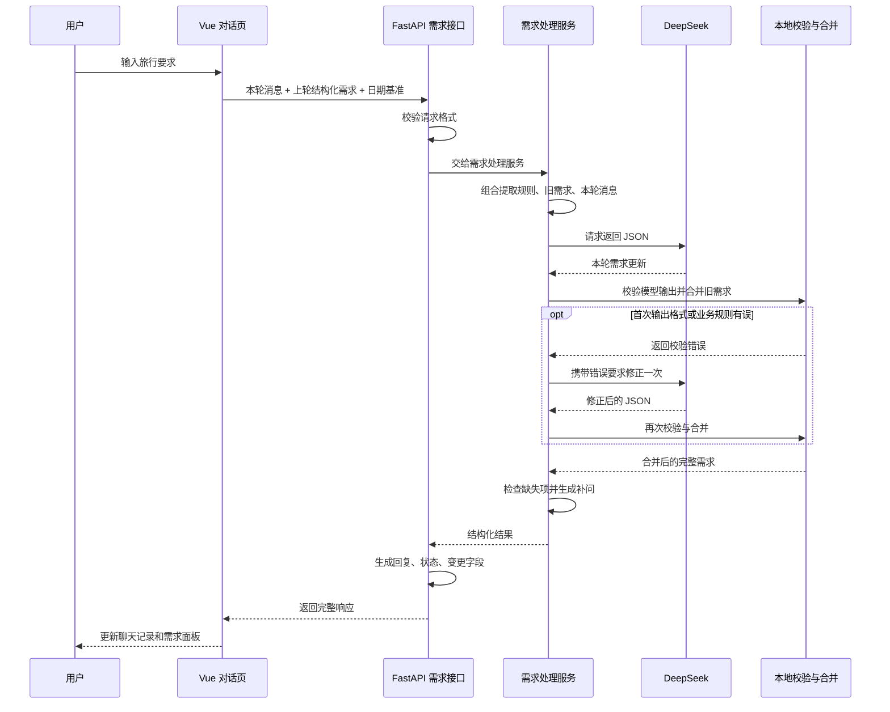
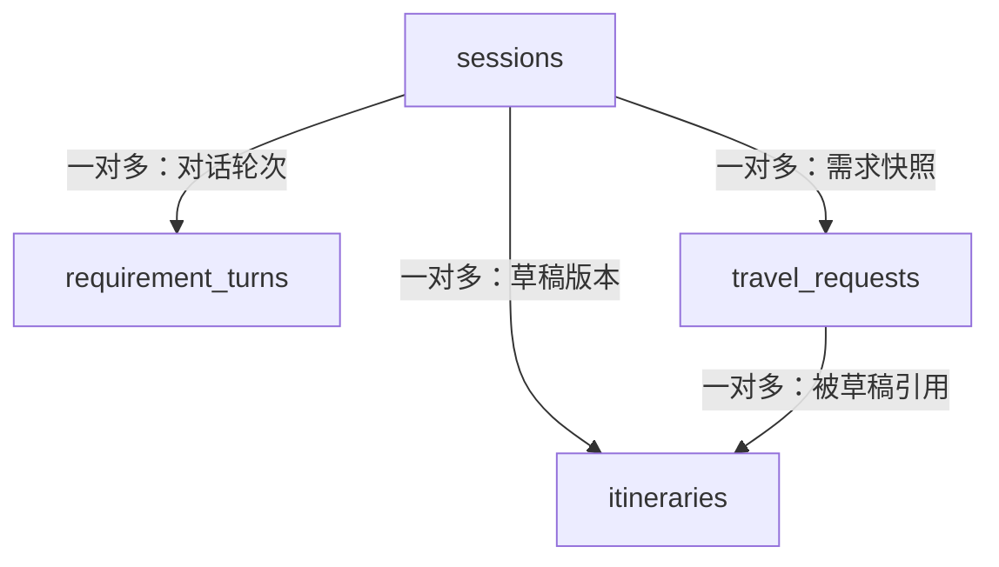

# TravelMindAI 架构设计说明

> 最近源码核对：2026-09-11（Asia/Shanghai）  
> 范围：当前工作区 `backend/app/`、`frontend/src/` 与数据库迁移文件。  
> 验证口径：2026-09-11开发验收已核对源码，当前全量216项测试通过；本地0002迁移及Vue构建已在第三小步验收，第六小步校正首次意图后，同题库30组36轮全部通过。具体证据见第10节。  
> 阅读配合：[07-各阶段开发说明](./07-各阶段开发说明.md) 讲开发顺序和逐文件写法；本文讲这些文件怎样组成系统。[02-技术设计文档](./02-技术设计文档.md) 包含目标设计，不能将其中尚未落地的模块视为当前能力。

## 1. 先用一句话理解现在的系统

TravelMindAI 当前采用 **Vue 对话前端 + FastAPI 模块化后端 + DeepSeek 需求理解 + PostgreSQL 数据存储**。

可以把它理解成一家旅行服务店：前端是接待窗口，后端是负责业务规则的工作人员，DeepSeek 是把自然语言翻译成表格的助手，数据库是保存会话与草稿的档案柜。

当前源码里有两条业务主线：

1. **M2 需求对话**：用户说话 → 读取已保存需求 → 模型提取本轮修改 → 程序校验与合并 → 保存完整一轮 → 页面显示；刷新页面时可以依据会话编号读取历史。
2. **M1 预算与草稿**：提交预算输入 → 程序计算预算 → 按需要保存需求快照和行程草稿 → 读取最新或指定版本。

**两条主线共享旅行会话，但聊天完成后还不会自动计算预算或生成行程草稿。** 页面说“需求完整”，仅表示必要需求已齐全。

聊天持久化已接入：前端调用按会话保存消息的接口，旧需求由后端读取。2026-09-11已完成本地数据库迁移、自动测试及浏览器刷新续聊验收；这些记录对应2026-09-11的开发验收。

## 2. 总体架构图

下图按基础需求抽取与 M1 预算、草稿接口展示系统关系。前端采用 Vue 3、TypeScript 和 Arco Design，后端采用 FastAPI。


[打开高清总图](./diagram/travelmind-overview.png) · [查看 Mermaid 图源](./diagram/travelmind-overview.mmd)

**图示范围：**图中的 `/requirements/messages` 是保留的无状态抽取接口；前端传回旧需求的方式对应这条基础路径。当前页面已改用按会话保存消息的持久化接口，新增的历史读取与聊天入库模块未画入本图，具体见第4节和第7节。图中没有聊天到数据库的连线，不代表当前聊天没有入库。

正文嵌入的是同一张浅色 Mermaid 总图的高清 PNG，保留全部16个模块与17条调用连线，避免阅读器预览或导出时动态图出现空白。图源保存在 `docs/diagram/travelmind-overview.mmd`；后续修改图源后同步重新生成同名 PNG，并检查正文中的图片显示。图源继续使用兼容 Mermaid 6.0.0 的语法。

## 3. 前端每部分负责什么

以下路径均相对于项目根目录。

| 文件 | 职责 | 通俗理解 |
|---|---|---|
| `frontend/src/main.ts` | 创建 Vue 应用、加载样式 | 打开接待窗口 |
| `frontend/src/App.vue` | 组件布局、输入法按键处理、模型配置状态 | 用户看见并操作的页面 |
| `frontend/src/useRequirementConversation.ts` | 会话编号、聊天展示状态、发送、刷新恢复、冲突处理 | 管理这一次对话的过程 |
| `frontend/src/components/RequirementPanel.vue` | 展示需求、缺失项、修改高亮、推算说明和 JSON | 展示不断填写的旅行需求表 |
| `frontend/src/api/requirements.ts` | 定义 TypeScript 契约并封装后端请求 | 页面与后端之间的传话接口 |
| `frontend/src/style.css` | 页面视觉样式 | 调整窗口的外观和排版 |
| `frontend/vite.config.ts` | 本地端口、Vue 插件和 API 代理 | 让开发中的前后端连起来 |

目前状态管理使用 Vue 的 `ref`、`computed` 与组合式函数，没有引入 Pinia。`App.vue` 使用一次会话组合函数；没有把不同对话的需求放在模块级共享变量里。

发送采用普通 HTTP 响应，前端等待期间显示处理状态，没有流式打字输出。Enter 发送，Shift+Enter 换行，中文输入法选词时的回车不触发发送。

## 4. 一条消息的完整流程

### 4.1 需求抽取时序与当前持久化路径

下面先展示无状态抽取接口的核心处理过程，其中旧需求和日期基准由调用方提供。



当前页面的持久化接口复用这套提取、校验、合并和补问逻辑，但旧需求与日期基准由后端读取数据库取得，成功保存整轮后才向前端返回成功。图中的“本地校验与合并”是后端程序内的处理步骤，不是独立部署的服务。

**当前持久化路径按以下顺序执行：**

1. 页面第一次真正发送时创建旅行会话，空白页面不会立即创建数据库记录。
2. 页面为本次发送生成 `message_id`，同时携带自己已知的 `expected_revision`。
3. 后端从数据库读取上下文，先检查该消息是否已经保存、页面是否基于旧版本发送。
4. 从历史中找到最近一次有效旅行需求，并沿用首轮记录的日期基准。
5. 复用原有抽取入口，调用 DeepSeek，执行格式校验、业务校验和新旧需求合并。
6. 模型调用结束后才进入追加事务，锁住当前会话行，再检查版本并写入一整轮。
7. 数据库提交成功后才返回成功；前端据此更新右侧需求面板。

等待模型期间没有持有追加事务或会话行锁。两个请求同时生成答案时，提交阶段仍会复查版本，防止较晚返回的旧答案覆盖新需求。

### 4.2 四类编号不要混淆

| 名称 | 作用 |
|---|---|
| `session_id` | 标识整段旅行会话，关联多轮消息与草稿 |
| `message_id` | 标识一次发送；超时重试保留同一个编号，避免重复保存 |
| `revision` / `expected_revision` | 已保存轮数 / 本轮发送依据的轮数，用于并发冲突检查 |
| HTTP `request_id` | 排查一次 HTTP 请求的追踪编号，不是旅行会话编号 |

已经提交的消息重试会复用原结果，不再次执行提取。并发请求在第一次提交前仍可能分别调用模型，因此“防止重复保存”不等于任何并发情况下都只调用一次模型。

### 4.3 原来的无状态接口仍然存在

`POST /api/v1/requirements/messages` 仍接收 `message`、`previous`、`reference_date`，完成提取并返回结果，不自动写数据库。

当前 Vue 页面已经改用 `POST /api/v1/sessions/{session_id}/requirement-messages`。这条路径不接受浏览器提交旧需求，旧需求由后端从已保存历史中取得。两条路径复用同一套抽取、合并、补问规则。

## 5. 自然语言怎样变成结构化需求

### 5.1 核心文件与数据格式

| 文件 | 责任 |
|---|---|
| `backend/app/schemas/requirement.py` | 完整旅行需求与提取结果格式、字段和业务约束 |
| `backend/app/schemas/requirement_update.py` | 本轮更新格式，以及清空字段、删除列表项的表达 |
| `backend/app/schemas/requirement_chat.py` | 原有无状态聊天接口的请求和响应格式 |
| `backend/app/schemas/requirement_history.py` | 持久化消息、已保存轮次和历史响应格式 |
| `backend/app/services/requirement_prompt.py` | 提取规则、日期基准、JSON schema 与提示词 |
| `backend/app/services/requirement_service.py` | 模型调用、输出校验、一次修正、合并和缺失项检查 |
| `backend/app/services/requirement_merge.py` | 确定性的覆盖、追加、移除、清空和日期协调 |

完整需求中主要有以下字段：

| 字段 | 含义 |
|---|---|
| `intent` | 当前需求的业务意图 |
| `destination` / `origin` | 目的地 / 出发地 |
| `start_date` / `end_date` / `days` | 开始日期 / 结束日期 / 天数 |
| `travelers` / `total_budget` | 出行人数 / 全团人民币总预算 |
| `pace` | 轻松、均衡或紧凑 |
| `interests` | 兴趣 |
| `dietary` | 饮食要求 |
| `lodging_preferences` | 住宿偏好 |
| `hard_constraints` / `excluded_items` | 必须遵守的限制 / 明确排除的项目 |
| `assumptions` | 推算或解释依据 |

当前阶段支持 2～5 天、1～8 人和正数人民币预算。金额使用字符串传输，并通过 Decimal 规则校验，避免二进制浮点金额误差。

模型不能随便省略完整提取格式要求的字段：未知标量使用 `null`，未知列表使用 `[]`，额外字段会被拒绝。

### 5.2 多轮合并的规则

例如第一轮得到“杭州、3天、2人、5000元”，第二轮只说“改成3个人”，合并后应为“杭州、3天、3人、5000元”。

| 本轮表达 | 程序处理 |
|---|---|
| “人数改成3人” | 新值覆盖旧值 |
| 没再提目的地 | 保留旧目的地 |
| “还想去博物馆” | 在对应列表追加并去重 |
| “不要博物馆了” | 通过 `remove_items` 删除指定旧项目 |
| “预算先不定了” | 通过 `clear_fields` 明确清空预算 |
| 首轮给开始日及天数，或修改日期/天数 | 协调相关日期，并记录推算依据；首日计入，结束日＝开始日＋天数－1 |

在本轮更新语义中，`null` 或空列表表示没有提供更新，不能自动当成清空；明确清空需要 `clear_fields`。这样能区分“这次没说预算”和“明确取消预算”。

同一字段同时被清空和赋值、要求删除不存在的项目、日期与天数冲突等，会触发校验。输出格式和合并错误共享最多一次模型修正额度。

在合并之前，`extract_requirements`先检查无档案的删除/清空，再把无previous时的modify_trip校正为plan_trip。判断依据是已有有效需求，而不是会话轮数。后续真实修改仍为modify_trip；other等非规划意图不转换。`message_intent`表示经上下文规则校正后的本轮业务意图，HTTP回复、历史保存及评测使用同一结果；当前没有单独保存模型原始意图标签。

首轮只给开始日及天数时，`merge_requirements`也调用`reconcile_dates`补结束日；明确清空仍优先。首轮已给完整首尾日期时继续由`build_result`补天数。10月1日开始三天为1日至3日；最后一天早上返程不改变自然日数。到离时间与可游玩时段尚未建模，当前不生成交通接驳或每日活动。

### 5.3 谁负责判断信息齐不齐

程序检查目的地、天数、人数、总预算；日期齐全时可按包含首尾两天的方式推导天数。当前出发地不是必要条件。

接口状态有三种：

- `needs_clarification`：仍缺信息，程序生成集中补问。
- `complete`：必要需求齐全，可以继续修改；尚未生成每日行程。
- `unsupported`：当前意图不属于旅行规划或修改，本轮可以保存文字，但不会替换此前有效旅行需求。

右侧面板来自 `result.extraction`；聊天文字来自 `reply`；修改提示来自 `changed_fields`。这些是同一次响应的不同部分。

## 6. 模型调用与“记忆”边界

```text
需求服务的 ModelClient 接口
    → DeepSeekClient.generate_json()
    → LangChain ChatOpenAI.invoke()
    → OpenAI 兼容客户端 / httpx
    → DeepSeek Chat Completions API
```

`ChatOpenAI` 是接入类名，实际提供方由地址和密钥决定。当前 `base_url` 指向 DeepSeek，模型名称来自配置，源码默认值为 `deepseek-v4-pro`。

当前开启 JSON 输出模式、关闭思考模式，使用同步调用，没有接入 SSE 或流式输出。SDK 自动重试关闭；输出校验失败的修正由需求服务控制，网络失败不会走这条修正循环。默认网络超时为30秒，前端停止等待的超时为90秒，两者不是同一层的限制。

**保存了聊天记录，不代表把整段聊天记录都发给模型。** 当前模型上下文仍主要由系统规则、最近有效的结构化需求、本轮原话组成；修正时再附加无效输出和校验原因。数据库历史用于恢复页面及查找最新有效需求。

DeepSeek 负责理解自然语言；确定性的日期协调、需求合并、缺项检查、预算计算和数据库保存由程序负责。当前没有把 LangGraph、Redis 记忆或 RAG 接入这条正式调用链，`old_learn/` 中的学习示例不代表产品功能已经接通。

## 7. 数据库结构与保存边界

### 7.1 当前源码中的业务表关系



| 表 | 保存内容 | 对应代码 |
|---|---|---|
| `sessions` | 旅行会话编号、标题、状态、时间及预留 thread_id | `backend/app/models/trip.py` |
| `requirement_turns` | 每轮消息编号、轮次、原话、回复、参考日期和完整需求响应 | `backend/app/models/requirement_turn.py` |
| `travel_requests` | M1 草稿保存路径产生的需求 JSON 快照和版本 | `backend/app/models/trip.py` |
| `itineraries` | 行程草稿 JSON、版本、状态和关联需求编号 | `backend/app/models/trip.py` |
| `alembic_version` | 数据库已应用的结构版本，属于迁移管理表 | Alembic 管理 |

`requirement_turns.response_json` 保存整个聊天响应，原话在 `result.original_message` 中；一行是一整轮，而不是用户消息和助手消息分别各存一行。

这张新表不等于 `travel_requests`：聊天需求快照随轮次保存，M1 需求快照则随草稿保存。当前没有自动把一轮聊天同步转换成 M1 的需求和行程记录。

`itineraries.request_id` 是关联需求快照的数据库外键，与 HTTP 请求追踪的 `request_id` 含义不同。会话中的 `thread_id` 是预留字段，并不表示已经实现 LangGraph 检查点。

### 7.2 两种保存服务

**对话保存服务 `RequirementHistoryService`：**

- 按会话读取有序历史；读取不调用模型。
- 在短事务中锁定会话行，检查消息是否重复以及轮次是否冲突。
- 整轮结果和会话更新时间一起提交；失败不会留下半轮结果。
- `(session_id, revision)` 与 `(session_id, message_id)` 分别限制轮次重复和消息重复。

**草稿保存服务 `TripService`：**

- 需求快照和行程草稿在同一个事务里保存。
- 同会话通过行锁协调版本分配。
- 两份快照和会话更新时间一起提交或回滚。
- 读取最新或指定行程版本时，取出实际关联的需求快照。

M1 草稿接口仍接收预算输入，由固定费率规则计算预算后保存。当前草稿中的逐日安排为 `days: []`，尚未产生景点、交通和每日活动。

### 7.3 页面刷新后从哪里恢复

| 数据 | 保存位置 | 刷新时的行为 |
|---|---|---|
| 已提交原话、回复、需求快照 | PostgreSQL 的 `requirement_turns` | 后端读历史，前端重新展示 |
| 当前会话编号 | 浏览器 `sessionStorage` | 当前标签页刷新后用于定位会话 |
| 待确认发送的原话、消息编号、依据版本 | 浏览器 `sessionStorage` | 恢复时检查是否已保存，必要时沿用编号重试 |
| 消息气泡、需求对象、错误和加载状态 | Vue 页面内存 | 根据历史重新构建，历史字段高亮清除 |
| 尚未提交的普通输入草稿 | Vue 页面内存 | 没有通用的自动保存恢复机制 |
| M1 草稿快照 | PostgreSQL | 通过草稿接口单独读取 |

当前没有完整的历史会话列表或账号归属体系。`sessionStorage` 不保证关闭标签页后还能自动找回；数据库记录仍然存在，但页面需要会话编号才能读取。“重新开始”清除当前页面的会话关联，下一次发送创建新会话，不删除数据库旧记录。

恢复失败时页面保留会话编号并阻止继续发送，避免在空上下文上覆盖旧需求。版本冲突返回409后，页面重新读取历史，再让用户确认并重新发送。

### 7.4 迁移状态的口径

源码包含 `0001_business_tables` 与 `0002_requirement_turns`，第二版迁移创建对话轮次表。2026-09-11已在本机配置的PostgreSQL执行upgrade head；current为`0002_requirement_turns (head)`，alembic check未发现差异。真实业务库只升级，回滚和故障注入仅在随机临时schema中测试。

当前就绪检查代码已经检查四张业务表及字段。数据库启用但未完成新迁移时，可能返回未就绪。数据库面板可以用 PyCharm 的数据库工具连接已有 PostgreSQL；管理工具不是业务应用的一部分。

### 7.5 当前表的详细数据字典

以下按2026-09-11的ORM和`0001/0002`迁移文件核对。此次补充只修改文档，未重新连接数据库或运行迁移；第7.4节和第10节保留此前开发验收记录。

四张业务表的下列字段均为`NOT NULL`。UUID主键由应用的`uuid4`生成，当前迁移没有为其配置数据库端`gen_random_uuid()`默认值；不能把两种生成方式混写。时间字段为带时区的`TIMESTAMPTZ`。

**`sessions`：一段旅行会话。迁移：`0001_business_tables`。**

| 字段 | 数据库类型 | 含义、默认值及约束 |
|---|---|---|
| `id` | UUID | 主键；应用生成 |
| `thread_id` | UUID | 预留工作流编号；应用生成，唯一；尚无LangGraph检查点 |
| `title` | VARCHAR(200) | 会话标题；无数据库默认值 |
| `status` | VARCHAR(20) | 默认`active`；CHECK仅允许`active/archived` |
| `created_at` | TIMESTAMPTZ | 创建时间，数据库默认`now()` |
| `updated_at` | TIMESTAMPTZ | 默认`now()`；保存草稿或对话时由服务显式更新 |

索引由主键和`thread_id`唯一约束建立；目前没有`user_id`、登录归属或用户外键。

**`requirement_turns`：每轮已提交的对话和需求结果。迁移：`0002_requirement_turns`。**

| 字段 | 数据库类型 | 含义、默认值及约束 |
|---|---|---|
| `id` | UUID | 主键；应用生成 |
| `session_id` | UUID | 外键→`sessions.id`；无级联删除 |
| `message_id` | UUID | 浏览器生成的一次发送编号；同一次重试沿用 |
| `revision` | INTEGER | 会话内轮次；服务分配，CHECK要求≥1 |
| `response_json` | JSONB | 整轮响应，无默认值；CHECK要求JSON对象 |
| `created_at` | TIMESTAMPTZ | 默认`now()` |

唯一约束：`(session_id, revision)`防止同轮重复，`(session_id, message_id)`防止同次发送重复。两者有对应唯一索引。JSON内部包含`result.original_message`、`result.extraction`、`result.reference_date`、`reply`、`status`等；这些是JSON键，不是独立数据库列。

**`travel_requests`：保存预算草稿时产生的需求快照。迁移：`0001_business_tables`。**

| 字段 | 数据库类型 | 含义、默认值及约束 |
|---|---|---|
| `id` | UUID | 主键；应用生成 |
| `session_id` | UUID | 外键→`sessions.id`；无级联删除 |
| `version` | INTEGER | 服务分配的需求版本；CHECK要求≥1 |
| `request_json` | JSONB | 需求快照，无默认值；CHECK要求JSON对象 |
| `created_at` | TIMESTAMPTZ | 默认`now()` |

唯一约束：`(session_id, version)`与`(id, session_id)`。第二项为行程的复合外键提供目标，保证行程引用的需求属于同一个会话。

**`itineraries`：版本化行程草稿。迁移：`0001_business_tables`。**

| 字段 | 数据库类型 | 含义、默认值及约束 |
|---|---|---|
| `id` | UUID | 主键；应用生成 |
| `session_id` | UUID | 外键→`sessions.id`；无级联删除 |
| `request_id` | UUID | 所依据的需求快照，不是HTTP追踪编号 |
| `version` | INTEGER | 服务分配的行程版本；CHECK要求≥1 |
| `status` | VARCHAR(20) | 默认`draft`；CHECK允许`draft/confirmed`，当前尚无确认接口 |
| `itinerary_json` | JSONB | 草稿内容，无默认值；CHECK要求JSON对象 |
| `created_at` | TIMESTAMPTZ | 默认`now()` |

唯一约束：`(session_id, version)`。复合外键：`(request_id, session_id)`→`travel_requests(id, session_id)`，无级联删除。当前JSON保存预算和空的逐日活动列表，尚无`itinerary_days/itinerary_spots`明细表。

`alembic_version`是迁移管理表：`version_num VARCHAR(32)`、非空主键，由Alembic管理；业务代码不要把它当作需求或行程版本。

### 7.6 用户提供的后续参考表（尚未建表）

来源：用户2026-09-11提供的ER截图与五份CREATE TABLE参考。以下按文字SQL保留字段，清理粘贴产生的`&#x20;`、转义下划线等展示字符；不是可直接执行的迁移。截图另外出现`USER_PREFERENCE`和`BOOKING`，尚未提供完整DDL。

参考关系为：一个用户有多趟旅行，一趟旅行有多天，一天有多个按顺序安排的景点；每个安排引用景点库中的一个景点。它表达目标业务，但还要衔接当前会话和行程版本。

下表“可空”严格按参考SQL记录；`DEFAULT`不等于`NOT NULL`。“无”表示未定义默认值。后续实际采用的类型和约束须在对应开发小步确定，再写新的迁移。

**`users`：用户账号与长期偏好。**

| 字段 | 参考类型 | 可空／默认值 | 含义 |
|---|---|---|---|
| `id` | UUID | 否／`gen_random_uuid()` | 主键 |
| `username` | VARCHAR(50) | 否／无 | 唯一用户名 |
| `email` | VARCHAR(255) | 否／无 | 唯一邮箱 |
| `password_hash` | VARCHAR(255) | 否／无 | 密码哈希，不能保存明文密码 |
| `avatar_url` | VARCHAR(500) | 是／无 | 头像地址 |
| `preferences` | JSONB | 是／`{}` | 长期偏好 |
| `risk_level` | VARCHAR(20) | 是／`moderate` | 参考风险偏好；尚无本项目业务定义 |
| `created_at`、`updated_at` | TIMESTAMP | 是／`CURRENT_TIMESTAMP` | 创建与修改时间 |

参考索引：主键、用户名/邮箱唯一约束、`email`普通索引、`created_at`索引。邮箱普通索引与唯一约束产生的索引重复，应在实际设计中去掉重复项。`preferences`与截图中的独立偏好表先选一种事实来源，不同时维护两份长期偏好。

**`trips`：一趟旅行的业务主体。**

| 字段 | 参考类型 | 可空／默认值 | 含义 |
|---|---|---|---|
| `id` | UUID | 否／`gen_random_uuid()` | 主键 |
| `user_id` | UUID | 否／无 | 外键→`users.id`，参考为级联删除 |
| `title` | VARCHAR(200) | 否／无 | 旅行标题 |
| `destination` | VARCHAR(200) | 否／无 | 目的地 |
| `start_date`、`end_date` | DATE | 否／无 | 起止日期 |
| `budget` | INTEGER | 是／0 | 预算；原SQL未说明元还是分 |
| `status` | VARCHAR(20) | 是／`planning` | 旅行状态；原SQL未限制枚举 |
| `requirements` | JSONB | 是／`{}` | 旅行要求 |
| `generated_plan` | JSONB | 是／无 | 生成的行程 |
| `created_at`、`updated_at` | TIMESTAMP | 是／`CURRENT_TIMESTAMP` | 创建与修改时间 |

参考索引：`user_id`、`status`、`(start_date, end_date)`。它不能直接替换当前`sessions`：会话允许用户只说“想去杭州”，尚无日期或预算。`trips`与会话之间的关系需在旅行主体功能落地时确定；现有版本化`itineraries`继续保留，不把历史压缩成一个反复覆盖的`generated_plan`。

**`itinerary_days`：行程中的一天。**

| 字段 | 参考类型 | 可空／默认值 | 含义 |
|---|---|---|---|
| `id` | UUID | 否／`gen_random_uuid()` | 主键 |
| `trip_id` | UUID | 否／无 | 外键→`trips.id`，参考为级联删除 |
| `day_number` | INTEGER | 否／无 | 第几天 |
| `date` | DATE | 否／无 | 当天日期 |
| `theme` | VARCHAR(100) | 是／无 | 当天主题 |
| `summary` | TEXT | 是／无 | 当天概要 |
| `weather_info` | JSONB | 是／无 | 天气信息 |
| `created_at` | TIMESTAMP | 是／`CURRENT_TIMESTAMP` | 创建时间 |

参考索引：`trip_id`。适配当前版本模型时，建议关联具体`itineraries.id`，并约束`UNIQUE(itinerary_id, day_number)`和`day_number >= 1`；若不采用版本关联，也至少要防止同一旅行重复出现相同day_number。具体外键调整属于后续设计，不在此次文档更新中建表。

**`itinerary_spots`：一天内的某一次景点安排。**

| 字段 | 参考类型 | 可空／默认值 | 含义 |
|---|---|---|---|
| `id` | UUID | 否／`gen_random_uuid()` | 主键 |
| `day_id` | UUID | 否／无 | 外键→`itinerary_days.id`，参考为级联删除 |
| `spot_id` | UUID | 否／无 | 外键→`spots.id` |
| `order_index` | INTEGER | 否／无 | 当天访问顺序 |
| `start_time`、`end_time` | TIME | 是／无 | 计划开始、结束时间 |
| `duration_minutes` | INTEGER | 是／120 | 预计停留分钟数 |
| `transport_to_next` | VARCHAR(100) | 是／无 | 去下一站的交通方式 |
| `estimated_cost` | INTEGER | 是／0 | 预计费用；原SQL未说明金额单位 |
| `notes` | TEXT | 是／无 | 补充说明 |
| `created_at` | TIMESTAMP | 是／`CURRENT_TIMESTAMP` | 创建时间 |

参考索引：`day_id`、`(day_id, order_index)`。后续应使顺序组合唯一，明确从0还是1编号，约束停留时长和金额范围。相同景点可以多次安排，不应仅用`spot_id`作为安排记录的主键。跨午夜活动需定义日期语义，不能只用TIME比较大小处理。

**`spots`：景点基础资料库。**

| 字段 | 参考类型 | 可空／默认值 | 含义 |
|---|---|---|---|
| `id` | UUID | 否／`gen_random_uuid()` | 主键 |
| `name` | VARCHAR(200) | 否／无 | 中文或主要名称 |
| `name_en` | VARCHAR(200) | 是／无 | 英文名称 |
| `city`、`country` | VARCHAR(100) | 否／无 | 城市、国家 |
| `category` | VARCHAR(50) | 否／无 | 景点分类 |
| `latitude` | DECIMAL(10,8) | 是／无 | 纬度 |
| `longitude` | DECIMAL(11,8) | 是／无 | 经度 |
| `address` | VARCHAR(500) | 是／无 | 地址 |
| `description` | TEXT | 是／无 | 景点介绍 |
| `ticket_info` | JSONB | 是／`{}` | 门票资料 |
| `rating` | DECIMAL(3,2) | 是／0 | 评分，评分尺度需定义 |
| `review_count` | INTEGER | 是／0 | 评价数量 |
| `recommend_duration` | INTEGER | 是／120 | 推荐停留分钟数 |
| `tags`、`images` | JSONB | 是／`[]` | 标签与图片地址列表 |
| `opening_hours` | JSONB | 是／`{}` | 营业时间 |
| `best_season` | JSONB | 是／`[]` | 推荐季节 |
| `latitude_rad`、`longitude_rad` | INTEGER | 是／0 | 名称似乎表示弧度，参考未说明算法和单位，不直接采用 |
| `embedding_id` | INTEGER | 是／无 | 向量关联编号，不是向量本身 |
| `created_at`、`updated_at` | TIMESTAMP | 是／`CURRENT_TIMESTAMP` | 创建与修改时间 |

参考普通索引：`city`、`country`、`category`、`rating DESC`。参考中的`ivfflat (embedding_id vector_cosine_ops)`存在类型错误，不能直接执行，详见下一节。

截图中的`USER_PREFERENCE`没有字段，暂只记录概念；`BOOKING`列出了`id/trip_id/type/provider/details/price/status`，但没有完整类型约束和接口范围。预订支付当前不在首版功能中，不据此增加预订表或预订能力。

### 7.7 参考表落地前必须对齐的事项

| 项目 | 问题与本项目处理方向 |
|---|---|
| 建表依赖 | 参考SQL中`itinerary_spots`先于`spots`，直接按粘贴顺序执行会找不到外键目标。真正迁移应先建用户/旅行/景点父表，再建逐日和安排子表 |
| 向量索引 | `INTEGER embedding_id`只有编号，没有向量。pgvector索引应作用于实际向量列；不能对整数列使用`vector_cosine_ops`。参见[pgvector官方说明](https://github.com/pgvector/pgvector#ivfflat) |
| 向量库选择 | 现有[技术设计18.4及ADR-007](02-技术设计文档.md)规划Milvus，并用`poi_id`关联景点业务资料。此次参考没有改变该决定，不另引入pgvector；景点名称`spots/pois`须在M3统一，避免建两份同义资料库 |
| 重复索引 | PostgreSQL的UNIQUE约束会自动创建唯一B-tree索引，`users.email`一般无需再建同列普通索引。参见[PostgreSQL约束文档](https://www.postgresql.org/docs/18/ddl-constraints.html#DDL-CONSTRAINTS-UNIQUE-CONSTRAINTS) |
| 金额与缺失值 | 先统一人民币单位。可采用`NUMERIC(...,2)`保存元，或明确命名为`*_cents`的整数保存分；不使用浮点金额。需求未填写用NULL，不能默认0冒充已填写；未知门票或费用也不能默认免费 |
| 日期与草稿 | 当前支持仅天数、无具体日期的会话。参考的非空日期只能用于已确定日期的实体，不能阻止需求草稿保存；按实体状态分层校验。当前2～5天范围不因录入参考表而改变 |
| 行程版本 | 每日和景点明细需绑定具体行程版本。`generated_plan`、`itinerary_json`和明细表若同时保留，要明确谁是唯一事实来源、其余怎样生成，避免分别编辑后不一致 |
| 时间字段 | 新业务表优先与现有TIMESTAMPTZ保持一致。`updated_at DEFAULT CURRENT_TIMESTAMP`只提供插入默认值，不会在每次UPDATE时自动变化；需要服务显式更新或明确的触发器策略 |
| JSON与状态 | JSON对象/数组补类型CHECK，空值策略和字段契约明确；状态、评分尺度及数值范围按实际功能补CHECK。`risk_level`当前语义不明确，保留参考记录，不提前接入业务 |
| 景点事实 | 纬度限制[-90,90]、经度[-180,180]；记录坐标系。资料应有来源URL、采集/核验时间，门票、天气等动态事实注明有效期；无资料与0分/免费不能混淆 |
| 弧度字段 | 若`*_rad`确实表示弧度，普通整数会丢失小数；未说明定点缩放约定前不采用。可由经纬度按需计算，避免保存可推导的重复字段 |
| 删除策略 | 参考中的级联删除只是参考方案。现有记录没有级联删除；用户注销、景点下架、旅行删除时是否保留历史，需要另行确定，不能顺带改旧外键 |

后续每落地一张表，都把已决定的字段、约束和迁移版本移入“当前数据字典”，并修订参考表的状态；不是把整份参考SQL一次性放进数据库。

## 8. 接口地图

下面所有路径都以 `/api/v1` 开头。

| 方法与路径 | 作用 | 当前聊天页面是否使用 |
|---|---|---|
| `GET /requirements/status` | 返回模型配置标志与名称，不调用模型 | 是 |
| `POST /sessions` | 创建旅行会话 | 首次发送时 |
| `GET /sessions/{session_id}` | 读取会话基本信息 | 当前恢复路径不依赖它 |
| `GET /sessions/{session_id}/requirement-messages` | 读取已保存完整历史 | 是 |
| `POST /sessions/{session_id}/requirement-messages` | 基于服务端历史提取并保存一轮 | 是 |
| `POST /requirements/messages` | 无状态提取，由调用方提供 previous | 页面已切换到持久化路径 |
| `POST /budget/estimate` | 单独计算预算 | 否 |
| `POST /sessions/{session_id}/drafts` | 计算预算并保存草稿 | 否 |
| `GET /sessions/{session_id}/drafts` | 读取最新或指定版本草稿 | 否 |
| `GET /health/live` | 应用存活检查 | 非聊天请求链 |
| `GET /health/ready` | 检查配置后的数据库业务表是否可访问 | 非聊天请求链 |

`/requirements/status` 的“已配置”不等于远端模型已经连通。数据库未配置时纯预算计算和无状态提取可以分别在其必要条件满足时工作，但当前页面的持久化对话需要数据库。

## 9. 应用入口、配置与错误

后端入口是 `app.main:create_app`，由 Uvicorn 使用工厂方式创建。`main.py` 注册各组路由，在应用生命周期中管理数据库连接池，并统一处理异常。

配置统一由 `backend/app/config.py` 的 Settings 管理。环境文件需要明确指定，不自动扫描根目录学习配置。DeepSeek 密钥和数据库连接地址保留在后端，本文不记录真实密码、密钥或包含密码的连接串。

前端开发配置是 `127.0.0.1:5173`，Vite 将 `/api` 转发给 `127.0.0.1:8000`；构建预览端口是4173。2026-09-11开发验收时已启动8000后端与5173前端，并通过真实页面操作确认联通；4173预览端口本次没有启动。完整启动步骤以README与07文件为准。

常见错误处理包括：请求格式错误422、会话不存在404、对话版本冲突409、模型输出校验最终失败502、模型或数据库不可用503。错误响应包含可展示的消息和请求追踪编号；模型原始错误内容不会直接作为完整响应返回页面。

需求服务现按上下文生成失败提示：没有previous时引导先建立旅行档案、从目的地开始；已有需求时说明原需求已保留。无历史的删除/清空在合并前直接提示，不占用一次模型修复。沿用RequirementExtractionError及502错误契约，由原前端提示区域展示，不新增表或状态。

对模型识别出的超范围日期，提示词要求other意图、days/end_date为空，在assumptions保留原跨度及原因，使不支持请求也能通过schema校验。HTTP的unsupported回复由程序说明单目的地、2～5天、1～8人和人民币预算范围，已有需求保持原值。该意图识别仍依赖模型，若输出再次违反schema，最多修复一次后返回既有错误；不能保证任意自然语言都能正确分类。

Pydantic 的 schema 是“数据填写规则”，SQLAlchemy 的 model 是“数据库表定义”，service 是“实际业务处理”。这三层名称相近，但不是同一种东西。

## 10. 当前边界与验证证据

### 10.1 新增的独立评测路径

第四小步新增的评测运行在命令行，不属于在线HTTP请求链，不新增业务表或改变第7节数据字典。

**人工题库 → scripts/evaluate_requirements.py → scripts/requirement_eval.py → 正式extract_requirements/merge_requirements → DeepSeek → 逐字段评分 → JSON与Markdown报告。**

| 文件 | 作用 |
|---|---|
| `backend/evals/requirements.v1.json` | 固定30组36轮人工标注，含参考日期及中文标注理由 |
| `backend/scripts/requirement_eval.py` | 校验题库、维护实际多轮上下文、比较字段、统计分母和分子 |
| `backend/scripts/evaluate_requirements.py` | 显式模型运行与报告输出，默认只校验不联网 |
| `backend/tests/test_requirement_eval.py` | 防止漏题、错误值、模型失败或金标准泄漏造成虚假高分 |

标准答案只供评分，不传给模型。每组从空需求开始，组内多轮采用实际前次成功结果；失败也计分。金额按Decimal数值比较，列表仅忽略顺序，不由另一个模型猜同义。完整报告保存题库和提示词哈希、模型名、依赖版本、时间、调用计数及每个错误项。

评测不调用保存接口，也不写36条会话记录。在线前端继续沿用原有服务；脚本数据的固定日期与网页新会话的当前日期须区分。

### 10.2 当前证据


| 能力 | 当前证据 | 验证限制 |
|---|---|---|
| Vue对话及需求面板 | TypeScript检查与生产构建通过，真实网页展示和刷新恢复通过 | 未验收移动设备和完整E2E自动化套件 |
| 单模型提取、多轮合并、补问 | 第六小步同题库真实DeepSeek评测，30组36轮全部通过，36次调用且无修复 | 人工开发集，评分包含程序校正；不是模型原始意图准确率 |
| 聊天保存、恢复、版本冲突与重试 | 正式本地库0002迁移完成；HTTP、事务回滚、幂等及并发冲突自动测试通过；后端重启后网页读取恢复 | 不含账号归属、历史列表和跨设备找回；并发进行中的重复模型调用未合并 |
| 固定规则预算、版本化草稿保存 | 本轮全量回归包含真实PostgreSQL草稿测试 | 本次未手工检查正式库既有草稿的全部内容 |
| 自动每日行程、实时价格、LangGraph、RAG、Redis记忆和多模型路由 | 当前主链路未接入 | 不作为本小步成果 |

第四小步及提示改进最终检查：**208项测试通过、0跳过、1条既有依赖弃用提示**；其中PostgreSQL测试在随机临时schema运行并清理。新增8项判卷/CLI测试和3项错误提示HTTP测试，变更文件Ruff通过，mypy共38文件通过，compileall通过。第三小步Vue构建通过；本小步没有修改前端，实际复核发送和保存成功。

真实浏览器另验证了：断开本任务后端时保留卡片并禁止发送；重启后重新读取恢复；重新开始后旧人数、预算和出发地不会带入苏州会话。网页样例不代表准确率评测。逐文件步骤及命令见[07开发说明](07-各阶段开发说明.md)。

真实模型基线：四项字段（目的地、days、人数、预算）132/132；其中已提供值115/115、应未知17/17。另标注开始/结束日期11/12，意图35/36。共38次模型调用、2轮修复、1轮最终输出失败；该失败没有从评分中剔除。

上述基线曾暴露M2-16首次日期遗漏和M2-22六天输入未正常返回unsupported，第五小步已修复并使用同一题库复核。原报告保留：[基线Markdown](../backend/evals/reports/m2-baseline-20260911.md) · [逐字段JSON](../backend/evals/reports/m2-baseline-20260911.json)。

第五小步最终自动检查：**214项测试通过、0跳过、1条既有依赖弃用提示**；新增四个首轮日期边界用例及两个超范围HTTP用例，真实PostgreSQL回归通过。变更文件Ruff及38文件mypy通过。真实模型新报告为29/30组、35/36轮，四项字段132/132、日期12/12，36次调用且无修复。M2-20意图分类失误如实保留，M2仍进行中。题库SHA-256与原基线一致，未修改标注：[本次Markdown](../backend/evals/reports/m2-date-fix-20260911.md) · [本次JSON](../backend/evals/reports/m2-date-fix-20260911.json)。

第五小步真实前端复核：10.1开始三天显示2026-10-01～2026-10-03；改成1日至6日后展示范围引导并保留原需求；刷新后恢复两轮聊天与原卡片。前端源码没有变更，本次没有重复执行Vue构建。

第六小步验收：新增完整/缺预算两项首轮误标回归，扩展真实数据库HTTP测试验证校正结果保存、刷新重读及后续修改。最终216项测试通过、0跳过，1条既有依赖弃用提示；变更文件Ruff与38文件mypy通过。题库及提示词未变，四项必要字段132/132、日期12/12、最终业务意图36/36；历史两份失败报告保留。M2按实施文档当前标准完成，后续M3及交通时间/每日行程功能尚未接入。[第六小步报告](../backend/evals/reports/m2-intent-fix-20260911.md) · [逐字段JSON](../backend/evals/reports/m2-intent-fix-20260911.json)。

第六小步真实前端：M2-20原话成功建档，刷新后“改成三个人”更新人数，杭州、3天、5000元及轻松节奏保留，两轮已保存。正式后端已重启；没有修改前端源码或重跑Vue构建。原始模型标签不在页面展示，因此意图校正本身由上述离线复现与真实数据库HTTP断言验证。

## 11. 后续如何同步维护本文

本文是持续更新的当前架构说明，不另建一份新的阶段架构文件。后续每个涉及架构的开发小步，在交付前同步检查：

1. **增加或拆分模块**：更新总体图、职责表和真实文件路径。
2. **修改接口或数据契约**：更新接口地图、请求字段、响应状态和调用顺序。
3. **改变会话或存储方式**：更新上下文来源、表关系、迁移文件、事务与刷新恢复说明。
   新增或修改表还须同步逐字段数据字典：字段名、数据库类型、中文含义、可空性、默认值、主外键、唯一/检查约束、索引、金额/时间单位及迁移版本。明确哪些来自参考、哪些已经实现、哪些已执行迁移。
4. **接入模型、工具或工作流**：更新外部调用链，明确哪些工作由模型完成、哪些由程序完成。
5. **完成运行验收**：更新核对日期和验证口径；区分源码已实现、测试通过、真实服务验证。
6. **替换旧流程**：改写对应的当前描述，不能只在末尾追加新结论却保留相互矛盾的“当前行为”。

07文件继续负责开发顺序、逐文件功能与教学说明；08文件负责整体结构与模块关系。源码和文档冲突时，先核对当前源码与运行证据，再修正文档。

此维护要求是在后续开发交付时同步执行，不表示存在后台自动监听或定时任务。
